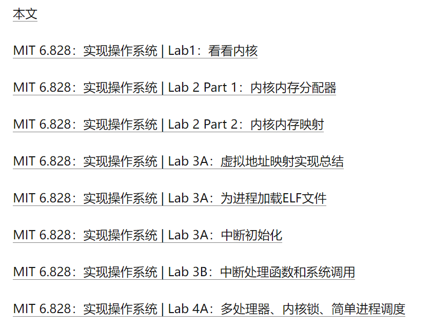

# MIT6.828

## MIT6.828-2017

schedule:

https://pdos.csail.mit.edu/6.828/2017/schedule.html

lecture:

https://pdos.csail.mit.edu/6.828/2017/lec/

tools:

https://pdos.csail.mit.edu/6.828/2017/tools.html

labguide:

https://pdos.csail.mit.edu/6.828/2017/labguide.html

reference:

https://pdos.csail.mit.edu/6.828/2017/reference.html


## Setup on VM ubuntu18.04(x86_64)

注: 参照 2018年的 tools 页面, 2017 的会有很多错误.

错误解决参考 https://zhuanlan.zhihu.com/p/489921553

tools:

https://pdos.csail.mit.edu/6.828/2018/tools.html

### Test Your Compiler Toolchain

```
% objdump -i
% gcc -m32 -print-libgcc-file-name
```

执行上面两个命令, 都正常.

因为虚拟机是 64-bit, 需要安装 32-bit 的库.

```
% sudo apt-get install gcc-multilib
```

### QEMU Emulator

qemu 的安装与 2017年区别很大.

1. 下载 qemu

   ```
   git clone https://github.com/mit-pdos/6.828-qemu.git qemu
   
   ps. 如果网速比较慢的话可以使用镜像
   git clone https://github.com/mit-pdos/6.828-qemu.git qemu
   git clone https://hub.nuaa.cf/mit-pdos/6.828-qemu.git qemu
   ```

2. 配置

   ```
   ./configure --disable-kvm --disable-werror --target-list="i386-softmmu x86_64-softmmu"
   ```

   与 2017年的区别是增加了 "--disable-werror", 否则会有编译错误

3. 编译及安装

   ```
   sudo make
   sudo make install
   ```

### JOS

jos 代码也用 2018 lab1 的, 使用老的 2017 的, 运行 make qemu 总是出现"Triple fault.  Halting for inspection via QEMU monitor" (与 kernel.ld 有关.)

```
git config --global http.sslverify false	// 解决 Certificate verification failed
git clone https://pdos.csail.mit.edu/6.828/2018/jos.git lab
```

#### kernel.ld

链接脚本在 2017~2018之间有个对符号 "edata" 和 "end" 的修改, "edata" 修改为 .bss 段的开头(之前是 .data段的结束, .data 与 .bss 之间有新的内容), "end" 为 bss 段的结束前 0x14地址(bss段的结束增加了 BYTE(0)). 

```
xxx:~/workspace/6.828_2018/lab$ git branch
  lab1
* lab2

xxx:~/workspace/6.828_2018/lab$ git log -2
commit 8808e9d652b14dc31eef48038855d897a333ae33 (HEAD -> lab2)
Author: hongssun <bhshs@aliyun.com>
Date:   Sat Nov 26 06:36:13 2022 -0500

    Debug for edata end in kernel.ld

commit cd2dd55fc7092d8355af5f3ed098c0c73cc8428d
Author: hongssun <bhshs@aliyun.com>
Date:   Sat Oct 23 22:07:11 2021 +0800

    lab2 exercise1 complete


===================================================
kernel.ld 的修改
===================================================
xxx:~/workspace/6.828_2018/lab$ git show a56269d4beefc7d0b3672180aa46c654cfb63af4
commit a56269d4beefc7d0b3672180aa46c654cfb63af4 (origin/lab1, origin/HEAD, lab1)
Author: Jonathan Behrens <fintelia@gmail.com>
Date:   Tue Sep 4 14:10:42 2018 -0400

    Tweak kernel.ld linker script so edata and end are set correctly
    
    This change should hopefully resolve issues when compiling with newer versions
    of GCC.

diff --git a/kern/kernel.ld b/kern/kernel.ld
index 45a0b6a..a219d1d 100644
--- a/kern/kernel.ld
+++ b/kern/kernel.ld
@@ -47,13 +47,13 @@ SECTIONS
                *(.data)
        }
 
-       PROVIDE(edata = .);
-
        .bss : {
+               PROVIDE(edata = .);
                *(.bss)
+               PROVIDE(end = .);
+               BYTE(0)
        }
 
-       PROVIDE(end = .);
 
        /DISCARD/ : {
                *(.eh_frame .note.GNU-stack)

===================================================
参照 2017年的 kernel.ld 打印 bss end_2017
===================================================
book@100ask:~/workspace/6.828_2018/lab$ make qemu
qemu-system-i386 -drive file=obj/kern/kernel.img,index=0,media=disk,format=raw -serial mon:stdio -gdb tcp::26001 -D qemu.log 
VNC server running on `127.0.0.1:5900'
6828 decimal is 15254 octal!
edata_2017 end addr: 0xf0114300, bss end_2017 addr: 0xf01166d4
edata end addr: 0xf0116060, bss end addr: 0xf01166c0

===================================================
.bss = 00000674, bss end addr: 0xf01166c0
bss end_2017(0xf01166d4) - 0xf0116060 = 0x674
===================================================
book@100ask:~/workspace/6.828_2018/lab$ objdump -h obj/kern/kernel

obj/kern/kernel:     file format elf32-i386

Sections:
Idx Name          Size      VMA       LMA       File off  Algn
  0 .text         000028c9  f0100000  00100000  00001000  2**4
                  CONTENTS, ALLOC, LOAD, READONLY, CODE
  1 .rodata       00000c50  f01028e0  001028e0  000038e0  2**5
                  CONTENTS, ALLOC, LOAD, READONLY, DATA
  2 .stab         000052f9  f0103530  00103530  00004530  2**2
                  CONTENTS, ALLOC, LOAD, READONLY, DATA
  3 .stabstr      00001d6f  f0108829  00108829  00009829  2**0
                  CONTENTS, ALLOC, LOAD, READONLY, DATA
  4 .data         00009300  f010b000  0010b000  0000c000  2**12
                  CONTENTS, ALLOC, LOAD, DATA
  5 .got          00000010  f0114300  00114300  00015300  2**2
                  CONTENTS, ALLOC, LOAD, DATA
  6 .got.plt      0000000c  f0114310  00114310  00015310  2**2
                  CONTENTS, ALLOC, LOAD, DATA
  7 .data.rel.local 00001000  f0115000  00115000  00016000  2**12
                  CONTENTS, ALLOC, LOAD, DATA
  8 .data.rel.ro.local 00000044  f0116000  00116000  00017000  2**2
                  CONTENTS, ALLOC, LOAD, DATA
  9 .bss          00000674  f0116060  00116060  00017060  2**5
                  CONTENTS, ALLOC, LOAD, DATA
 10 .comment      00000029  00000000  00000000  000176d4  2**0
                  CONTENTS, READONLY
```

## MIT6.828-2018

自 ubuntu18.04(x86_64) 开始, 使用 2018 lab1.

schedule:

https://pdos.csail.mit.edu/6.828/2018/schedule.html

在做 JOS lab之前, 都要学习该 lab的相关资料(**Preparation**:), 而参考资料都在对应 lab之后的课程中, 以 lab3为例, lab3 出现在 LEC7中,  其学习参考资料在 LEC8, LEC9 中, 一直到 **DUE**: Lab 3 (Part A), **DUE**: Lab 3 (Part B).

## XV6-reference

JOS lab 基于 XV6, 学习资料都是阅读 XV6相关章节.

1. xv6-chinese: https://github.com/ranxian/xv6-chinese/tree/rev8

   这里取的是 rev8 分支, chapter1: 操作系统组织架构

2. [MIT 6.828：实现操作系统 | Lab1：快来引导一个内核吧 - 知乎 (zhihu.com)](https://zhuanlan.zhihu.com/p/166413604)



​	repo: AnBlogs/6.828, https://github.com/Anarion-zuo/AnBlogs/tree/master/6.828

3. [MIT6.828-神级OS课程-要是早遇到，我还会是这种 five 系列 - 知乎 (zhihu.com)](https://zhuanlan.zhihu.com/p/74028717)

4. 给操作系统捋条线, https://zhuanlan.zhihu.com/p/438838399

   repo: https://github.com/Rand312/xv6

5. repo: https://github.com/pleasewhy/xv6-book-2020-Chinese
