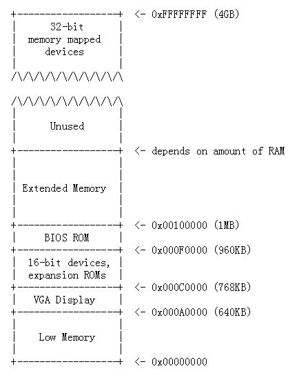

## The BIOS

PC 的物理地址空间布局如下:



BIOS 位于物理地址空间 0x000f0000-0x000fffff, 在上电后或者任何系统重启后总是首先获得机器控制权.

## Exercise 2

> 使用 GDB si(Step Instruction) 命令跟踪 ROM BIOS 几条指令, 试图去猜测它可能在做什么. 参考  [6.828 reference materials page](https://pdos.csail.mit.edu/6.828/2017/reference.html) 上的一些资料, 不需要弄清楚所有的细节, 只需大致了解 BIOS 首先要做什么.

PC 启动后, 处理器进入实模式, 将 *CS* 设置为 0xf000,  IP 设置为 0xfff0, 从 *CS:IP* 段地址(0xffff0: 16 * 0xf000 + 0xfff0 = 0xffff0) 开始执行, BIOS 执行的第一条指令是 `jmp` 指令, 跳转到段地址`CS = 0xf000` 和`IP = 0xe05b`


0xffff0 是 BIOS 结束前的16个字节, BIOS 所做的第一件事就是 `jmp` 返回到 BIOS 中较早的位置(0xfe05b),  si 命令跟踪 BIOS 的几条指令.


BIOS 设置一个中断描述符表, 初始化各种设备. 在初始化 PCI 总线和 BIOS 所知道的所有的重要设备之后, 它将搜索一个可引导的设备, 如软盘、硬盘或 CD-ROM, 当 BIOS 找到一个可引导磁盘时, 从磁盘读取 *boot loader* 并将控制权交给它.

## Boot Loader

BIOS 找到可引导的软盘或硬盘时, 将 512字节的引导扇区(boot sector)加载到物理地址0x7c00~0x7dff 的内存中, 然后使用 `jmp` 指令将 *CS:IP* 设置为 0000:7c00, 将控制权传递给引导加载程序.

Boot loader 位于这512字节中, 由一个汇编语言源文件 `boot/boot.S` 和一个 C源文件 `boot/main.c` 组成, 完成两个主要功能:

- 引导加载程序将处理器从实模式切换到32位保护模式, 因为只有在这种模式下软件才能访问处理器物理地址空间中1MB以上的所有内存. 
- 引导加载程序通过 x86 特殊的 I/O 指令直接访问 IDE 磁盘设备寄存器, 从硬盘读取内核.

编译好的 Boot Loader 位于 obj/boot/, 相关代码如下:


## 实模式和保护模式

两种模式都是CPU的工作模式, 实模式(real mode) 是早期CPU运行的工作模式, 而保护模式(protected mode) 则是现代CPU运行的模式.

#### 实模式

实模式出现于早期 Intel 8086/8088 CPU时期, 20位地址总线, 地址空间1MB(0x0~0xFFFFF), 8个16位的通用寄存器, 4个16位的段寄存器. 
直接参与运算的数值都是16位, 为了支持20位 1MB寻址空间, Intel 采用分段方法, 使用两个16 位的值决定一个地址. 当某个指令访问内存地址时, 使用下面的这种格式来表示:

```
(段基址:段偏移量)
```

其中第一个字段是段基址, 它的值是由段寄存器提供的. 段寄存器有4种: %cs, %ds, %ss, %es. 具体这个指令采用哪个段寄存器是由这个指令的类型来决定的, 比如取指令就是采用 %cs 寄存器, 读取或写入数据就是 %ds 寄存器, 如果是对堆栈操作就是 %ss 寄存器. 不管什么指令, 都会有一个段寄存器提供一个16位的段基址.

第二字段是段内偏移量, 代表你要访问的这个内存地址距离这个段基址的偏移, 它的值就是由通用寄存器来提供. 采用如下公式得出 20 位的实际物理地址.

```
物理地址 = 段基址 << 4 + 偏移地址
```

如 lab1 中 BIOS 执行的第一条指令,  `CS = 0xf000` `IP = 0xfff0` , 实际物理地址是 16 * 0xf000 + 0xfff0 = 0xffff0, 即  BIOS 从 0x000ffff0 开始执行.

#### 保护模式

随着CPU的发展, 地址总线从20位发展到 32位, 可以访问的内存空间从1MB 变为 4GB, 寄存器的位数变为32位. 所以实模式下的内存地址计算方式就不再适合了, 引入了保护模式, 实现更大空间的, 更灵活的内存访问.

在介绍保护模式的工作原理之前, 先清楚以下几个容易混淆的地址概念: 
逻辑地址(logical address), 虚拟地址(virtual address), 线性地址(linear address), 物理地址(physical address).

在编写程序时, 程序运行在虚拟地址空间下. 也就是说, 在编写程序时指令中出现的地址并不一定是这个程序在内存中运行时真正要访问的内存地址. 这样做的目的就是为了能够让程序员在编程时不需要直接操作真实地址, 因为当它在真实运行时, 内存中各个程序的分布情况是不可能在你编写程序时就知道的, 所以这个程序的这条指令到底要访问哪个内存单元是由操作系统来确定的, 这就是一个从虚拟地址(virtual address)到真实主存中的物理地址(physical address)的转换.

那么逻辑地址(logical address)又是什么呢? 根据上面一段文字, 编写程序时看到的是虚拟地址, 但是并不是是直接把这个虚拟地址写到指令中的, 它是由逻辑地址推导得到的, 所以指令中真实出现的是逻辑地址. 一个逻辑地址是由两部分组成的: 一个段选择子(segment selector), 一个段内偏移量(offset), 通常被写作 segment:offset. 而且采用哪个段选择子通常也是在指令中隐含的, 程序员通常只需要指明段内偏移量, 然后分段管理机构(segmentation hardware) 将会把这个逻辑地址转换为线性地址(linear address). 如果该机器没有采用分页机制(paging hardware)的话, 此时 linear address 就是最后的主存物理地址; 如果机器中还有分页设备的话, 比如内存大小实际只有1G, 但是根据前面我们知道可访问的空间有4G, 此时还需要分页机构(paging hardware) 把这个线性地址转换为最终的真实物理地址. 

即地址转换过程: segment:offset --> 逻辑地址---> 分段管理 ---> 虚拟地址/线性地址 ---> 分页机制 ---> 物理地址, 参考下图(来自 XV6 Appendix B). 


在 boot loader中, 并没有开启分页, 所以计算出来的线性地址就是真实要访问的内存物理地址.

那么在保护模式下, 是如何通过 segment:offset 最终得到物理地址的呢?

首先, 在计算机中存在两个表: GDT(全局段描述符表), LDT(本地段描述符表). 他们都是用来存放关于某个运行在内存中的程序的分段信息的. 比如某个程序的代码段是从哪里开始, 有多大; 数据段又是从哪里开始, 有多大. GDT 表是全局可见的, 也就是说每一个运行在内存中的程序都能看到这个表, 所以操作系统内核程序的段信息就存在这里面. LDT 表是每一个在内存中的程序都包含的, 里面指明了每一个程序的段信息, 这两个表的结构如下图所示:


从图中可以看到, 无论是GDT, 还是LDT, 每一个表项都包括三个字段:

Base: 32位, 代表这个程序的这个段的基地址.
Limit: 20位, 代表这个程序的这个段的大小.
Flags: 12位, 代表这个程序的这个段的访问权限.

当程序中给出逻辑地址 segment:offset 时, 他并不是像实模式那样, 用 segment 的值作为段基址, 而是把这个segment 的值作为一个 selector, 代表这个段的段表项在 GDT/LDT 表的索引. 比如你当前要访问的地址是segment:offset = 0x01:0x0000ffff, 此时由于每个段表项的长度为8, 此时应该取出地址8处的段表项. 然后首先根据Flags 字段来判断是否可以访问这个段的内容, 这样做是为了能够实现进程间地址的保护. 如果能访问, 则把Base 字段的内容取出, 直接与offset 相加, 得到线性地址(linear address)了. 之后就是要根据是否有分页机构来进行地址转换了. 比如当前 Base字段的值是0x00f0000, 则最后线性地址的值为 0x00f0ffff.

如上所述就是保护模式下内存地址的计算方法.

综上, 保护模式比实模式的工作方式灵活许多:

1. 实模式下段基地址必须是16的整数倍，保护模式下段基地址可以是4GB空间内的任意一个地址.
2. 实模式下段的长度是65536B, 但是保护模式下段的长度也是可以达到4GB的.
3. 保护模式下可以对内存的访问多加一层保护，但是实模式没有.

参考:

https://www.cnblogs.com/fatsheep9146/p/5116426.html

## Exercise 3

> 在 0x7c00 设置一个断点, 引导扇区将在这里加载. 继续执行直到该断点, 跟踪 `boot/boot.S` 代码, 使用源代码和反汇编文件 `obj/boot/boot.asm` 保持跟踪的位置. 还可以使用 x/i 命令在引导加载程序中对指令序列进行反汇编, 并将原始的引导加载程序源代码与 `obj/boot/boot.asm` 中的反汇编和 GDB 进行比较.
>

在一个 terminal 中输入 make qemu-gdb, 启动 QEMU, 在另一个 terminal 中运行 make gdb. 

`b *0x7c00` 在 0x7C00 地址设置了一个断点, 使用 `c` 命令继续执行到断点, 此时 QEMU 终端上显示 "Booting from Hard Disk...", 使用 `x/10i` 命令对 0x7c00 处的后续10条指令进行反汇编, 使用  `si` 命令继续下一条指令.


对比反汇编文件  `obj/boot/boot.asm` 和源文件  `boot/boot.S` 

`obj/boot/boot.asm` 0x7c00 及后续10条指令


  `boot/boot.S` 0x7c00 及后续10条指令


> 跟踪进入 `boot/main.c bootmain()`, 然后进入 `readsect()`. 识别出 `readsect()` 中每个语句对应的汇编指令, 跟踪 `readsect()` 的其余部分并返回到 `bootmain()`, 并标识从磁盘读取内核剩余扇区的 `for` 循环的开始和结束, 找出循环结束时将运行什么代码, 在那里设置一个断点, 然后继续运行到断点, 然后逐步完成引导加载程序的其余部分.

## 几个问题的答案

- 处理器从何时开始执行 32 位代码, 是什么导致从16位模式切换到32位模式?

  代码如下:

  ```
  # Switch from real to protected mode, using a bootstrap GDT
  # and segment translation that makes virtual addresses 
  # identical to their physical addresses, so that the 
  # effective memory map does not change during the switch.
    lgdt    gdtdesc
    movl    %cr0, %eax
    orl     $CR0_PE_ON, %eax
    movl    %eax, %cr0
  ```

  CR0 寄存器的 bit0 是保护模式启动位, 把这一位值设为1代表保护模式启动.

  ```
    # Jump to next instruction, but in 32-bit code segment.
    # Switches processor into 32-bit mode.
    ljmp    $PROT_MODE_CSEG, $protcseg
  ```

  跳转指令, 把当前的运行模式切换成32位地址模式.

  详细分析过程参考: https://www.cnblogs.com/fatsheep9146/p/5115086.html

  

- 引导加载程序执行的最后一条指令是什么? 加载内核的第一条指令是什么?

  Boot Loader 的最后一条指令是跳转到 Kernel 的入口(ELF header 中的入口地址).

  ```
  // call the entry point from the ELF header
  // note: does not return!
  ((void (*)(void)) (ELFHDR->e_entry))();
  ```

   对应于`obj/boot/boot.asm` 中的汇编代码:

  ```
  	((void (*)(void)) (ELFHDR->e_entry))();
      7d61:	ff 15 18 00 01 00    	call   *0x10018
  ```

  即跳转到 0x10018 内存地址所存储的值处运行, 而该地址存储的内容是 0x10000C, 即 Kernel 的入口地址.

  注意:

  ```
  此时位于保护模式下, Kernel 入口地址 0x10000C 经过全局描述符表(GDT)生成线性地址, 又因还没有开启分页, 线性地址就等于物理地址, 所以 kernel 代码本身就加载在内存物理地址 0x10000C.
  ```

- 内核的第一条指令在哪?

  根据 kernel 的入口文件 kern/entry.S, 第一条指令如下, 由注释可知, 此时虚拟地址还没有设置, lootloader 跳转到 entry point 的物理地址即 0x10000C 执行.

  ```
  # '_start' specifies the ELF entry point.  Since we haven't set up
  # virtual memory when the bootloader enters this code, we need the
  # bootloader to jump to the *physical* address of the entry point.
  .globl		_start
  _start = RELOC(entry)
  ```

- 引导加载程序如何决定必须读取多少个扇区才能从磁盘获取整个内核? 它从哪里找到这些信息?

  从 ELF Header 获取, 由 e_phoff 知道第一个段的位置, 由 e_phnum 可以知道需要加载几个段.

## Loading the Kernel

读取硬盘上的 kernel image 到内存中并运行. 代码位于函数 `bootmain()` 中, 如 lab1 所说, 要弄清 `boot/main.c` 的输出则要知道 ELF 二进制文件是什么, kernel image 是以 ELF 形式组织的.

```
/**********************************************************************
 * This a dirt simple boot loader, whose sole job is to boot
 * an ELF kernel image from the first IDE hard disk.
 *
 * DISK LAYOUT
 *  * This program(boot.S and main.c) is the bootloader.  It should
 *    be stored in the first sector of the disk.
 *
 *  * The 2nd sector onward holds the kernel image.
 *
 *  * The kernel image must be in ELF format.
 *
 * BOOT UP STEPS
 *  * when the CPU boots it loads the BIOS into memory and executes it
 *
 *  * the BIOS intializes devices, sets of the interrupt routines, and
 *    reads the first sector of the boot device(e.g., hard-drive)
 *    into memory and jumps to it.
 *
 *  * Assuming this boot loader is stored in the first sector of the
 *    hard-drive, this code takes over...
 *
 *  * control starts in boot.S -- which sets up protected mode,
 *    and a stack so C code then run, then calls bootmain()
 *
 *  * bootmain() in this file takes over, reads in the kernel and jumps to it.
 **********************************************************************/
```

硬盘上的第一个扇区(扇区 0) 存储的是 bootloader, 第二个扇区是 kernel image, 每个扇区大小 512 byptes, 加载到内存都需按照 512 bytes 对齐. 

`readseg((uint32_t) ELFHDR, SECTSIZE*8, 0);` 
	---> `offset = (offset / SECTSIZE) + 1;` 
	---> `readsect((uint8_t*) pa, offset);`

读取 512 bytes *8 = 4K 数据, 包括ELF头部和程序头表到物理地址 0x10000, offset =1 表示从扇区1开始, `readsect()`是以扇区为读取.

	#define SECTSIZE	512
	#define ELFHDR		((struct Elf *) 0x10000) // scratch space
	
		// read 1st page off disk
		readseg((uint32_t) ELFHDR, SECTSIZE*8, 0);
	
		// is this a valid ELF?
		if (ELFHDR->e_magic != ELF_MAGIC)
			goto bad;
	
		// load each program segment (ignores ph flags)
		// 通过 e_phoff 找到第一个段, 以及段的个数 e_phnum
		ph = (struct Proghdr *) ((uint8_t *) ELFHDR + ELFHDR->e_phoff);
		eph = ph + ELFHDR->e_phnum;
		for (; ph < eph; ph++)
			// p_pa is the load address of this segment (as well
			// as the physical address)
			// p_offset 开始之后的段的 p_memsz 个内存数据读取到物理地址 p_pa
			readseg(ph->p_pa, ph->p_memsz, ph->p_offset);
			
		((void (*)(void)) (ELFHDR->e_entry))();
		
	===================================================================================
	
	// Read 'count' bytes at 'offset' from kernel into physical address 'pa'.
	void
	readseg(uint32_t pa, uint32_t count, uint32_t offset)
	{
		while (pa < end_pa) {
			// Since we haven't enabled paging yet and we're using
			// an identity segment mapping (see boot.S), we can
			// use physical addresses directly.  This won't be the
			// case once JOS enables the MMU.
			readsect((uint8_t*) pa, offset);
			pa += SECTSIZE;
			offset++;
	}
`ELFHDR`: ELF Header 结构, `Proghdr`: 是 program header 结构.

`e_phoff`: program header table(程序头表第一项)相对于 ELF 文件开始位置的偏移, 则 `ph` 为第一项程序头表的地址, 保存了第一个段(segment)的信息(地址, 大小等).

`e_phnum`: program header table 中表项个数, 即段的个数, 则 `eph` 为最后一个段的信息.

`ph->p_pa`: program header 中的 p_vaddr, 表示 segment 的第一个字节在内存中的物理地址.

`ph->p_memsz`: program header 中的 p_memsz, 表示 segment 的内存映像大小.

`ph->p_offset`: program header 中的 p_offset, ELF 文件开始位置到该 segment 第一个字节的偏移量.

`readseg()`: 从 `ph->p_offset` 读取 `ph->p_memsz` 个字节到 `ph->p_pa`.

```
struct Elf {
	uint32_t e_magic;	// must equal ELF_MAGIC
	uint8_t e_elf[12];
	uint16_t e_type;
	uint16_t e_machine;
	uint32_t e_version;
	uint32_t e_entry;
	uint32_t e_phoff;
	uint32_t e_shoff;
	uint32_t e_flags;
	uint16_t e_ehsize;
	uint16_t e_phentsize;
	uint16_t e_phnum;
	uint16_t e_shentsize;
	uint16_t e_shnum;
	uint16_t e_shstrndx;
};

struct Proghdr {
	uint32_t p_type;
	uint32_t p_offset;
	uint32_t p_va;
	uint32_t p_pa;
	uint32_t p_filesz;
	uint32_t p_memsz;
	uint32_t p_flags;
	uint32_t p_align;
};
```

通过 ELF Header 和 Program Header 找到文件的第 i 个段地址的方法如下:

```undefined
第 i 段程序头表表项位置 = 文件起始位置 + 程序头表偏移e_phoff + i*程序头表项字节数 
第 i 段地址就是第i个程序头表表项的 p_offset 值
```

下面是根据 kernel ELF header 和 Program header 信息画出的内存 mapping. 

Program header table1 相对 ELF文件起始地址偏移 e_phoff(52 bytes), 对应 segment 1, 其包含 .text .rodata .stab .stabstr 等 section, 加载到内存物理地址 0x100000, 占用 p_memsz (0x0716c bytes) 空间.


### ELF Structure

关于 ELF Header 和 Program Header 的详细字段解释及更多可参考 ELF.md.

#### Segment (Program Header)

下面是用 *readelf* 命令分别读取 boot loader 的 ELF Header, Program Header 和 kernel 的 ELF Header, Program Header. 

```
hongssun@hongssun-user:~/workspace/6.828/lab/obj/boot$ readelf -h boot.out
ELF Header:
  Magic:   7f 45 4c 46 01 01 01 00 00 00 00 00 00 00 00 00 
  Class:                             ELF32
  Data:                              2's complement, little endian
  Version:                           1 (current)
  OS/ABI:                            UNIX - System V
  ABI Version:                       0
  Type:                              EXEC (Executable file)
  Machine:                           Intel 80386
  Version:                           0x1
  Entry point address:               0x7c00
  Start of program headers:          52 (bytes into file)
  Start of section headers:          4868 (bytes into file)
  Flags:                             0x0
  Size of this header:               52 (bytes)
  Size of program headers:           32 (bytes)
  Number of program headers:         2
  Size of section headers:           40 (bytes)
  Number of section headers:         9
  Section header string table index: 6
  
入口地址是: Entry point address:               0x7c00

hongssun@hongssun-user:~/workspace/6.828/lab/obj/boot$ readelf -l boot.out

Elf file type is EXEC (Executable file)
Entry point 0x7c00
There are 2 program headers, starting at offset 52

Program Headers:
  Type           Offset   VirtAddr   PhysAddr   FileSiz MemSiz  Flg Align
  LOAD           0x000074 0x00007c00 0x00007c00 0x0022c 0x0022c RWE 0x4
  GNU_STACK      0x000000 0x00000000 0x00000000 0x00000 0x00000 RWE 0x10

 Section to Segment mapping:
  Segment Sections...
   00     .text .eh_frame 
   01  

代码段的物理地址, 虚拟地址都是 0x7c00.
```

```
hongssun@hongssun-user:~/workspace/6.828/lab/obj/kern$ git branch
* lab1
hongssun@hongssun-user:~/workspace/6.828/lab/obj/kern$ readelf -h kernel
ELF Header:
  Magic:   7f 45 4c 46 01 01 01 00 00 00 00 00 00 00 00 00 
  Class:                             ELF32
  Data:                              2's complement, little endian
  Version:                           1 (current)
  OS/ABI:                            UNIX - System V
  ABI Version:                       0
  Type:                              EXEC (Executable file)
  Machine:                           Intel 80386
  Version:                           0x1
  Entry point address:               0x10000c
  Start of program headers:          52 (bytes into file)
  Start of section headers:          78712 (bytes into file)
  Flags:                             0x0
  Size of this header:               52 (bytes)
  Size of program headers:           32 (bytes)
  Number of program headers:         3
  Size of section headers:           40 (bytes)
  Number of section headers:         11
  Section header string table index: 8
  
入口地址是: Entry point address:               0x10000c
 
hongssun@hongssun-user:~/workspace/6.828/lab/obj/kern$ readelf -l kernel

Elf file type is EXEC (Executable file)
Entry point 0x10000c
There are 3 program headers, starting at offset 52

Program Headers:
  Type           Offset   VirtAddr   PhysAddr   FileSiz MemSiz  Flg Align
  LOAD           0x001000 0xf0100000 0x00100000 0x0716c 0x0716c R E 0x1000
  LOAD           0x009000 0xf0108000 0x00108000 0x0a300 0x0a944 RW  0x1000
  GNU_STACK      0x000000 0x00000000 0x00000000 0x00000 0x00000 RWE 0x10

 Section to Segment mapping:
  Segment Sections...
   00     .text .rodata .stab .stabstr 
   01     .data .bss 
   02   

代码段的物理地址 0x100000, 虚拟地址 0xf0100000.
代码段(00) 包含 .text .rodata 等 section.
数据段(01) 包含 .data .bss section
```

前面的代码及图例都是以 ELF 结构的执行视角, 即可执行文件的内存布局. 可执行文件由 segment(段)组成, 每个  segment 和 program header table 条目一一对应, 运行时一个 segment 由链接器将一个或多个 section 链接而成. 

后面以 ELF 结构的链接视角, 即目标文件的内容布局. 目标文件的内容由节(section)组成, 通常我们说的程序代码的 .text, .bss, .data 这些都是 section. 比如 .text 告诉汇编器将后面的代码放入 .text section 中.

目标文件中的 section 和  section header table 条目一一对应, 同一个 ELF 中, 所有 section header 大小相同.

#### Section

```
hongssun@hongssun-user:~/workspace/6.828/lab$ objdump -h obj/kern/kernel

obj/kern/kernel:     file format elf32-i386

Sections:
Idx Name          Size      VMA       LMA       File off  Algn
  0 .text         00001917  f0100000  00100000  00001000  2**4
                  CONTENTS, ALLOC, LOAD, READONLY, CODE
  1 .rodata       00000714  f0101920  00101920  00002920  2**5
                  CONTENTS, ALLOC, LOAD, READONLY, DATA
  2 .stab         00003889  f0102034  00102034  00003034  2**2
                  CONTENTS, ALLOC, LOAD, READONLY, DATA
  3 .stabstr      000018af  f01058bd  001058bd  000068bd  2**0
                  CONTENTS, ALLOC, LOAD, READONLY, DATA
  4 .data         0000a300  f0108000  00108000  00009000  2**12
                  CONTENTS, ALLOC, LOAD, DATA
  5 .bss          00000644  f0112300  00112300  00013300  2**5
                  ALLOC
  6 .comment      0000002b  00000000  00000000  00013300  2**0
                  CONTENTS, READONLY
```

- `.text` 程序的可执行指令
- `.rodata` 只读数据, 如 C 编译器生成的ASCII字符串常量. (不用费心设置硬件来禁止写入)
- `.data` 数据部分保存程序的初始化数据, 如全局变量 `int x = 5`

当链接器计算程序的内存布局时, 它为未初始化的全局变量(如 `int x;`)预留了空间, 在名为 `.bss` 中, 该部分在内存中紧跟的 `.data` 之后. C 语言要求“未初始化的”全局变量以 0 值开始, 因此无需在 ELF 二进制文件中存储 `.bss` 的内容. 相反链接器只记录 `.bss` 部分的地址和大小, 加载程序或程序本身必须将 `.bss` 部分设为零.

### 链接地址和加载地址

kernel image  每个 section 都有 “VMA” (链接地址)和 “LMA” (加载地址). `.text` 的链接地址和加载地址分别为0xf0100000, 0x100000. 通过链接脚本 kern/kernel.ld 指定.

```
SECTIONS
{
	/* Link the kernel at this address: "." means the current address */
	. = 0xF0100000;

	/* AT(...) gives the load address of this section, which tells
	   the boot loader where to load the kernel in physical memory */
	.text : AT(0x100000) {
		*(.text .stub .text.* .gnu.linkonce.t.*)
	}
...
}
```

一个程序节的加载地址是将该节加载到内存中的内存地址, 是物理地址. 程序节的链接地址是该段期望被执行的内存地址, 是虚拟地址.

链接器以各种方式对二进制文件中的链接地址进行编码, 编译器在编译的时候会认定程序将会连续的存放在从链接地址开始的内存空间. 程序的链接地址实际上就是链接器对代码中的变量、函数等符号进行一个地址编排, 赋予这些抽象的符号一个地址, 然后在程序中通过地址访问相应变量和函数. 使用ld等链接程序时通过`-Ttext xxxx` 和 `-Tdata yyyy` 指定代码段/数据段的链接地址, 运行期间代码指令和数据变量的地址都在相对 `-T` 指定的基址的某个偏移量处, 这个地址实际上就是链接地址. 例如当代码需要全局变量的地址时, 如果从一个没有链接的地址执行二进制文件, 那么二进制文件通常无法工作.

而加载地址则是可执行程序在物理内存中真正存放的位置.

通常链接地址和加载地址通常是一样的, boot loader的链接地址和加载地址都是0x7C00, 在 `boot/Makefrag `里面定义. 而 kernel 是不一样的, 因为内核通常期望链接和运行在一个高的虚拟地址, 以便把低位的虚拟地址空间让给用户程序使用. 

以前的机器通常没有 0xf0100000 这么大的物理内存, 解决方案就是在虚拟地址空间中 kernel 放在高地址处0xf0100000, 但是实际上还是存放在一个低的物理地址处 0x100000. 当用户程序想访问一个操作系统内核的指令时, 首先给出的是一个高的虚拟地址, 然后通过内存管理硬件(分段管理, 分页管理)将虚拟地址映射为真实的物理地址.

## Physical Address Space


## Exercise 5

BIOS 默认把 boot loader 加载到物理地址 0x7C00 处, 若修改链接地址为 0x7C10, 则导致出错.

1. 修改 `boot/Makefrag` 中的链接地址为 0x7C10. make clean, 再 make.

   此时反汇编文件 `obj/boot/boot.asm` 中第一条指令地址已变为 0x7C10.

   

2. 在一个 terminal 中执行 make qemu-gdb, 启动 QEMU. 另一个 terminal 中运行 make gdb.

3.  `b *0x7c10` 在 0x7C10 地址设置了一个断点, 使用 `c` 命令继续执行到断点, 继续运行

   

4. 问题出在[0:7c2d], 对应 `ljmp    $PROT_MODE_CSEG, $protcseg`. 应该跳转到的地址应该就是ljmp的下一条指令地址, 即0x7c32，但是这里给的值是0x7c42，下条指令变成了 0xfe05b.

   ```
     # Jump to next instruction, but in 32-bit code segment.
     # Switches processor into 32-bit mode.
     ljmp    $PROT_MODE_CSEG, $protcseg
       7c3d:	ea 42 7c 08 00 66 b8 	ljmp   $0xb866,$0x87c42
   
   00007c42 <protcseg>:
   
     .code32                     # Assemble for 32-bit mode
   protcseg:
     # Set up the protected-mode data segment registers
     movw    $PROT_MODE_DSEG, %ax    # Our data segment selector
       7c42:	66 b8 10 00          	mov    $0x10,%ax
   ```

   链接地址为 0x7c00 是, [0:7c2d] 处跳转到下一条指令 0x7c32. 

   


## Exercise 6

复位机器 (退出 QEMU/GDB 并重新启动), 在 BIOS 进入 boot loader 时检查内存 0x00100000 处的 8个 word, 然后在 boot loader 进入内核时再检查一次. 它们为什么不同? 第二个断点是什么? 

```
(gdb) b *0x7c00
Breakpoint 1 at 0x7c00
(gdb) c
Continuing.
[   0:7c00] => 0x7c00:	cli    

Breakpoint 1, 0x00007c00 in ?? ()
(gdb) x/8x 0x00100000
0x100000:	0x00000000	0x00000000	0x00000000	0x00000000
0x100010:	0x00000000	0x00000000	0x00000000	0x00000000
(gdb) 
0x100020:	0x00000000	0x00000000	0x00000000	0x00000000
0x100030:	0x00000000	0x00000000	0x00000000	0x00000000
(gdb) b *0x0010000c
Breakpoint 2 at 0x10000c
(gdb) c
Continuing.
The target architecture is assumed to be i386
=> 0x10000c:	movw   $0x1234,0x472

Breakpoint 2, 0x0010000c in ?? ()
(gdb) x/8x 0x00100000
0x100000:	0x1badb002	0x00000000	0xe4524ffe	0x7205c766
0x100010:	0x34000004	0x0000b812	0x220f0011	0xc0200fd8
```

进入 Boot Loader的时, 因为还没有加载内核, 0x100000 处内存还没有内容, 所以看到的都是0.
从 Boot Loader 进入 kernel 时, 此时 kernel 已经加载到内存中, 因此有对应的数据.
参考前面 Kernel ELF 的解析, 0x100000 是代码段的起始地址.

## Exercise 7

通过 kernel.asm,  `movl %eax、%cr0` 链接地址 0xf0100025, 物理地址0x00100025.

```
(gdb) b *0x00100025
Breakpoint 1 at 0x100025
(gdb) c
Continuing.
The target architecture is assumed to be i386
=> 0x100025:	mov    %eax,%cr0

Breakpoint 1, 0x00100025 in ?? ()
(gdb) x/8x 0x00100000
0x100000:	0x1badb002	0x00000000	0xe4524ffe	0x7205c766
0x100010:	0x34000004	0x0000b812	0x220f0011	0xc0200fd8
(gdb) x/8x 0xf0100000
0xf0100000 <_start+4026531828>:	0x00000000	0x00000000	0x00000000	0x00000000
0xf0100010 <entry+4>:	0x00000000	0x00000000	0x00000000	0x00000000
(gdb) si
=> 0x100028:	mov    $0xf010002f,%eax
0x00100028 in ?? ()
(gdb) x/8x 0x00100000
0x100000:	0x1badb002	0x00000000	0xe4524ffe	0x7205c766
0x100010:	0x34000004	0x0000b812	0x220f0011	0xc0200fd8
(gdb) x/8x 0xf0100000
0xf0100000 <_start+4026531828>:	0x1badb002	0x00000000	0xe4524ffe	0x7205c766
0xf0100010 <entry+4>:	0x34000004	0x0000b812	0x220f0011	0xc0200fd8
(gdb) 
```

  `movl %eax、%cr0` 这条指令开启分页, 在这之前内存映射还未生效, 高地址 0xf0000000 开始的内容为0. 这条指令执行以后, 将 0xf0000000 - 0xf0400000 的虚拟地址映射到 0x00000000 - 0x00400000 的物理地址空间,  可以看到 0xf0100000 与 0x00100000 的内容是一样的.

如果注释掉 `movl %eax， %cr0`, 因为高地址没有映射, 执行完 `jmp *%eax` 后跳转到 eax寄存器保存的值所在地址 0xf010002c 时会报如下错误:

```
qemu: fatal: Trying to execute code outside RAM or ROM at 0xf010002c
```

参考:

https://github.com/shishujuan/mit6.828-2017/blob/master/docs/lab1-exercize.md

## Formatted Printing to the Console

通读 `kern/printf.c, lib/printfmt.c, kern/console.c`, 了解他们的关系, 稍后的实验中将会清楚为什么 `printfmt.c` 位于单独的 `lib` 目录中.

能够回答以下问题:

1. 解释 `printf.c` 和 `console.c` 之间的接口. 特别是 `console.c` 输出什么函数? 这个函数如何被 `printf.c `使用?

   ```
   a. inc/stdio.h 中声明了所有 I/O 相关的函数, 其中 int	cprintf(const char *fmt, ...) 是被其他模块所使用的的标准输出函数, 其定义在 kern/printf.c
   b. kern/printf.c 提供了实际需要调用的 I/O 接口 cprintf(), 接着调用 vcprintf(), 并继续调用 vprintfmt(). vprintfmt() 定义在 lib/printfmt.c
   c. lib/printfmt.c 中的 vprintfmt() 是对输出进行格式化, 实现不同类型的输出(%s %d %p等). 最终会调用 kern/printf.c 提供的回调函数 putch()
   d. putch()调用 kern/console.c 中的 cputchar() ---> cons_putc(): 输出一个字符到控制台上
   e. cons_putc() 调用了三个函数:  serial_putc(), lpt_putc(), cga_putc(), 分别对应串口输出, 并口输出, 显示屏幕输出
   
   综上, printf.c 提供用户接口, printfmt.c 实现格式化输出, console.c 真正操作底层硬件的 I/O 端口输出字符到控制台上.
   printf.c 和 console.c 之间的接口是 cputchar(). 
   ```

2. 从 `console.c` 中解释如下代码

   ```
   case '\b':
      	if (crt_pos > 0) {
      		crt_pos--;
      		crt_buf[crt_pos] = (c & ~0xff) | ' ';
      		}
      	break;
      	...
      	default:
      		crt_buf[crt_pos++] = c;		/* write the character */
      	break;
      	
   ```

   ```
   if (crt_pos >= CRT_SIZE) {
      	int i;
      	//清除buf中"第一行"的字符,即将第一行移出屏幕
      	memmove(crt_buf, crt_buf + CRT_COLS, (CRT_SIZE - CRT_COLS) * sizeof(uint16_t));
      	for (i = CRT_SIZE - CRT_COLS; i < CRT_SIZE; i++)
      		crt_buf[i] = 0x0700 | ' '; // 最后一行用空格填充,需要用空格擦写才能去掉本来已显示的字符
      	
      	crt_pos -= CRT_COLS;	// 显示光标移动到屏幕最后一行的开始处
    }
      // crt_buf 在 cga_init() 初始化, 指向显示器I/O地址 = KERNBASE + CGA_BUF
      // CRT_SIZE = CRT_ROWS, CRT_COLS: CRT 显示器行列最大值,25x80
   ```

   结合前一段代码, crt_pos 是缓冲区当前显示内容的最后一个字符的指针, 当c为'\b'时, 表示输入了退格, 所以此时要把缓冲区最后一个字节的指针减一, 相当于丢弃当前最后一个输入的字符. 如果不是特殊字符，那么就把字符的内容直接输入到缓冲区.

   if 判断语句的功能是保证缓冲区中的最后显示的内容大小不要超过显示器的范围 CRT_SIZE, 实现屏幕滚动一行.

   

3. 对于下面的问题, 可以参考 lec2的讲义. 这些注释涵盖了 GCC 在 x86 上的调用约定.

   一步一步跟踪以下代码的执行:

   ```
   int x = 1, y = 3, z = 4;
   cprintf("x %d, y %x, z %d\n", x, y, z);
   ```

   - 在调用 `cprintf()` 时, `fmt` 指向什么? `ap` 指向什么?

     ```
     fmt 指向的是参数中的格式字符串, ap 指向 fmt的后一个参数地址
     ```

   - 列出(按执行顺序) 对 `cons_putc, va_arg, vcprintf` 的每个调用. 对于 `cons_putc`, 也列出它的参数. 对于 `va_arg`, 列出调用前后 `ap` 指向的内容. 对于 `vcprintf` 列出它的两个参数的值.

4. 运行下面的代码:

   ```
   unsigned int i = 0x00646c72;
   cprintf("H%x Wo%s", 57616, &i);
   ```

   输出是什么? 按照前面的练习一步一步地解释这个输出是如何得到的. [Here's an ASCII table](http://web.cs.mun.ca/~michael/c/ascii-table.html) 将字节映射到字符. 

   输出取决于 x86 是 little-endian 这一事实, 如果 x86 是 big-endian,为了得到相同的输出将 `i` 设置什么 ? 是否需要将 `57616` 改为不同的值 ?

   [Here's a description of little- and big-endian](http://www.webopedia.com/TERM/b/big_endian.html) and [a more whimsical description](http://www.networksorcery.com/enp/ien/ien137.txt).

   ```
   代码输出是 He110 World, 因为 57616 = 0xe110. 
   i=0x00646c72, 当作字符串处理, 则 'r'=(char)0x72,'l'=(char)0x6c,'d'=(char)0x64, 0x00 作为字符串的结束.
   x86采用的是小端模式,即低地址存低位数据, 高地址存高位数据, 按照地址从低到高正好是 rld
   如果x86 是大端模式, 则输出为 He110, Wo
   因为低地址存的是高位数据 0x00, 当作字符串结束, 不需要修改 57616, 因为它是纯数字被打印出来.
   i=0x726c6400
   ```

5. 在下面的代码中,`'y='` 后面会打印什么? (注意:答案不是一个特定的值) 为什么会这样 ?

   ```
   cprintf("x=%d y=%d", 3);
   
   如果 fmt里面指定的格式化字符串数目大于实际参数数目, 因为缺少参数, 由可变参数的方式知道会打印第一个参数3 所在的栈之上的 4字节内容, 结果显示为 x=3 y=-267321364
   ```

6. 假设 GCC 更改了它的调用约定, 按声明顺序在堆栈上放参数(从左到右), 以便最后一个参数被放到最后, 将如何更改 `cprintf` 或者它的接口, 使它仍然能够传递可变数量的参数?

   ```
   需要在最后一个参数之后加入一个新的变量, 表示参数的个数.
   ```

## Exercise 8

参考 case 'u' 的实现

```
		case 'o':
			// Replace this with your code.
			num = getuint(&ap, lflag);
			base = 8;
			goto number;
```

参考: 

https://www.cnblogs.com/fatsheep9146/p/5066690.html
https://github.com/shishujuan/mit6.828-2017/blob/master/docs/lab1-exercize.md
https://github.com/Clann24/jos/tree/master/lab1
https://www.dingmos.com/2020/07/24/24.html
[PC Assembly Language](https://pdos.csail.mit.edu/6.828/2017/readings/pcasm-book.pdf) 

## Exercise 9

确定内核在哪里初始化它的堆栈, 以及堆栈在内存中的确切位置. 内核如何为其堆栈保留空间? 栈指针初始化指向的是这个保留区域的哪个“端”?

在 entry.S中查找对 %ebp, %esp 的操作, 这两个寄存器构成被调函数的栈帧, 代码如下:

	movl	$0x0,%ebp			# nuke frame pointer
	# Set the stack pointer
	movl	$(bootstacktop),%esp
	
	.data
	###################################################################
	# boot stack
	###################################################################
		.p2align	PGSHIFT		# force page alignment
		.globl		bootstack
	bootstack:
		.space		KSTKSIZE
		.globl		bootstacktop   
	bootstacktop:
在数据段中定义栈顶 bootstacktop之前, 首先分配了 KSTKSIZE的存储空间, 专门用于堆栈. KSTKSIZE = 8 * PGSIZE  = 8 * 4096 = 32KB.
从 kernel.asm 中得知 bootstacktop = 0xf0110000, 所以堆栈空间是 0xf0110000-0xf0108000, 栈顶为 0xf0110000. 这是堆栈的虚拟空间地址, 其物理地址为 0x00110000-0x00108000.

内核通过伪指令 `.space`分配了堆栈空间, 栈指针 `esp` 指向空间顶端.

参考:
https://www.cnblogs.com/fatsheep9146/p/5079177.html
常用 ARM 指令及汇编.pdf

## Exercise 10

熟悉x86上的C调用约定, 在 `obj/kern/kernel.asm`中找到 `test_backtrace`函数的地址. 在那里设置一个断点, 并检查内核启动后每次调用它时会发生什么. `test_backtrace` 的每个递归嵌套层在堆栈上压入多少32-bit 的字, 这些字是什么?

 `obj/kern/kernel.asm`中  `test_backtrace`的指令地址为 0xf0100040, 在这里设置断点, 开始调试.

并且, 每一次进入 `test_backtrace` ,`cprintf("entering test_backtrace %d\n", x)` 之前, 都要执行过程调用的通用操作: 保存要传递的参数以及调用函数 `i386_init()` 的栈帧信息等, 如下：

```
	// Test the stack backtrace function (lab 1 only)
	test_backtrace(5);
f01000de:	c7 04 24 05 00 00 00 	movl   $0x5,(%esp)
f01000e5:	e8 56 ff ff ff       	call   f0100040 <test_backtrace>

void
test_backtrace(int x)
{
f0100040:	55                   	push   %ebp
f0100041:	89 e5                	mov    %esp,%ebp
f0100043:	53                   	push   %ebx
f0100044:	83 ec 14             	sub    $0x14,%esp
f0100047:	8b 5d 08             	mov    0x8(%ebp),%ebx
	cprintf("entering test_backtrace %d\n", x);
...
}
```

为了观察调用前的准备工作, 把断点分别设在 0xf01000de 和 0xf0100040

设断点 0xf01000de, 执行到断点, 下一条要执行的指令, `movl   $0x5,(%esp)` , %eip = 0xf01000de, %esp = 0xf010ffe0, 如下图:


si 单步执行  `movl   $0x5,(%esp)` , 则[0xf010ffe0] = 5, 如下图. 下一条要执行的指令: `call   f0100040 <test_backtrace>`, %eip = 0xf01000e5.


si 单步执行  : `call   f0100040 <test_backtrace>`,  如下图. 此时 %esp =0xf010ffe0-4 = 0xf010ffdc. 并且 [0xf010ffdc] = 0xf01000ea, 这是 `test_backtrace` 调用之后的返回地址.


所以, call 指令做了两件事, 1. 压栈; 2. 将返回地址保存在栈中. 在 lec2 homework 中同样会有call 指令.

如果是断点直接设在 0xf0100040, 打印CPU 寄存器信息, 此时已经执行完了 call 指令, 无法完全看出子程序调用前的准备工作. 如下图. 
调用前, %ebp = 0xf010fff8,  %esp = 0xf010ffe0, 这就是调用函数`i386_init()` 的栈帧信息.


进入 `test_backtrace(5)`之后的操作如下:

```
f0100040:	55                   	push   %ebp
f0100041:	89 e5                	mov    %esp,%ebp
f0100043:	53                   	push   %ebx
f0100044:	83 ec 14             	sub    $0x14,%esp
```

si 单步执行, `push   %ebp`,  将%ebp压栈, 保存调用函数的栈基址, 执行后 %esp = %esp-4 = 0xf010ffd8, 该地址上保存了 %ebp 的值 0xf010fff8, 所以压栈过程是先移动 sp, 后保存寄存器;

`mov    %esp,%ebp`  %ebp的值更新为 %esp的值, %ebp 在前面已经保存, 这里更新后即为子函数  `test_backtrace(5)` 的栈基址, %ebp = 0xf010ffd8;

`push %ebx`  %ebx寄存器的值压入堆栈, 此时  %esp = %esp-4 = 0xf010ffd4, 因为 %ebx 可能被这个子程序所使用, 所以必须把它之前的值保存;

`sub $0x14, %esp` %esp = %esp - 0x14 = 0xf010ffd4 - 20 = 0xf010ffc0, 这是给 `test_backtrace(5)`子函数分配一个大小为 20个存储单元的栈空间, 用于存储临时变量.

所以子程序调用的通用过程如下:

1. 保存参数到栈中(或CPU寄存器), movl   $0x5,(%esp), %esp 没变, 而且还是调用者的栈 0xf010ffe0
2. call 指令, 返回地址入栈, %esp=%esp-4, 0xf010ffdc, [0xf010ffdc] = 0xf01000ea
3. 保存调用者的栈帧信息 %ebp 到栈中, %esp=%esp-4=0xf010ffd8, [0xf010ffd8] = 0xf010fff8
4. 更新子程序的栈帧信息, %ebp = %esp, 被调者的栈基址
5. 移动 %esp 开辟栈空间保存子程序的本地变量, %esp = %esp-20


以上过程的第 4 步开始才是被调者的栈帧开始, 所以 X86 的调用约定是入参, 返回地址, 调用者的栈帧信息都在调用者的栈中,  如下图 lec2 的教程. 而 ARM 的调用约定是 入参, 返回地址, 调用者的栈帧信息都保存在子程序的栈中.

调用者保存入参, 返回地址; 被调者保存调用者的栈帧信息.


上述命令执行完成后, %ebp = 0xf010ffd8,%esp = 0xf010ffc0,  接着调用 `test_backtrace(4)`, 类似的过程. %ebp 在第3步更新, 相对于前一个 %esp, 递减 8, 所以 %ebp= 0xf010ffc0-8= 0xf010ffb8. %esp 不仅要考虑 `test_backtrace`的递归调用, 还有 `cprintf(...);`, 调试结果看会递减 32.

```
		test_backtrace(x-1);
f010005e:	8d 43 ff             	lea    -0x1(%ebx),%eax
f0100061:	89 04 24             	mov    %eax,(%esp)
f0100064:	e8 d7 ff ff ff       	call   f0100040 <test_backtrace>
```

 `test_backtrace(5)` %ebp = 0xf010ffd8, %esp = 0xf010ffc0
 `test_backtrace(4)` %ebp =  0xf010ffb8, %esp = 0xf010ffa0
 `test_backtrace(3)` %ebp =  0xf010ff98, %esp = 0xf010ff80
 `test_backtrace(2)` %ebp =  0xf010ff78, %esp = 0xf010ff60
 `test_backtrace(1)` %ebp =  0xf010ff58, %esp = 0xf010ff40
 `test_backtrace(0)` %ebp =  0xf010ff38, %esp = 0xf010ff20

## Exercise 11

```
int mon_backtrace(int argc, char **argv, struct Trapframe *tf)
{
    uint32_t *ebp_reg = (uint32_t *)read_ebp();
    // uint32_t ebp_addr_value = *ebp_reg;
    uint32_t eip_reg;

	while(ebp_reg != 0)
    {
        eip_reg = *(ebp_reg + 1);
        cprintf("ebp %08x eip %08x args %08x %08x %08x %08x %08x\n", ebp_reg, eip_reg, *(ebp_reg+2), *(ebp_reg)+3, *(ebp_reg+4), *(ebp_reg+5), *(ebp_reg+6));

        //ebp_reg = (uint32_t *)(ebp_addr_value);
        //cprintf("ebp %08x \n", ebp_reg);
        ebp_reg = (uint32_t *)(*ebp_reg);
        cprintf("ebp %08x\n", ebp_reg);
    }
	return 0;
}
```

下面分析代码实现, 每一行都很重要！！！

1. 参照 lab1 exercise11 的说明

   ```
   int *p = (int*)100;		
   // 指针变量 p=100, 指针指向即地址100上存储一个 int 数据. 
   // (int*)(p + 1)=104, 对指针加减一个整数相当于指针移动所指数据类型的整数倍, 这里是 1x4.
   // 参考 "指针的算术运算" https://www.runoob.com/w3cnote/c-pointer-detail.html
   // 代码中 read_ebp() 获取当前函数的 %ebp, ebp_reg+1 也相当于移动了 4个 byte
   ```

2. 参考  `i386_init()` 调用  `test_backtrace(5)`的过程, 当栈帧构建完成以后, %ebp = 0xf010ffd8,%esp = 0xf010ffc0. 
   逆向来看, %ebp 前一个压栈的就是 eip(保存下一条指令地址, 也是返回地址), 所以取其地址上的值  [0xf010ffd8+4] = [0xf010ffdc] =  0xf01000ea
   再往前是参数压栈, 所以才有下面的代码.

   ```
   eip_reg = *(ebp_reg + 1);
   args = *(ebp_reg + 2), *(ebp_reg + 3)...
   ```

3. 最重要的一行代码, 打印完成以后新的 %ebp 怎么获取? 再次参考 `i386_init()` 调用  `test_backtrace(5)`的过程,  %ebp = 0xf010ffd8 对应地址上的值就是前一个调用函数的 %ebp, 即新的 %ebp = [%ebp] = [0xf010ffd8] = 0xf010fff8, 将之强转为指针.

   ```
   ebp_reg = (uint32_t *)(*ebp_reg);
   ```

   并且 %ebp 在 entry.S中调用  `i386_init()` 之前赋值为 0, 以此为循环结束条件.

代码执行结果及注释如下, ebp 是寄存器本身值(地址), eip 即之后的都是取的地址上的数据值.

```
lab$ make qemu

entering test_backtrace 5
entering test_backtrace 4
entering test_backtrace 3
entering test_backtrace 2
entering test_backtrace 1
entering test_backtrace 0
// 当前函数 mon_backtrace的信息
ebp f010ff18 eip f0100087 args 00000000 f010ff3b 00000000 00000000 f0100957
// 调用函数即 test_backtrace(0)的 %ebp
ebp f010ff38

// test_backtrace(0)的信息
ebp f010ff38 eip f0100069 args 00000000 f010ff5b f010ff78 00000000 f0100957
// 调用函数 test_backtrace(1)的 %ebp
ebp f010ff58

// test_backtrace(1)的信息
ebp f010ff58 eip f0100069 args 00000001 f010ff7b f010ff98 00000000 f0100957
// 调用函数 test_backtrace(2)的 %ebp
ebp f010ff78

// test_backtrace(2)的信息
ebp f010ff78 eip f0100069 args 00000002 f010ff9b f010ffb8 00000000 f0100957
// 调用函数 test_backtrace(3)的 %ebp
ebp f010ff98

// test_backtrace(3)的信息
ebp f010ff98 eip f0100069 args 00000003 f010ffbb 00000000 00000000 00000000
// 调用函数 test_backtrace(4)的 %ebp
ebp f010ffb8

// test_backtrace(4)的信息
ebp f010ffb8 eip f0100069 args 00000004 f010ffdb 00000000 00010094 00010094
// 调用函数 test_backtrace(5)的 %ebp
ebp f010ffd8

// test_backtrace(5)的信息
ebp f010ffd8 eip f01000ea args 00000005 f010fffb 00000644 00000000 00000000
// 调用函数 i386_init()的 %ebp
ebp f010fff8

// i386_init()的信息
ebp f010fff8 eip f010003e args 00111021 00000003 00000000 00000000 00000000
ebp 00000000

leaving test_backtrace 0
leaving test_backtrace 1
leaving test_backtrace 2
leaving test_backtrace 3
leaving test_backtrace 4
leaving test_backtrace 5
```

注意代码中的注释部分: 

```
// uint32_t ebp_addr_value = *ebp_reg;
...
// ebp_reg = (uint32_t *)(ebp_addr_value);
// cprintf("ebp %08x \n", ebp_reg);
```

本来以为实现功能一样, 实际上只实现了当前函数的信息打印, 因为没有进一步的更新 %ebp 的值, 函数会无限循环,如下. 所以 %ebp 的更新是实现回溯栈最关键的一步.

```
ebp f010ff18 eip f0100087 args 00000000 f010ff3b 00000000 00000000 f010095d
ebp f010ff38 
ebp f010ff38 eip f0100069 args 00000000 f010ff5b f010ff78 00000000 f010095d
ebp f010ff38 
ebp f010ff38 eip f0100069 args 00000000 f010ff5b f010ff78 00000000 f010095d
ebp f010ff38 
...
```

另外下面的代码实现也值得使用, 参考 https://github.com/clpsz/mit-jos-2014/tree/master/Lab1/Exercise11

```
 int  mon_backtrace(int argc, char **argv, struct Trapframe *tf)
 {
+    uint32_t ebp, *p;
+
+    ebp = read_ebp();
+    while (ebp != 0)
+    {
+        p = (uint32_t *) ebp;
+        cprintf("ebp %x eip %x args %08x %08x %08x %08x %08x\n", ebp, p[1], p[2], p[3], p[4], p[5], p[6]);
+        ebp = p[0];
+    }
+    
+    return 0;
 }
```

`p[i]` 与 `*(p+i)`一样, 都是取地址上的值. `&p[i]` 与 `(p+i)` 一样, 取地址.

## TODO

Exercise 12, 打印回溯栈每个 eip 函数名, 源文件, 行号

StackFrame, 栈类型, ARM GCC 调用约定(参数压栈顺序, 返回值等)

Formatted Printing 格式化输出的实现机制, 与栈有关
	https://www.jianshu.com/p/af9d7eee635e
	7 显示输出
	https://github.com/clpsz/mit-jos-2014/tree/master/Lab1/Exercise08
	正是因为C函数调用实参的入栈顺序是从右到左的，才使得调用参数个数可变的函数成为可能(且不用显式地指出参数的个数)

​	https://www.cnblogs.com/fatsheep9146/p/5066690.html
​	　**3. \kern\printf.c**

​	　**3. \kern\printf.c**


