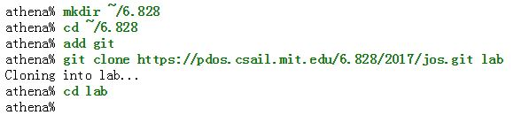
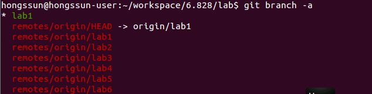
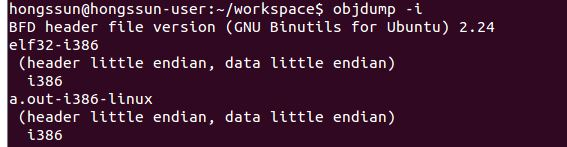
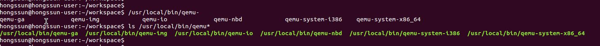
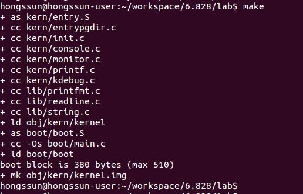
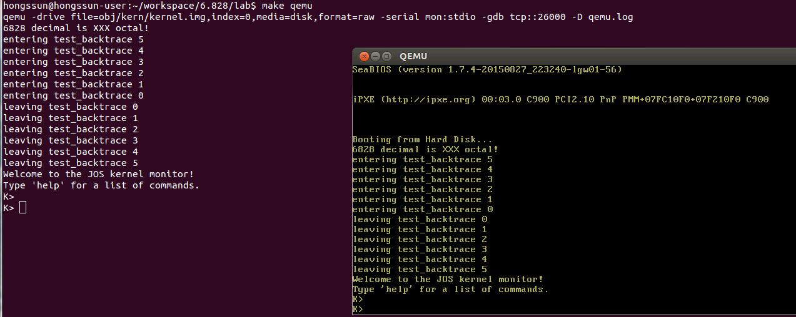
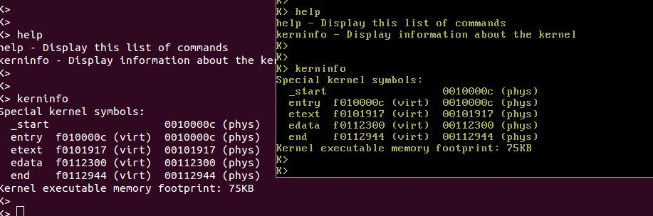
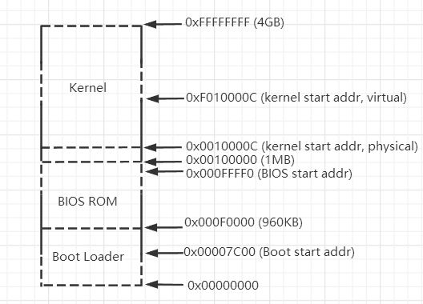
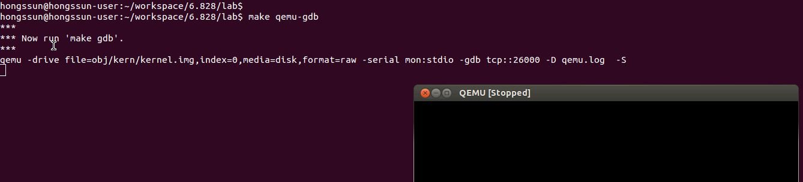
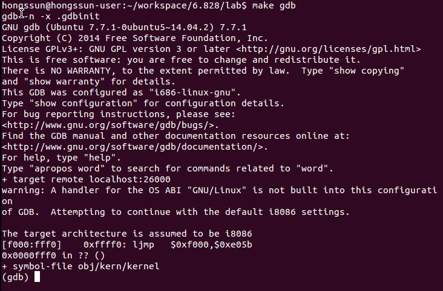

# Lab 1: Booting a PC
原文: [https://pdos.csail.mit.edu/6.828/2017/labs/lab1/](https://pdos.csail.mit.edu/6.828/2017/labs/lab1/)

## Introduction
本实验分为三个部分, 第一部分熟悉 x86汇编语言, QEMU x86模拟器, 以及 PC的上电启动流程; 第二部分考察 6.828内核的引导加载程序, 程序在 lab 的 boot 目录; 第三部分深入研究 6.828 内核本身的初始模板, 名为 JOS, 它位于 kernel 目录中.

### Software Setup
课程的 git repo [ https://pdos.csail.mit.edu/6.828/2017/jos.git]( https://pdos.csail.mit.edu/6.828/2017/jos.git " https://pdos.csail.mit.edu/6.828/2017/jos.git"). 下载代码后 *git branch* 是 origin/lab1, *git diff origin/lab1* 会显示相较于 origin/lab1 的修改.  






如果工作在 "non-Athena machine", 需要安装 qumu 以及 gcc 等, 参考 [https://pdos.csail.mit.edu/6.828/2017/tools.html](https://pdos.csail.mit.edu/6.828/2017/tools.html "tools page"). 对 qemu 有几个有用的调试修改, 后续的一些实验依赖这些补丁. 如果工作环境使用了本地 ELF 工具链, 比如 Linux, 大多数 BSD, 但不是 OS X, 可以简单地从软件包管理器安装 gcc, 否则按照工具页面上的说明操作.

#### Test Your Compiler Toolchain

输入命令: objdump -i

输出第二行应该是: elf32-i386



输入命令: gcc -m32 -print-libgcc-file-name

输出打印类似于 /usr/lib/gcc/i486-linux-gnu/version/libgcc.a 或者 /usr/lib/gcc/x86_64-linux-gnu/version/32/libgcc.a


如果两个命令都执行成功, 则不需要编译工具链, 否则需要安装开发环境.

#### Using a Virtual Machine

略.

#### Building Your Own Compiler Toolchain

上面两个命令执行成功, 略.

#### QEMU Emulator
使用 MIT 打过 patch 的 qemu 版本 v2.3.0

1. 下载 qemu
	
		git clone http://web.mit.edu/ccutler/www/qemu.git -b 6.828-2.3.0
	
2. 在 Debian/Ubuntu 上需要安装下列库
    libsdl1.2-dev, libtool-bin, libglib2.0-dev, libz-dev, and libpixman-1-dev

3. 配置源码, 默认将 qemu 安装到 /usr/local/bin
    ./configure --disable-kvm  --target-list="i386-softmmu x86_64-softmmu"

4. 安装

    sudo make
    sudo make install

    

## Part 1: PC Bootstrap
第一个练习的目的是介绍 x86汇编语言以及 PC的引导启动过程, 开始 qemu 和 qemu/gdb 调试.

### Getting Started with x86 assembly
快速熟悉 x86 汇编语言, 参考书 [PC Assembly Language Book](https://pdos.csail.mit.edu/6.828/2017/readings/pcasm-book.pdf "PC Assembly Language Book"). 但是书中的例子采用 NASM 汇编器, 使用 Intel syntax, 而本实验将使用 GNU 汇编器, 使用 AT&T syntax. 两者之间的转换参考 [Brennan's Guide to Inline Assembly](http://www.delorie.com/djgpp/doc/brennan/brennan_att_inline_djgpp.html).

#### Exercise 1. 

熟悉参考页 [the 6.828 reference page](https://pdos.csail.mit.edu/6.828/2017/reference.html) 上的汇编语言材料, 不需要现在就读他们, 当读写 x86 汇编的时候参考这些材料.

推荐 [Brennan's Guide to Inline Assembly](http://www.delorie.com/djgpp/doc/brennan/brennan_att_inline_djgpp.html)上的 "The Syntax" 章节, 描述了 JOS 中使用的 AT&T assembly syntax.

### Simulating the x86
在 6.828 中我们将使用 QEMU Emulator, 一个现代和相对快速的模拟器. QEMU的内置监听器只提供有限的调试支持, QEMU 可以作为 GNU debugger(GDB) 的远程调试目标, 我们将在这个实验室中使用 GDB 来逐步完成早期引导过程.  

在前面下载的 JOS 源码 lab 目录执行 *make*, 构建最小的 6.828 引导加载程序和内核.



上面 make 产生的文件 obj/kern/kernel.img 作为模拟 PC 的 “virtual hard disk” 的内容, 这个硬盘映像包含我们的引导加载程序 (obj/boot/boot) 和内核 (obj/kernel). 

执行 *make qemu*.



"Starting SeaBIOS” 是 BIOS 的输出.

从 "6828 decimal is XXX octal!" 开始都是 JOS kernel 的打印输出,  提示符 K> 由 small monitor 打印.  

kernel monitor 只支持两个命令输入: *help* 和 *kerninfo*.



*help* 命令是显而易见的, 我们将简单讨论 *kerninfo* 打印的含义. 尽管简单但是值得注意的是 kernel monitor 直接运行在模拟 PC 的虚拟硬件上(is running "directly" on the "raw (virtual) hardware"). 这意味着能够复制 *obj/kern/kernel.img* 的内容到实际硬盘的前几个扇区, 将该硬盘插入到实际 PC 中, 打开它, 然后在 PC 的实际屏幕上看到与上面在 QEMU 窗口中看到的完全相同的东西.(但是, 我们不建议在硬盘上有有用信息的真实机器上这样做, 因为将 *kernel.img* 复制到硬盘的开头会破坏主引导记录和第一个分区的开头, 实际上导致硬盘上以前的所有内容丢失!)

### The PC's Physical Address Space
PC 的物理地址空间是硬连接的, 一般布局如下:




第一代 PC 基于16-bit 的 Intel 8088 处理器, 只能寻址1M的物理空间. 因此早期的 PC 物理地址空间起始于 0x00000000 终止于 0x000FFFFF, 即 0x00000000~0x000FFFFF. 并且早期 PC 只能使用"低内存" 640KB(0x00000000~0x000A0000)的区域作为随机存取存储器(RAM), 实际上非常早期的PC只能配置 16KB, 32KB, 64KB 的 RAM.

0x000A0000~0x000FFFFF 的 384KB区域被硬件保留用于特殊用途, 如视频显示缓冲区和保存在非易失性存储器中的固件, 该保留区域最重要的部分是 BIOS, 占用 0x000F0000~0x000FFFFF 64KB 空间. 在早期PC中 BIOS 保存在只读存储器中(ROM), 但是现代 PC存储在 Flash 上. BIOS 负责执行基本的系统初始化, 如激活显卡, 检查安装的内存大小. 初始化之后 BIOS 从适当的位置如软盘、硬盘、CD-ROM或网络加载操作系统, 并将机器的控制权交给操作系统.

Intel 最终在 80286 和 80386处理器上打破了1M内存空间限制, 分别支持 16M和 4GB 的内存空间, 但是 PC架构师们仍然保留了低 1MB 物理地址空间的原始布局, 以确保现有软件向后兼容. 因此现代 PC在物理内存 0x000A0000~0x00100000 有一个"洞", 将 RAM分为“低内存” 或 “传统内存”(前 640KB) 和“扩展内存”(其他所有内存). 此外在 32bit物理地址空间的最顶端的一些空间, 尤其是物理 RAM, 现在通常由 BIOS为32位的 PCI设备保留.

	这里“洞”的意思是早期 0x000A0000~0x00100000 的 384KB空间是保留用于特殊用途, 现在为了兼容以前的软件, 这块空间不会被使用, RAM的物理地址空间是 0x00000000~0x000A0000 + 0x00100000~xxxxxxxx(取决于RAM大小)

近代的 x86处理器能够支持超过 4GB的物理 RAM, 所以 RAM地址可以扩展到 0xFFFFFFFF以上. 在这种情况下, BIOS必须在系统 RAM的32位可寻址区域的顶部留下第二个洞, 以便为这些 32位设备留下映射空间. 由于设计上的限制, JOS 将只使用 PC机物理内存的前256MB, 所以现在我们假设所有 PC “只有”32位物理地址空间, 但是处理复杂的物理地址空间和经过多年发展的硬件组织的其他方面是操作系统开发的重要实践挑战之一.

	第二个洞也是为了兼容已有的软件, 因为在 32bit物理地址空间的顶部区域用作了特殊用途, 如一些设备映射.

### The ROM BIOS

在实验的这部分将使用 QEMU 调试工具来研究 IA-32 兼容计算机如何引导.

打开两个 terminal, 都 cd 到 lab 目录. 在一个 terminal 中输入 make qemu-gdb, 启动 QEMU, 但是停在处理器执行第一条指令之前, 等待来自 GDB 的调试连接. 



在第二个 terminal 中运行 make gdb, 应该看到如下输出.



我们提供了一个 .gdbinit, 配置 GDB 在早期引导期间调试 16-bit 代码使用, 控制它附加到正在监听的 QEMU. (如果无法工作, 可能需要在 home 目录下的 .gdbinit 中添加一个 add-auto-load-safe-path, 让 gdb 处理我们提供的 .gdbinit)

下面这一行

```
[f000:fff0] 0xffff0:	ljmp   $0xf000,$0xe05b
```

是PC启动后 BIOS 执行的第一条指令的 GDB 反汇编, 从这个输出可以得出一些结论:

* IBM PC 从物理地址 0x000ffff0 开始执行, 该地址在 ROM BIOS 64KB 保留区域的最顶端.
* PC 以 `CS = 0xf000` 和 `IP = 0xfff0` 开始执行.
* 第一条将被执行的指令是 `jmp` 指令, 跳转到段地址`CS = 0xf000` 和`IP = 0xe05b`

为什么 QEMU 是这样开始的? 英特尔就是这样设计 8088 处理器的, IBM 在他们最初的个人电脑中使用了这种处理器. 由于 PC 中的 BIOS是硬连接到物理地址空间 0x000f0000-0x000fffff, 这种设计可以确保 BIOS 在上电后或者任何系统重启后总是首先获得机器控制权, 这是至关重要的, 因为上电时机器的内存中没有任何可以被处理器执行的软件. QEMU 模拟器带有自己的 BIOS, 在处理器模拟的物理地址空间的这个位置, 在处理器复位时, (模拟的)处理器进入实模式, 将 CS 设置为 0xf000,  IP 设置为 0xfff0, 从 CS:IP 段地址开始执行.

分段后的地址 0xf000:fff0 如何转换为物理地址? 

在实模式(PC 启动的模式)中, 地址转换根据下面的公式:

```
physical address = 16*segment + offset
```

因此当 PC 设置 CS 为 0xf000 以及 IP 为 0xfff0 时, 引用的物理地址是 16 * 0xf000 + 0xfff0 = 0xffff0.

0xffff0 是 BIOS 结束(0x100000)前的16个字节, 因此我们不应该惊讶于 BIOS 所做的第一件事就是 jmp 返回到BIOS 中较早的位置, 毕竟16个字节能完成多少工作呢?

当 BIOS运行时, 它设置一个中断描述符表, 并初始化各种设备比如 VGA显示器, 这就是在 QEMU 窗口中看到的 "Starting SeaBIOS” 消息的地方. 在初始化 PCI 总线和 BIOS 所知道的所有的重要设备之后, 它将搜索一个可引导的设备, 如软盘、硬盘或 CD-ROM. 最后当 BIOS 找到一个可引导磁盘时, 从磁盘读取 *boot loader* 并将控制权交给它.

### Exercise 2

使用 GDB si(Step Instruction) 命令跟踪 ROM BIOS 几条指令, 试图去猜测它可能在做什么. 参考  [6.828 reference materials page](https://pdos.csail.mit.edu/6.828/2017/reference.html) 上的一些资料, 不需要弄清楚所有的细节, 只需大致了解 BIOS 首先要做什么.


## Part 2: The Boot Loader

PC 的软盘和硬盘被划分为 512 字节的扇区(sector).  扇区是磁盘的最小传输粒度: 每个读或写操作的大小必须是一个或多个扇区, 并且在扇区边界上对齐. 如果磁盘是可引导的, 则第一个扇区称为引导扇区(*boot sector*), 因为这是引导加载程序代码所在的位置. 当 BIOS 找到可引导的软盘或硬盘时, 将 512字节的引导扇区加载到物理地址0x7c00~0x7dff 的内存中, 然后使用 `jmp` 指令将 *CS:IP* 设置为 0000:7c00, 将控制权传递给引导加载程序. 与 BIOS 加载地址一样, 这些地址是固定的并且是 PC 标准化的.

从 CD-ROM 引导的能力在 PC 的发展过程中出现得很晚, PC 架构师利用这个机会重新思考了一下引导过程. 因此现代 BIOS 从 CD-ROM引导的方式有点复杂(而且功能更强大). CD-ROM 使用2048字节而不是512字节的扇区大小, BIOS 可以在将控制权转移到引导程序之前将更大的引导映像从磁盘加载到内存(而不仅仅是一个扇区). 有关更多信息, 参考 ["El Torito" Bootable CD-ROM Format Specification](https://pdos.csail.mit.edu/6.828/2017/readings/boot-cdrom.pdf).

对于6.828, 我们将使用传统的硬盘驱动器引导机制, 这意味着我们的引导加载程序放进512字节中. 引导加载程序由一个汇编语言源文件 `boot/boot.S` 和一个C源文件 `boot/main.c` 组成, 仔细查看这些源文件并弄明白. 引导加载程序必须完成两个主要功能:

1. 首先, 引导加载程序将处理器从实模式切换到32位保护模式, 因为只有在这种模式下软件才能访问处理器物理地址空间中1MB以上的所有内存. 在[PC Assembly Language](https://pdos.csail.mit.edu/6.828/2017/readings/pcasm-book.pdf) 的1.2.7和1.2.8节中简要描述了保护模式, 在 Intel架构手册中有详细的描述. 此时只需要理解分段地址(分段:偏移)转换为物理地址的方式在保护模式下是不同的, 并且转换之后偏移量是32位而不是16位.
2. 其次, 引导加载程序通过 x86 特殊的 I/O 指令直接访问 IDE 磁盘设备寄存器, 从硬盘读取内核. 如果想更好地理解这里的特定 I/O指令的含义, 请查看 [the 6.828 reference page](https://pdos.csail.mit.edu/6.828/2017/reference.html) 参考页面上的 "IDE hard drive controller". 在本课程中不需要学习太多关于特定设备编程的知识: 编写设备驱动程序实际上是操作系统开发的一个非常重要的部分, 但是从概念或架构的角度来看它也是最无趣的部分之一.

理解引导加载程序源代码之后, 查看 `obj/boot/boot.asm` 文件. 这是引导加载程序的反汇编, 是GNU makefile 编译后创建的. 这个反汇编文件可以很容易地查看物理内存中所有引导加载程序代码的确切位置, 并且可以更容易地在 GDB 中跟踪单步进入引导加载程序时发生了什么. 同样 obj/kern/kernel.asm 包含一个 JOS 内核的反汇编,它通常对调试很有用.

在 GDB 中使用 `b` 命令设置断点地址, 例如 `b *0x7c00` 在 0x7C00 地址设置了一个断点. 在断点处使用 `c` 和 `si` 命令继续执行: `c` 让 QEMU 继续执行直到下一个断点, `si N` 一次步进 N 个指令. 

可以使用 `x/i` 命令检查内存中的指令,  语法是 `x/Ni ADDR`, N 是要反汇编的连续指令数, `ADDR` 是开始反汇编的内存地址.

#### Exercise 3

查看 [lab tools guide](https://pdos.csail.mit.edu/6.828/2017/labguide.html), 特别是有关 GDB 命令的部分, 包括一些对操作系统工作有用的深奥的 GDB 命令.

在 0x7c00 设置一个断点, 引导扇区将在这里加载. 继续执行直到该断点, 跟踪 `boot/boot.S` 代码, 使用源代码和反汇编文件 `obj/boot/boot.asm` 保持跟踪的位置. 还可以使用 x/i 命令在引导加载程序中对指令序列进行反汇编, 并将原始的引导加载程序源代码与 `obj/boot/boot.asm` 中的反汇编和 GDB 进行比较.

跟踪进入 `boot/main.c bootmain()`, 然后进入 `readsect()`. 识别出 `readsect()` 中每个语句对应的汇编指令, 跟踪 `readsect()` 的其余部分并返回到 `bootmain()`, 并标识从磁盘读取内核剩余扇区的 `for` 循环的开始和结束, 找出循环结束时将运行什么代码, 在那里设置一个断点, 然后继续运行到断点, 然后逐步完成引导加载程序的其余部分.

能够回答以下问题:

* 处理器从何时开始执行 32 位代码, 是什么导致从16位模式切换到32位模式?
* 引导加载程序执行的最后一条指令是什么? 加载内核的第一条指令是什么?
* 内核的第一条指令在哪?
* 引导加载程序如何决定必须读取多少个扇区才能从磁盘获取整个内核? 它从哪里找到这些信息?

#### Exercise 4

阅读 C 语言指针编程, 参考 *The C Programming Language* by Brian Kernighan and Dennis Ritchie (known as 'K&R').

阅读 5.1(指针与地址)到5.5(字符指针与函数), 下载代码 [pointers.c](https://pdos.csail.mit.edu/6.828/2017/labs/lab1/pointers.c), 运行, 了解所有打印值的来源. 特别是要了解打印的第1行和第6行中的指针地址来自何处, 打印的第2行到第4行中的所有值是如何实现的, 以及为什么第5行中的值看起来是损坏的.

#### Loading the Kernel

为了弄清 `boot/main.c` 的输出, 需要知道 ELF 二进制文件是什么. 当编译和链接一个 C 程序如 JOS 内核, 编译器将每个 C 源文件 ('`. C` ') 转换成一个目标文件('`.o`'), 其中包含汇编语言指令, 以硬件期望的二进制格式编码. 然后链接器将所有编译后的目标文件组合成一个单一的二进制映像，比如 `obj/kern/kernel`, 在本例中是 ELF 格式的二进制映像, ELF 格式代表“可执行和可链接格式”.

有关 ELF 格式的完整信息在 [the ELF specification](https://pdos.csail.mit.edu/6.828/2017/readings/elf.pdf), 在本节课中不需要深入研究这种格式的细节. 尽管从整体上看这种格式非常强大和复杂, 但是大多数复杂部分都是用于支持动态加载共享库的, 维基百科页面  [Wikipedia page](http://en.wikipedia.org/wiki/Executable_and_Linkable_Format) 有一个简短的描述.

6.828 的目的, 可以将 ELF 可执行文件看作是一个带有加载信息的头文件, 后面跟着几个程序段, 每个程序段都是一个连续的代码块或数据块，要加载到内存中的指定地址. 引导加载程序不修改代码或数据, 只是将它加载到内存中并开始执行它.

ELF 二进制文件以一个固定长度的 ELF 头开始, 然后是一个可变长度的程序头, 列出要加载的每个程序节. 这些 ELF 头文件的 C 定义在`inc/elf.h`中, 感兴趣的程序节有:

* `.text` 程序的可执行指令
* `.rodata` 只读数据, 如 C 编译器生成的ASCII字符串常量. (不用费心设置硬件来禁止写入)
* `.data` 数据部分保存程序的初始化数据, 如全局变量 `int x = 5`

当链接器计算程序的内存布局时, 它为未初始化的全局变量(如 `int x;`)预留了空间, 在名为 `.bss` 中, 该部分在内存中紧跟的 `.data` 之后. C 语言要求“未初始化的”全局变量以 0 值开始, 因此无需在 ELF 二进制文件中存储 `.bss` 的内容. 相反链接器只记录 `.bss` 部分的地址和大小, 加载程序或程序本身必须将 `.bss` 部分设为零.

检查内核中所有可执行部分的名称、大小和链接地址的完整列表，输入:

*objdump -h obj/kern/kernel*

会看到比上面列出的更多的段, 但是并不重要, 其他大部分用于保存调试信息, 调试信息通常包含在程序的可执行文件中, 但不会由程序加载器加载到内存中.

特别是 `.text` 部分的 “VMA” (链接地址)和 “LMA” (加载地址), 一个程序节的加载地址是将该节加载到内存中的内存地址. 程序节的链接地址是该段期望被执行的内存地址. 

链接器以各种方式对二进制文件中的链接地址进行编码, 例如当代码需要全局变量的地址时, 如果从一个没有链接的地址执行二进制文件, 那么二进制文件通常无法工作. (生成不包含任何绝对地址的位置无关代码也是可能的, 这被现代共享库广泛使用, 但是有性能和复杂性成本, 不会在6.828中使用)

通常链接地址和加载地址是一样的. 例如查看引导加载程序的 `.text` 部分

*objdump -h obj/boot/boot.out*

引导加载程序使用 ELF 程序头来决定如何加载程序段, 程序头指定 ELF 对象的哪些部分要加载到内存中, 以及每个部分应该占据的目标地址, 输入以下命令可以检查程序头:

*objdump -x obj/kern/kernel*

程序头在 objdump 输出中的 “Program Headers” 下列出, ELF 对象中需要加载到内存中的区域标记为 “LOAD”. 还有每个 Program Header 的其他信息, 如虚拟地址 (“vaddr”)、物理地址 (“paddr”) 和加载区域的大小 (“memsz” 和 “filesz”).

回到 `boot/main.c`, 每个 program header 的ph->p_pa字段都包含段的目标物理地址 (在本例中, 它实际上是一个物理地址, 尽管 ELF 规范对该字段的实际含义含糊其辞).

BIOS 从地址 0x7c00 开始将引导扇区加载到内存中, 所以这是引导扇区的加载地址. 这也是引导扇区执行的位置, 所以这也是它的链接地址. 我们通过将`-Ttext 0x7C00`传递给 boot/Makefrag 中的链接器来设置链接地址，这样链接器将在生成的代码中生成正确的内存地址.

#### Exercise 5

再次跟踪  boot loader 的前几条指令, 并确定第一个可能 “break” 的指令, 或者如果错误地获取了 boot loader 的链接地址, 则会执行错误的操作. 然后将 boot/Makefrag 中的链接地址更改为错误, 运行 make clean, 再 make 重新编译, 然后再次跟踪 boot loader 看看会发生什么. 别忘了把链接地址改回来, 再 make clean.

回顾 kernel 的加载和链接地址, 与  boot loader 程序不同, 这两个地址并不相同: kernel 告诉 boot loader 将其加载到内存中的低地址(1兆字节), 但它希望从高地址执行, 我们将在下一节中深入研究如何实现这一点.

除了节信息之外, ELF 头中还有一个很重要的字段, e_entry. 这个字段包含程序 *entry point* 的链接地址:  在程序 text 中的内存地址, 程序从这里开始执行, 通过下面命令查看 entry point

*objdump -f obj/kern/kernel*

现在应该能够理解 `boot/main.c` 中最小的 ELF 加载器, 它将内核的每个 section 从磁盘读取到内存中该节的加载地址, 然后跳转到内核的 entry point.

#### Exercise 6

我们可以使用 GDB 命令 *x* 检查内存, [GDB manual](https://sourceware.org/gdb/current/onlinedocs/gdb/Memory.html) 有完整的细节, 但是现在只要知道命令 *x/Nx ADDR* 在 *ADDR* 打印内存的 *N* 个 word 就足够了. (注意命令中的 'x' 都是小写的) 警告: 一个 word 的大小不是一个通用的标准, 在 GNU 汇编中一个 word 是两个字节( xorw 中的 'w' 代表 word, 意思是 2个 bytes).

复位机器 (退出 QEMU/GDB 并重新启动), 在 BIOS 进入 boot loader 时检查内存 0x00100000 处的 8个 word, 然后在 boot loader 进入内核时再检查一次. 它们为什么不同? 第二个断点是什么? (并不需要使用QEMU 来回答这个问题, 只是思考).


## Part 3: The Kernel

与引导加载程序一样, 内核以一些汇编语言代码开始, 这些代码设置了一些东西, 以便 C语言代码能够正确执行.

### Using virtual memory to work around position dependence

检查前面的引导加载程序的链接和加载地址时, 它们完全匹配. 但是内核的链接地址(由 objdump 打印)和它的加载地址之间存在相当大的差异. 回去检查一下, 确保明白我们在说什么. (链接内核比引导加载程序更复杂, 所以链接和加载地址位于 `kern/kernel.ld` 的顶部)

操作系统内核通常喜欢链接并运行在非常高的虚拟地址上, 比如0xf0100000, 以便留出处理器虚拟地址空间的较低部分供用户程序使用, 这样安排的原因在下一个实验会更加清楚.

许多机器在地址 0xf0100000 处没有任何物理内存, 所以我们不能指望能够将内核存储在那里. 相反, 我们将使用处理器的内存管理硬件将虚拟地址 0xf0100000 (内核代码期望运行的链接地址)映射到物理地址0x00100000 (这是引导加载程序将内核加载到物理内存的地方). 这种方式, 虽然内核虚拟地址高得让很多用户进程有大量的地址空间, 但是它将被加载到物理内存中 1MB 的电脑的内存, 仅在 BIOS ROM 之上. 这种方法要求个人电脑至少有几兆字节的物理内存 (物理地址0x00100000 能工作), 但这很可能适用于1990年后生产的任何个人电脑.

实际上, 在下一个实验室中, 我们将映射 PC 物理地址整个底层的256MB 空间, 从物理地址 0x00000000 到 0x0fffffff, 分别映射到虚拟地址 0xf0000000 到 0xffffffff. 现在应该能明白为什么 JOS 只能使用前256MB 的物理内存.

现在, 我们只映射物理内存的第一个4MB 空间, 这足够让我们启动并运行. 我们使用 `kern/entrypgdir.c` 中手工编写的静态初始化的页目录和页表来实现这一点. 现在不需要了解它如何工作的细节, 只需要了解它所实现的效果. 直到 `kern/entry.S` 设置 CR0_PG 标志, 内存引用被视为物理地址 (严格地说, 它们是线性地址，但是 `boot/boot.S` 建立了一个从线性地址到物理地址的同等映射, 我们永远不会改变它). 

一旦设置了 CR0_PG, 内存引用就是虚拟内存硬件将其转换为物理地址的虚拟地址. `entry_pgdir` 将范围为 0xf0000000 到 0xf0400000 的虚拟地址转换为物理地址 0x00000000 到 0x00400000, 以及将虚拟地址 0x00000000 到 0x00400000 转换为物理地址 0x00000000 到0x00400000. 任何不在这两个范围内的虚拟地址都将导致硬件异常, 因为我们还没有设置中断处理, 这将导致 QEMU dump 机器状态并退出(如果没有使用 6.828 补丁版本的 QEMU, 则会无休止地重启).

### **Exercise 7**

使用 QEMU 和 GDB 跟踪 JOS 内核, 停在 `movl %eax、%cr0`. 检查0x00100000 和 0xf0100000 处的内存. 现在使用 *stepi*  命令单步执行该指令,  再次检查 0x00100000 和 0xf0100000处的内存, 确保能明白刚刚发生了什么.

在新映射建立之后, 如果映射没有就位, 第一个不能正常工作的指令是什么? 在 `kern/entry.S`  中注释掉 `movl %eax， %cr0`, 跟踪一下看看你是不是对的.

### Formatted Printing to the Console

大多数人认为 printf() 这样的函数是理所当然的, 有时甚至认为它们是 C语言的“基本类型”. 但是在操作系统内核中, 我们必须自己实现所有的I/O.

通读 `kern/printf.c, lib/printfmt.c, kern/console.c`, 了解他们的关系, 稍后的实验中将会清楚为什么 `printfmt.c` 位于单独的 `lib` 目录中.

能够回答以下问题:

1. 解释 `printf.c` 和 `console.c` 之间的接口. 特别是 `console.c` 输出什么函数? 这个函数如何被 `printf.c `使用?

2. 从 `console.c` 中解释如下代码

   	if (crt_pos >= CRT_SIZE) {
      	    	int i;
      	    	memmove(crt_buf, crt_buf + CRT_COLS, (CRT_SIZE - CRT_COLS) * sizeof(uint16_t));
      	    	for (i = CRT_SIZE - CRT_COLS; i < CRT_SIZE; i++)
      	            crt_buf[i] = 0x0700 | ' ';
      	    	crt_pos -= CRT_COLS;
      	}

3. 对于下面的问题, 可以参考第二讲的讲义. 这些注释涵盖了 GCC 在 x86 上的调用约定.

   一步一步跟踪以下代码的执行:

   ```
   int x = 1, y = 3, z = 4;
   cprintf("x %d, y %x, z %d\n", x, y, z);
   ```

   * 在调用 `cprintf()` 时, `fmt` 指向什么? `ap` 指向什么?
   * 列出(按执行顺序) 对 `cons_putc, va_arg, vcprintf` 的每个调用. 对于 `cons_putc`, 也列出它的参数. 对于 `va_arg`, 列出调用前后 `ap` 指向的内容. 对于 `vcprintf` 列出它的两个参数的值.

4.  运行下面的代码:

   ```
   unsigned int i = 0x00646c72;
   cprintf("H%x Wo%s", 57616, &i);
   ```

   输出是什么? 按照前面的练习一步一步地解释这个输出是如何得到的. [Here's an ASCII table](http://web.cs.mun.ca/~michael/c/ascii-table.html) 将字节映射到字符. 

   输出取决于 x86 是 little-endian这一事实, 如果 x86 是 big-endian,为了得到相同的输出将 `i` 设置什么 ? 是否需要将 `57616` 改为不同的值 ?

   [Here's a description of little- and big-endian](http://www.webopedia.com/TERM/b/big_endian.html) and [a more whimsical description](http://www.networksorcery.com/enp/ien/ien137.txt).

5.  在下面的代码中,`'y='` 后面会打印什么? (注意:答案不是一个特定的值) 为什么会这样 ?

   ```
   cprintf("x=%d y=%d", 3);
   ```

6. 假设 GCC 更改了它的调用约定, 以便按声明顺序在堆栈上放参数, 以便最后一个参数被放到最后, 将如何更改 `cprintf` 或者它的接口, 使它仍然能够传递可变数量的参数 ?

### **Exercise 8**

使用 “%o” 形式的模式打印八进制数所需的代码, 查找并填充此代码片段.

### The Stack

在本实验室的最后练习中, 我们将更详细地探讨C语言在 x86上使用堆栈的方式, 并在这一过程中写一个有用的新内核监控功能, 打印一个堆栈回溯(*backtrace*): 从导致当前执行点的嵌套调用指令 `call` 中保存的指令指针(IP)值的列表.

### **Exercise 9**

```
确定内核在哪里初始化它的堆栈, 以及堆栈在内存中的确切位置. 内核如何为其堆栈保留空间? 栈指针初始化指向的是这个保留区域的哪个“端”?
```

x86 堆栈指针(`esp` 寄存器) 指向当前正在使用的堆栈的最低位置, 该位置以下为堆栈保留的区域中的所有内容都是空闲的. 将一个值压入堆栈先减少堆栈指针, 然后将该值写入堆栈指针指向的位置. 从堆栈中弹出一个值先读取堆栈指针指向的值, 然后增加堆栈指针. 在32 bit 模式下,堆栈只能保存32 bit 值, `esp` 总是可以被 4整除. 各种x86指令, 比如 `call`都是“硬连接”的, 以便使用堆栈指针寄存器.

相反, `ebp` (基指针) 寄存器主要是通过软件约定与堆栈相关联的. 在进入C函数时, 函数的 *prologue* 代码通常通过将前一个函数的  `ebp` 压入堆栈来保存它, 然后在函数运行期间将当前 `esp` 值复制到 `ebp` 中. 

如果程序中的所有函数遵守这个约定, 在程序执行期间任何给定的点, 可以通过跟踪保存的 `ebp` 指针链来遍历堆栈, 准确确定哪些嵌套函数调用序列导致到达程序中的这个特定点. 该功能可能特别有用, 例如当某个特定的函数因为传递给它的错误参数而导致 `assert` 失败或 `panic`, 但你不确定是谁传递了错误参数时, 堆栈回溯可以让你找到出错的函数.

### **Exercise 10**

```
熟悉x86上的C调用约定, 在 obj/kern/kernel.asm中找到 test_backtrace函数的地址. 在那里设置一个断点, 并检查内核启动后每次调用它时会发生什么. test_backtrace 的每个递归嵌套层在堆栈上压入多少32-bit 的字, 这些字是什么?
注意, 要使这个练习正常工作, 你应该使用工具页或 Athena上打过 patch的 QEMU版本. 否则将不得不手动地将所有断点和内存地址转换为线性地址.
```

上面的练习应该为你提供了实现一个堆栈回溯函数所需的信息, 应该调用 `mon_backtrace()`. 这个函数的原型已经在 `kern/monitor.c` 中等着你了. 你可以完全用C 来完成, 但是可能会发现 `inc/x86.h` 中的 `read_ebp()` 函数很有用. 你还必须将这个新函数挂接到内核监控的命令列表中, 以便用户可以交互式地调用它.

栈回溯函数应该以如下格式显示函数调用帧列表:

```
Stack backtrace:
  ebp f0109e58  eip f0100a62  args 00000001 f0109e80 f0109e98 f0100ed2 00000031
  ebp f0109ed8  eip f01000d6  args 00000000 00000000 f0100058 f0109f28 00000061
  ...
```

每行包含 `ebp`, `eip`, and `args`. 
The `ebp` 值表示该函数使用的堆栈的基指针. 也就是说, 堆栈指针的位置就在函数进入之后, 函数的 prologue 代码设置了基指针. 
`eip` 值是函数的返回指令指针: 函数返回时的指令地址. 返回指令指针通常指向 call 指令之后的指令(为什么?) 
最后, `args` 后列出的5个十六进制值是所讨论的函数的前5个参数, 它们将在调用函数之前被压入堆栈. 当然如果调用函数时参数少于5个, 那么并不是所有的5个值都有用. (为什么回溯代码不能检测实际有多少参数? 这个限制怎么能被修正呢?)

打印的第一行反映了当前正在执行的函数, 即 `mon_backtrace()` 本身, 第二行反映了调用 `mon_backtrace()` 的函数，第三行反映了调用该函数的函数, 以此类推. 你应该打印所有优秀的堆栈帧, 通过学习  `kern/entry.S` 你会发现有一种简单的方法来告诉你什么时候该停下来.

以下是你在《K&R》第5章中读到的一些特别的要点, 值得记住, 以备以后的练习和将来的实验.

- If `int *p = (int*)100`, then `(int)p + 1` and `(int)(p + 1)` are different numbers: the first is `101` but the second is `104`. When adding an integer to a pointer, as in the second case, the integer is implicitly multiplied by the size of the object the pointer points to.
- `p[i]` is defined to be the same as `*(p+i)`, referring to the i'th object in the memory pointed to by p. The above rule for addition helps this definition work when the objects are larger than one byte.
- `&p[i]` is the same as `(p+i)`, yielding the address of the i'th object in the memory pointed to by p.

尽管大多数C程序从来不需要在指针和整数之间进行强制转换, 但操作系统经常需要这样做. 当你看到一个涉及内存地址的加法时, 问问你自己它是整数加法还是指针加法, 并确保被加的值是否被适当地乘上了.

### **Exercise 11**

```
实现上面指定的 backtrace函数, 使用与示例中相同的格式, 否则评分脚本将会混乱. 当你认为已经让它正常工作时, 运行 make grade看看它的输出是否符合我们的评分脚本的预期, 如果不符合就修复它. 在提交了 Lab 1代码之后, 欢迎以任何您喜欢的方式更改 backtrace函数的输出格式.

如果使用 read_ebp(), 请注意 GCC可能会生成“优化的”代码, 在 mon_backtrace()的 function prologue 之前调用 read_ebp(), 这将导致不完整的堆栈跟踪(最近的函数调用的堆栈帧丢失). 虽然我们已经尝试禁用导致这种重新排序的优化, 但你可能希望检查 mon_backtrace()的汇编, 并确保对 read_ebp()的调用发生在 function prologue 之后.
```

此时，你的 backtrace 函数应该给你提供函数调用者在堆栈上的地址, 其导致 `mon_backtrace()` 被执行. 然而, 在实践中你通常希望知道与这些地址对应的函数名. 例如, 你可能想知道哪些函数可能包含错误导致内核崩溃.

为了帮你实现这个功能, 我们提供了函数 `debuginfo_eip()`, 该函数在符号表里面查找 `eip`, 并返回该地址的调试信息. 函数定义在 `kern/kdebug.c`

### Exercise 12

```
修改堆栈回溯函数以显示每个 eip的函数名, 源文件名和对应于该 eip的行号.
在 debuginfo_eip中, __STAB_* 来自哪里? 这个问题的答案很长, 为了帮助你找到答案, 这里有一些你可能想做的事情:
* look in the file kern/kernel.ld for __STAB_*
* run objdump -h obj/kern/kernel
* run objdump -G obj/kern/kernel
* run gcc -pipe -nostdinc -O2 -fno-builtin -I. -MD -Wall -Wno-format -DJOS_KERNEL -gstabs -c -S kern/init.c, and look at init.s.
* see if the bootloader loads the symbol table in memory as part of loading the kernel binary

通过插入stab_binsearch的调用来查找地址的行号, 完成 debuginfo_eip的实现.
在内核监视器中添加一个 backtrace命令, 并扩展 mon_backtrace 的实现来调用 debuginfo_eip, 并为每个堆栈帧打印一行:

K> backtrace
Stack backtrace:
  ebp f010ff78  eip f01008ae  args 00000001 f010ff8c 00000000 f0110580 00000000
         kern/monitor.c:143: monitor+106
  ebp f010ffd8  eip f0100193  args 00000000 00001aac 00000660 00000000 00000000
         kern/init.c:49: i386_init+59
  ebp f010fff8  eip f010003d  args 00000000 00000000 0000ffff 10cf9a00 0000ffff
         kern/entry.S:70: <unknown>+0
K> 

每一行给出了堆栈帧的 eip 的文件名和该文件中的行, 后面是函数名和 eip 与该函数的第一个指令的偏移量(例如, monitor+106 表示返回的 eip是 monitor开始位置后的106个字节).

确保将文件和函数名打印在单独的一行上, 以避免混淆评分脚本.

提示:printf 格式字符串提供了一种简单但晦涩的方式来打印像 STABS表中那样的非空结尾字符串. printf("%.*s", length, string) 打印 string的最大长度字符. 看看 printf 手册页, 了解为什么这样做.

你可能会发现在回溯过程中丢失了一些函数. 例如可能会看到对 monitor()的调用, 但不会看到对 runcmd()的调用.这是因为编译器内联了一些函数调用. 其他优化可能会导致你看到意外的行号. 如果从 GNUMakefile 中去掉-O2, 回溯可能更有意义(但内核将运行得更慢).
```

这就完成了实验, 在实验目录中, 使用 git commit 提交修改, 并输入 make hand 提交代码.