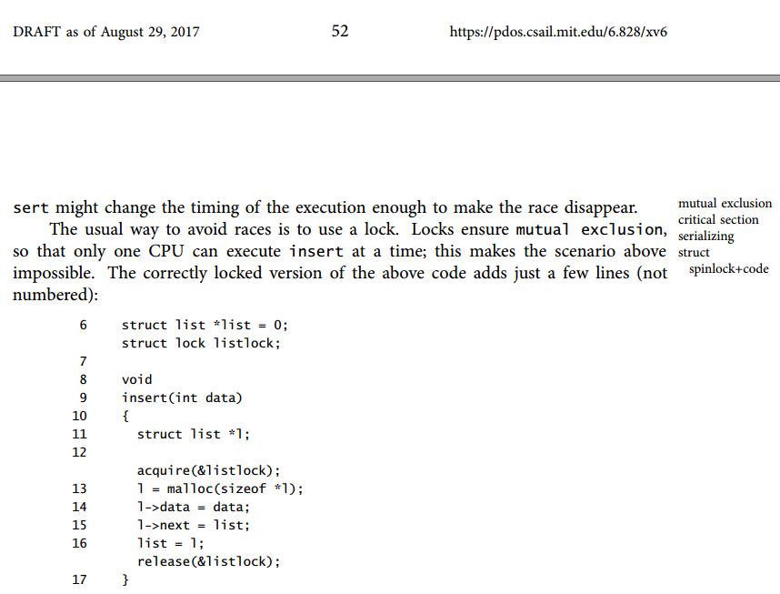
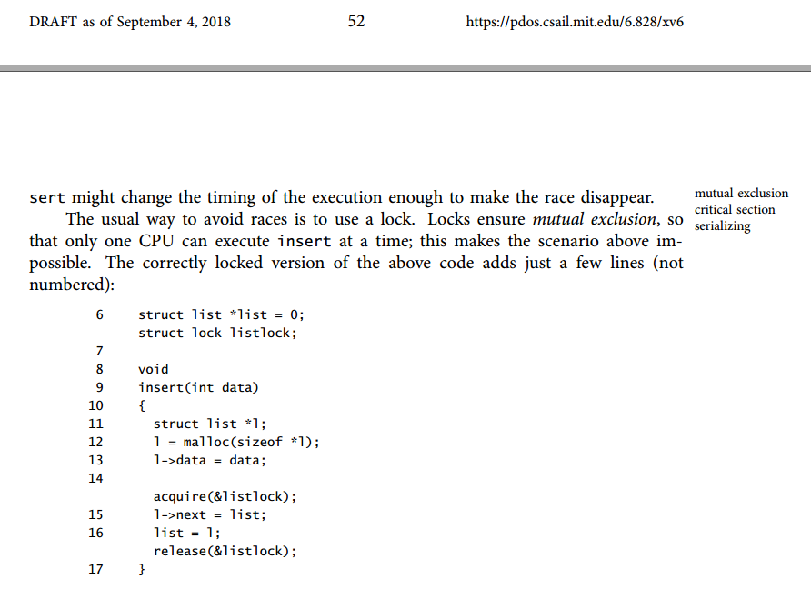

# Lab 4: Preemptive Multitasking

## 预习准备

### 一些基本概念

* 公共资源: 就是被多个任务共享的资源, 如内存, 文件等
* 临界区: 要访问使用公共资源, 肯定得通过一些代码指令去访问, 这些访问公共资源的代码就是临界区
* 并发: 单个 CPU 上交替处理多个任务, 宏观上看就像是同时进行的一样, 但微观上看任意时刻还是只有一个任务在进行
* 并行: 多个处理器同时处理多个任务, 能够做到真正意义上的多个任务同时进行
* 互斥: 也称为排他, 任何时候公共资源只允许最多一个任务独享, 不允许多个任务同时执行临界区的代码访问公共资源
* 竞争条件: 竞争条件指的是多个任务以竞争的形式并行访问公共资源, 公共资源的最终状态取决于这些任务的临界区代码的精确执行时序

显然竞争条件并不是我们想要的, 虽然一些竞争条件出现的概率很小. 所以对于进入临界区访问公共资源要避免竞争条件, 保证访问公共资源的互斥排他性, 一般有两种主要的解决思路来实现互斥:

* 忙等待: 没进入临界区时一直循环, 占用 CPU 资源
* 休眠等待: 没进入临界区时一直休眠, 不占用 CPU, CPU 利用率较高, 但有进程上下文切换的开销

那如何知道临界区能不能进, 公共资源能不能访问, 让进程知道现在是否可以进入临界区访问公共资源, 这个东西就是锁. 根据上面两种解决思路, xv6 实现了两种锁:
自旋锁和休眠锁.

### Race conditions(竞争条件)

下面例子说明为什么需要锁. xv6 中的 IDE 磁盘, 磁盘驱动会维护一个未完成磁盘请求的链表, 这样处理器可能会并发地向链表中加入新的请求. 如果没有并发请求, 可以这样实现:

  

如果两个不同的 CPU同时执行 insert, 可能会两者都运行到15行, 而都未开始运行16行(见下图).


这样的话就会出现两个链表节点 l, 并且 next 都被设置为 list. 当两者都运行了16行的赋值后, 后运行的一个会覆盖前运行的,于是先赋值的进程中添加的节点就丢失了. 这种问题就被称为竞争条件, 竞争问题在于它们的结果由 CPU 执行时间以及其内存操作的先后决定的, 并且这个问题难以重现. 例如, 在调试 insert 时加入输出语句, 就足以改变执行时间, 使得竞争消失.

通常我们使用锁来避免竞争, 锁提供了互斥, 所以同一时刻只有一个 CPU 可以运行 insert, 这就让上面的竞争条件不可能发生, 代码如下:

```
struct list *list = 0;
struct lock listlock;

void insert(int data)
{
	struct list *l;
	l = malloc(sizeof *l);
	l->data = data;
		acquire(&listlock);
	l->next = list;
	list = l;
		release(&listlock);
}
```

当我们说锁保护了数据时, 是指锁保护了数据对应的一组不变量 (invariant). 不变量是数据结构在操作中维护的一些状态. 一般来说操作的正确行为会取决于不变量是否为真. 操作是有可能暂时破坏不变量的, 但在结束操作之前必须恢复不变量.

例如, 在上述链表中, 不变量即 list 指向链表中第一个节点, 而每个节点的 next 指向下一个节点. insert 的实现就暂时破坏了不变量: 第13行建立一个新链表元素 l, 并认为 l 是链表中的第一个节点, 但 l 的 next 还没有指向下一个节点(在第15行恢复了该不变量), 而 list 也还没有指向 l (在第16行恢复了该不变量). 上面所说的竞争之所以发生是因为可能有另一个 CPU 在这些不变量(暂时)没有被恢复的时刻运行了依赖于不变量的代码. 恰当地使用锁就能保证一时间只有一个 CPU 操作数据结构,这样在不变量不正确时就不可能有其他 CPU 对数据结构进行操作了.

你可以把锁看成是把并发的临界区串行化 (serializing)的一种工具, 使它们同时只运行一个, 从而保护不变量. 你也可以认为由同一个锁保护的临界区相互之间是原子的, 这样每个临界区都只能看到来自之前临界区的完整变化, 而永远不会看到部分完成的更新.  

### Locking (锁)

大多数内核, 包括 xv6, 都会交错执行多个任务. 多处理器硬件可以交错执行任务, 具有多个 CPU 独立执行的计算机. 这些多个 CPU 共享物理内核, xv6 利用共享来维护所有 CPU 读写的数据结构. 这种共享带来了一种可能性, 即一个 CPU读取一个数据结构, 而另一个 CPU 正在中途更新它, 甚至多个 CPU 同时更新同一个数据. 如果不仔细设计, 这种并行访问很可能产生不正确的结果或破坏数据结构. 

即使在单处理器上, 内核也可能在多个线程之间切换 CPU, 导致它们的交错执行. 最后, 如果访问数据结构时发生中断, 一个设备中断处理程序可能会修改与一些可中断代码相同的数据, 从而破坏数据. 并发一词指的是由于多处理器并行、线程切换或中断而导致多个指令流交错的情况.

xv6 为以上两种情况提供了能够达到互斥功能的锁, 即保证某个时间点只有一个 CPU 能持有锁, 只能在持有特定的锁时才能使用数据结构, 那么就能保证同一时间只有一个 CPU能使用这个数据结构. 这样, 这个锁就保护了数据结构.

在代码实现时, 一定要问自己一个问题: 另一个处理器的存在是否会让这行代码无法达到期望的运行结果(因为另一个处理器也可能正在运行该代码, 并修改这个共享变量). 还要考虑如果这里执行一个中断处理程序, 又会发生什么情况. 与此同时一行 C 代码可能由多条机器指令组成, 而另一个处理器或者中断可能在这些指令中间影响它(原子操作), 你不能假设这些代码是顺序执行的(内存乱序), 也不能假设一个 C 指令是以原子操作执行的. 

虽然使用锁可以使不正确的代码变得正确, 但缺点是锁会扼杀性能, 因为锁将并发操作串行化了.

锁的位置对性能也很重要, 在前面链表的例子中, 把 acquire(&listlock);移到 malloc(sizeof *l) 之前也是正确的, 这可能会降低性能, 因为这样对 malloc 的调用也会被锁住 (book-rev10 中就是这么写的, book-rev11 更新).






#### spinlock 自旋锁

xv6 有两种类型的锁: 自旋锁和睡眠锁.

自旋锁的结构定义如下:

```
[spinlock.h]

struct spinlock {
  uint locked;       // Is the lock held?

  // For debugging:
  char *name;        // Name of lock.
  struct cpu *cpu;   // The cpu holding the lock.
  uint pcs[10];      // The call stack (an array of program counters)
                     // that locked the lock.
};
```

locked  用来表示该锁是否可用, 0 表示空闲可用, 1 表示锁被某 CPU持有. 其他三个元素用作为 debug调试信息.

##### acqui/rerelease 取锁/释放锁

从逻辑上讲, xv6 获取锁的的代码类似于

```
21 void
22 acquire(struct spinlock *lk) // does not work!
23 {
24 		for (;;){
25 		if (lk->locked == 0){
26 			lk->locked = 1;
27 			break;
28 			}
39 		}
30 }
```

不幸的是, 这种实现并不能保证多处理器上的相互排斥. 当两个 CPU 同时到达 if 语句, 都看到 lk->locked 为零, 然后都通过设置 lk->locked = 1 来抢夺锁. 此时两个不同的 CPU 持有锁, 这就违反了互斥属性. 正确的实现是让第 25行和第 26行作为一个原子(即不可分割)步骤来执行.

为了让这两行变为原子操作, xv6 采用了 x86硬件上的一条特殊指令 xchg(ARMv8 则是 LDXR/STXR 加载/存储). 在这个原子操作中, xchg 交换了内存中的一个字和一个寄存器的值. 函数 acquire 在循环中反复使用 xchg, 每一次都读取 lk->locked 然后设置为 1.

如果锁已经被持有了, lk->locked 就已经为 1, 故 xchg 会返回1然后继续循环. 如果 xchg 返回 0, 但是 acquire 已经成功获得了锁, 即 locked 已经从0变为 1, 跳出循环, 记录获得锁的 CPU 和栈信息, 以便调试 (当某个进程获得了锁却没有释放时, 这些信息可以找到问题所在, 当然这些信息也被锁保护着, 只有在持有锁时才能修改)

```
// Acquire the lock.
// Loops (spins) until the lock is acquired.
// Holding a lock for a long time may cause
// other CPUs to waste time spinning to acquire it.
void
acquire(struct spinlock *lk)
{
  pushcli(); // disable interrupts to avoid deadlock.
  if(holding(lk))	// 判断锁是否可用
    panic("acquire");

  // The xchg is atomic.
  while(xchg(&lk->locked, 1) != 0)	// 原子赋值
    ;

  // Tell the C compiler and the processor to not move loads or stores
  // past this point, to ensure that the critical section's memory
  // references happen after the lock is acquired.
  __sync_synchronize();			// 发出一个full barrier

  // Record info about lock acquisition for debugging.
  lk->cpu = mycpu();
  getcallerpcs(&lk, lk->pcs);
}

void
release(struct spinlock *lk)
{
  if(!holding(lk))
    panic("release");

  lk->pcs[0] = 0;
  lk->cpu = 0;

  // Tell the C compiler and the processor to not move loads or stores
  // past this point, to ensure that all the stores in the critical
  // section are visible to other cores before the lock is released.
  // Both the C compiler and the hardware may re-order loads and
  // stores; __sync_synchronize() tells them both not to.
  __sync_synchronize();

  // Release the lock, equivalent to lk->locked = 0.
  // This code can't use a C assignment, since it might
  // not be atomic. A real OS would use C atomics here.
  asm volatile("movl $0, %0" : "+m" (lk->locked) : );

  popcli();
}
```

##### "开关"中断

```
void
pushcli(void)
{
  int eflags;

  eflags = readeflags();	// 关中断之前读取 eflags寄存器
  cli();					// 关中断
  if(mycpu()->ncli == 0)	// 第一次 pushcli()
  		mycpu()->intena = eflags & FL_IF;	//记录 cli之前的中断状态
  mycpu()->ncli += 1;		// 关中断次数(深度)加1
}

void
popcli(void)
{
  if(readeflags()&FL_IF)	// 如果eflags寄存器 IF位为1
    	panic("popcli - interruptible");
  if(--mycpu()->ncli < 0)	// 如果计数小于0
    	panic("popcli");
  if(mycpu()->ncli == 0 && mycpu()->intena)	// 关中断次数为0时即开中断
    	sti();
}
```

pushcli()/popcli() 是 cli() 和 sti() 的封装函数, 只是增加了计数, 每个 popcli 与 pushcli 匹配, 有多少次 pushcli 就要有多少次 popcli.

每次 pushcli() 都要先读取 eflags 寄存器, 然后 cli() 关中断, 这是因为如果是第一次 pushcli 的话需要记录 cli 之前的中断状态到 cpu 结构体 intena 字段.

每次 pushcli() 都调用了 cli 来关中断, 但其实只有第一次 pushcli 有实际关中断的效果 (如果第一次 pushcli 之前本来就处于关中断状态, 那么第一次的 pushcli 的 cli 也没关中断的效果).

但是 popcli() 开中断的时机必须是最后一个 popcli (也就是计数为 0时) 以及第一次 pushcli 之前的中断状态为打开状态, 只有两者都满足时才能开中断.

###### 为什么要关中断

从竞争条件的角度看, 在单个 CPU上, 中断也可能导致并发. 如果允许中断, 内核代码可能在任何时候停下来, 然后执行中断处理程序, 内核代码和中断处理程序交叉访问公共资源也可能导致错误, 所以在取锁检验锁都要在关中断下进行. 另外 xv6不支持线程, 而各个进程之间内存是不共享的, 加之内核进入临界区访问公共资源的时候是关了中断的, 关了中断除了自己休眠是不会让出 CPU 的, 所以运行在单个处理器上的各个进程之间的并发其实并不会产生竞争条件.

从死锁的角度看, 若有进程 A调用 acquire() 想要获得锁, 当它拿到锁时刚好发生中断, 中断处理程序也想要获得该锁, 但 A已经换下 CPU 不会释放锁, 则产生死锁. 所以要先关中断再上锁.

###### 为什么 pushcli()/popcli() 而不直接使用 cli()/sti()

那是因为某个程序中可能要取多个锁, 比如先后取了锁 1 锁 2, 那么释放锁 2 之后能开中断吗? 显然不能, 必须等锁 1 也释放的时候才能开中断. 所以使用增加计数功能的 pushcli()/popcli() 来实现最后一个锁释放的时候才开中断.

##### 检查锁

```
// Check whether this cpu is holding the lock.
int
holding(struct spinlock *lock)
{
  int r;
  pushcli();
  r = lock->locked && lock->cpu == mycpu();	//检验是否上锁, 以及被当前 CPU持有
  popcli();
  return r;
}
```

关中断下检查锁的条件为两个: 一是锁是否被持有, 二是锁是否由当前 CPU持有, xv6 不允许同一个 CPU对同一个锁重复上锁.

##### 上锁

```
  // The xchg is atomic.
  while(xchg(&lk->locked, 1) != 0)	// 原子赋值
    ;
```

xchg() 是一个原子赋值操作, 交换就相当于赋值, 将 &lk->locked赋值为 1并返回 &lk->locked的旧值. 也就是说如果该锁空闲没有 CPU 持有, 那么当前 CPU 将其赋值为 1 表示取得该锁, xchg 返回旧值 0, 跳出循环. 如果该锁已经被某 CPU持有, xchg 对其赋值为 1, 且返回也是 1, 则继续循环等待.

##### 内存屏障

```
  __sync_synchronize();			// 发出一个full barrier
```

现今处理器在执行指令时, 除了有流水线技术, 还有乱序执行. 为了获得更高的性能, 会不按顺序执行代码. 如果一条指令需要很多周期才能完成, CPU 可能会提前发出该指令, 例如 CPU可能会注意到在一个串行序列中, 指令 A 和 B 互不依赖. CPU 可能先启动指令 B, 这是因为它的输入在 A 的输入之前已经准备好了, 或者是为了使 A 和 B 的执行重叠, 编译器可以执行类似的重新排序(re-order), 在一条语句的指令之前发出另一条语句的指令.

re-order 有时会产生不确定性, 比如 lk->cpu = mycpu(); 在乱序后被放到了取锁之前执行. 为了告诉编译器和 CPU不要执行这样的 re-ordering, xv6 在获取和释放中都使用了__sync_synchronize().

__sync_synchronize() 是一个内存屏障(memory barrier), 它告诉编译器和 CPU不要在屏障上乱序加载或存储.

内存屏障包括两类: 编译器屏障和CPU内存屏障

* 编译时, 编译器优化进行指令重排而导致内存乱序访问;  比如 g++下 O2或者 O3都会改变实际执行指令的顺序
* 运行时, CPU间交互引入内存乱序访问(实际上单CPU 山多进程/多线程不会有运行时乱序问题)

####  sleeplock 休眠锁

有时需要长时间保持一个锁, 例如文件系统在磁盘上读写文件内容时, 会保持一个文件的锁定, 这些磁盘操作可能需要几十毫秒. 如果另一个进程想获取一个自旋锁,那么保持那么长的时间会导致浪费.

自旋锁的另一个缺点是, 一个进程在保留自旋锁的同时不能让出 CPU. 在保留自旋锁的同时让出是非法的, 因为如果第二个线程试图获取自旋锁, 可能会导致死锁, 因为获取自旋锁不会让出 CPU, 第二个线程的自旋可能会阻止第一个线程运行并释放锁. 在持有锁的同时让出也会违反在持有自旋锁时中断必须关闭的要求. 因此, 我们希望有一种锁, 在等待获取的过程中让出 CPU(和中断)      

 xv6 提供了休眠锁, 它在自旋锁的基础之上实现, 定义如下

```
// Long-term locks for processes
struct sleeplock {
  uint locked;       // Is the lock held?
  struct spinlock lk; // spinlock protecting this sleep lock
  
  // For debugging:
  char *name;        // Name of lock.
  int pid;           // Process holding lock
};

void acquiresleep(struct sleeplock *lk)
{
	acquire(&lk->lk); 			//优先级:->高于&
	while (lk->locked) { 		//当锁已被其他进程取走
		sleep(lk, &lk->lk); 	//休眠
	}
	lk->locked = 1; 			//上锁
	lk->pid = myproc()->pid; 	//取锁进程的 pid
	release(&lk->lk);
}

void releasesleep(struct sleeplock *lk)
{
	acquire(&lk->lk); //取自旋锁
	lk->locked = 0;
	lk->pid = 0;
	wakeup(lk); //唤醒
	release(&lk->lk);
}
```

休眠锁的意思是某个进程为了取这个休眠锁不得而休眠, 所以有个 pid来记录进程号.

休眠锁要使用自旋锁来保护有两点原因:

* 首先休眠锁的自旋锁可以使得对休眠锁的本身属性字段的操作为一个原子操作, 是为保护.

* 另外一个原因涉及到进程的休眠唤醒.

  sleep(&obj, (&obj)->lock); 这是sleep 函数的原型, 如果一个进程想要获取一个对象 obj 而不得, 那么这个进程就会休眠在对象 obj上面. 有休眠就有唤醒, 而这个 obj.lock 主要就是为了避免错过唤醒. 当前进程想要获取休眠锁, 这个休眠锁就是对象, 如果被别的进程取走的话, 那么当前进程就取而不得, 休眠在休眠锁这个对象上. 如果取到了该休眠锁, 就将 locked 置为 1, 记录取得该锁的进程号.
  解锁操作基本上就是上锁的逆操作, 注意可能有其他进程休眠在休眠锁上, 所以当前进程解锁后需要唤醒休眠在休眠锁上的进程.

acquiresleep 对 sleep 的调用会原子性地让出 CPU并释放 spinlock, 其结果是, 在 acquiresleep 等待时, 其他线程可以执行.

因为休眠锁会使中断处于启用状态, 所以不能在中断处理程序中使用. 因为 acquiresleep 可能会让出 CPU, 所以休眠锁不能在 spinlock 临界区内使用.

自旋锁最适合短的临界区, 因为等待它们会浪费 CPU时间, 睡眠锁适用于长时间的操作.      

## Introduction

在本实验中, 你将在多个同时活动的用户模式环境中实施抢占式多任务处理

- PartA: 为 JOS 增添多处理器支持特性, 实现循环调度 (round-robin scheduling), 添加一个基本的环境(进程)管理系统调用(创建和销毁环境, 分配和映射内存)
- PartB: 实现一个类 Unix 的, 其允许一个用户模式的环境能创建一份它自身的拷贝, fork()
- PartC: 支持进程间通信 (inter-process communication, IPC), 支持硬件时钟中断和抢占

### Getting started

```
git checkout -b lab4 origin/lab4
git merge lab3
```

## Part A: Multiprocessor Support and Cooperative Multitasking

多处理器支持和协作式多任务处理

扩展 JOS 使其能运行在多处理器上, 实现新的 JOS内核系统调用允许用户程序能创建新的环境(进程). 还将实现协作式循环调度, 允许内核在当前环境自愿放弃 CPU (或退出)时从一个环境切换到另一个环境. 后面在 C 部分, 将实现抢占式调度, 即使环境不合作, 也允许内核在一定时间后重新夺回 CPU 控制权.

### Multiprocessor Support

我们将让 JOS 支持对称多处理器 (symmetric multiprocessing, SMP), 这是一种多处理器模型, 其中所有 CPU 都具有对系统资源 (如内存和 I/O 总线)的等效访问. 虽然所有 CPU 在 SMP 中功能相同, 但在引导过程中它们可分为两种类型

- 引导处理器 (bootstrap processor, BSP): 负责初始化系统和引导操作系统
- 应用程序处理器 (application processors, AP): 只有在操作系统启动并运行后, BSP 才会激活应用程序处理器

在 SMP 系统中, 每个 CPU都有一个附带的 Local APIC (LAPIC) 单元

```
APIC:Advanced Programmable Interrupt Controller 高级可编程中断控制器, 连接外设, 将外设产生的中断信号传递给指定的处理器
```

LAPIC 单元负责在整个系统中传递中断, LAPIC 还为其连接的 CPU提供一个唯一标识符. 在本实验中, 我们利用 LAPIC 单元(在 kern/lapic.c 中) 的以下基本功能

* 读取 LAPIC 识别码(APIC ID), 告诉我们代码运行在哪个 CPU上, 参见 `cpunum()`
* 从 BSP向 APs发送处理器间中断 (IPI) 唤醒其他的 CPU, 参见 `lapic_startap()`
* 在 Part C, 编写 LAPIC 的内置定时器来触发时钟中断, 以支持抢占式多任务, 参见`pic_init()`

处理器使用内存映射 I/O (MMIO) 访问其 LAPIC. 在 MMIO中, 物理内存的一部分被硬连线到一些 I/O设备的寄存器, 因此通常用于访问内存的相同 load/store 指令也可以用于访问设备寄存器. 在物理地址 0xA0000 处已经看到了一个 IO空间 (我们用它来写入VGA显示缓冲区). LAPIC 开始于物理地址 0xFE000000 (4GB 之下的 32MB), 但是这地址太高, 我们无法使用通常的直接映射到 KERNBASE 来访问它(虚拟地址 0xF0000000 映射0x0, 即只有 256MB). JOS虚拟内存映射在 MMIOBASE(0xEF800000) 处留下了 4MB的空隙, 因此我们有一个可以映射设备的地方. 由于后面的实验会引入更多的 MMIO 区域, 你将编写一个简单的函数来从这个区域分配空间并将设备内存映射到其中.

#### Exercise 1

```
Implement mmio_map_region in kern/pmap.c. To see how this is used, look at the beginning of lapic_init in kern/lapic.c. You'll have to do the next exercise, too, before the tests for mmio_map_region will run.

void *
mmio_map_region(physaddr_t pa, size_t size)
{
	static uintptr_t base = MMIOBASE;

	// Your code here:
    void *ret = (void *)base;
    size = ROUNDUP(size, PGSIZE);
    if (base + size > MMIOLIM || base + size < base) 
	{
        panic("mmio_map_region size overflow\n");
    }
    
    boot_map_region(kern_pgdir, base, size, pa, PTE_W|PTE_PCD|PTE_PWT);

    base += size;
    return ret;
}
```

#### Application Processor Bootstrap

应用处理器 (APs)引导程序

在启动 APs之前, BSP应该先收集关于多处理器系统的配置信息, 比如 CPU总数, CPUs的 APIC ID, LAPIC单元的 MMIO地址等.  `kern/mpconfig.c`中的 `mp_init()`函数通过读取驻留在 BIOS内存区域中的 MP配置表来检索此信息. 也就是说在出厂时, 厂家就将此计算机的处理器信息写入了 BIOS中, 其有一定的规范, 也就是 `kern/mpconfig.c`中 `struct mp`定义的.

`boot_aps()`(在 `kern/init.c`中)函数驱动了 AP引导过程. AP以实模式启动, 非常类似于 bootloader 在 `boot/boot.S`中启动的方式, 因此 `boot_aps()`将 AP入口代码( `kern/mpentry.S`) 复制到可在实模式下寻址的内存位置. 与 bootloader 不同, 我们可以控制 AP开始执行代码的位置; 我们将 entry 代码复制到  `0x7000` (`MPENTRY_PADDR`), 但任何未使用的, 页面对齐的物理地址低于 640KB都可以.

之后, `boot_aps()` 函数通过发送 `STARTUP`的 IPI(处理器间中断)信号到 AP的 LAPIC 单元来一个个地激活 AP. 并附带一个 AP应该开始执行其入口代码的初始 `CS:IP` 地址(在我们的案例中是  `MPENTRY_PADDR`). `kern/mpentry.S` 的入口代码与  `boot/boot.S`的代码相似, 在一些简短的配置后, 它使 AP进入保护模式并启用分页, 调用 C语言的配置函数  `mp_main()`. `boot_aps()` 在继续唤醒下一个 AP之前, 会等待 AP在其 `struct CpuInfo`  的`cpu_status`字段中发出  `CPU_STARTED` 标志.

#### Exercise 2

```
Read boot_aps() and mp_main() in kern/init.c, and the assembly code in kern/mpentry.S. Make sure you understand the control flow transfer during the bootstrap of APs. 
Then modify your implementation of page_init() in kern/pmap.c to avoid adding the page at MPENTRY_PADDR to the free list, so that we can safely copy and run AP bootstrap code at that physical address. 
Your code should pass the updated check_page_free_list() test (but might fail the updated check_kern_pgdir() test, which we will fix soon).

void
page_init(void)
{
	// LAB 4:
	// Change your code to mark the physical page at MPENTRY_PADDR 
	// as in use
	// boot_aps() 将 APs的入口代码放到了 MPENTRY_PADDR处, page_init()将此处的物理页标识为已用, 避免加入到空闲链表中,
	// 所以在原来的代码基础上添加一个判断即可. 
	//    if (i == mp_page)
    //        continue;

    size_t i = 1;
    size_t mp_page = PGNUM(MPENTRY_PADDR);

    for (i = 1; i < npages_basemem; i++)
    {
        if (i == mp_page)
            continue;
        pages[i].pp_ref = 0;
        pages[i].pp_link = page_free_list;
        page_free_list = &pages[i];
    }

    physaddr_t next_page = PADDR(boot_alloc(0));
    size_t idx_free = next_page / PGSIZE;
    for(i = idx_free; i < npages; i++)
    {
        pages[i].pp_ref = 0;
        pages[i].pp_link =page_free_list;
        page_free_list = &pages[i];
    }
}
```

#### Question

```
1. Compare kern/mpentry.S side by side with boot/boot.S. Bearing in mind that kern/mpentry.S is compiled and linked to run above KERNBASE just like everything else in the kernel, what is the purpose of macro MPBOOTPHYS? Why is it necessary in kern/mpentry.S but not in boot/boot.S? In other words, what could go wrong if it were omitted in kern/mpentry.S? 
Hint: recall the differences between the link address and the load address that we have discussed in Lab 1.
```

#### Per-CPU State and Initialization

在编写多处理器 OS时, 区分每个处理器私有的 CPU 状态和共享的系统全局状态非常重要.  `kern/cpu.h` 定义了大部分 per-CPU 状态, 包括 `struct CpuInfo`, 它存储每个 CPU的变量.  `cpunum()` 返回 CPU ID, 可以用作  `cpus`等数组的索引. 宏  `thiscpu` 则是当前 CPU 的 `struct CpuInfo`的简写.

应该注意以下  per-CPU状态如下:

- Per-CPU kernel stack, 每个 CPU的内核栈
  由于多个 CPU可以同时陷入内核, 因此需要为每个处理器分配单独的内核栈, 以防止它们干扰彼此的执行. 数组  `percpu_kstacks[NCPU][KSTKSIZE]` 为 NCPU 的内核栈预留了空间.

  在 lab2 中，将  `bootstack` 所指的物理内存映射为 BSP的内核栈, 位于 `KSTACKTOP`之下. 类似地, 在本 lab中, 将为每个 CPU的内核栈映射该区域, 使用保护页作为它们之间的缓冲区. CPU0  的栈仍然从 `KSTACKTOP`向下生长; CPU1 的栈将从 CPU0 栈底下方  `KSTKGAP` 字节的位置开始, 依此类推. inc/memlayout.h 显示了映射布局.

- Per-CPU TSS and TSS descriptor, 每个 CPU 的 TSS和TSS 描述符
  还需要每个 CPU的任务状态段(TSS), 以指定每个 CPU的内核栈所在位置. CPU i 的 TSS 存储在  `cpus[i].cpu_ts`中, 相应的 TSS 描述符在 GDT 条目  `gdt[(GD_TSS0 >> 3) + i]`中定义,  `kern/trap.c` 中定义的全局  `ts`将不再有用.
  
- Per-CPU current environment pointer, 每个 CPU 的当前环境(进程)指针
  由于每个 CPU可以同时运行不同的用户进程, 我们重新定义了符号  `curenv`,使其指向  `cpus[cpunum()].cpu_env` 或  `thiscpu->cpu_env`, 指向当前 CPU 上正在执行的环境(执行该代码的 CPU)
  
- Per-CPU system registers

  所有寄存器, 包括系统寄存器, 都是 CPU私有的. 在每个 CPU上必须执行初始化这些寄存器的指令, 例如  `lcr3()`, `ltr()`, `lgdt()`, `lidt()`等. 这类指令必须在每个 CPU上执行一次, 为此，定义了函数  `env_init_percpu()` 和  `trap_init_percpu()`

  此外, 如果在之前的实验中解决挑战问题时添加了任何额外的每个 CPU状态或进行了额外的 CPU特定初始化(例如, 在 CPU寄存器中设置新位), 请务必在这里在每个 CPU上复制这些操作!

#### Exercise 3

```
Modify mem_init_mp() (in kern/pmap.c) to map per-CPU stacks starting at KSTACKTOP, as shown in inc/memlayout.h. The size of each stack is KSTKSIZE bytes plus KSTKGAP bytes of unmapped guard pages. Your code should pass the new check in check_kern_pgdir().

//memlayout.h, 为每个 CPU分配一个内核栈,大小KSTKSIZE,内核栈之间的间隔 KSTKGAP,起保护作用
 *    KERNBASE, ---->  +------------------------------+ 0xf0000000      --+
 *    KSTACKTOP        |     CPU0's Kernel Stack      | RW/--  KSTKSIZE   |
 *                     | - - - - - - - - - - - - - - -|                   |
 *                     |      Invalid Memory (*)      | --/--  KSTKGAP    |
 *                     +------------------------------+                   |
 *                     |     CPU1's Kernel Stack      | RW/--  KSTKSIZE   |
 *                     | - - - - - - - - - - - - - - -|                 PTSIZE
 *                     |      Invalid Memory (*)      | --/--  KSTKGAP    |
 *                     +------------------------------+                   |
 *                     :              .               :                   |
 *                     :              .               :                   |
 *    MMIOLIM ------>  +------------------------------+ 0xefc00000      --+
 
static void
mem_init_mp(void)
{
	// Map per-CPU stacks starting at KSTACKTOP, for up to 'NCPU' CPUs.
	//
	// For CPU i, use the physical memory that 'percpu_kstacks[i]' refers
	// to as its kernel stack. CPU i's kernel stack grows down from virtual
	// address kstacktop_i = KSTACKTOP - i * (KSTKSIZE + KSTKGAP), and is
	// divided into two pieces, just like the single stack you set up in
	// mem_init:
	//     * [kstacktop_i - KSTKSIZE, kstacktop_i)
	//          -- backed by physical memory
	//     * [kstacktop_i - (KSTKSIZE + KSTKGAP), kstacktop_i - KSTKSIZE)
	//          -- not backed; so if the kernel overflows its stack,
	//             it will fault rather than overwrite another CPU's stack.
	//             Known as a "guard page".
	//     Permissions: kernel RW, user NONE
	//
	// LAB 4: Your code here:
    size_t i;
    size_t kstacktop_i;
    for(i = 0; i < NCPU; i++)
    {
        kstacktop_i = KSTACKTOP - i * (KSTKSIZE + KSTKGAP);
        boot_map_region(kern_pgdir,
                        kstacktop_i - KSTKSIZE,
                        KSTKSIZE,
                        PADDR(&percpu_kstacks[i]),
                        PTE_W);
    }
}
```

#### Exercise 4

```
The code in trap_init_percpu() (kern/trap.c) initializes the TSS and TSS descriptor for the BSP. It worked in Lab 3, but is incorrect when running on other CPUs. Change the code so that it can work on all CPUs. (Note: your new code should not use the global ts variable any more.)

// 复用 Lab3中的代码, 将所有的全局ts替换为 cpus[i].cpu_ts 就行.
// 并且此时代码执行发生在不同的 CPU上, 只需要对自身 CPU进行初始化即可, 即使用 thiscpu->cpu_ts代替全局变量 ts
// 不需要对所有 CPU进行 init
void
trap_init_percpu(void)
{
	// LAB 4: Your code here:

	// Setup a TSS so that we get the right stack
	// when we trap to the kernel.
    size_t i = cpunum();
    thiscpu->cpu_ts.ts_esp0 = KSTACKTOP - i*(KSTKSIZE + KSTKGAP);
    thiscpu->cpu_ts.ts_ss0 = GD_KD;
    thiscpu->cpu_ts.ts_iomb = sizeof(struct Taskstate);
    // Initialize the TSS slot of the gdt.
    gdt[GD_TSS0 >> 3] = SEG16(STS_T32A, (uint32_t) (&thiscpu->cpu_ts),
                            sizeof(struct Taskstate) - 1, 0);
    gdt[GD_TSS0 >> 3].sd_s = 0;

	// Load the TSS selector (like other segment selectors, the
	// bottom three bits are special; we leave them 0)
	ltr(GD_TSS0);

	// Load the IDT
	lidt(&idt_pd);
}

```

完成上述练习后, 使用 make qemu CPUS=4 (或 make qemu-nox CPUS=4) 在 QEMU中运行 JOS, 应该会看到如下输出:

```
...
Physical memory: 66556K available, base = 640K, extended = 65532K
check_page_alloc() succeeded!
check_page() succeeded!
check_kern_pgdir() succeeded!
check_page_installed_pgdir() succeeded!
SMP: CPU 0 found 4 CPU(s)
enabled interrupts: 1 2
SMP: CPU 1 starting
SMP: CPU 2 starting
SMP: CPU 3 starting
```


#### Locking

我们当前的代码在 `mp_main()` 中初始化 AP后进入了自旋. 在让 AP进一步执行之前, 我们需要首先解决多个 CPU同时运行内核代码时可能出现的竞争条件. 实现这一点的最简单方法是使用 *大内核锁*. 大内核锁是一个全局单一锁, 在环境进入内核模式时被持有, 并在环境返回用户模式时释放. 在这种模式下, 处于用户模式的环境可以在任何可用的 CPU上并发运行, 但在内核模式下只能有一个环境运行; 任何试图进入内核模式的其他环境都必须等待.

`kern/spinlock.h` 声明了大内核锁, 即`kernel_lock`. 同时, 它还提供了  `lock_kernel()` 和  `unlock_kernel()`, 用于获取和释放锁的快捷方式. 应该在四个位置应用大内核锁:

- In `i386_init()`, acquire the lock before the BSP wakes up the other CPUs.
- In `mp_main()`, acquire the lock after initializing the AP, and then call `sched_yield()` to start running environments on this AP.
- In `trap()`, acquire the lock when trapped from user mode. To determine whether a trap happened in user mode or in kernel mode, check the low bits of the `tf_cs`.
- In `env_run()`, release the lock *right before* switching to user mode. Do not do that too early or too late, otherwise you will experience races or deadlocks.

#### Exercise 5

```
Apply the big kernel lock as described above, by calling lock_kernel() and unlock_kernel() at the proper locations.
```

如何测试你的锁是否正确? 此时无法测试, 但是在接下来的练习中实现调度程序后, 将能够进行测试.

#### Question

```
2. It seems that using the big kernel lock guarantees that only one CPU can run the kernel code at a time. Why do we still need separate kernel stacks for each CPU? Describe a scenario in which using a shared kernel stack will go wrong, even with the protection of the big kernel lock.
```

### Round-Robin Scheduling

在本 lab中的下一个任务是修改 JOS内核, 使其能够以“轮转”的方式在多个环境之间切换. JOS中的轮转调度工作如下:

- 新文件  `kern/sched.c` 中的函数  `sched_yield()` 负责选择一个新的环境进行运行. 它以循环的方式在 `envs[]` 数组中顺序搜索, 从上一个运行环境之后开始(如果没有上一个运行环境, 则从数组的开头开始), 选择第一个状态为  `ENV_RUNNABLE` 的环境 (见`inc/env.h`), 并调用  `env_run()`以跳转到该环境.
- `sched_yield()` 绝不能在两个 CPU上同时运行同一个环境. 它可以通过环境的状态是否为  `ENV_RUNNING`来判断某个环境当前是否在某个 CPU上运行(可能是当前 CPU).
- 我们为你实现了一个新的系统调用 `sys_yield()`, 用户环境可以调用它以触发内核的  `sys_yield()`函数, 从而自愿将 CPU让给其他环境.

#### Exercise 6

```
Implement round-robin scheduling in sched_yield() as described above. Don't forget to modify syscall() to dispatch sys_yield().

Make sure to invoke sched_yield() in mp_main.

Modify kern/init.c to create three (or more!) environments that all run the program user/yield.c.

Run make qemu. You should see the environments switch back and forth between each other five times before terminating, like below.

Test also with several CPUS: make qemu CPUS=2.

...
Hello, I am environment 00001000.
Hello, I am environment 00001001.
Hello, I am environment 00001002.
Back in environment 00001000, iteration 0.
Back in environment 00001001, iteration 0.
Back in environment 00001002, iteration 0.
Back in environment 00001000, iteration 1.
Back in environment 00001001, iteration 1.
Back in environment 00001002, iteration 1.
...
After the yield programs exit, there will be no runnable environment in the system, the scheduler should invoke the JOS kernel monitor. If any of this does not happen, then fix your code before proceeding.
```

#### Question

```
3. In your implementation of env_run() you should have called lcr3(). Before and after the call to lcr3(), your code makes references (at least it should) to the variable e, the argument to env_run. Upon loading the %cr3 register, the addressing context used by the MMU is instantly changed. But a virtual address (namely e) has meaning relative to a given address context--the address context specifies the physical address to which the virtual address maps. Why can the pointer e be dereferenced both before and after the addressing switch?

4. Whenever the kernel switches from one environment to another, it must ensure the old environment's registers are saved so they can be restored properly later. Why? Where does this happen?
```

### System Calls for Environment Creation

Although your kernel is now capable of running and switching between multiple user-level environments, it is still limited to running environments that the *kernel* initially set up. You will now implement the necessary JOS system calls to allow *user* environments to create and start other new user environments.

Unix provides the `fork()` system call as its process creation primitive. Unix `fork()` copies the entire address space of calling process (the parent) to create a new process (the child). The only differences between the two observable from user space are their process IDs and parent process IDs (as returned by `getpid` and `getppid`). In the parent, `fork()` returns the child's process ID, while in the child, `fork()` returns 0. By default, each process gets its own private address space, and neither process's modifications to memory are visible to the other.

You will provide a different, more primitive set of JOS system calls for creating new user-mode environments. With these system calls you will be able to implement a Unix-like `fork()` entirely in user space, in addition to other styles of environment creation. The new system calls you will write for JOS are as follows:

尽管现在我们的内核能够运行和在多个用户级环境之间切换, 但仍然仅限于运行由内核最初设置的环境. 现在将实现必要的 JOS系统调用, 允许用户环境创建和启动其他新的用户环境.
Unix提供了 `fork()`系统调用作为其进程创建原语. Unix的 `fork()`将调用进程(父进程)的整个地址空间复制到一个新进程(子进程)中. 用户空间可观察到的两个进程之间唯一的区别是它们的进程 ID和父进程 ID(由 `getpid`和 `getppid`返回). 在父进程中, `fork()`返回子进程的进程ID, 而在子进程中,`fork()`返回 0. 默认情况下, 每个进程都有自己私有的地址空间, 且一个进程对内存的修改对另一个进程不可见.

你将为创建新的用户模式环境提供一组不同且更原始的 JOS系统调用, 通过这些系统调用, 将能够在用户空间中完全实现类似 Unix的 `fork()`, 以及其他风格的环境创建. 为JOS编写的新系统调用如下:

- `sys_exofork`

  This system call creates a new environment with an almost blank slate: nothing is mapped in the user portion of its address space, and it is not runnable. The new environment will have the same register state as the parent environment at the time of the `sys_exofork` call. In the parent, `sys_exofork` will return the `envid_t` of the newly created environment (or a negative error code if the environment allocation failed). In the child, however, it will return 0. (Since the child starts out marked as not runnable, `sys_exofork` will not actually return in the child until the parent has explicitly allowed this by marking the child runnable using....)

* `sys_env_set_status`

  Sets the status of a specified environment to `ENV_RUNNABLE` or `ENV_NOT_RUNNABLE`. This system call is typically used to mark a new environment ready to run, once its address space and register state has been fully initialized.

* `sys_page_alloc`

  Allocates a page of physical memory and maps it at a given virtual address in a given environment's address space.

* `sys_page_map`

  Copy a page mapping (*not* the contents of a page!) from one environment's address space to another, leaving a memory sharing arrangement in place so that the new and the old mappings both refer to the same page of physical memory.

* `sys_page_unmap`

  Unmap a page mapped at a given virtual address in a given environment.

对于所有接受环境 ID的系统调用, JOS内核支持约定值为 0表示“当前环境”. 这一约定由  `kern/env.c`中的  `envid2env()` 实现.

我们在测试程序  `user/dumbfork.c`中提供了一个非常简单的类 Unix  `fork()` 的实现. 该测试程序使用上述系统调用创建并运行一个子环境, 并复制其自身的地址空间. 然后这两个环境利用 `sys_yield` 在之前的练习中交替切换. 父进程在 10次迭代后退出, 而子进程在 20次迭代后退出.

#### Exercise 7

```
Implement the system calls described above in kern/syscall.c and make sure syscall() calls them. You will need to use various functions in kern/pmap.c and kern/env.c, particularly envid2env(). For now, whenever you call envid2env(), pass 1 in the checkperm parameter. Be sure you check for any invalid system call arguments, returning -E_INVAL in that case. Test your JOS kernel with user/dumbfork and make sure it works before proceeding.
```

这完成了实验 Part A, 确保在运行 make grade 时通过所有 Part A的测试, 并像往常一样使用 make handin 提交. 如果你想弄清楚某个特定测试用例失败的原因, 可以运行  ./grade-lab4 -v, 它将显示每个测试的内核构建和 QEMU运行的输出, 直到某个测试失败. 当测试失败时, 脚本将停止, 你可以检查 jos.out 以查看内核实际输出的内容.

## Part B: Copy-on-Write Fork

## 参考

[GitHub - SmallPond/MIT6.828_OS: MIT 6.828 Operating System Lab https://pdos.csail.mit.edu/6.828/2018/schedule.html](https://github.com/SmallPond/MIT6.828_OS)

[MIT6.828 Lab4 Part A: Multiprocessor Support and Cooperative Multitasking_env priority-CSDN博客](https://blog.csdn.net/bysui/article/details/51567733)

[AnBlogs/6.828/lab4A-multicpu.md at master · Anarion-zuo/AnBlogs · GitHub](https://github.com/Anarion-zuo/AnBlogs/blob/master/6.828/lab4A-multicpu.md)

https://github.com/shishujuan/mit6.828-2017/blob/master/docs/lab4-exercize.md