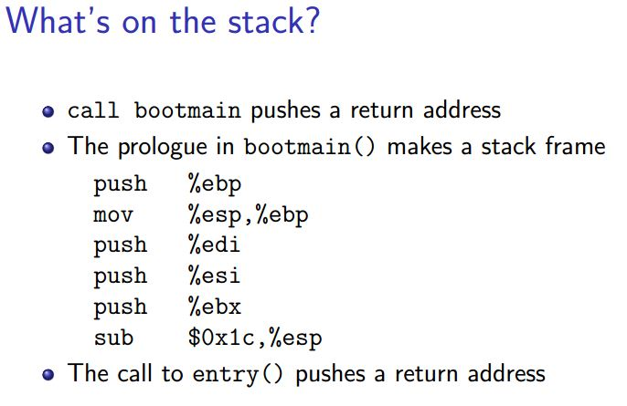
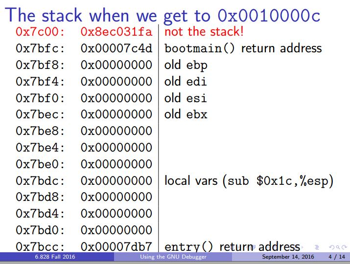

# Homework: boot xv6

原文: https://pdos.csail.mit.edu/6.828/2017/homework/xv6-boot.html

## Boot xv6

```
$ mkdir 6.828
$ cd 6.828
$ git clone git://github.com/mit-pdos/xv6-public.git

$ cd xv6-public
$ make
```

## Finding and breaking at an address

```
$ nm kernel | grep _start
8010a48c D _binary_entryother_start
8010a460 D _binary_initcode_start
0010000c T _start
```

`nm` 命令显示文件中符号的信息, 文件可以是对象文件, 可执行文件或对象文件库. 所谓符号, 通常指定义出的函数,全局变量等.

`kernel` 是 `make` 生成的 xv6 内核文件, 根据 `Makefile` 中的规则:

```
kernel: $(OBJS) entry.o entryother initcode kernel.ld
	$(LD) $(LDFLAGS) -T kernel.ld -o kernel entry.o $(OBJS) -b binary initcode entryother
	$(OBJDUMP) -S kernel > kernel.asm
	$(OBJDUMP) -t kernel | sed '1,/SYMBOL TABLE/d; s/ .* / /; /^$$/d' > kernel.sym
```

`_start` 是 `kernel`  的入口地址, 定义在 `entry.S`

```
# Entering xv6 on boot processor, with paging off.
.globl entry
entry:
  # Turn on page size extension for 4Mbyte pages
  movl    %cr4, %eax
  orl     $(CR4_PSE), %eax
  movl    %eax, %cr4
...
```

所以 xv6 内核的入口地址为: 0x10000c

运行 QEMU GDB, 在 0x10000c 设置断点. 在当前 terminal 执行

```
$ make qemu-gdb
```

新开一个 terminal 执行

```
$ gdb

(gdb) br *0x0010000c
Breakpoint 1 at 0x10000c
(gdb) c
Continuing.
The target architecture is assumed to be i386
=> 0x10000c:	mov    %cr4,%eax

Breakpoint 1, 0x0010000c in ?? ()
(gdb) info reg
eax            0x0	0
ecx            0x0	0
edx            0x1f0	496
ebx            0x10094	65684
esp            0x7bcc	0x7bcc
ebp            0x7bf8	0x7bf8
esi            0x10094	65684
edi            0x0	0
eip            0x10000c	0x10000c
eflags         0x46	[ PF ZF ]
cs             0x8	8
ss             0x10	16
ds             0x10	16
es             0x10	16
fs             0x0	0
gs             0x0	0
(gdb) x/24x $esp
0x7bcc:	0x00007db7	0x00000000	0x00000000	0x00000000
0x7bdc:	0x00000000	0x00000000	0x00000000	0x00000000
0x7bec:	0x00000000	0x00000000	0x00000000	0x00000000
0x7bfc:	0x00007c4d	0x8ec031fa	0x8ec08ed8	0xa864e4d0
0x7c0c:	0xb0fa7502	0xe464e6d1	0x7502a864	0xe6dfb0fa
0x7c1c:	0x16010f60	0x200f7c78	0xc88366c0	0xc0220f01

(gdb) x/10i
   0x10000f:	or     $0x10,%eax
   0x100012:	mov    %eax,%cr4
   0x100015:	mov    $0x109000,%eax
   0x10001a:	mov    %eax,%cr3
   0x10001d:	mov    %cr0,%eax
   0x100020:	or     $0x80010000,%eax
   0x100025:	mov    %eax,%cr0
   0x100028:	mov    $0x8010b5c0,%esp
   0x10002d:	mov    $0x80102df0,%eax
   0x100032:	jmp    *%eax
```

## Exercise: What is on the stack?

`x/24x $esp` 显示了内存地址 0x7bcc 即堆栈上的数据, 如果解释这些数据?

`x/10i` 显示当前断点即 `0x10000c` 后的 10 条汇编指令.

xv6 文件结构参考 lab1, 结合 `Makefile`

```
bootblock: bootasm.S bootmain.c
	$(CC) $(CFLAGS) -fno-pic -O -nostdinc -I. -c bootmain.c
	$(CC) $(CFLAGS) -fno-pic -nostdinc -I. -c bootasm.S
	$(LD) $(LDFLAGS) -N -e start -Ttext 0x7C00 -o bootblock.o bootasm.o bootmain.o
	$(OBJDUMP) -S bootblock.o > bootblock.asm
	$(OBJCOPY) -S -O binary -j .text bootblock.o bootblock
	
kernel: $(OBJS) entry.o entryother initcode kernel.ld
	$(LD) $(LDFLAGS) -T kernel.ld -o kernel entry.o $(OBJS) -b binary initcode entryother
	$(OBJDUMP) -S kernel > kernel.asm
	$(OBJDUMP) -t kernel | sed '1,/SYMBOL TABLE/d; s/ .* / /; /^$$/d' > kernel.sym
```

* bootasm.S, bootmain.c 组成 boot 部分, bootblock.asm 是生成的反汇编
* entry.S 是 kernel 入口文件, kernel.asm 是生成的反汇编

要知道 kernel 入口时的堆栈数据, 需要从 boot 开始知道对堆栈作了哪些操作, 分为以下4个问题.

1. 堆栈指针的初始值?

   重启 QEMU GDB, 在 0x7c00 设置断点, 这是 boot 的起始地址.

   ```
   // bootasm.S
   .code16                       # Assemble for 16-bit mode
   .globl start
   start:
     cli                         # BIOS enabled interrupts; disable
   
   // bootblock.asm
   00007c00 <start>:
   # with %cs=0 %ip=7c00.
   
   .code16                       # Assemble for 16-bit mode
   .globl start
   start:
     cli                         # BIOS enabled interrupts; disable
       7c00:	fa                   	cli    
   ```

   ```
   (gdb) br *0x7c00
   Breakpoint 1 at 0x7c00
   (gdb) c
   Continuing.
   [   0:7c00] => 0x7c00:	cli    
   
   Breakpoint 1, 0x00007c00 in ?? ()
   (gdb) info reg
   eax            0xaa55	43605
   ecx            0x0	0
   edx            0x80	128
   ebx            0x0	0
   esp            0x6f2c	0x6f2c
   ebp            0x0	0x0
   esi            0x0	0
   edi            0x0	0
   eip            0x7c00	0x7c00
   eflags         0x202	[ IF ]
   cs             0x0	0
   ss             0x0	0
   ds             0x0	0
   es             0x0	0
   fs             0x0	0
   gs             0x0	0
   
   ```

2. 当调用 `bootmain()` 时, 栈中数据是什么.

   ```
   // bootblock.asm
     movw    %ax, %gs                # -> GS
       7c41:	8e e8                	mov    %eax,%gs
     # Set up the stack pointer and call into C.
     movl    $start, %esp
       7c43:	bc 00 7c 00 00       	mov    $0x7c00,%esp
     call    bootmain
       7c48:	e8 e2 00 00 00       	call   7d2f <bootmain>
     
     # If bootmain returns (it shouldn't), trigger a Bochs
     # breakpoint if running under Bochs, then loop.
     movw    $0x8a00, %ax            # 0x8a00 -> port 0x8a00
       7c4d:	66 b8 00 8a          	mov    $0x8a00,%ax
   ```

   `bootasm.S` 中, 将 `start`赋值给 `%esp`, 即 `%esp = 0x7c00`

   ```
   (gdb) br * 0x7c41
   Breakpoint 1 at 0x7c41
   (gdb) c
   Continuing.
   The target architecture is assumed to be i386
   => 0x7c41:	mov    %eax,%gs
   
   // 断点设在 0x7c41, esp 还是初始值 0x6f2c
   Breakpoint 1, 0x00007c41 in ?? ()
   (gdb) info reg
   eax            0x0	0
   ecx            0x0	0
   edx            0x80	128
   ebx            0x0	0
   esp            0x6f2c	0x6f2c
   ebp            0x0	0x0
   esi            0x0	0
   edi            0x0	0
   eip            0x7c41	0x7c41
   eflags         0x6	[ PF ]
   cs             0x8	8
   ss             0x10	16
   ds             0x10	16
   es             0x10	16
   fs             0x0	0
   gs             0x0	0
   
   // 单步一下, esp 设为0x7c00, 保存 start
   (gdb) si
   => 0x7c43:	mov    $0x7c00,%esp
   0x00007c43 in ?? ()
   (gdb) info reg
   eax            0x0	0
   ecx            0x0	0
   edx            0x80	128
   ebx            0x0	0
   esp            0x6f2c	0x6f2c
   ebp            0x0	0x0
   esi            0x0	0
   edi            0x0	0
   eip            0x7c43	0x7c43
   eflags         0x6	[ PF ]
   cs             0x8	8
   ss             0x10	16
   ds             0x10	16
   es             0x10	16
   fs             0x0	0
   gs             0x0	0
   
   // 单步一下, 调用 bootmain(), 
   (gdb) si
   => 0x7c48:	call   0x7d2f
   0x00007c48 in ?? ()
   (gdb) info reg
   eax            0x0	0
   ecx            0x0	0
   edx            0x80	128
   ebx            0x0	0
   esp            0x7c00	0x7c00
   ebp            0x0	0x0
   esi            0x0	0
   edi            0x0	0
   eip            0x7c48	0x7c48
   eflags         0x6	[ PF ]
   cs             0x8	8
   ss             0x10	16
   ds             0x10	16
   es             0x10	16
   fs             0x0	0
   gs             0x0	0
   
   // bootmain() 的第一条指令, 将%ebp压栈, 即 (%esp-4)=%ebp, 地址0x7bfc保存调用函数的栈帧.
   // 压栈后 %esp=0x7bfc, 注意这里是先移动栈帧,后存储寄存器
   (gdb) si
   => 0x7d2f:	push   %ebp
   0x00007d2f in ?? ()
   (gdb) info reg
   eax            0x0	0
   ecx            0x0	0
   edx            0x80	128
   ebx            0x0	0
   esp            0x7bfc	0x7bfc
   ebp            0x0	0x0
   esi            0x0	0
   edi            0x0	0
   eip            0x7d2f	0x7d2f
   eflags         0x6	[ PF ]
   cs             0x8	8
   ss             0x10	16
   ds             0x10	16
   es             0x10	16
   fs             0x0	0
   gs             0x0	0
   (gdb) 
   ```

4. `bootmain()` 的第一条指令是将 %ebp 压栈, 保存调用者的栈帧.

5. 修改 %eip (程序技术器/指令指针寄存器)值为 0x10000c 的 call 语句对栈做了什么?

   ```
   // bootblock.asm
     // Call the entry point from the ELF header.
     // Does not return!
     entry = (void(*)(void))(elf->entry);
     entry();
       7db1:	ff 15 18 00 01 00    	call   *0x10018
       
       7db7:	83 c4 1c             	add    $0x1c,%esp
   ```

   ```
   (gdb) br * 0x7db1
   Breakpoint 1 at 0x7db1
   (gdb) c
   Continuing.
   The target architecture is assumed to be i386
   => 0x7db1:	call   *0x10018
   
   // 断点设在 call 调用前一条指令, 此时esp 为 0x7bd0
   Breakpoint 1, 0x00007db1 in ?? ()
   (gdb) info reg
   eax            0x0	0
   ecx            0x0	0
   edx            0x1f0	496
   ebx            0x10094	65684
   esp            0x7bd0	0x7bd0
   ebp            0x7bf8	0x7bf8
   esi            0x10094	65684
   edi            0x0	0
   eip            0x7db1	0x7db1
   eflags         0x46	[ PF ZF ]
   cs             0x8	8
   ss             0x10	16
   ds             0x10	16
   es             0x10	16
   fs             0x0	0
   gs             0x0	0
   
   // eip=0x10000c, 即将进入 kernel.
   // esp=0x7bcc,0x7bd0 -> 0x7bcc, 说明call调用有压栈操作.
   // 且 0x7bcc 地址上的数为 0x7db7, 此为 0x7db1 的下一条语句, 即返回地址 7db7.
   // 所以 call 压栈之后同时把返回地址也放入栈中
   (gdb) si
   => 0x10000c:	mov    %cr4,%eax
   0x0010000c in ?? ()
   (gdb) info reg
   eax            0x0	0
   ecx            0x0	0
   edx            0x1f0	496
   ebx            0x10094	65684
   esp            0x7bcc	0x7bcc
   ebp            0x7bf8	0x7bf8
   esi            0x10094	65684
   edi            0x0	0
   eip            0x10000c	0x10000c
   eflags         0x46	[ PF ZF ]
   cs             0x8	8
   ss             0x10	16
   ds             0x10	16
   es             0x10	16
   fs             0x0	0
   gs             0x0	0
   ```

所以, 0x7bcc 地址上的数据是 `bootmain()` 在进入 kernel 时保存的数据, 返回地址等.

```
(gdb) x/24x $esp
0x7bcc:	0x00007db7	0x00000000	0x00000000	0x00000000
0x7bdc:	0x00000000	0x00000000	0x00000000	0x00000000
0x7bec:	0x00000000	0x00000000	0x00000000	0x00000000
0x7bfc:	0x00007c4d	0x8ec031fa	0x8ec08ed8	0xa864e4d0
0x7c0c:	0xb0fa7502	0xe464e6d1	0x7502a864	0xe6dfb0fa
0x7c1c:	0x16010f60	0x200f7c78	0xc88366c0	0xc0220f01
```

结合 lec3 中的  [gdb](https://pdos.csail.mit.edu/6.828/2017/lec/gdb_slides.pdf) 教程.

* 第一步: 调用 `bootmain()` 之前,  `%esp = 0x7c00`, 0x7c00 是 boot 起始地址, 0x7c00, 0x7c04...都是boot的内容. 栈是向下增长的, 即 0x7bfc 开始都是栈.

* 第二步: `call    bootmain`时, 第一条指令将%ebp压栈, 即 (%esp-4)=%ebp, 地址0x7bfc保存调用函数的栈帧, 就是 `bootmain()`的下一条指令地址为返回地址: 0x7c4d

  ​	

* 第三步: 保存当前 CPU 寄存器以及申请堆栈空间保存局部变量

* 第四步: 调用 `entry()` 时, 第一步依然是保存下一条指令的地址为返回地址: 0x7db7

  ​	

