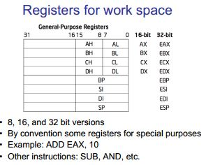
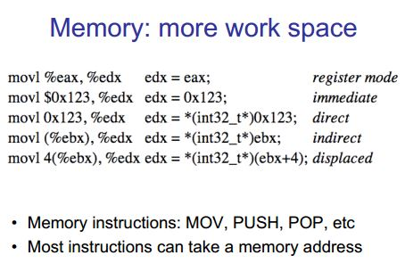
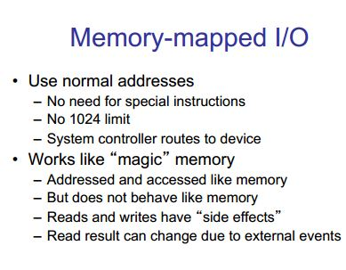
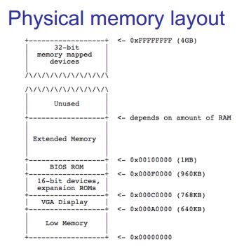
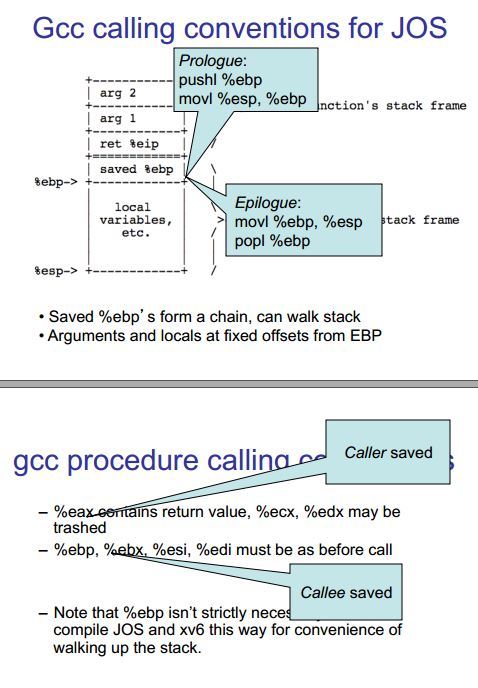
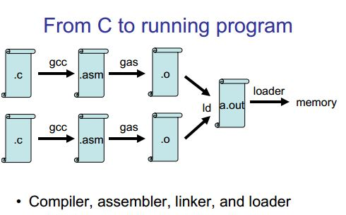

# 6.828 Lecture Notes: x86 and PC architecture

原文: 

https://pdos.csail.mit.edu/6.828/2017/lec/l-x86.html

https://pdos.csail.mit.edu/6.828/2017/lec/l-x86.pdf

## Outline

- PC architecture
- x86 instruction set
- gcc calling conventions : gcc 调用约定
- PC emulation: PC 模拟

## PC architecture

- A full PC has:
  - an x86 CPU with registers, execution unit, and memory management
  - CPU chip pins include address and data signals
  - memory
  - disk
  - keyboard
  - display
  - other resources: BIOS ROM, clock, ...

- We will start with the original 16-bit 8086 CPU (1978) : 从最开始的 16-bit 8086 开始

- CPU runs instructions:

  ```
  for(;;){
  	run next instruction
  }
  ```

- Needs work space: registers

  - four 16-bit data registers: AX, BX, CX, DX

  - each in two 8-bit halves, e.g. AH and AL : 每个都分成两个 8-bit 部分

  - very fast, very few

    # 

- More work space: memory
  - CPU sends out address on address lines (wires, one bit per wire) : CPU 在地址线上发出地址

  - Data comes back on data lines : 数据从数据线上返回

  - *or* data is written to data lines : 或者 数据写到数据线上

    # 

- Add address registers: pointers into memory
  - SP - stack pointer : 堆栈指针
  - BP - frame base pointer : 帧基指针
  - SI - source index: 源索引
  - DI - destination index : 目的地索引
- Instructions are in memory too! : 指令也在内存中
  - IP - instruction pointer (PC on PDP-11, everything else): 指令指针
  - increment after running each instruction : 运行每条指令后递增
  - can be modified by CALL, RET, JMP, conditional jumps : 可以被 CALL, RET, JMP, 条件跳转 修改

- Want conditional jumps : 希望有条件地跳转

  - FLAGS - various condition codes : 标志 - 各种条件代码
    - whether last arithmetic operation overflowed : 上次算术操作是否溢出
    - ... was positive/negative : 为正/负
    - ... was [not] zero: 零/非零
    - ... carry/borrow on add/subtract : 在 加/减 上 进/借 位
    - ... etc.
    - whether interrupts are enabled : 是否使能中断
    - direction of data copy instructions : 数据拷贝指令的方向
  - JP, JN, J[N]Z, J[N]C, J[N]O ...

- Still not interesting - need I/O to interact with outside world : 仍然不够有趣: 需要 I/O 与外部世界交互

  - Original PC architecture: use dedicated I/O space : 最初的 PC 架构使用专用的 I/O 空间

    - Works same as memory accesses but set I/O signal : 与内存访问相同, 但设置 I/O 信号
    - Only 1024 I/O addresses : 只有 1024 I/O 地址
    - Accessed with special instructions (IN, OUT) : 使用特殊指令(IN, OUT)
    - #define DATA_PORT    0x378
      #define STATUS_PORT  0x379
      #define   BUSY 0x80
      #define CONTROL_PORT 0x37A
      #define   STROBE 0x01
      void
      lpt_putc(int c)
      {
        /* wait for printer to consume previous byte */
        while((inb(STATUS_PORT) & BUSY) == 0)
          ;
      
        /* put the byte on the parallel lines */
        outb(DATA_PORT, c);
      
        /* tell the printer to look at the data */
        outb(CONTROL_PORT, STROBE);
        outb(CONTROL_PORT, 0);
      }

  - Memory-Mapped I/O : 内存映射 I/O

    - Use normal physical memory addresses : 使用正常的物理内存
      - Gets around limited size of I/O address space : 获取有限的 I/O 地址空间
      - No need for special instructions : 不需要特别的指令
      - System controller routes to appropriate device : 系统控制器路由到合适的设备
    - Works like 'magic' memory: 类似于 '魔法' 内存
      - *Addressed* and *accessed* like memory, but ... : 寻址和访问就像内存一样, 但是又不像内存
      - ... does not *behave* like memory!
      - Reads and writes can have ``side effects'' : 读写会有 "副作用"
      - Read results can change due to external events : 读写结果会根据外部事件修改

    # 

- What if we want to use more than 2^16 bytes of memory? : 如果我们想使用超过 2^16 字节的内存怎么办

  - 8086 has 20-bit physical addresses, can have 1 Meg RAM : 8086 有 20-bit 的物理地址, 可以有 1M
  - the extra four bits usually come from a 16-bit "segment register": 另外4bit通常使用 16-bit 的段寄存器
  - CS - code segment, for fetches via IP: 代码段: 通过 IP 获取
  - SS - stack segment, for load/store via SP and BP : 栈段, 通过 SP 和 BP 加载/存储
  - DS - data segment, for load/store via other registers: 数据段, 通过其他寄存器 加载/存储
  - ES - another data segment, destination for string operations : 另外的数据段, 字符串操作的目的地
  - virtual to physical translation: pa = va + seg*16 : 虚拟到物理地址转换: pa = va + seg* * 16
  - e.g. set CS = 4096 to execute starting at 65536 : 例如: CS = 4096, 从 65535 开始执行
  - tricky: can't use the 16-bit address of a stack variable as a pointer : 棘手, 不能使用堆栈变量的16-bit 地址作为指针
  - a *far pointer* includes full segment:offset (16 + 16 bits) : 一个远指针包含所有的 段:偏移量 (16 + 16bit)
  - tricky: pointer arithmetic and array indexing across segment boundaries : 棘手: 指针算术和跨段边界的数组索引

- But 8086's 16-bit addresses and data were still painfully small : 但是 8086 的 16-bit地址和数据仍然非常小

  - 80386 added support for 32-bit data and addresses (1985) : 80386 增加了对 32-bit 数据和地址的支持
  - boots in 16-bit mode, boot.S switches to 32-bit mode : 在 16-bit模式下引导, 切到 32-bit 模式下
  - registers are 32 bits wide, called EAX rather than AX : 寄存器 32 位宽, 称为 EAX 而不是 AX
  - operands and addresses that were 16-bit became 32-bit in 32-bit mode, e.g. ADD does 32-bit arithmetic : 16-bit 的操作数和地址在 32-bit 模式下变成 32 位, 如: ADD 做 32 位运算
  - prefixes 0x66/0x67 toggle between 16-bit and 32-bit operands and addresses: in 32-bit mode, MOVW is expressed as 0x66 MOVW : 前缀 0x66/67 在 16-bit 和 32-bit 操作数和地址之间切换, 在32-bit模式下 MOVW 表示为 0x66 MOVW (move word)
  - the .code32 in boot.S tells assembler to generate 0x66 for e.g. MOVW : boot.S 中的 .code32 告诉汇编器产生 MOVW 的 0x66
  - 80386 also changed segments and added paged memory... : 80386 也改变了段和增加了页内存

- Example instruction encoding

  ```
  b8 cd ab		16-bit CPU,  AX <- 0xabcd
  b8 34 12 cd ab		32-bit CPU, EAX <- 0xabcd1234
  66 b8 cd ab		32-bit CPU,  AX <- 0xabcd
  ```

## x86 Physical Memory Map

- The physical address space mostly looks like ordinary RAM : 物理地址空间大部分看着像普通的 RAM

- Except some low-memory addresses actually refer to other things : 除了一些低内存地址实际上指向其他东西

- Writes to VGA memory appear on the screen : 对 VGA 内存写入会显示在屏幕上

- Reset or power-on jumps to ROM at 0xfffffff0 (so must be ROM at top...) : 复位或上电跳转到 ROM 的 0xfffffff0

  # 

## x86 Instruction Set

- Intel syntax: `op dst, src` (Intel manuals!)

- AT&T (gcc/gas) syntax: `op src, dst` (labs, xv6)

  - uses b, w, l suffix on instructions to specify size of operands : 在指令上使用b,w,l 后缀来指定操作数的大小

- Operands are registers, constant, memory via register, memory via constant : 操作数是寄存器, 常量, 通过寄存器存储, 通过常量存储

- Examples:

  | AT&T syntax        | "C"-ish equivalent        |                 |
  | ------------------ | ------------------------- | --------------- |
  | movl %eax, %edx    | edx = eax;                | *register mode* |
  | movl $0x123, %edx  | edx = 0x123;              | *immediate*     |
  | movl 0x123, %edx   | edx = *(int32_t*)0x123;   | *direct*        |
  | movl (%ebx), %edx  | edx = *(int32_t*)ebx;     | *indirect*      |
  | movl 4(%ebx), %edx | edx = *(int32_t*)(ebx+4); | *displaced*     |

- Instruction classes

  - data movement: MOV, PUSH, POP, ...
  - arithmetic: TEST, SHL, ADD, AND, ...
  - i/o: IN, OUT, ...
  - control: JMP, JZ, JNZ, CALL, RET
  - string: REP MOVSB, ...
  - system: IRET, INT

- Intel architecture manual Volume 2 is *the* reference

## gcc x86 calling conventions (调用约定)

- x86 dictates that stack grows down:

  | Example instruction | What it does                            |
  | ------------------- | --------------------------------------- |
  | pushl %eax          | subl $4, %esp  movl %eax, (%esp)        |
  | popl %eax           | movl (%esp), %eax  addl $4, %esp        |
  | call 0x12345        | pushl %eip (*)  movl $0x12345, %eip (*) |
  | ret                 | popl %eip (*)                           |

  (*) Not real instructions

- GCC dictates how the stack is used. Contract between caller and callee on x86: GCC 规定如何使用堆栈, 调用函数和被调用函数的契约.

  - at entry to a function (i.e. just after call):
    - %eip points at first instruction of function
    - %esp+4 points at first argument
    - %esp points at return address
  - after ret instruction:
    - %eip contains return address
    - %esp points at arguments pushed by caller
    - called function may have trashed arguments
    - %eax (and %edx, if return type is 64-bit) contains return value (or trash if function is `void`)
    - %eax, %edx (above), and %ecx may be trashed
    - %ebp, %ebx, %esi, %edi must contain contents from time of `call`
  - Terminology:
    - %eax, %ecx, %edx are "caller save" registers
    - %ebp, %ebx, %esi, %edi are "callee save" registers

- Functions can do anything that doesn't violate contract. By convention, GCC does more: 函数可以做任何不违反契约的事情, 按照惯例 GCC 会实现更多.

  - each function has a stack frame marked by %ebp, %esp: 每个函数都有个以 ebp, esp 标记的栈帧.

    ```
    		       +------------+   |
    		       | arg 2      |   \
    		       +------------+    >- previous function's stack frame
    		       | arg 1      |   /
    		       +------------+   |
    		       | ret %eip   |   /
    		       +============+   
    		       | saved %ebp |   \
    		%ebp-> +------------+   |
    		       |            |   |
    		       |   local    |   \
    		       | variables, |    >- current function's stack frame
    		       |    etc.    |   /
    		       |            |   |
    		       |            |   |
    		%esp-> +------------+   /
    		
    ```

  - %esp can move to make stack frame bigger, smaller: %esp 可以移动使栈帧变大或变小

  - %ebp points at saved %ebp from previous function, chain to walk stack : %ebp 指向前一个函数的 %ebp, 链到步进堆栈.

  - function prologue: 函数序幕

    ```
    			pushl %ebp
    			movl %esp, %ebp
    		
    ```

    or

    ```
    			enter $0, $0
    		
    ```

    enter usually not used: 4 bytes vs 3 for pushl+movl, not on hardware fast-path anymore

  - function epilogue can easily find return EIP on stack: 函数结尾可以很容易地在堆栈上找到返回地址 EIP

    ```
    			movl %ebp, %esp
    			popl %ebp
    		
    ```

    or

    ```
    			leave
    ```
    
leave used often because it's 1 byte, vs 3 for movl+popl
    
# 
  
- Big example:

  - C code

    ```
    		int main(void) { return f(8)+1; }
    		int f(int x) { return g(x); }
    		int g(int x) { return x+3; }
    ```
    
- assembler
  
  ```
    		_main:
    					prologue
    			pushl %ebp
    			movl %esp, %ebp
    					body
    			pushl $8
    			call _f
    			addl $1, %eax
    					epilogue
    			movl %ebp, %esp
    			popl %ebp
    			ret
    		_f:
    					prologue
    			pushl %ebp
    			movl %esp, %ebp
    					body
    			pushl 8(%esp)
    			call _g
    					epilogue
    			movl %ebp, %esp
    			popl %ebp
    			ret
    
    		_g:
    					prologue
    			pushl %ebp
    			movl %esp, %ebp
    					save %ebx
    			pushl %ebx
    					body
    			movl 8(%ebp), %ebx
    			addl $3, %ebx
    			movl %ebx, %eax
    					restore %ebx
    			popl %ebx
    					epilogue
    			movl %ebp, %esp
    			popl %ebp
    			ret
    ```
  
- Super-small _g :

  ```
  		_g:
  			movl 4(%esp), %eax
  			addl $3, %eax
  			ret
  ```
  
- Shortest `_f`?

- Compiling, linking, loading:

  - *Preprocessor* takes C source code (ASCII text), expands #include etc, produces C source code
  - *Compiler* takes C source code (ASCII text), produces assembly language (also ASCII text)
  - *Assembler* takes assembly language (ASCII text), produces `.o` file (binary, machine-readable!)
  - *Linker* takes multiple '`.o`'s, produces a single *program image* (binary)
  - *Loader* loads the program image into memory at run-time and starts it executing

  ###### 

## PC emulation

- The Bochs emulator works by

  - doing exactly what a real PC would do,
  - only implemented in software rather than hardware!

- Runs as a normal process in a "host" operating system (e.g., Linux)

- Uses normal process storage to hold emulated hardware state: e.g.,

  - Stores emulated CPU registers in global variables

    ```
    		int32_t regs[8];
    		#define REG_EAX 1;
    		#define REG_EBX 2;
    		#define REG_ECX 3;
    		...
    		int32_t eip;
    		int16_t segregs[4];
    		...
    		
    ```

  - Stores emulated physical memory in Boch's memory

    ```
                    char mem[256*1024*1024];
                    
    ```

- Execute instructions by simulating them in a loop:

  ```
  	for (;;) {
  		read_instruction();
  		switch (decode_instruction_opcode()) {
  		case OPCODE_ADD:
  			int src = decode_src_reg();
  			int dst = decode_dst_reg();
  			regs[dst] = regs[dst] + regs[src];
  			break;
  		case OPCODE_SUB:
  			int src = decode_src_reg();
  			int dst = decode_dst_reg();
  			regs[dst] = regs[dst] - regs[src];
  			break;
  		...
  		}
  		eip += instruction_length;
  	}
  	
  ```

- Simulate PC's physical memory map by decoding emulated "physical" addresses just like a PC would:

  ```
  	#define KB		1024
  	#define MB		1024*1024
  
  	#define LOW_MEMORY	640*KB
  	#define EXT_MEMORY	10*MB
  
  	uint8_t low_mem[LOW_MEMORY];
  	uint8_t ext_mem[EXT_MEMORY];
  	uint8_t bios_rom[64*KB];
  
  	uint8_t read_byte(uint32_t phys_addr) {
  		if (phys_addr < LOW_MEMORY)
  			return low_mem[phys_addr];
  		else if (phys_addr >= 960*KB && phys_addr < 1*MB)
  			return rom_bios[phys_addr - 960*KB];
  		else if (phys_addr >= 1*MB && phys_addr < 1*MB+EXT_MEMORY) {
  			return ext_mem[phys_addr-1*MB];
  		else ...
  	}
  
  	void write_byte(uint32_t phys_addr, uint8_t val) {
  		if (phys_addr < LOW_MEMORY)
  			low_mem[phys_addr] = val;
  		else if (phys_addr >= 960*KB && phys_addr < 1*MB)
  			; /* ignore attempted write to ROM! */
  		else if (phys_addr >= 1*MB && phys_addr < 1*MB+EXT_MEMORY) {
  			ext_mem[phys_addr-1*MB] = val;
  		else ...
  	}
  	
  ```

- Simulate I/O devices, etc., by detecting accesses to "special" memory and I/O space and emulating the correct behavior: e.g.,

  - Reads/writes to emulated hard disk transformed into reads/writes of a file on the host system
  - Writes to emulated VGA display hardware transformed into drawing into an X window
  - Reads from emulated PC keyboard transformed into reads from X input event queue