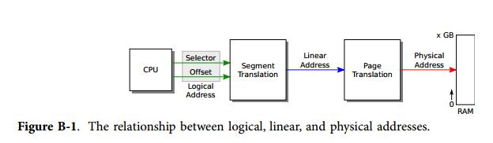
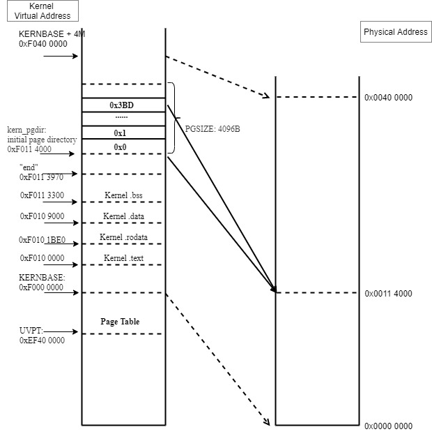
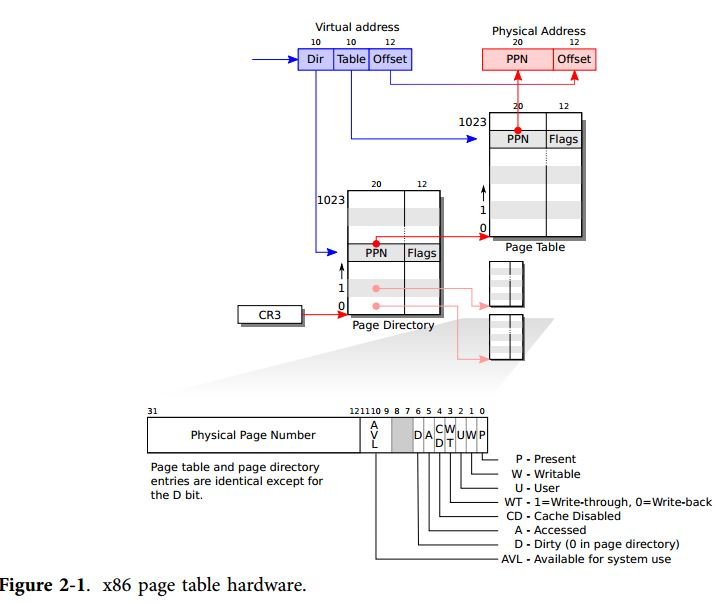
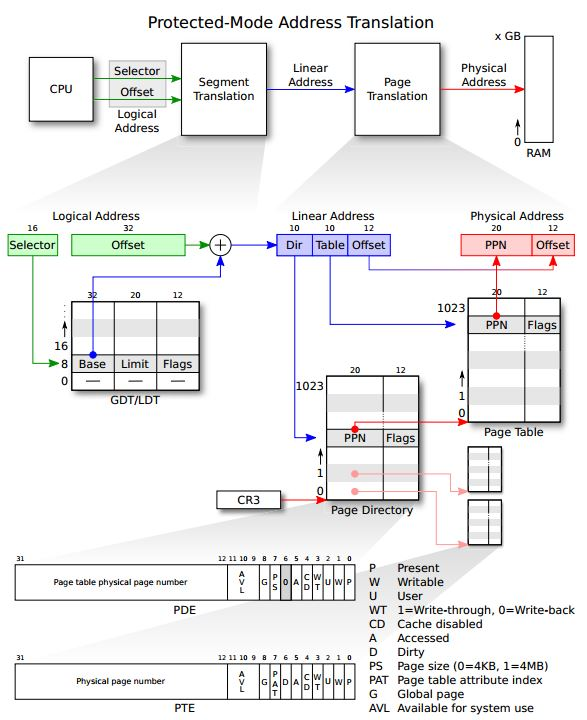
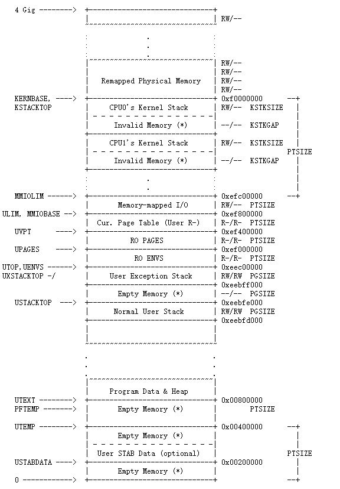
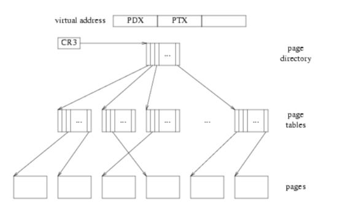
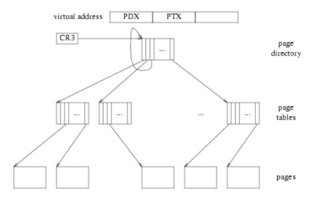

# Lab 2: Memory Management

## 参考

https://icegrave0391.github.io/2020/03/04/joslab2/

https://111qqz.github.io/2019/02/mit-6-828-lab-2/

https://zhuanlan.zhihu.com/p/318537679

https://blog.csdn.net/qq_33765199/article/details/104743134

https://www.cnblogs.com/fatsheep9146/p/5124921.html

https://www.dingmos.com/index.php/category/MIT6-828/

https://blog.csdn.net/cinmyheart/article/details/39827321

https://github.com/clpsz/mit-jos-2014/tree/master/Lab2/Exercise01

https://ocw.mit.edu/courses/electrical-engineering-and-computer-science/6-828-operating-system-engineering-fall-2012/lecture-notes-and-readings/

https://www.cnblogs.com/oasisyang/p/15495908.html

## 背景知识

#### 启动过程

由 lab1 可知, 整个系统的启动过程如下:

1. 上电或重启后, BIOS 首先运行并获得机器控制权. BIOS 位于物理地址空间 0x000f0000-0x000fffff.

2. BIOS 进行一些必要的初始化之后, 将 512 byte 的引导扇区(boot sector)加载到物理地址 0x7c00~0x7dff 的内存中, 然后使用 `jmp` 指令将 *CS:IP* 设置为 0000:7c00, 将控制权传递给引导加载程序(boot loader).

​		注: boot loader 的链接地址和加载地址都是 0x7c00, 编译时在 `boot/Makefrag ` 指定逻辑地址为 0x7c00.
​		boot loader 中, 还没有开启分页, 所以计算出来的线性地址就是真实要访问的内存物理地址.

3. (参考 lab1 Part 2: The Boot Loader  以及 lab1 Exercise 3). 硬盘上的第一个扇区存储的是 bootloader, bootloader 将处理器从实模式切换到32位保护模式, 使用 Bootstrap GDT 以及 segment translation, 使得虚线性地址和物理地址相同.

   ```
     # Switch from real to protected mode, using a bootstrap GDT
     # and segment translation that makes virtual addresses 
     # identical to their physical addresses, so that the 
     # effective memory map does not change during the switch.
     lgdt    gdtdesc # 把 gdtdesc 这个标识符的值送入全局映射描述符表寄存器 GDTR
     movl    %cr0, %eax
     orl     $CR0_PE_ON, %eax
     movl    %eax, %cr0 # CR0寄存器的bit0置1, bit0 保护模式启动位
     
     # Jump to next instruction, but in 32-bit code segment.
     # Switches processor into 32-bit mode.
     ljmp    $PROT_MODE_CSEG, $protcseg # 跳转到保护模式下执行
     
     # Bootstrap GDT
   .p2align 2                                # force 4 byte alignment
   gdt:
     SEG_NULL				# null seg
     SEG(STA_X|STA_R, 0x0, 0xffffffff)	# code seg
     SEG(STA_W, 0x0, 0xffffffff)	        # data seg
   
   gdtdesc:
     .word   0x17                            # sizeof(gdt) - 1
     .long   gdt                             # address gdt
   ```
   
   `lgdt    gdtdesc`  把 gdtdesc 这个标识符(标识一个内存地址)的值送入全局映射描述符表寄存器 GDTR. GDT 表是处理器工作于保护模式下一个非常重要的表, 用来存放关于某个运行在内存中的程序的分段信息的, 具体参考 lab1 Exercise 中关于实模式和保护模式的介绍.
   
   这条指令把关于 GDT 表的一些重要信息存放到 CPU 的 GDTR 寄存器中, 其中包括 GDT 表的内存起始地址, 表的长度. GDTR 寄存器是 48位, 低16位表示该表长度, 高32位表该表在内存中的起始地址.
   
   `.word   0x17`  0x17 是这个表的大小 sizeof(gdt) -1 = 0x17 = 23
    `.long   gdt`  gdt 也是一个标识符, 标识从这里开始就是 GDT 表. 表中包括三个表项, 分别代表 3个段, null seg，code seg，data seg. 由于 xv6 并没有使用分段机制, 也就是说数据和代码都是写在一起的, 所以数据段和代码段的起始地址都是 0x0, 大小都是 0xffffffff.
   
   表项由 SEG() 宏定义构造, 3个参数, type: 这个段的访问权限; base: 这个段的起始地址; lim: 这个段的大小界限.
   
   ```
   #define SEG(type,base,lim)					\
   	.word (((lim) >> 12) & 0xffff), ((base) & 0xffff);	\
   	.byte (((base) >> 16) & 0xff), (0x90 | (type)),		\
   		(0xC0 | (((lim) >> 28) & 0xf)), (((base) >> 24) & 0xff)
   ```
   
   段的 base 都是 0, 当程序中给出逻辑地址 segment:offset 时, 无论选择的是哪个段表项, 最后线性地址 = base + offset = offset, 则线性地址和逻辑(虚拟)地址相同.
   
   也就是 lab2 中所说的, "一个 C 指针是虚拟地址的 “Offset” 组件. 在 `boot/boot.S` 我们安装了一个全局描述符表(GDT), 通过将所有的 segment base addresses 设置为 0, limits 为 0xffffffff 来有效地禁用段转换. 因此 "selector" 没有影响, 线性地址总是等于虚拟地址的 Offset".
   
4. 第二个扇区是 kernel image, 扇区大小 512 byptes. boot loader   从第二个扇区开始一直读8个扇区 (512 x 8 = 4K, ELF头的大小), 放到 0x10000(64KB) 的地方, 然后通过对 ELF头的解析, 得到 kernel 模块编译出来之后占的大小，并将 kernel 读到物理内存 0x100000(1MB) 的地方.

   最后跳转到 `ELFHDR->e_entry`, 即跳转到 0x10018 内存地址所存储的值处运行, 而该地址存储的内容是 0x10000C, 即 Kernel 的入口地址.

```
#define ELFHDR		((struct Elf *) 0x10000) // scratch space
void bootmain(void)
{
	struct Proghdr *ph, *eph;

	// read 1st page off disk
	readseg((uint32_t) ELFHDR, SECTSIZE*8, 0);

	// is this a valid ELF?
	if (ELFHDR->e_magic != ELF_MAGIC)
		goto bad;

	// load each program segment (ignores ph flags)
	// 通过 e_phoff 找到第一个段, 以及段的个数 e_phnum
	ph = (struct Proghdr *) ((uint8_t *) ELFHDR + ELFHDR->e_phoff);
	eph = ph + ELFHDR->e_phnum;
	for (; ph < eph; ph++)
		// p_pa is the load address of this segment (as well
		// as the physical address)
		// p_offset 开始之后的段的 p_memsz 个内存数据读取到物理地址 p_pa
		readseg(ph->p_pa, ph->p_memsz, ph->p_offset);

	// call the entry point from the ELF header
	// 
	((void (*)(void)) (ELFHDR->e_entry))();
}

hongssun@hongssun-user:~/workspace/6.828/lab/obj/kern$ readelf -h kernel
ELF Header:
  Magic:   7f 45 4c 46 01 01 01 00 00 00 00 00 00 00 00 00 
  Class:                             ELF32
  Data:                              2's complement, little endian
  Version:                           1 (current)
  OS/ABI:                            UNIX - System V
  ABI Version:                       0
  Type:                              EXEC (Executable file)
  Machine:                           Intel 80386
  Version:                           0x1
  Entry point address:               0x10000c
  ...
```

5. (参考 lab1 Part 3: The Kernel 以及 Exercise 7) 进入 kernel 后, 链接脚本 /kern/kernel.ld `. = 0xF0100000`使用的都是 0xF0000000 以上的虚拟地址. 需要建立虚拟地址到物理地址的映射, 并开启分页机制.
   使用 `kern/entrypgdir.c` 中手工编写的静态初始化的页目录和页表来实现 4MB 空间的物理内存映射. 设置 CR0_PG, 内存引用就是虚拟内存硬件将其转换为物理地址的虚拟地址.

   (在这之前的 bootloader 中, `boot/boot.S` 建立了一个从线性地址到物理地址的同等映射, 内存引用被视为物理地址, ). `entry_pgdir` 将虚拟地址 [0, 4MB) 映射到物理地址 [0, 4MB), 虚拟地址 [0xf0000000, 0xf0400000) 映射到 [0, 4MB).

   ```
   pde_t entry_pgdir[NPDENTRIES] = {
   	// Map VA's [0, 4MB) to PA's [0, 4MB)
   	[0]
   		= ((uintptr_t)entry_pgtable - KERNBASE) + PTE_P,
   	// Map VA's [KERNBASE, KERNBASE+4MB) to PA's [0, 4MB)
   	[KERNBASE>>PDXSHIFT]
   		= ((uintptr_t)entry_pgtable - KERNBASE) + PTE_P + PTE_W
   };
   
   pte_t entry_pgtable[NPTENTRIES] = {
   	0x000000 | PTE_P | PTE_W,
   	0x001000 | PTE_P | PTE_W,
   	0x002000 | PTE_P | PTE_W,
   	0x003000 | PTE_P | PTE_W,
   	0x004000 | PTE_P | PTE_W,
   	0x005000 | PTE_P | PTE_W,
   	...
   	0x3ff000 | PTE_P | PTE_W,
   };
   ```

   ```
   .globl entry
   entry:
   	movw	$0x1234,0x472			# warm boot
   
   	# We haven't set up virtual memory yet, so we're running from
   	# the physical address the boot loader loaded the kernel at: 1MB
   	# (plus a few bytes).  However, the C code is linked to run at
   	# KERNBASE+1MB.  Hence, we set up a trivial page directory that
   	# translates virtual addresses [KERNBASE, KERNBASE+4MB) to
   	# physical addresses [0, 4MB).  This 4MB region will be
   	# sufficient until we set up our real page table in mem_init
   	# in lab 2.
   
   	# Load the physical address of entry_pgdir into cr3.  entry_pgdir
   	# is defined in entrypgdir.c.
   	movl	$(RELOC(entry_pgdir)), %eax
   	movl	%eax, %cr3	# cr3 寄存器保存页目录表的物理地址
   	# Turn on paging.
   	movl	%cr0, %eax
   	orl	$(CR0_PE|CR0_PG|CR0_WP), %eax
   	movl	%eax, %cr0	# cr0 最高位PG位设置为1后, 打开分页功能
   
   	# Now paging is enabled, but we're still running at a low EIP
   	# (why is this okay?).  Jump up above KERNBASE before entering
   	# C code.
   	mov	$relocated, %eax
   	jmp	*%eax
   relocated:
   	# Clear the frame pointer register (EBP)
   	# so that once we get into debugging C code,
   	# stack backtraces will be terminated properly.
   	movl	$0x0,%ebp			# nuke frame pointer
   
   	# Set the stack pointer
   	movl	$(bootstacktop),%esp
   
   	# now to C code
   	call	i386_init
   ```

   ```
   # RELOC(x) maps a symbol x from its link address to its actual
   # location in physical memory (its load address).	 
   
   #define	RELOC(x) ((x) - KERNBASE)
   #define CR0_PG		0x80000000	// Paging
   ```

   链接脚本 /kern/kernel.ld `. = 0xF0100000`使用的都是 0xF0000000 以上的虚拟地址, entry_pgdir 符号代表的地址也是以 0xF0000000 为基址, entry_pgdir - 0xF0000000  则为物理地址.

   `movl %eax, %cr0` 使能分页后, 高地址的映射已经建立, 此时程序还在低地址运行. 所以接下来是跳转到高地址(KERNBASE: 0xF0000000) 上, 然后设置 %ebp, %esp, 最后调用 `i386_init`.

#### 地址空间布局

根据启动过程以及 lab1 中 `objdump -h obj/kern/kernel`的输出, 程序进入 `i386_init`后的内存空间映射如下:


#### 80386 内存管理

##### 80386 存储器组织和段

参考 INTEL 80386 PROGRAMMER'S REFERENCE MANUAL 1986, 2.1 Memory Organization and Segmentation

物理内存在 80386系统下被组织成一个 8位的字节序列, 每个字节含有一个唯一的地址, 从 0 到 2^32-1(4GB).

然而, 80386的程序与物理地址空间是相互独立的, 这意味着写程序时可以不用关心有多少物理存储器, 也不用管指令和数据在物理存储器中是如何存放的.

对应用程序可见的存储器组织模型是由系统软件设计者来决定的. 80386的体系结构给予了设计者为每个任务选择一种模式的自由, 存储器组织模型可以是下面几种:

* “平坦”地址空间, 由最多 4G字节组成的单个数组
* 段地址空间, 可以由 16383个线性地址空间组成, 每个 4G

两种模式均可以提供存储器保护, 不同的任务可以使用不同的存储器组织模型, 设计者使用存储器组织模型的准则和系统程序员使用什么方式来实现在第II部分－系统编程中讨论.

* “平坦” 模式

  “平坦”模式下, 应用程序可以使用 2^32(4G) 字节的数组. 尽管存储器可以是 4G字节, 但通常它们要小的多, 处理器通过第 5章介绍的地址变换将 4G空间映射到物理存储器, 应用程序不需要知道这些细节.

  指向平坦地址空间的指针是一个 32位序列数, 从 0到 2^32 -1. 单独编译模块的重定位由系统软件来做(例如: 链接器, 定位器, 绑定器, 加载器).

* 段模式

  在段模式下, 应用程序可以使用更大的地址空间(称为逻辑地址空间), 多达 2^46(64T) 字节的数组. 处理器通过第5章介绍的地址转换机制将 64T的地址空间映射到物理存储器(多达 4G), 应用程序不需要知道地址映射的细节. 

  应用程序可以把逻辑地址空间看作是 16383个一维空间的集合, 每个都有指定的长度. 每个线性子空间被称作段, 段是连续地址空间的一个单位, 段大小可以从一个字节到最多 2^32 字节, 这个地址空间的一个完整指针由两部分组成 (见图 2-1):

  

  * 16位段选择符,标识一个段
  * 32位偏移, 段内偏移地址

  在程序执行期间, 处理器将段的起始物理地址与段选择器相关联. 单独编译的模块可以在运行时通过改变它们段的基址来重新定位. 段的大小是可变的, 因此段可以和它里面的模块大小相同.

##### 分段地址转换 (Segment Translation)

参考 INTEL 80386 PROGRAMMER'S REFERENCE MANUAL 1986, Chapter 5 Memory Management 

在 lab1 execise 中讲解保护模式时, 以及 lab2 中 Virtual, Linear, and Physical Addresses 的学习中, 都介绍了虚拟地址到物理地址的转换机制, 如下图:



80386 转换逻辑地址(虚拟地址, 也就是程序员看到的地址) 到物理地址(也就是实际的物理内存地址)分以下两步：

1. 分段地址转换, 这一步中把逻辑地址 (由段选择子和段偏移组成)转换为线性地址
2. 分页地址转换, 这一步中把线性地址转换为物理地址. 这一步是可选的, 由系统软件设计者决定是否需要.

这些转换对于应用程序员来说是不可见的, 图 5-1以高度抽象的形式显示了这两步转换. 图5-1和这一章的以下部分以一种简单的方式介绍了 80386的地址转换机制. 事实上, 地址转换机制也包括了内存保护的特性. 为了简单起见, 保护机制放在第六章来讲述. 


图 5-2 详细显示了处理器如何把逻辑地址转换为线性地址. 为了这样的转换, 处理器用到了以下的数据结构:

1. 描述符 (Descriptors)
2. 描述符表 (Descriptor tables)
3. 选择子 (Selectors)
4. 段寄存器 (Segment Registers)


###### 描述符 (Descriptors)

段描述符是处理器用来把逻辑地址映射为线性地址的必要数据结构. 描述符是由编译器、链接器、加载器、或者是操作系统生成的, 不能由应用程序员生成. 图5-3显示了两种常用的描述符的格式, 所有的段描述符都是这两种格式当中的一种, 段描述符的字段如下:


基址(BASE): 决定了一个段在 4G线性地址空间中的位置, 处理器将基址的3个片段连接起来, 形成一个单独的32位值.

界限(LIMIT): 决定了一个段的大小, 处理器用2部分的界限字段来形成一个20位的界限值. 处理器以两种方式来解析界限的值, 解析方式取决于粒度位(granularity) 的设置情况:

1. 以1个 byte 为单位, 定义了一个最大为1M字节的段
2. 以 4KB 为单位, 则段大小可以高达 4G. 界限值在使用之前处理器将会把它先左移12位, 低12位则自动插入0.

粒度位 (Granularity bit): 决定了界限值被处理器解析的方式. 当它被复位时, 界限值被解析为以 1Byte为一个单位.当它置位时, 则界限值以 4KB为一个单位.

类型 (TYPE): 用于区别不同类型的描述符.

描述符特权级 (Descriptor Privilege Level, DPL): 用来实现保护机制(参看第六章).

段存在位 (Segment-Present bit): 如果这一位为 0, 则此描述符为非法的, 不能被用来实现地址转换. 如果一个非法描述符被加载进一个段寄存器, 处理器会立即产生异常. 

图5-4显示了当存在位为 0时, 描述符的格式. 操作系统可以任意的使用被标识为可用(AVAILABLE)的位. 一个实现基于段的虚拟内存的操作系统可以在以下情况下来清除存在位:

1. 当这个段的线性地址空间并没有完全被分页系统映射到物理地址空间时.
2. 当段根本没有在内存里时.

已访问位(Accessed bit): 当处理器访问该段时, 将自动设置访问位. 也就是说, 当一个指向该段描述符的选择子被加载进一个段寄存器时或者当被一条选择子测试指令使用时, 在段级基础上实现虚拟内存的操作系统可能会周期性的测试和清除该位, 从而监视一个段的使用情况.

创建和维护描述符是系统软件的任务, 一般说来可能是由编译器、程序加载器、系统生成器、或者操作系统来协作完成.

###### 描述符表 (Descriptor Tables)

段描述符存储在以下两种描述符表当中的一个：

a. 全局描述符表 (GDT)

b. 一个局部描述符表 (LDT)

如图 5-5所示, 一个描述符表仅仅是一个包含了很多描述符的 8字节内存数组而已. 描述符表是长度是可变的, 最多可包含高达 8192(2^13) 个描述符, 但是处理器是不会使用全局描述符表的第一项 (INDEX=0) 的.

处理器用 GDTR 和 LDTR寄存器来定位内存中的 GDT 和当前的 LDT. 这些寄存器存储了这些表的线性地址的基址和段长界限, 指令 LGDT 和 SGDT 用来访问 GDT, 而指令 LLDT 和 SLDT 则是用来访问 LDT.


###### 段选择子 (Selectors)

线性地址部分的 Selector 是用来选择哪个描述符表和在该表中索引一个描述符的. Selector 可以做为指针变量的一部分, 从而对应用程序员是可见的, Selector 的值一般是由链接器或链接加载器来设置的. 图 5-6显示了 Selector 的格式.


索引 (Index): 在描述符表中从 8192个描述符中选择一个描述符. 处理器自动将这个索引值乘以 8 (描述符的长度), 再加上描述符表的基址来索引描述符表, 从而选出一个合适的描述符.

表指示位 (Table Indicator): 选择应该访问哪一个描述符表. 0 代表应该访问 GDT, 1 代表应该 LDT.

请求特权级(Requested Privilege Level): 保护机制使用该位 (参看第六章).

由于 GDT 的第一项是不被处理器使用的, 所以当一个 Selector 的 Index 部分和 Table Indicator 都为 0 的时候(也就是说, Selector  指向 GDT的第一项时), 可以当做一个空的选择子. **当一个段寄存器被加载一个空选择子时, 处理器并不会产生一个异常. 但是当用一个空选择子去访问内存时, 则会产生异常. 这个特点可以用来初始化不用的段寄存器, 以防偶然性的非法访问.**

###### 段寄存器 (Segment Registers)

80386 **把描述符的信息存储在段寄存器里**, 以便不用每次内存访问都去访问内存中的描述符表.

如图 5-7所示, 每一个段寄存器都有一个可见部分和一个不可见部分. 这些段寄存器的可见部分被程序员当作一个 16位的寄存器来使用, 不可见的部分则只能由处理器来操作.


加载这些寄存器的操作和一般的加载指令是一样的, 这些指令分为两类:

a. 直接的加载指令, 例如 MOV, POP, LDS, LSS, LGS, LFS. 这些指令显示的访问这些段寄存器.

b. 隐式的加载指令, 例如 far CALL, JMP. 这些指令隐式的访问 CS 段寄存器, 将它加载一个新的值.

使用这些指令, 程序将用一个16位的 Selector 加载到段寄存器的可见部分, 处理器将自动的将基址(BASE)、界限(LIMIT)、类型(TYPE)、和其它信息从描述符表中加载到段寄存器的不可见部分.

因为很多数据访问的指令都是访问一个已加载段寄存器的数据段, 所以处理器可以用与段相关的基址部分加上指令提供的偏移部分, 而且不会有额处的加法开销.
(Because most instructions refer to data in segments whose selectors have already been loaded into segment registers, the processor can add the segment-relative offset supplied by the instruction to the segment base address with no additional overhead)

##### 分页地址转换 (Page Translation)

在地址转换的第二个阶段, 80386 将线性地址转换为物理地址. 这个阶段实现了基于页的虚拟内存和页级保护机制.

分页地址转换过程是可选的, 只有当 CR0中的 PG 位置位时才会产生效果, 这个位的设置一般来说是由操作系统在系统初始化的过程中设置的. 如果操作系统想要实现能运行多个虚拟 8086任务、基于页级的保护、基于页级的虚拟内存的话, PG位是必需置位的.

###### 页桢 (Page Frame)

一个页桢是一个地址连续的 4KB 大小单元内存, 各页以字节边界为起始, 大小固定不变.

###### 线性地址 (Linear Address)

线性地址通过指定页表、该表中的页以及该页中的偏移量间接访问物理地址. 图 5-8显示了线性地址的格式.


图 5-9显示了处理器如何将线性地址中的 DIR, PAGE, 和 OFFSET 字段转换为物理地址. 这个过程使用了两级页表, 寻址机制使用 DIR 字段来索引页目录表, 用 PAGE 字段来索引页表, 这样就确定了一个物理页桢, 然后再使用 OFFSET 部分来索引该物理页桢, 最终访问所需要的数据.


###### 页表 (Page Tables)

一个页表仅仅是很多 32-bit 页指示器(32-bit page specifiers) 组成的数组. 页表本身也是一个页, 所以包含了4K Bytes 内存空量或者最多 1K 32-bit 的表项.

在寻址一个内存页时, 使用了两级的页表. 高一级的页表也被叫作页目录, 页目录可最多寻址 1K个二级页表, 一个二级页表最多可寻址 1K个页面. 所以一个页目录最多可寻址 2^10 * 2^10 个页面. 因为每个页面有 4K(2^12) 字节大小, 所以一个页目录可寻址整个 80386的实物理地址空间 (2^20 * 2^12 = 2^32).

###### 页表项 (Page-Table Entries)

两级页表项都有相同的格式, 图 5-10显示了这种格式.


* 页桢地址 (Page Frame Address)

  页桢地址指出了一个实物理页的开始地址. 因为页的地址是以4K为边界的, 所以地址的低 12位总是为 0. 在页目录中, 页桢地址是二级页表的起始地址. 在二级页表中, 页桢地址是所要要访问的物理页的起始地址, 该物理页包含了要访问的指令操作数.

* 存在位 (Present Bit)

  存在位决定了一个页表项是否可以用作地址转换过程, 如果 P=1 则可以用该页表项.

  当任何一级页表项的 P=0 时, 该项都不可以用作地址转换过程, 这时该项的其它位可以被软件使用, 它们中的任何一位都不会被硬件使用. 图5 -11显示了当 P=0 时的页表项格式.

  当任何一级页表项的 P=0 时, 而软件又试图用它来访问内存时, 处理器将会引发一个异常. 在支持页级虚拟内存的软件系里, 缺页异常处理子程序可以将所需的页面调入物理内存. 引起缺页异常的指令是可以重起的, 关于异常处理的更多信息请参看第9章. 

  注意, 没有页目录自身的存在位. 当任务挂起时, 该任务的页目录是可以不存在的, 但是操作系必须在一个任务被重调度前, 确保 Task State Segment(TSS) 里 CR3 image 指示的页目录表在内存中. 关于 TSS和任务调度的详细信息请参看第7章.

  

* 已访问位和脏位 (Accessed and Dirty Bits)

  这些位提供了两级页表的数据使用情况信息. 除了页目录表的脏位(Dirty bit), 所有的这些位都由硬件自动置位,但是处理器绝对不会复位它们.

  在一个页面被读或写之前, 处理器自动将两级页表的这些相关的位置 1. 当向一个地址写入时, 处理器将会把相关的二级页表的脏位(Dirty bit) 置为1. 页目录表项的脏位没有作定义.

  当系统内存紧张时, 一个支持页级虚拟内存的操作系统可以使用这些位来决定将要换出哪些物理页面. 操作系统应该自已负责测试和清除这些相关位. 参看第11章, 学习 80386如何在多处理器环境下更改访问位和脏位.

* 读/写位, 用户/特权用户位 (Read/Write and User/Supervisor Bits)

  这些位并不是用于地址转换过程的, 它们是用来实现页级保护机制的, 这些保护机制是在地址转换过程的同时实施的. 参看第六章以了解理多关于保拟机制特性.

###### 页地址转换缓存 (Page Translation Cache)

为了获得最大的地址转换效率, 处理器把最近使用的页表数据存储在一个芯片内的缓存中. 只有当所要的地址转换信息没有在缓存中时, 才有访问两级页表的必要.

应用程序员是感觉不到页地址转换缓存的存在的, 但系统程序员可以. 当页表内容改变时, 操作系统程序员必须清除缓存. 页地址转换缓存可以用以下两种方法清除:

1. 通过MOV 指令重新加载 CR3寄存器, 例如 MOV CR3,  EAX.
2. 通过任务切换到一个 TSS, 该 TSS 保存了一个不同的 CR3 映象. 关于任务切换, 请查看第7章.

##### 混合分段和分页地址转换 (Combining Segment and Page Translation)

图 5-12 结合了图 5-2 和图 5-9 来对两阶段 (从逻辑地址到线性, 再从线性地址到实物理地址(当启用分页时)) 的地址转换做一个总结. 通过使用不同的方法, 内存管理软件可以实现几种不同形式的内存管理机制.


###### “平坦”体系结构 (”Flat Architecture”)

当 80386 用来执行一些程序, 而这些程序也为别的不支持分段的处理器而设计时, 有效的“关闭”分段可能比较好. 80386 没有禁止分段的执行模式, 但是同样的效果可以通过一些特定的方法实现: 把指向包括整个 32-bit 地址空间的描述符的 Selector 加载到段寄存器里, 段选择子没有必要改变. 32-bit 的偏移已足够寻址整个80386支持的内存空间. 

###### 跨多个页的段 (Segments Spanning Several Pages)

80386 系统结构允许一个段比内存页(4KB)大, 也允许比内存页小. 比如有一个段用来寻址和保护一个大小为 132K的数据结构. 在一个支持页级虚拟内存的软件系统里, 没有必要把这一整个段都调入实物理内存. 该结构被分成功 33个页面, 任何一个都可以不存在. 应用程序程序员不需要知道虚拟内存子系统以这种方式对结构进行分页.

###### 跨段的页面 (Pages Spaning Several Segments)

另一方面, 段可能比一个页面要小. 比如考虑一个数据结构 (如信号量 Semaphore)). 因为段的保护和共享机制, 把每一个信号量放在一个段里也许比较好些. 但是由于一个系统需要很多的信号量， 如果为每一个信号量分配一页的话效率很低下, 所以把几个段合并到一个页面里应该更好.

###### 非对齐的页和段边界 (Non-Aligned Page and Segment Boundaries)

80386 系统并不强求页和段的任何对齐. 即使一个页包含了一个段的结尾又包含了一个段的开始也是完全可以的. 类似的, 即包含一个页的开始和另一个页的结尾的段也是完全允许的.

###### 对齐的页和段边界 (Aligned Page and Segment Boundaries)

如果页与段之间有一定的对齐的话, 对于内存管理系统来说也许会简单很多. 例如如果一个段只以页为单元来分配的话, 段页逻辑将会结合起来, 就没有为部分页面而管理的逻辑了.

###### 每段一个页表 (Page-Table Per Segment)

一个更简单的内存空间管理方法是将每一个段对应为一个页目录项, 图 5-13显示了这种方式. 

每个描述符的基址部分的低22位都将是0. 换言之, 基址被映射到每个页表的第一项. 每个段长度可以从 1到 4M的任意大小. 一个段可以包含 1到 1K个物理内存页, 多少则由长度界限字段来决定.

这样的话, 一个任务可以寻址 1K个段 (对于很多应用程序来说都足够了), 每个段可以高达 4M字节. 描述符和与之对应的页目录项, 还有与之对应的页表, 就可以同时分配同时回收.


## 实验准备

### 新建 lab2 分支, 合并 lab1 的修改

```
git checkout -b lab2 remotes/origin/lab2
git merge lab1
```

### lab2 新加文件

- `inc/memlayout.h` : 描述了虚拟地址空间的结构
- `kern/pmap.c` : 物理内存管理的函数实现, 需要修改、添加代码以完成实验
- `kern/pmap.h` : 定义了 `PageInfo` 结构, 用来管理物理内存页面
- `kern/kclock.c` : 操作电池供电的时钟以及 CMOS RAM硬件
- `kern/kclock.h`

要特别注意 `memlayout.h` 和`pmap.h`, 因为这个 lab 要求使用并理解其中包含的许多定义. `inc/mmu.h` 也包含了一些对这个 lab 有用的定义.

### 编译并运行 lab2

代码最后执行 `i386_init`, 停在 `kern/pmap.c:128: mem_init: This function is not finished`

```
hongssun@hongssun-user:~/workspace/6.828/lab$ make qemu
```


`mem_init` 就是 lab2 内存管理的初始化函数.

```
void i386_init(void)
{
	extern char edata[], end[];

	// Before doing anything else, complete the ELF loading process.
	// Clear the uninitialized global data (BSS) section of our program.
	// This ensures that all static/global variables start out zero.
	memset(edata, 0, end - edata);

	// Initialize the console.
	// Can't call cprintf until after we do this!
	cons_init();

	cprintf("6828 decimal is %o octal!\n", 6828);

    //cprintf("edata end addr: 0x%x, bss end addr: 0x%x\n", edata, end);

	// Lab 2 memory management initialization functions
	mem_init();

	// Drop into the kernel monitor.
	while (1)
		monitor(NULL);
}
```

## Exercise 1

要求写一个 physical page allocator.

### boot_alloc()

```
// This simple physical memory allocator is used only while JOS is setting
// up its virtual memory system.  page_alloc() is the real allocator.
//
// If n>0, allocates enough pages of contiguous physical memory to hold 'n'
// bytes.  Doesn't initialize the memory.  Returns a kernel virtual address.
//
// If n==0, returns the address of the next free page without allocating
// anything.
//
// If we're out of memory, boot_alloc should panic.
// This function may ONLY be used during initialization,
// before the page_free_list list has been set up.
static void *
boot_alloc(uint32_t n)
{
	static char *nextfree;	// virtual address of next byte of free memory
	char *result;

	// Initialize nextfree if this is the first time.
	// 'end' is a magic symbol automatically generated by the linker,
	// which points to the end of the kernel's bss segment:
	// the first virtual address that the linker did *not* assign
	// to any kernel code or global variables.
	if (!nextfree) {
		extern char end[];
		nextfree = ROUNDUP((char *) end, PGSIZE);
	}

	// Allocate a chunk large enough to hold 'n' bytes, then update
	// nextfree.  Make sure nextfree is kept aligned
	// to a multiple of PGSIZE.
	//
	// LAB 2: Your code here.

	return NULL;
}
```

根据注释, boot_alloc()  是一个简单的物理内存分配器, 仅仅用于 JOS 设置其虚拟内存系统时, 真正的分配器是 page_alloc(). n > 0, 分配连续 n 个 bytes 的内存, 不做初始化, 返回一个内核虚拟地址, 如果超出内存, 则 panic.

boot_alloc() 仅在初始化时, page_free_list 还没建立之前使用.

根据代码, boot_alloc() 在 mem_init() 中被调用, 其返回值用来初始化  kern_pgdir, 目的是创建初始化的页目录(page directory). 那么为什么需要一个单独的 page allocator, 仅在初始化时使用呢?

原因是 kernel 启动时要将物理地址映射到虚拟地址, 而我们需要一个 page table 来记录这种映射关系. 但是创建一个 page table 涉及到为 page table 所在的 page 分配空间, 而为一个 page 分配空间需要在将物理地址映射到虚拟地址以后.
解决办法是, 使用一个单独的 page allocator, 在一个固定的位置 allocate memory. 然后在这部分去做初始化的工作.

参考 xv6-book Chapter 2 Page tables.

```
	The kernel must allocate and free physical memory at run-time for page tables,process user memory, kernel stacks, and pipe buffers.
	xv6 uses the physical memory between the end of the kernel and PHYSTOP for run-time allocation. It allocates and frees whole 4096-byte pages at a time. It keeps track of which pages are free by threading a linked list through the pages themselves. Allocation consists of removing a page from the linked list; freeing consists of adding the freed page to the list.
	There is a bootstrap problem: all of physical memory must be mapped in order for the allocator to initialize the free list, but creating a page table with those mappings involves allocating page-table pages. 
	xv6 solves this problem by using a separate page allocator during entry, which allocates memory just after the end of the kernel’s data segment. This allocator does not support freeing and is limited by the 4 MB mapping in the entrypgdir, but that is sufficient to allocate the first kernel page table.
	xv6 使用从内核结尾到 PHYSTOP 之间的物理内存为运行时分配提供内存资源. 每次分配,它会将整块 4096byte 大小的页分配出去. xv6还会通过维护一个物理页组成的链表来寻找空闲页,所以分配内存需要将页移出该链表,而释放内存需要将页加入该链表.
	这里我们遇到了一个自举的问题:为了让分配器能够初始化该空闲链表, 所有的物理内存都必须要建立起映射, 但是建立包含这些映射的页表又必须要分配存放页表的页. xv6 通过在 entry中使用一个特别的页分配器来解决这个问题,该分配器会在内核数据部分的后面分配内存.该分配器不支持释放内存, 并受限于 entrypgdir中规定的 4MB分配大小, 即便如此,该分配器还是足够为内核的第一个页表分配出内存.
```

boot_alloc() 的实现有2个点要考虑:

1. 如何才能分配内存, 不可能使用 malloc. 源代码中使用了 “end”, 这是定义在链接脚本 kernel.ld 中的符号, 由链接器生成, 指向 bss 段的结束地址, 由 objdump -h obj/kern/kernel 命令的输出结合打印出来的结果, 其值为: 0xf0112970 ( .bss 虚拟地址 0xf0112300 + size 0x670)

   ```
   hongssun@hongssun-user:~/workspace/6.828/lab$ git log -1
   commit f85962cd4f91823588fbbe0ac8ec4a4907f3ae43
   Author: hongssun <bhshs@aliyun.com>
   Date:   Sun Jul 11 00:41:28 2021 +0800
   
       lab2 exercise1 boot_alloc impl
   hongssun@hongssun-user:~/workspace/6.828/lab$ 
   hongssun@hongssun-user:~/workspace/6.828/lab$ objdump -h obj/kern/kernel
   
   obj/kern/kernel:     file format elf32-i386
   
   Sections:
   Idx Name          Size      VMA       LMA       File off  Algn
     0 .text         00001ae7  f0100000  00100000  00001000  2**4
                     CONTENTS, ALLOC, LOAD, READONLY, CODE
     1 .rodata       00000820  f0101b00  00101b00  00002b00  2**5
                     CONTENTS, ALLOC, LOAD, READONLY, DATA
     2 .stab         000040a5  f0102320  00102320  00003320  2**2
                     CONTENTS, ALLOC, LOAD, READONLY, DATA
     3 .stabstr      00001bc9  f01063c5  001063c5  000073c5  2**0
                     CONTENTS, ALLOC, LOAD, READONLY, DATA
     4 .data         0000a300  f0108000  00108000  00009000  2**12
                     CONTENTS, ALLOC, LOAD, DATA
     5 .bss          00000670  f0112300  00112300  00013300  2**5
                     ALLOC
     6 .comment      0000002b  00000000  00000000  00013300  2**0
                     CONTENTS, READONLY
   ```

2. 如何判断空间不够?

代码实现如下:

```
	if (!nextfree) {
		extern char end[];
		nextfree = ROUNDUP((char *) end, PGSIZE);

        cprintf("nextfree: 0x%x, bss end addr: 0x%x\n", nextfree, end);
	}
	// LAB 2: Your code here.
    if (n == 0) 
    	return nextfree;

    result = nextfree;
    nextfree = ROUNDUP((char *)(nextfree + n),PGSIZE);

    cprintf("nextfree: 0x%x\n", nextfree);
    if ((uint32_t)nextfree > (KERNBASE + npages * PGSIZE))
    {
        panic("boot_alloc: there is no enough space\n");
    }
    return result;
```

执行结果如下:

```
6828 decimal is 15254 octal!
edata end addr: 0xf0112300, bss end addr: 0xf0112970
Physical memory: 131072K available, base = 640K, extended = 130432K
nextfree: 0xf0113000, bss end addr: 0xf0112970
nextfree: 0xf0114000
kernel panic at kern/pmap.c:145: mem_init: This function is not finished
```

nextfree 是一个 static char *nextfree, 默认初始化为 0. 第一次执行时进入 if (!nextfree), 获取 bss end 地址之后的以 PGSIZE 对齐的地址空间 (0xf0113000). 用 result 保存 nextfree 并用于返回, nextfree 则继续取下一个 n 之后的地址空间.

nextfree 其始终存放着下一个可以使用的空闲内存空间的虚拟地址. 当再次执行 boot_alloc(), 先  result = nextfree 用于返回, 再计算 nextfree. 如果 n==0, 则不再计算 nextfree. 

如何判断空间不够? 

在函数 i386_detect_memory() 中, 通过 *CMOS calls* 得到剩余的物理内存. 其中 basemem 就是 0-640k 之间的内存, extmem 是 1M 以后的内存. npages 是剩余物理内存的页数, 每页大小是 PGSIZE, 因此一共能分配的空间大小为 (npages * PGSIZE). 而虚拟地址的 base 为 KERNBASE (inc/memlayout.h, 因此最大能访问的虚拟地址为 KERNBASE + (npages * PGSIZE).

JOS 把整个物理内存空间划分成三个部分, 参考 inc/memlayout.h 注释以及前文地址空间布局图:
0x00000~0xA0000(640K), 这部分叫 Base memory, 是可用的.
0xA0000~0x100000, 这部分叫做 IO hole, 是不可用的. 主要被用来分配给外部设备了. 
0x100000~ ???, 1M 以后的空间, 这部分叫做 Extended memory, 是可用的, 这是最重要的内存区域.

### mem_init()

```
// Set up a two-level page table:
//    kern_pgdir is its linear (virtual) address of the root
//
// This function only sets up the kernel part of the address space
// (ie. addresses >= UTOP).  The user part of the address space
// will be setup later.
//
// From UTOP to ULIM, the user is allowed to read but not write.
// Above ULIM the user cannot read or write.
void mem_init(void)
{
	uint32_t cr0;
	size_t n;

	// Find out how much memory the machine has (npages & npages_basemem).
	i386_detect_memory();

	// Remove this line when you're ready to test this function.
	panic("mem_init: This function is not finished\n");

	//////////////////////////////////////////////////////////////////////
	// create initial page directory.
	kern_pgdir = (pde_t *) boot_alloc(PGSIZE);
	memset(kern_pgdir, 0, PGSIZE);

	//////////////////////////////////////////////////////////////////////
	// Recursively insert PD in itself as a page table, to form
	// a virtual page table at virtual address UVPT.
	// (For now, you don't have understand the greater purpose of the
	// following line.)

	// Permissions: kernel R, user R
	kern_pgdir[PDX(UVPT)] = PADDR(kern_pgdir) | PTE_U | PTE_P;

	//////////////////////////////////////////////////////////////////////
	// Allocate an array of npages 'struct PageInfo's and store it in 'pages'.
	// The kernel uses this array to keep track of physical pages: for
	// each physical page, there is a corresponding struct PageInfo in this
	// array.  'npages' is the number of physical pages in memory.  Use memset to initialize all fields of each struct PageInfo to 0.
	// Your code goes here:


	//////////////////////////////////////////////////////////////////////
	// Now that we've allocated the initial kernel data structures, we set
	// up the list of free physical pages. Once we've done so, all further
	// memory management will go through the page_* functions. In
	// particular, we can now map memory using boot_map_region
	// or page_insert
	page_init();

	check_page_free_list(1);
	check_page_alloc();
	check_page();

	//////////////////////////////////////////////////////////////////////
	// Now we set up virtual memory

	//////////////////////////////////////////////////////////////////////
	// Map 'pages' read-only by the user at linear address UPAGES
	// Permissions:
	//    - the new image at UPAGES -- kernel R, user R
	//      (ie. perm = PTE_U | PTE_P)
	//    - pages itself -- kernel RW, user NONE
	// Your code goes here:

	//////////////////////////////////////////////////////////////////////
	// Use the physical memory that 'bootstack' refers to as the kernel
	// stack.  The kernel stack grows down from virtual address KSTACKTOP.
	// We consider the entire range from [KSTACKTOP-PTSIZE, KSTACKTOP)
	// to be the kernel stack, but break this into two pieces:
	//     * [KSTACKTOP-KSTKSIZE, KSTACKTOP) -- backed by physical memory
	//     * [KSTACKTOP-PTSIZE, KSTACKTOP-KSTKSIZE) -- not backed; so if
	//       the kernel overflows its stack, it will fault rather than
	//       overwrite memory.  Known as a "guard page".
	//     Permissions: kernel RW, user NONE
	// Your code goes here:

	//////////////////////////////////////////////////////////////////////
	// Map all of physical memory at KERNBASE.
	// Ie.  the VA range [KERNBASE, 2^32) should map to
	//      the PA range [0, 2^32 - KERNBASE)
	// We might not have 2^32 - KERNBASE bytes of physical memory, but
	// we just set up the mapping anyway.
	// Permissions: kernel RW, user NONE
	// Your code goes here:

	// Check that the initial page directory has been set up correctly.
	check_kern_pgdir();

	// Switch from the minimal entry page directory to the full kern_pgdir
	// page table we just created.	Our instruction pointer should be
	// somewhere between KERNBASE and KERNBASE+4MB right now, which is
	// mapped the same way by both page tables.
	//
	// If the machine reboots at this point, you've probably set up your
	// kern_pgdir wrong.
	lcr3(PADDR(kern_pgdir));

	check_page_free_list(0);

	// entry.S set the really important flags in cr0 (including enabling
	// paging).  Here we configure the rest of the flags that we care about.
	cr0 = rcr0();
	cr0 |= CR0_PE|CR0_PG|CR0_AM|CR0_WP|CR0_NE|CR0_MP;
	cr0 &= ~(CR0_TS|CR0_EM);
	lcr0(cr0);

	// Some more checks, only possible after kern_pgdir is installed.
	check_page_installed_pgdir();
}
```

根据注释, mem_init() 配置两级页表, kern_pgdir 是第一级页目录.

mem_init() 首先调用  i386_detect_memory(), 其中 basemem 就是 0-640k 之间的内存, extmem 是 1M 以后的内存. npages 是剩余物理内存的页数, 每页大小是 PGSIZE, 因此一共能分配的空间大小为 (npages * PGSIZE). 根据前面 boot_alloc() 的执行结果:

```
Physical memory: 131072K available, base = 640K, extended = 130432K
totalmem = 131072K
basemem = 640K
extended = 130432K
PGSIZE = 4096
npages = 131072 / (PGSIZE / 1024) = 32768
npages_basemem = 640 / (PGSIZE / 1024) = 160
```

接着调用 `kern_pgdir = (pde_t *) boot_alloc(PGSIZE);` 

kern_pgdir 是一个 pde_t * 的指针, 指向操作系统的页目录表, 操作系统之后工作在虚拟内存模式下时, 就需要这个页目录表进行地址转换. 根据前面 boot_alloc() 的执行结果, 这个地址紧跟在 Kernal bss 段之后 (0xf0113000).

```
nextfree: 0xf0113000, bss end addr: 0xf0112970
```

分配一个页 (PGSIZE: 4096 Bytes) 大小的内存空间作为第一级的页目录表. 一个页表项是 4 Bytes, 所以一共有 1024 个页表, 参考图 5-9.

接着执行   `kern_pgdir[PDX(UVPT)] = PADDR(kern_pgdir) | PTE_U | PTE_P;`

```
为了弄清这句的意义, 增加一些打印:
6828 decimal is 15254 octal!
edata end addr: 0xf0113300, bss end addr: 0xf0113970
Physical memory: 131072K available, base = 640K, extended = 130432K
nextfree: 0xf0114000, bss end addr: 0xf0113970
nextfree: 0xf0115000
mem_init() kern_pgdir: 0xf0114000, kern_pgdir addr: 0xf0113968
mem_init() kern_pgdir[0]: 0, kern_pgdir[1]: 0, ...kern_pgdir[PGSIZE-1]: 0
mem_init() UVPT: 0xef400000, PDX(UVPT): 0x3bd, kern_pgdir[PDX(UVPT)] physical addr: 0x00114000
kernel panic at kern/pmap.c:159: mem_init: This function is not finished

Kernel 的地址空间相比于之前也有点变化, .text, .rodata, .stab 三个段 size 变大, kern_pgdir 的起始地址比之前大了 0x1000 (0xf0114000).
hongssun@hongssun-user:~/workspace/6.828/lab$ objdump -h obj/kern/kernel
obj/kern/kernel:     file format elf32-i386
Sections:
Idx Name          Size      VMA       LMA       File off  Algn
  0 .text         00001bc7  f0100000  00100000  00001000  2**4
                  CONTENTS, ALLOC, LOAD, READONLY, CODE
  1 .rodata       00000920  f0101be0  00101be0  00002be0  2**5
                  CONTENTS, ALLOC, LOAD, READONLY, DATA
  2 .stab         00004171  f0102500  00102500  00003500  2**2
                  CONTENTS, ALLOC, LOAD, READONLY, DATA
  3 .stabstr      00001bc9  f0106671  00106671  00007671  2**0
                  CONTENTS, ALLOC, LOAD, READONLY, DATA
  4 .data         0000a300  f0109000  00109000  0000a000  2**12
                  CONTENTS, ALLOC, LOAD, DATA
  5 .bss          00000670  f0113300  00113300  00014300  2**5
                  ALLOC
  6 .comment      0000002b  00000000  00000000  00014300  2**0
                  CONTENTS, READONLY

可以看到, kern_pgdir 指向操作系统的页目录表 0xf0114000, UVPT=0xef400000, PDX(UVPT): 0x3bd
kern_pgdir[0x3bd] = PADDR(kern_pgdir)|PTE_U|PTE_P = 0x00114000|0x004|0x001

结合 memlayout.h 中的地址空间映射及相关定义:
#define PDXSHIFT	22		// offset of PDX in a linear address
// page directory index
#define PDX(la)		((((uintptr_t) (la)) >> PDXSHIFT) & 0x3FF)

参考图 5-8所示的线性地址格式, 以及图 5-9分页地址转换.
PDX(UVPT) 即取 UVPT 的 DIR部分(bit31~bit22), 使用 DIR字段来索引页目录表.
PADDR(kern_pgdir) 是取 kern_pgdir 对应的物理地址, PTE_U 设置页表项的 User/Supervisor 位, PTE_P 设置 Present 位.
```

这条语句的意义是:

在页目录表添加第一个页目录表项, 为虚拟地址 UVPT(0xef400000) 建立映射, 映射到页目录地址 kern_pgdir 对应的物理地址 0x00114000. 根据图 5-9分页地址转换机制, 由页目录找到页表, 所以从 0xef400000 这个虚拟地址开始, 存放的就是操作系统的页表.


```
如果访问地址 0xef400000上的数据, 其线性地址格式为: 0x3bd << 22 | 0 | 0
高 10bit为0x3bd, kern_pgdir[0x3bd] = 0x00114000|0x004|0x001 (物理地址)
中间 10bit为 0, 即访问页表的第 0 项, 也是物理地址 0x00114000|0x004|0x001
```

由于在启动过程中, 已经将虚拟地址 [0xf0000000, 0xf0400000) 的 4MB的地址空间映射到物理地址 [0, 0x0400000). 当访问 UVPT 这个虚拟地址时,  相当于访问物理地址 0x00114000,相当于访问一级页表目录.

后文 Excrcise2中还有关于 UVPT的描述.



接下来是初始化结构数组: `struct PageInfo *pages;`	
`PageInfo` 结构体是一个物理内存的页面, 也就是说 `pages` 每一个元素都映射到一个物理页面, 操作系统内核通过这个数组来追踪所有物理页的使用情况. 

下面的代码是为 `pages`分配空间并初始化. 由于是在 page_init() 之前, 不能使用 page_alloc(),因此这部分 allocate 也是由 boot_alloc() 完成.

```
n = npages * sizeof(struct PageInfo);
pages = (struct PageInfo *)boot_alloc(n);
memset(pages, 0, n);
```

这段执行后, 所有的物理内存都按照页面大小划分成了页面, 存放在了 pages 中.

### page_init()

page_init() 是初始化物理页的的数据结构以及空闲物理空间页的链表 memory free list. 代码实现已给出, 但是其将所有的物理页都标记为 free, 存在一些问题, 参考前文的地址空间图和函数  i386_detect_memory() 的输出.

1. 物理页面 0 应该是 used, 这部分保存着实模式的 IDT 和 BIOS 的数据结构, 这些数据之后可能还会用到
2. lab1 中为了兼容 8086 留下的 I/O hole 空间, 这部分内存不能够被使用, 也就不能标记为 free.
3. 从 0x00100000 开始的 extended memory, 有一部分被 kernel 占用, 不能标记为 free.

这里的重点是如果知道  extended memory 哪部分区域被 kernel 占用, 可以通过调用 `boot_alloc(0)` 得知分配的页目录的最后区域, 这个区域之后就全是空闲了.

最终完成的`page_init()`如下

```
void
page_init(void)
{
	size_t i = 1;
	// for (i = 0; i < npages; i++) {
	// 	pages[i].pp_ref = 0;
	// 	pages[i].pp_link = page_free_list;
	// 	page_free_list = &pages[i];
	// }
	
	// 跳过page[0], 分配 npages_basemem 数量的物理页
	for (i = 1; i < npages_basemem; i++){
		pages[i].pp_ref = 0;
		pages[i].pp_link = page_free_list;
		page_free_list = &pages[i];
	}
	// extended_memory 中 kernel使用之后的位置开始分配
	physaddr_t next_page = PADDR(boot_alloc(0));
	size_t idx_free = next_page / PGSIZE;
	for(i = idx_free; i < npages; i++){
		pages[i].pp_ref = 0;
		pages[i].pp_link =page_free_list;
		page_free_list = &pages[i];
	}
}
```

这段执行后, `page_free_list`即为物理内存空闲也链表.

### page_alloc()

请求页面, 即从 `page_free_list`中分配一个空闲的物理页.

```
struct PageInfo * page_alloc(int alloc_flags)
{
	struct PageInfo * alloc_page = page_free_list;
	if(!page_free_list)
	{
		return NULL;
	}
	// move page_free_list
	page_free_list = page_free_list -> pp_link;
	// init free page
	alloc_page -> pp_link = NULL;
	if(alloc_flags & ALLOC_ZERO)
	{
    // page2kva 是将 PageInfo 结构体转换成对应的 pages[]虚拟地址,因为 pages都是通过 boot_alloc 分配在kernel区，
		memset(page2kva(alloc_page), 0, PGSIZE);
	}
	return alloc_page;
}
```

### page_free()

释放一块空闲页.

```
void page_free(struct PageInfo *pp)
{
	// Hint: You may want to panic if pp->pp_ref is nonzero or
	// pp->pp_link is not NULL.
	if(pp -> pp_ref){
		panic("[page_free] page : %p is still being used", pp);
	}
	else if(pp -> pp_link){
		panic("[page_free] page : %p is already freed", pp);
	}
	pp -> pp_link = page_free_list;
	page_free_list = pp;
}
```

## Exercise 2 虚拟内存

阅读 Intel 80386 参考手册 (https://pdos.csail.mit.edu/6.828/2017/readings/i386/toc.htm) 的第5章和第6章.仔细阅读关于分页转换和基于页面的保护的章节(5.2和6.4). 我们建议你也浏览一下关于分段(segmentation) 的部分; 虽然 JOS 使用分页硬件来实现虚拟内存和保护, 但在 x86上不能禁用分段转换和基于段的保护, 因此你需要对它有基本的了解.

### X86 分页地址转换

参考 Intel 80386 手册 5.2 Page Translation. 在前文背景知识/80386 内存管理中已经介绍.

这里补充一下 XV6 Chapter 2 中对分页硬件的描述.

##### 分页硬件

一个 x86 页表就是一个包含 2^20(1,048,576) 条页表条目(PTE) 的数组, 每条 PTE 包含了一个 20 位的物理页号(PPN) 及一些标志位. 分页硬件要找到一个虚拟地址对应的 PTE, 只需使用其高20位来找到该虚拟地址在页表中的索引, 然后把其高 20 位替换为对应 PTE 的 PPN, 而低 12 位是会被分页硬件原样复制的, 因此在虚拟地址-物理地址的翻译机制下, 页表可以为操作系统提供对一块块大小为 4096(2^12) Byte 的内存片, 这样的一个内存片就是一页.



如图 2-1所示, 地址的翻译分两个步骤. 一个页表在物理内存中像一棵两层的树, 树的根是一个 4096 Byte的页目
录, 其中包含了 1024 个类似 PTE 的条目(PDE), 但其实每个条目是指向一个页表页的引用, 而每个页表页又是包含 1024 个 32bit PTE 的数组. 分页硬件使用虚拟地址的高10bit 来决定对应页目录条目, 如果想要的条目已经放在了页目录中, 分页硬件就会继续使用接下来的 10bit 来从页表页中选择出对应的 PTE, 否则分页硬件就会抛出错误. 通常情况下, 大部分虚拟地址不会进行映射, 而这样的二级结构就使得页目录可以忽略那些没有任何映射的页表页.

每个 PTE 都包含一些标志位, 说明分页硬件对应的虚拟地址的使用权限, 图 2-1 对此进行了说明.
PTE_P 表示 PTE 是否存在于页表中, 如果不是那么一个对该页的引用会引发错误(也就是:不允许被使用).
PTE_W 控制着能否对页执行写操作, 如果不能则只允许对其进行读操作和取指令.
PTE_U 控制着用户程序能否使用该页, 如果不能, 则只有内核能够使用该页.

### X86 页保护机制

参考 Intel 80386 手册 "Chapter 6 Protection"

#### 为什么 (Why Protection)

​    80386 保护功能的目的是帮助检测和识别bug. 80386 支持复杂的应用程序, 可能包含数百或数千个程序模块. 在这类应用程序中, 问题是如何尽快发现和消除bug, 以及如何严格限制它们的危害. 为了帮助在生产中更快地调试应用程序并使它们更健壮, 80386 包含了验证内存访问和指令执行是否符合保护标准的机制. 根据系统设计目标, 可以使用或忽略这些机制.

#### 保护机制概述

​	80386 的保护有五个方面:

1. 类型检查 (Type checking)
2. 界限检查 (Limit checking)
3. 可寻址空间约束 (Restriction of addressable domain)
4. 子程序入口点约束 (Restriction of procedure entry points)
5. 指令集约束 (Restriction of instruction set)

80386 的保护硬件是内存管理硬件的一个组成部分. 保护既适用于分段地址转换, 也适用于分页地址转换.

每一个对内存的引用都由硬件检查, 以验证它是否满足保护标准. 所有这些检查都是在内存周期开始之前进行的; 任何违规都会阻止循环的启动并导致异常. 由于这些检查是与地址形成同时执行, 因此不存在性能损失.

访问内存的无效尝试会导致异常, 有关异常机制的解释请参阅第9章. 本章只介绍引发异常的非法操作.

“特权级”的概念是保护的几个方面的核心 (前面列表中的数字3、4和5). 对于子程序, 特权级是指一个子程序被信赖的程度, 这种信赖程度可以使别的子程序或数据免受损害. 对于数据, 特权级是指对数据结构的保护程度, 这种程度可以让该数据结构免受不信任代码的访问.

特权的概念既适用于段保护也适用于页保护.

#### 页级保护 (Page-Level Protection)

与页相关的保护有两种:

1. 可寻址范围约束 (Restriction of addressable domain)
2. 类型检查 (Type checking)

##### 页表项保存保护参数 (Page-Table Entries Hold Protection Parameters)


图6-10 高亮显示了控制访问的页表项(PTE)和页目录项(PDE)的字段

###### 可寻址范围约束 (Restricting Addressable Domain)

页面的特权级概念是通过以下两级来实现的

1. 超级用户级 (Supervisor level (U/S=0)) — 用于关连操作系统和其它一些系统软件和数据.
2. 用户级（U/S=1）— 用于应用程序子程序和数据.

当前级(U或者S)和 CPL相关. 如果 CPL是0, 1或 2, 处理器在特权级执行. 如果 CPL是 3, 处理器在用户级执行.

当处理器在超级用户(特权级)模式执行, 所有页面可寻址. 但是当处理器在用户模执行时, 只有用户的页面可寻址.

###### 类型检查 (Type Checking)

在分页寻址时, 以下两种类型被定义:

1. 只读访问 (R/W=0) (Read-Only Access)
2. 可读写访问 (R/W=1) (Read/Write Access)

当处理器在特权模式下执行时, 所有页面都是可读可写的. 当处理器在用户模式下执行时, 只有用户页面而且被标识为可写的页面才能写, 被标识为只读的页面则只允许读取. 所有属于超级用户的页面都不可访问, 无论读还是写.

### JOS 的分段和分页

前面介绍的分段/分页机制都是 x86硬件提供的内存管理/地址转换功能, 那么操作系统 JOS/XV6 是怎么实现内存管理的虚拟内存功能呢?

这里再贴一张图, 描述虚拟地址、线性地址、物理地址之间的关系, 以及分段、分页(二级页表)的寻址过程.

 

虚拟内存是将较小的物理内存映射到很大的虚拟内存空间. 虚拟地址/线性地址用于虚拟内存空间地址的索引, 物理地址是物理内存中真实的地址. 物理地址可以由 MMU 硬件寻址得到, 而映射关系的建立(段表/页表)则由操作系统完成.


JOS 并没有使用分段机制, 这部分的详细过程如前文背景知识/启动过程所述, 在 bootloader 中, 段表的 base 都是 0, 当程序中给出虚拟地址 segment:offset 时, 无论选择的是哪个段表项, 最后线性地址 = base + offset = offset, 则线性地址和逻辑(虚拟)地址相同.

如 lab2 中所说的, "一个 C 指针是虚拟地址的 “Offset” 组件. 在 `boot/boot.S` 我们安装了一个全局描述符表(GDT), 通过将所有的 segment base addresses 设置为 0, limits 为 0xffffffff 来有效地禁用段转换. 因此 "selector" 没有影响, 线性地址总是等于虚拟地址的 Offset".

JOS 对分段及分页的使用参考 How we will use paging (and segments) in JOS.pdf (https://pdos.csail.mit.edu/6.828/2017/lec/l-josmem.html)

* 仅使用段在进出内核时切换权限级别

* 使用分页来构造进程地址空间

* 使用分页来限制进程对自己的地址空间的内存访问, 下面是 JOS虚拟内存映射

  

* 为什么同时映射了内核和当前进程? 为什么不每个4GB呢? 这个和 xv6相比如何?

* 为什么内核在顶端?

* 为什么把所有的物理模型都标在上面? 例如, 为什么要有多个映射?

* (稍后将讨论UVPT…)

* 我们如何为不同的进程切换映射?

`mmu.h` 中对线性地址的结构有详细的描述:

```
// A linear address 'la' has a three-part structure as follows:
//
// +--------10------+-------10-------+---------12----------+
// | Page Directory |   Page Table   | Offset within Page  |
// |      Index     |      Index     |                     |
// +----------------+----------------+---------------------+
//  \--- PDX(la) --/ \--- PTX(la) --/ \---- PGOFF(la) ----/
//  \---------- PGNUM(la) ----------/
//
// The PDX, PTX, PGOFF, and PGNUM macros decompose linear addresses as shown.
// To construct a linear address la from PDX(la), PTX(la), and PGOFF(la),
// use PGADDR(PDX(la), PTX(la), PGOFF(la)).
```

* `Page directory index`: 页目录号(10 bit) ---> 2^10 个页表项
* `Page table index`: 页表号(10 bit) ---> 2^10 个页
* `Page offset`: 地址在页内的偏移(12 bit) -> 2^12 = 4KB 的页面大小

每个页目录有 1024 个页表, 每个页表有 1024 个页, 每一页的大小是4KB. 整个映射的内存空间 2^32 = 4GB.

`memlayout.h` 中可以看到整个虚拟内存空间的映射, 如上图所示.

* `0xf0000000` 以上:`Remapped physical memory`, 物理内存的原样映射, 这一部分为虚拟地址
* `0xefc00000` - `0xf0000000`: 内核栈区域，存放各个CPU的内核栈
* `0xef800000`：`ULIM`, 内核内存区和用户内存区的分界线, 这以上用户不可读写
* `0xef400000`：`UVPT`, 页表区域的开始
* `0xef000000`：`UPAGES`, 页区域的开始
* `0xeec00000`：`UTOP`, 用户只读区和读写区的分界线, 这以上到 `ULIM`之间用户只有读权限

- `0xeebff000`:  1 PGSIZE, 用户的异常栈
- `0xeebfe000`: 留空内存
- `0xeebfd000 `: 用户栈, 可以向下增长
- `0x00800000`以上：程序数据和用户的堆区

#### The UVPT

User read-only virtual page table.

我们有一个页表的很好的概念模型, 它是一个 2^20 个条目的数组, 我们可以使用物理页号(PPN)来索引它. x86 二级分页机制打破了这种模型, 其将巨大的页表分解为多个页表和一个页目录. 我们希望以某种方式获得这个巨大的概念性页表 — JOS 中的进程将查看它, 以弄清它们的地址空间中发生了什么. 但是如何查看呢?

幸运的是, 分页硬件在这方面做得很好 — 将一组片段页放在一个连续的地址空间中. 结果我们已经有了一个表, 表中的指针指向所有分段页表: 它就是页目录!

因此, 我们可以使用页目录作为页表, 在虚拟地址空间中某个连续的 2^22 字节范围内, 映射概念上的巨大的 2^22 字节页表 (用 2^10 个页表示). 通过将 PDE 条目标记为只读, 我们可以确保用户进程不能修改其页表.

CR3 指向页面目录. PDX 地址部分索引到页面目录中, 给出一个页表. PTX 部分索引到页表中给出一个页, 然后将低位添加进去.

但是处理器没有页目录、页面表的概念, 而页面只是普通内存. 所以没有人说内存中的某一特定的页不能同时服务于两三个这样的东西. 处理器跟随指针: pd = lcr3(); pt = * (pd + 4*PDX); page = * (pt + 4 * PTX);




从图上看, 它从 CR3开始, 沿着三个箭头, 然后停止.

如果我们在页面目录中放置一个指针, 在 Index V 处该指针指向自身. 然后当我们尝试转换虚拟地址时(PDX=V, PTX=V), 跟随三个箭头将使我们到达页目录. 因此, 虚拟页转换为包含页目录的页. 如下图.



在 JOS 中, V = 0x3BD, 所以 UVPD 的虚拟地址是 (0x3BD<<22)|(0x3BD<<12).

```
在 mem_init(void) 中
	kern_pgdir[PDX(UVPT)] = PADDR(kern_pgdir) | PTE_U | PTE_P;
```

现在, 如果我们试图转换一个 PDX = V 但是 PTX != V 的虚拟地址, 然后沿着 CR3的三个箭头结束, 这比通常的结束高出一级 (而不是在最后一种情况下的两级), 也就是说在页表中. 因此, PDX = V 的虚拟页面集形成了一个 4MB 区域的页面内容, 对于处理器而言, 该页面内容就是页面表本身. 

在 JOS中, V = 0x3BD, 所以 UVPT 的虚拟地址是 (0x3BD<<22).

因此, 由于我们巧妙地将 “no-op” 箭头插入到页面目录中, 我们将用作页目录的页, 和页表的页(通常实际上是不可见的)映射到了虚拟地址空间中.

### XV6 Page tables

参考 xv6-chinese.pdf Chapter 2  Page tables.

### 参考

https://zhuanlan.zhihu.com/p/35890535

https://www.cnblogs.com/oasisyang/p/15421981.html

https://zhuanlan.zhihu.com/p/188511374

## Exercise 4

### pgdir_walk()

由注释提供的信息可知:

```
入参: pde_t *pgdir,指向页目录的指针; const void *va, 给定的虚拟地址; int create, 是否创建页表项.
pgdir_walk() 返回一个指向线性地址'va'对应的 page table entry(PTE) 的(虚拟)地址指针
===> 其实就是在第一级页目录中找页表项

如果页表项不存在, 且create==1, 则使用 page_alloc()分配新的页表页; 否则create==0返回 NULL; pgdir_walk() 返回指向新的页表页的指针.
完成后就实现了通过虚拟地址以及页目录首址来获取相应的页表项(PTE)地址的功能.
```

函数实现如下:

```
pte_t * pgdir_walk(pde_t *pgdir, const void *va, int create)
{
    assert(pgdir);
    uint32_t pd_idx = PDX(va); // page directory index 
    pde_t pd_entry = pgdir[pd_idx];	// page entry in page directory
	uint32_t pt_idx = PTX(va);	// page table index and entry

    if ((pd_entry & PTE_P) != 1) // page entry(2nd level page table not exists
    {
        if (!create) 
        	return NULL;
        struct PageInfo *page_new = page_alloc(ALLOC_ZERO);
        if (!page_new) 
        	return NULL;
        page_new->pp_ref += 1;
        assert(page_new->pp_ref == 1);
        assert(page_new->pp_link == NULL);
        
   		physaddr_t pg_pa = page2pa(page_new);
		// add to page directory entry
		pgdir[pd_idx] = pg_pa | PTE_P | PTE_W | PTE_U;

		return (pte_t *)page2kva(pg_new) + pt_idx;
    }
	
	// PTE_ADDR(pd_entry)---> page table addr, physical addr
	// KADDR() ---> pointer shuold be a virtual addr
	pte_t *pg_table = KADDR(PTE_ADDR(pd_entry));
	return (pte_t *)(pg_table + pt_idx);
}
```

### boot_map_region()

根据注释信息:

```
入参: pde_t *pgdir,指向页目录的指针;va,虚拟地址;size,大小;pa,物理地址;perm,权限
boot_map_region() 
将虚拟地址空间[va, va+size)映射到物理地址[pa, pa+size), size 是页的整数倍(x PGSIZE),va和pa 都是页对齐.页表项的权限(低12bit)设为 perm|PTE_P 
该函数只用于在 UTOP上 面建立“静态”映射, 因此它不应该改变被映射页面上的pp_ref字段

static void 
boot_map_region(pde_t *pgdir, uintptr_t va, size_t size, physaddr_t pa, int perm)
{
	size_t page_num = size / PGSIZE;
	size_t i = 0;
	for(i = 0; i < page_num; i++)
	{
		pte_t * pt_entry = pgdir_walk(pgdir, (void*)(va + i * PGSIZE), 1);
 		*pt_entry = (pa + i * PGSIZE) | perm | PTE_P;
	}
}
```

### page_lookup()

```
page_lookup() 返回映射虚拟地址'va'的页面. 如果 pte_store不为零,则将该页 pte的地址存储在其中.
这是由 page_remove使用,用来验证系统调用参数的页面权限,但不应该被大多数调用者使用

提示:使用 pgdir_walk()和 pa2page()实现

struct PageInfo *
page_lookup(pde_t *pgdir, void *va, pte_t **pte_store)
{
	pte_t *pt_entry = pgdir_walk(pgdir, va, 0);
	if(!pt_entry) 	// no page mapped at va
		return NULL;
	if(pte_store)
	{
		*pte_store = pt_entry;
	}
	return pa2page(PTE_ADDR(*pt_entry)); //*pt_entry解引用页表项, PTE_ADDR取页表中保存的物理帧号(PPN, 高20bit)
}
```

### page_remove()

```
取消虚拟地址'va'的物理页面映射. 如果'va'没有物理页面,则什么也不做
详细操作
	- 减少物理页的引用计数
	- 如果 refcount达到0,物理页面应该被释放
	- 如果 PTE存在, 对应'va'的 pg表项应该设置为0
	- 如果从页表中删除一个表项,TLB必须作废
提示: 使用 page_lookup(),tlb_invalidate(),page_decref()实现

void page_remove(pde_t *pgdir, void *va)
{
	pte_t * ptestore_temp = NULL;
	struct PageInfo * pg_entry = page_lookup(pgdir, va, &ptestore_temp);
	if(!pg_entry) 
		return;
	page_decref(pg_entry);
	*ptestore_temp = 0;			// pg table entry corresponding to 'va' set to 0
	tlb_invalidate(pgdir, va);	// invalidate a TLB entry
}
```

### page_insert()

```
将虚拟地址'va'映射到物理页 pp, PTE 的权限(低12bit)设为 perm|PTE_P 
要求:
	- 如果已经有一个页面映射到'va',它应该被 page_remove()
	- 根据需要, 应该分配一个页表并插入到'pgdir'(即二级也变放入一级页目录)
	- 如果插入成功, pp->pp_ref 应该增加
	- 如果一个页面以前在'va'处存在, TLB必须失效
小提示: 考虑当同一个 pp被重新插入到同一个 pgdir中的同一个虚拟地址时会发生什么. 然而,不要在你的代码中区分这种情况,因为这经常会导致细微的bug;有一种优雅的方法可以在一个代码路径中处理所有内容
提示:使用 pgdir_walk(),page_remove(),page2pa()实现

int page_insert(pde_t *pgdir, struct PageInfo *pp, void *va, int perm)
{
	pte_t * pt_entry = pgdir_walk(pgdir, va, 1);
	if(!pt_entry) // no page mapped at va
		return -E_NO_MEM;
	pp -> pp_ref += 1;
	
	if((*pt_entry) & PTE_P)	//remove page
	{
		page_remove(pgdir, va);
	}
	*pt_entry = page2pa(pp) | perm | PTE_P;
	return 0;
}
```

