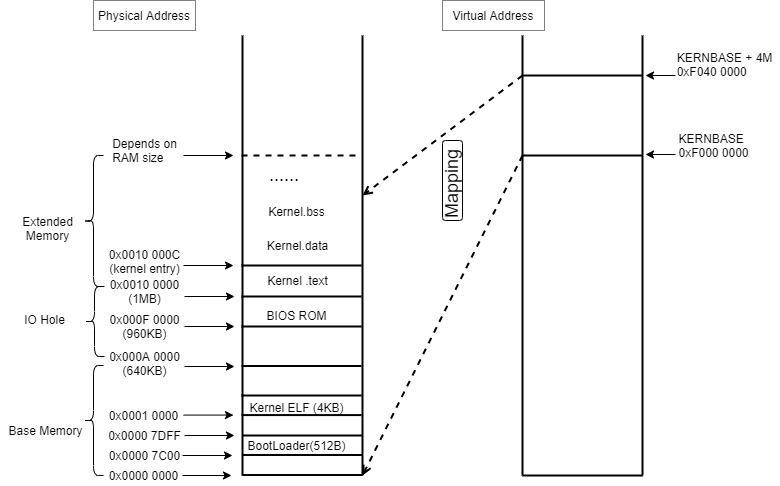

# Lab 2: Memory Management

## 参考

https://icegrave0391.github.io/2020/03/04/joslab2/

https://111qqz.github.io/2019/02/mit-6-828-lab-2/

https://zhuanlan.zhihu.com/p/318537679

https://blog.csdn.net/qq_33765199/article/details/104743134

https://www.cnblogs.com/fatsheep9146/p/5124921.html

https://www.dingmos.com/2020/07/24/25.html

https://blog.csdn.net/cinmyheart/article/details/39827321

https://github.com/clpsz/mit-jos-2014/tree/master/Lab2/Exercise01

## 背景知识

#### 启动过程及内存映射

由 lab1 可知, 整个系统的启动过程如下:

1. 上电或重启后, BIOS 首先运行并获得机器控制权. BIOS 位于物理地址空间 0x000f0000-0x000fffff.

2. BIOS 进行一些必要的初始化之后, 将 512 byte 的引导扇区(boot sector)加载到物理地址 0x7c00~0x7dff 的内存中, 然后使用 `jmp` 指令将 *CS:IP* 设置为 0000:7c00, 将控制权传递给引导加载程序(boot loader).

​		注: boot loader 的链接地址和加载地址都是 0x7c00, 编译时在 `boot/Makefrag ` 指定逻辑地址为 0x7c00.
​		boot loader 中, 还没有开启分页, 所以计算出来的线性地址就是真实要访问的内存物理地址.

3. (参考 lab1 Part 2: The Boot Loader  以及 Exercise 3). 硬盘上的第一个扇区存储的是 bootloader, bootloader 将处理器从实模式切换到32位保护模式, 使用 Bootstrap GDT 以及 segment translation, 使得虚拟(线性)地址和物理地址相同.

   ```
     # Switch from real to protected mode, using a bootstrap GDT
     # and segment translation that makes virtual addresses 
     # identical to their physical addresses, so that the 
     # effective memory map does not change during the switch.
     lgdt    gdtdesc # 把 gdtdesc 这个标识符的值送入全局映射描述符表寄存器 GDTR
     movl    %cr0, %eax
     orl     $CR0_PE_ON, %eax
     movl    %eax, %cr0 # CR0寄存器的bit0置1, bit0 保护模式启动位
     
     # Jump to next instruction, but in 32-bit code segment.
     # Switches processor into 32-bit mode.
     ljmp    $PROT_MODE_CSEG, $protcseg # 跳转到保护模式下执行
     
     # Bootstrap GDT
   .p2align 2                                # force 4 byte alignment
   gdt:
     SEG_NULL				# null seg
     SEG(STA_X|STA_R, 0x0, 0xffffffff)	# code seg
     SEG(STA_W, 0x0, 0xffffffff)	        # data seg
   
   gdtdesc:
     .word   0x17                            # sizeof(gdt) - 1
     .long   gdt                             # address gdt
   ```
   
   `lgdt    gdtdesc`  把 gdtdesc 这个标识符(标识一个内存地址)的值送入全局映射描述符表寄存器 GDTR. GDT 表是处理器工作于保护模式下一个非常重要的表, 用来存放关于某个运行在内存中的程序的分段信息的, 具体参考 lab1 Exercise 中关于实模式和保护模式的介绍.
   
   这条指令把关于 GDT 表的一些重要信息存放到 CPU 的 GDTR 寄存器中, 其中包括 GDT 表的内存起始地址, 表的长度. GDTR 寄存器是 48位, 低16位表示该表长度, 高32位表该表在内存中的起始地址.
   
   `.word   0x17`  0x17 是这个表的大小 sizeof(gdt) -1 = 0x17 = 23
    `.long   gdt`  gdt 也是一个标识符, 标识从这里开始就是 GDT 表. 表中包括三个表项, 分别代表 3个段, null seg，code seg，data seg. 由于 xv6 并没有使用分段机制, 也就是说数据和代码都是写在一起的, 所以数据段和代码段的起始地址都是 0x0, 大小都是 0xffffffff.
   
   表项由 SEG() 宏定义构造, 3个参数, type: 这个段的访问权限; base: 这个段的起始地址; lim: 这个段的大小界限.
   
   ```
   #define SEG(type,base,lim)					\
   	.word (((lim) >> 12) & 0xffff), ((base) & 0xffff);	\
   	.byte (((base) >> 16) & 0xff), (0x90 | (type)),		\
   		(0xC0 | (((lim) >> 28) & 0xf)), (((base) >> 24) & 0xff)
   ```
   
   段的 base 都是 0, 当程序中给出逻辑地址 segment:offset 时, 无论选择的是哪个段表项, 最后线性地址 = base + offset = offset, 则线性地址和物理地址相同.
   
4. 第二个扇区是 kernel image, 扇区大小 512 byptes. boot loader   从第二个扇区开始一直读8个扇区 (512 x 8 = 4K, ELF头的大小), 放到 0x10000(64KB) 的地方, 然后通过对 ELF头的解析, 得到 kernel 模块编译出来之后占的大小，并将 kernel 读到物理内存 0x100000(1MB) 的地方.

   最后跳转到 `ELFHDR->e_entry`, 即跳转到 0x10018 内存地址所存储的值处运行, 而该地址存储的内容是 0x10000C, 即 Kernel 的入口地址.

```
#define ELFHDR		((struct Elf *) 0x10000) // scratch space
void bootmain(void)
{
	struct Proghdr *ph, *eph;

	// read 1st page off disk
	readseg((uint32_t) ELFHDR, SECTSIZE*8, 0);

	// is this a valid ELF?
	if (ELFHDR->e_magic != ELF_MAGIC)
		goto bad;

	// load each program segment (ignores ph flags)
	// 通过 e_phoff 找到第一个段, 以及段的个数 e_phnum
	ph = (struct Proghdr *) ((uint8_t *) ELFHDR + ELFHDR->e_phoff);
	eph = ph + ELFHDR->e_phnum;
	for (; ph < eph; ph++)
		// p_pa is the load address of this segment (as well
		// as the physical address)
		// p_offset 开始之后的段的 p_memsz 个内存数据读取到物理地址 p_pa
		readseg(ph->p_pa, ph->p_memsz, ph->p_offset);

	// call the entry point from the ELF header
	// 
	((void (*)(void)) (ELFHDR->e_entry))();
}

hongssun@hongssun-user:~/workspace/6.828/lab/obj/kern$ readelf -h kernel
ELF Header:
  Magic:   7f 45 4c 46 01 01 01 00 00 00 00 00 00 00 00 00 
  Class:                             ELF32
  Data:                              2's complement, little endian
  Version:                           1 (current)
  OS/ABI:                            UNIX - System V
  ABI Version:                       0
  Type:                              EXEC (Executable file)
  Machine:                           Intel 80386
  Version:                           0x1
  Entry point address:               0x10000c
  ...
```

5. (参考 lab1 Part 3: The Kernel 以及 Exercise 7) 进入 kernel 后, 链接脚本 /kern/kernel.ld `. = 0xF0100000`使用的都是 0xF0000000 以上的虚拟地址. 需要建立虚拟地址到物理地址的映射, 并开启分页机制.
   使用 `kern/entrypgdir.c` 中手工编写的静态初始化的页目录和页表来实现 4MB 空间的物理内存映射. 设置 CR0_PG, 内存引用就是虚拟内存硬件将其转换为物理地址的虚拟地址.

   (在这之前的 bootloader 中, `boot/boot.S` 建立了一个从线性地址到物理地址的同等映射, 内存引用被视为物理地址, ). `entry_pgdir` 将虚拟地址 [0, 4MB) 映射到物理地址 [0, 4MB), 虚拟地址 [0xf0000000, 0xf0400000) 映射到 [0, 4MB).

   ```
   pde_t entry_pgdir[NPDENTRIES] = {
   	// Map VA's [0, 4MB) to PA's [0, 4MB)
   	[0]
   		= ((uintptr_t)entry_pgtable - KERNBASE) + PTE_P,
   	// Map VA's [KERNBASE, KERNBASE+4MB) to PA's [0, 4MB)
   	[KERNBASE>>PDXSHIFT]
   		= ((uintptr_t)entry_pgtable - KERNBASE) + PTE_P + PTE_W
   };
   
   pte_t entry_pgtable[NPTENTRIES] = {
   	0x000000 | PTE_P | PTE_W,
   	0x001000 | PTE_P | PTE_W,
   	0x002000 | PTE_P | PTE_W,
   	0x003000 | PTE_P | PTE_W,
   	0x004000 | PTE_P | PTE_W,
   	0x005000 | PTE_P | PTE_W,
   	...
   	0x3ff000 | PTE_P | PTE_W,
   };
   ```

   ```
   .globl entry
   entry:
   	movw	$0x1234,0x472			# warm boot
   
   	# We haven't set up virtual memory yet, so we're running from
   	# the physical address the boot loader loaded the kernel at: 1MB
   	# (plus a few bytes).  However, the C code is linked to run at
   	# KERNBASE+1MB.  Hence, we set up a trivial page directory that
   	# translates virtual addresses [KERNBASE, KERNBASE+4MB) to
   	# physical addresses [0, 4MB).  This 4MB region will be
   	# sufficient until we set up our real page table in mem_init
   	# in lab 2.
   
   	# Load the physical address of entry_pgdir into cr3.  entry_pgdir
   	# is defined in entrypgdir.c.
   	movl	$(RELOC(entry_pgdir)), %eax
   	movl	%eax, %cr3	# cr3 寄存器保存页目录表的物理地址
   	# Turn on paging.
   	movl	%cr0, %eax
   	orl	$(CR0_PE|CR0_PG|CR0_WP), %eax
   	movl	%eax, %cr0	# cr0 最高位PG位设置为1后, 打开分页功能
   
   	# Now paging is enabled, but we're still running at a low EIP
   	# (why is this okay?).  Jump up above KERNBASE before entering
   	# C code.
   	mov	$relocated, %eax
   	jmp	*%eax
   relocated:
   	# Clear the frame pointer register (EBP)
   	# so that once we get into debugging C code,
   	# stack backtraces will be terminated properly.
   	movl	$0x0,%ebp			# nuke frame pointer
   
   	# Set the stack pointer
   	movl	$(bootstacktop),%esp
   
   	# now to C code
   	call	i386_init
   ```

   ```
   # RELOC(x) maps a symbol x from its link address to its actual
   # location in physical memory (its load address).	 
   
   #define	RELOC(x) ((x) - KERNBASE)
   #define CR0_PG		0x80000000	// Paging
   ```

   链接脚本 /kern/kernel.ld `. = 0xF0100000`使用的都是 0xF0000000 以上的虚拟地址, entry_pgdir 符号代表的地址也是以 0xF0000000 为基址, entry_pgdir - 0xF0000000  则为物理地址.

   `movl %eax, %cr0` 使能分页后, 高地址的映射已经建立, 此时程序还在低地址运行. 所以接下来是跳转到高地址(KERNBASE: 0xF0000000) 上, 然后设置 %ebp, %esp, 最后调用 `i386_init`.

#### 内存布局(包含 ELF 结构)

根据启动过程以及 lab1 中 `objdump -h obj/kern/kernel`的输出, 程序进入 `i386_init`后的内存空间映射如下:



#### 页表结构

XV6 Chapter 2  Page tables

x86 page table hardware 

Physical memory allocation 

## 实验准备

1. 新建 lab2 分支, 合并 lab1 的修改

   ```
   git checkout -b lab2 remotes/origin/lab2
   git merge lab1
   ```

2. lab2 新加文件

   - `inc/memlayout.h` : 描述了虚拟地址空间的结构
   - `kern/pmap.c` : 物理内存管理的函数实现, 需要修改、添加代码以完成实验
   - `kern/pmap.h` : 定义了 `PageInfo` 结构, 用来管理物理内存页面
   - `kern/kclock.c` : 操作电池供电的时钟以及 CMOS RAM硬件
   - `kern/kclock.h`

   要特别注意 `memlayout.h` 和`pmap.h`, 因为这个 lab 要求使用并理解其中包含的许多定义. `inc/mmu.h` 也包含了一些对这个 lab 有用的定义.

3. 编译并运行 lab2, 代码最后执行 `i386_init`, 停在 `kern/pmap.c:128: mem_init: This function is not finished`

   ```
   hongssun@hongssun-user:~/workspace/6.828/lab$ make qemu
   ```

   

   `mem_init` 就是 lab2 内存管理的初始化函数.

   ```
   void i386_init(void)
   {
   	extern char edata[], end[];
   
   	// Before doing anything else, complete the ELF loading process.
   	// Clear the uninitialized global data (BSS) section of our program.
   	// This ensures that all static/global variables start out zero.
   	memset(edata, 0, end - edata);
   
   	// Initialize the console.
   	// Can't call cprintf until after we do this!
   	cons_init();
   
   	cprintf("6828 decimal is %o octal!\n", 6828);
   
       //cprintf("edata end addr: 0x%x, bss end addr: 0x%x\n", edata, end);
   
   	// Lab 2 memory management initialization functions
   	mem_init();
   
   	// Drop into the kernel monitor.
   	while (1)
   		monitor(NULL);
   }
   ```

## Exercise 1

exercise 1 要求写一个 physical page allocator.

### boot_alloc()

```
// This simple physical memory allocator is used only while JOS is setting
// up its virtual memory system.  page_alloc() is the real allocator.
//
// If n>0, allocates enough pages of contiguous physical memory to hold 'n'
// bytes.  Doesn't initialize the memory.  Returns a kernel virtual address.
//
// If n==0, returns the address of the next free page without allocating
// anything.
//
// If we're out of memory, boot_alloc should panic.
// This function may ONLY be used during initialization,
// before the page_free_list list has been set up.
static void *
boot_alloc(uint32_t n)
{
	static char *nextfree;	// virtual address of next byte of free memory
	char *result;

	// Initialize nextfree if this is the first time.
	// 'end' is a magic symbol automatically generated by the linker,
	// which points to the end of the kernel's bss segment:
	// the first virtual address that the linker did *not* assign
	// to any kernel code or global variables.
	if (!nextfree) {
		extern char end[];
		nextfree = ROUNDUP((char *) end, PGSIZE);
	}

	// Allocate a chunk large enough to hold 'n' bytes, then update
	// nextfree.  Make sure nextfree is kept aligned
	// to a multiple of PGSIZE.
	//
	// LAB 2: Your code here.

	return NULL;
}
```

根据注释, boot_alloc()  是一个简单的物理内存分配器, 仅仅用于 JOS 设置其虚拟内存系统时, 真正的分配器是 page_alloc(). n > 0, 分配连续 n 个 bytes 的内存, 不做初始化, 返回一个内核虚拟地址, 如果超出内存, 则 panic.

boot_alloc() 仅在初始化时 page_free_list 还没建立之前使用.

根据代码, boot_alloc() 在 mem_init() 中被调用, 其返回值用来初始化  kern_pgdir, 目的是创建初始化的页目录. 那么为什么需要一个单独的 page allocator, 仅在初始化时使用呢?

原因是 kernel 启动时要将物理地址映射到虚拟地址, 而我们需要一个 page table 来记录这种映射关系. 但是创建一个 page table 涉及到为 page table 所在的 page 分配空间, 而为一个 page 分配空间需要在将物理地址映射到虚拟地址以后.
解决办法是, 使用一个单独的 page allocator, 在一个固定的位置 allocate memory. 然后在这部分去做初始化的工作.

参考 xv6-book Chapter 2 Page tables.

```
	The kernel must allocate and free physical memory at run-time for page tables,
process user memory, kernel stacks, and pipe buffers.
	xv6 uses the physical memory between the end of the kernel and PHYSTOP for
run-time allocation. It allocates and frees whole 4096-byte pages at a time. It keeps
track of which pages are free by threading a linked list through the pages themselves.
Allocation consists of removing a page from the linked list; freeing consists of adding the freed page to the list.
	There is a bootstrap problem: all of physical memory must be mapped in order
for the allocator to initialize the free list, but creating a page table with those mappings involves allocating page-table pages. xv6 solves this problem by using a separate page allocator during entry, which allocates memory just after the end of the kernel’s data segment. This allocator does not support freeing and is limited by the 4 MB mapping in the entrypgdir, but that is sufficient to allocate the first kernel page table.
	xv6 使用从内核结尾到 PHYSTOP 之间的物理内存为运行时分配提供内存资源. 每次分配,它会将整块4096字节大小的页分配出去. xv6还会通过维护一个物理页组成的链表来寻找空闲页,所以分配内存需要将页移出该链表,而释放内存需要将页加入该链表.
这里我们遇到了一个自举的问题:为了让分配器能够初始化该空闲链表, 所有的物理内存都必须要建立起映射,但是建立包含这些映射的页表又必须要分配存放页表的页. xv6 通过在 entry中使用一个特别的页分配器来解决这个问题,该分配器会在内核数据部分的后面分配内存.该分配器不支持释放内存, 并受限于 entrypgdir中规定的 4MB分配大小, 即便如此,该分配器还是足够为内核的第一个页表分配出内存.
```

boot_alloc() 的实现有2个点要考虑:

1. 如果才能分配内存, 不可能使用 malloc. 源代码中使用了 “end”, 这是定义在链接脚本 kernel.ld 中的符号, 由链接器生成, 指向 bss 段的结束地址, 由 objdump -h obj/kern/kernel 命令的输出结合打印出来的结果, 其值为: 0xf0112970 ( = .bss 虚拟地址 0xf0112300 + size 0x670)

   ```
   hongssun@hongssun-user:~/workspace/6.828/lab$ git log -1
   commit f85962cd4f91823588fbbe0ac8ec4a4907f3ae43
   Author: hongssun <bhshs@aliyun.com>
   Date:   Sun Jul 11 00:41:28 2021 +0800
   
       lab2 exercise1 boot_alloc impl
   hongssun@hongssun-user:~/workspace/6.828/lab$ 
   hongssun@hongssun-user:~/workspace/6.828/lab$ objdump -h obj/kern/kernel
   
   obj/kern/kernel:     file format elf32-i386
   
   Sections:
   Idx Name          Size      VMA       LMA       File off  Algn
     0 .text         00001ae7  f0100000  00100000  00001000  2**4
                     CONTENTS, ALLOC, LOAD, READONLY, CODE
     1 .rodata       00000820  f0101b00  00101b00  00002b00  2**5
                     CONTENTS, ALLOC, LOAD, READONLY, DATA
     2 .stab         000040a5  f0102320  00102320  00003320  2**2
                     CONTENTS, ALLOC, LOAD, READONLY, DATA
     3 .stabstr      00001bc9  f01063c5  001063c5  000073c5  2**0
                     CONTENTS, ALLOC, LOAD, READONLY, DATA
     4 .data         0000a300  f0108000  00108000  00009000  2**12
                     CONTENTS, ALLOC, LOAD, DATA
     5 .bss          00000670  f0112300  00112300  00013300  2**5
                     ALLOC
     6 .comment      0000002b  00000000  00000000  00013300  2**0
                     CONTENTS, READONLY
   ```

2. 如何判断空间不够?

代码实现如下:

```
	if (!nextfree) {
		extern char end[];
		nextfree = ROUNDUP((char *) end, PGSIZE);

        cprintf("nextfree: 0x%x, bss end addr: 0x%x\n", nextfree, end);
	}
	// LAB 2: Your code here.
    if (n == 0) 
    	return nextfree;

    result = nextfree;
    nextfree = ROUNDUP((char *)(nextfree + n),PGSIZE);

    cprintf("nextfree: 0x%x\n", nextfree);
    if ((uint32_t)nextfree > (KERNBASE + npages * PGSIZE))
    {
        panic("boot_alloc: there is no enough space\n");
    }
    return result;
```

执行结果如下:

```
6828 decimal is 15254 octal!
edata end addr: 0xf0112300, bss end addr: 0xf0112970
Physical memory: 131072K available, base = 640K, extended = 130432K
nextfree: 0xf0113000, bss end addr: 0xf0112970
nextfree: 0xf0114000
kernel panic at kern/pmap.c:145: mem_init: This function is not finished
```

nextfree 是一个 static char *nextfree, 默认初始化为 0. 第一次执行时进入 if (!nextfree), 获取 end 地址之后的以 PGSIZE 对齐的地址空间 (0xf0113000). 用 result 保存 nextfree 并用于返回, nextfree 则继续取下一个 n 之后的地址空间.

nextfree 其始终存放着下一个可以使用的空闲内存空间的虚拟地址. 当再次执行 boot_alloc(), 先  result = nextfree 用于返回, 再计算 nextfree. 如果 n==0, 则不再计算 nextfree. 

如何判断空间不够? 

在函数 i386_detect_memory() 中, 通过 *CMOS calls* 得到剩余的物理内存. 其中 basemem 就是 0-640k 之间的内存, extmem 是 1M 以后的内存. npages 是剩余物理内存的页数, 每页大小是 PGSIZE, 因此一共能分配的空间大小为 (npages * PGSIZE). 而虚拟地址的 base 为 KERNBASE (inc/memlayout.h, 因此最大能访问的虚拟地址为 KERNBASE + (npages * PGSIZE).

JOS 把整个物理内存空间划分成三个部分(参考 inc/memlayout.h 注释 )：
0x00000~0xA0000(640K), 这部分叫 Base memory, 是可用的.
0xA0000~0x100000, 这部分叫做 IO hole, 是不可用的. 主要被用来分配给外部设备了. 
0x100000~ ???, 1M 以后的空间, 这部分叫做 Extended memory, 是可用的, 这是最重要的内存区域.