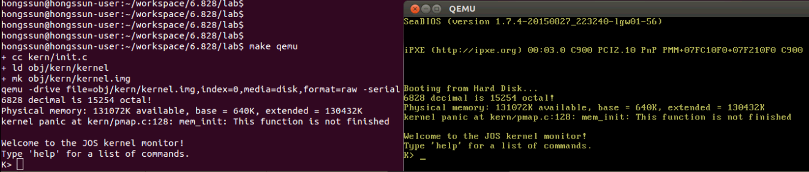
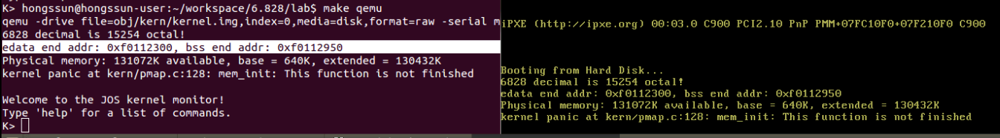

# Lab 2: Memory Management

## 参考

https://icegrave0391.github.io/2020/03/04/joslab2/

https://111qqz.github.io/2019/02/mit-6-828-lab-2/

https://zhuanlan.zhihu.com/p/318537679

https://blog.csdn.net/qq_33765199/article/details/104743134

https://www.cnblogs.com/fatsheep9146/p/5124921.html

https://www.dingmos.com/2020/07/24/25.html

https://blog.csdn.net/cinmyheart/article/details/39827321

https://github.com/clpsz/mit-jos-2014/tree/master/Lab2/Exercise01


## 实验准备

1. 新建 lab2 分支, 合并 lab1 的修改

   ```
   git checkout -b lab2 remotes/origin/lab2
   git merge lab1
   ```

2. lab2 新加文件

   - `inc/memlayout.h` : 描述了虚拟地址空间的结构
   - `kern/pmap.c` : 物理内存管理的函数实现, 需要修改、添加代码以完成实验
   - `kern/pmap.h` : 定义了 `PageInfo` 结构, 用来管理物理内存页面
   - `kern/kclock.c` : 操作电池供电的时钟以及 CMOS RAM硬件
   - `kern/kclock.h`

   要特别注意 `memlayout.h` 和`pmap.h`, 因为这个 lab 要求使用并理解其中包含的许多定义. `inc/mmu.h` 也包含了一些对这个 lab 有用的定义.

3. 编译并运行 lab2, 代码最后执行 `i386_init`, 停在 `kern/pmap.c:128: mem_init: This function is not finished`

   ```
   hongssun@hongssun-user:~/workspace/6.828/lab$ make qemu
   ```

   

   `mem_init` 就是 lab2 内存管理的初始化函数.

   ```
   void i386_init(void)
   {
   	extern char edata[], end[];
   
   	// Before doing anything else, complete the ELF loading process.
   	// Clear the uninitialized global data (BSS) section of our program.
   	// This ensures that all static/global variables start out zero.
   	memset(edata, 0, end - edata);
   
   	// Initialize the console.
   	// Can't call cprintf until after we do this!
   	cons_init();
   
   	cprintf("6828 decimal is %o octal!\n", 6828);
   
       //cprintf("edata end addr: 0x%x, bss end addr: 0x%x\n", edata, end);
   
   	// Lab 2 memory management initialization functions
   	mem_init();
   
   	// Drop into the kernel monitor.
   	while (1)
   		monitor(NULL);
   }
   ```

## 背景知识回顾

1. 启动过程

   运行 lab2, 代码最后执行 `i386_init`, 停在 `mem_init` . 由 lab1 可知, 整个系统的启动过程如下:

   a. 上电或重启后, BIOS 首先运行并获得机器控制权. BIOS 位于物理地址空间 0x000f0000-0x000fffff.

   b. BIOS 进行一些必要的初始化之后, 将 512 byte 的引导扇区(boot sector)加载到物理地址 0x7c00~0x7dff 的内存中, 然后使用 `jmp` 指令将 *CS:IP* 设置为 0000:7c00, 将控制权传递给引导加载程序(boot loader).

   ​		注: boot loader 的链接地址和加载地址都是 0x7c00, 编译时在 `boot/Makefrag `指定逻辑地址为 0x7c00.
   ​		boot loader 中, 还没有开启分页, 所以计算出来的线性地址就是真实要访问的内存物理地址.

   c. 硬盘上的第一个扇区存储的是 bootloader, 第二个扇区是 kernel image, 扇区大小 512 byptes. boot loader   从第二个扇区开始一直读8个扇区 (512 x 8 = 4K, ELF头的大小), 放到 0x10000(64KB) 的地方, 然后通过对 ELF头的解析, 得到 kernel 模块编译出来之后占的大小，并将 kernel 读到物理内存 0x100000(1MB) 的地方.

   最后跳转到 `ELFHDR->e_entry`, 即跳转到 0x10018 内存地址所存储的值处运行, 而该地址存储的内容是 0x10000C, 即 Kernel 的入口地址.

   ```
   #define ELFHDR		((struct Elf *) 0x10000) // scratch space
   void bootmain(void)
   {
   	struct Proghdr *ph, *eph;
   
   	// read 1st page off disk
   	readseg((uint32_t) ELFHDR, SECTSIZE*8, 0);
   
   	// is this a valid ELF?
   	if (ELFHDR->e_magic != ELF_MAGIC)
   		goto bad;
   
   	// load each program segment (ignores ph flags)
   	// 通过 e_phoff 找到第一个段, 以及段的个数 e_phnum
   	ph = (struct Proghdr *) ((uint8_t *) ELFHDR + ELFHDR->e_phoff);
   	eph = ph + ELFHDR->e_phnum;
   	for (; ph < eph; ph++)
   		// p_pa is the load address of this segment (as well
   		// as the physical address)
   		// p_offset 开始之后的段的 p_memsz 个内存数据读取到物理地址 p_pa
   		readseg(ph->p_pa, ph->p_memsz, ph->p_offset);
   
   	// call the entry point from the ELF header
   	// 
   	((void (*)(void)) (ELFHDR->e_entry))();
   }
   
   hongssun@hongssun-user:~/workspace/6.828/lab/obj/kern$ readelf -h kernel
   ELF Header:
     Magic:   7f 45 4c 46 01 01 01 00 00 00 00 00 00 00 00 00 
     Class:                             ELF32
     Data:                              2's complement, little endian
     Version:                           1 (current)
     OS/ABI:                            UNIX - System V
     ABI Version:                       0
     Type:                              EXEC (Executable file)
     Machine:                           Intel 80386
     Version:                           0x1
     Entry point address:               0x10000c
     ...
   ```

   d. (参考 lab1 Part 3: The Kernel)进入 kernel 后, 使用`kern/entrypgdir.c` 中手工编写的静态初始化的页目录和页表来实现 4MB 空间的物理内存映射. 设置 CR0_PG, 内存引用就是虚拟内存硬件将其转换为物理地址的虚拟地址(在这之前, 内存引用被视为物理地址, `boot/boot.S` 建立了一个从线性地址到物理地址的同等映射). `entry_pgdir` 将范围为 0xf0000000 到 0xf0400000 的虚拟地址转换为物理地址 0x00000000 到 0x00400000. 

   ```
   .globl entry
   entry:
   	movw	$0x1234,0x472			# warm boot
   
   	# We haven't set up virtual memory yet, so we're running from
   	# the physical address the boot loader loaded the kernel at: 1MB
   	# (plus a few bytes).  However, the C code is linked to run at
   	# KERNBASE+1MB.  Hence, we set up a trivial page directory that
   	# translates virtual addresses [KERNBASE, KERNBASE+4MB) to
   	# physical addresses [0, 4MB).  This 4MB region will be
   	# sufficient until we set up our real page table in mem_init
   	# in lab 2.
   
   	# Load the physical address of entry_pgdir into cr3.  entry_pgdir
   	# is defined in entrypgdir.c.
   	movl	$(RELOC(entry_pgdir)), %eax
   	movl	%eax, %cr3
   	# Turn on paging.
   	movl	%cr0, %eax
   	orl	$(CR0_PE|CR0_PG|CR0_WP), %eax
   	movl	%eax, %cr0
   
   	# Now paging is enabled, but we're still running at a low EIP
   	# (why is this okay?).  Jump up above KERNBASE before entering
   	# C code.
   	mov	$relocated, %eax
   	jmp	*%eax
   relocated:
   
   	# Clear the frame pointer register (EBP)
   	# so that once we get into debugging C code,
   	# stack backtraces will be terminated properly.
   	movl	$0x0,%ebp			# nuke frame pointer
   
   	# Set the stack pointer
   	movl	$(bootstacktop),%esp
   
   	# now to C code
   	call	i386_init
   ```

   ​		使能分页后, 高地址的映射已经建立, 此时内核还在低地址运行. 所以接下来是跳转到高地址(KERNBASE	0xF0000000) 上, 然后设置 %ebp, %esp, 最后调用 `i386_init`.

2. 内存布局(包含 ELF 结构)

3. objdump -h obj/kern/kernel

   

   ```
   hongssun@hongssun-user:~/workspace/6.828/lab$ objdump -h obj/kern/kernel
   
   obj/kern/kernel:     file format elf32-i386
   
   Sections:
   Idx Name          Size      VMA       LMA       File off  Algn
     0 .text         00001a57  f0100000  00100000  00001000  2**4
                     CONTENTS, ALLOC, LOAD, READONLY, CODE
     1 .rodata       000007c4  f0101a60  00101a60  00002a60  2**5
                     CONTENTS, ALLOC, LOAD, READONLY, DATA
     2 .stab         00003fcd  f0102224  00102224  00003224  2**2
                     CONTENTS, ALLOC, LOAD, READONLY, DATA
     3 .stabstr      00001bb0  f01061f1  001061f1  000071f1  2**0
                     CONTENTS, ALLOC, LOAD, READONLY, DATA
     4 .data         0000a300  f0108000  00108000  00009000  2**12
                     CONTENTS, ALLOC, LOAD, DATA
     5 .bss          00000650  f0112300  00112300  00013300  2**5
                     ALLOC
     6 .comment      0000002b  00000000  00000000  00013300  2**0
                     CONTENTS, READONLY
   hongssun@hongssun-user:~/workspace/6.828/lab$ 
   ```

   

4. XV6 Chapter 2  Page tables

   x86 page table hardware 

   Physical memory allocation 

## Exercise 1

