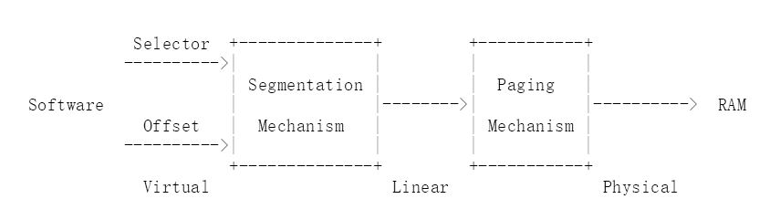

# Lab 2: Memory Management

## Introduction

在这个实验中, 你将要为你的操作系统写内存管理的代码, 内存管理有两个组件.

第一个组件是内核的物理内存分配器, 这样内核就可以分配内存然后释放它. 分配器将以 4096 字节(称为页)为单位进行操作. 你的任务是维护数据结构, 这些数据结构记录了哪些物理页是空闲的, 哪些是已经分配的, 以及有多少进程正在共享每个分配的页. 你还要编写用于分配和释放内存页的例程.

第二个组件是虚拟内存, 它将内核和用户使用的虚拟地址映射到物理内存地址. x86 硬件的内存管理单元(MMU)在指令使用内存时执行映射, 并参考一组页表. 你将根据我们提供的规范修改 JOS 来设置 MMU 的页表.

### Getting started

在本实验及后面的实验中, 将逐步构建你的内核. 我们也会提供给你一些额外的来源. 要获取源码, 使用 Git 提交 lab1 以来所做的修改(如果有的话), 获取最新版本的课程仓库, 然后在 lab2 分支 origin/lab2 的基础上创建一个本地分支 lab2

```
git checkout -b lab2 origin/lab2
```

`git checkout -b` 命令实际上做了两件事: 首先基于 origin/lab2 分支创建一个本地分支lab2, 其次它更改你的lab目录的内容以反映存储在 lab2 分支上的文件.
Git 允许使用 `git checkout branch-name `在现有分支之间切换, 不过在切换到另一个分支之前, 你应该提交一个分支上的任何未完成的更改.

在某些情况下, Git 可能无法弄清楚如何将你的更改与新的 lab 合并(例如, 如果你修改了一些在 lab2 中更改的代码). 这种情况下 `git merge` 命令将告诉你哪些文件存在冲突, 应该首先解决冲突(通过编辑相关文件), 然后使用 `git commit -a` 提交生成的文件.

lab2 包含以下新的源文件, 你应该浏览一下:

- `inc/memlayout.h`
- `kern/pmap.c`
- `kern/pmap.h`
- `kern/kclock.h`
- `kern/kclock.c`

`memlayout.h` 描述了虚拟地址空间的布局, 你必须通过修改 `pmap.c` 来实现. `memlayout.h` 和`pmap.h` 定义了 `PageInfo` 的结构, 你将使用它来跟踪物理内存中哪些页面是空闲的.
`kclock.c `和 `kclock.h` 操作 PC的备用电池时钟和 CMOS RAM硬件, 其中 BIOS 记录 PC 包含的物理内存数量, 以及其他东西.  `pmap.c`  代码需要读取设备硬件, 以便计算出有多少物理内存, 但这部分代码已经完成了, 你不需要知道 CMOS 硬件是如何工作的细节.

要特别注意 `memlayout.h` 和`pmap.h`, 因为这个 lab 要求你使用并理解其中包含的许多定义. 你可能想要审查`inc/mmu.h`, 因为它也包含了一些对这个 lab 有用的定义.

在开始实验之前, 不要忘记  add -f 6.828 以获得 6.828 QEMU 的版本.

### Lab Requirements

在本实验和后续的实验中, 做实验中描述的所有常规练习以及至少一个挑战性的问题. (当然, 有些挑战性的问题比其他的更有挑战性!) 另外, 写下在实验中提出的问题的简短答案和简短的描述(一到两段)你是如何解决你所选择的挑战性问题的.
如果你实现了多个具有挑战性的问题, 你只需要在本文中描述其中的一个, 当然我们欢迎你做更多的工作. 在提交工作之前, 将报告放置在 lab 目录顶层的一个名为  `answers-lab2.txt` 的文件中.

### Hand-In Procedure

## Part 1: Physical Page Management

操作系统必须跟踪物理 RAM 的哪些部分是空闲的, 哪些部分目前正在使用. JOS 以页为粒度(*page granularity*)管理 PC的物理内存, 这样它就可以使用 MMU 来映射和保护每个已分配的内存.

现在你将编写物理页分配器, 它通过  `struct PageInfo` 对象的链表来跟踪哪些页是空闲的 (与xv6不同, 这些对象没有嵌入到空闲页本身中), 每个对象对应于一个物理页面. 在编写虚拟内存实现的其余部分之前, 你需要编写物理页分配器, 因为页表管理代码需要分配物理内存来存储页表.

### Exercise 1

```
在文件 kern/pmap.c 中, 你必须实现下面函数的代码(可能是按给出的顺序).

boot_alloc()
mem_init() (只在调用 check_page_free_list(1) 之前)
page_init()
page_alloc()
page_free()

check_page_free_list(), check_page_alloc() 测试物理页分配器.
您应该引导 JOS 并查看 check_page_alloc() 是否报告成功. 修复你的代码让它通过, 您可能会发现添加自己的assert() 来验证你假设是否正确是很有帮助的.
```

这个 lab以及所有的 6.828 lab, 都要求你做一些侦查工作, 以明确你需要做什么. 这个作业并没有描述你必须添加到 JOS 中的代码的所有细节. 在 JOS 源代码中需要修改的部分查找注释, 这些注释通常包含说明和提示. 你还需要查看JOS 的相关部分, 英特尔手册, 或者你的 6.004 或 6.033 笔记.

## Part 2: Virtual Memory

在做其他事情之前, 先熟悉一下 x86 保护模式的内存管理体系结构: 即分段和分页转换(*segmentation* and *page translation*)

### Exercise 2

```
看看 Intel 80386 参考手册(https://pdos.csail.mit.edu/6.828/2017/readings/i386/toc.htm) 的第5章和第6章.仔细阅读关于分页转换和基于页面的保护的章节(5.2和6.4). 我们建议你也浏览一下关于分段(segmentation) 的部分; 虽然 JOS使用分页硬件来实现虚拟内存和保护, 但在 x86上不能禁用分段转换和基于段的保护, 因此你需要对它有基本的了解.
```

### Virtual, Linear, and Physical Addresses

在 x86术语中, 虚拟地址由一个段选择器和段内的偏移量组成.

线性地址是在段转换之后、分页转换之前得到的地址.

一个物理地址是在分段和分页转换之后最终得到的地址, 并且最终在硬件总线上传给 RAM.



下图来自 XV6 Appendix B)


Virtual(Selector: Offset) --> 分段转换 ---> 线性地址 ---> 分页转换 ---> 物理地址

一个 C 指针是虚拟地址的“Offset”组件. 在 `boot/boot.S` 我们安装了一个全局描述符表(GDT), 通过将所有的 segment base addresses 设置为 0, limits 为 0xffffffff 来有效地禁用段转换. 因此 "selector" 没有影响, 线性地址总是等于虚拟地址的 Offset.
在 lab3 中我们必须与分段进行更多的交互以设置特权级别, 但是对于内存转换, 我们可以在 JOS lab 中忽略分段, 只关注分页转换.

回想一下在 lab1 中的 Part 3, 我们安装了一个简单的页表, 这样内核就可以在它的链接地址 0xf0100000 上运行, 即使它实际上装载在 ROM BIOS 之上的物理内存中, 即 0x00100000. 这个页表只映射了 4MB的内存. 在本实验中你将为 JOS 设置虚拟地址空间布局, 将对其进行扩展, 以映射从虚拟地址 0xf0000000开始的前 256MB物理内存, 并映射虚拟地址空间的许多其他区域.

### Exercise 3

```
虽然 GDB只能通过虚拟地址访问 QEMU的内存, 但是在设置虚拟内存时能够检查物理内存通常是很有用的. 检查实验工具指南中的 QEMU监视器命令(https://pdos.csail.mit.edu/6.828/2017/labguide.html#qemu), 特别是 xp命令, 它允许您检查物理内存. 要访问 QEMU监视器, 请在终端中按 Ctrl-a c(相同的绑定返回到串行控制台).

使用 QEMU监视器中的 xp 命令和 GDB中的 x 命令检查相应物理地址和虚拟地址的内存, 并确保看到相同的数据.
我们修补过的 QEMU版本提供了一个 info pg 命令, 它可能也很有用: 它显示了一个紧凑但详细的当前页表信息, 包括所有映射的内存范围、权限和标记. Stock QEMU 还提供了一个 info mem 命令, 它显示了虚拟地址的映射范围范围以及哪些权限.
```

从 CPU上执行的代码来看, 一旦我们进入了保护模式 (`boot/boot.S`中首先进入的模式), 就没有办法直接使用线性地址或物理地址. 所有的内存引用都被解释为虚拟地址, 并由 MMU进行转换, 这意味着 C 语言中的所有指针都是虚拟地址.

JOS 内核经常需要将地址作为不透明的值或整数来操作, 而不需要对它们进行解引用, 例如在物理内存分配器中. 这些地址有时是虚拟地址, 有时是物理地址. 为了帮助记录代码, JOS 源代码区分了两种情况: 类型 `uintptr_t` 表示不透明的虚拟地址, 而`physaddr_t` 表示物理地址. 这两种类型都是 32位整数的同义词(uint32_t), 所以编译器不会阻止你将一种类型赋值给另一种类型! 因为它们是整数类型(不是指针), 如果你试图解引用它们, 编译器会报错.

JOS 内核可以通过首先将 `uintptr_t` 转换为指针类型来解引用它. 相反内核不能聪明地对物理地址解引用, 因为MMU 转换所有的内存引用. 如果你将 `physaddr_t` 转换为一个指针并对其进行解引用, 可能能够加载并存储到结果地址(硬件将它当作一个虚拟地址处理), 但是不会得到你想要的内存位置.

总结:

```
C type			Address type
T*  			Virtual
uintptr_t  		Virtual
physaddr_t  	Physical
```

### Question

```
假设下面 JOS的内核代码是正确的, 变量 x的类型应该是 uintptr_t 还是 physaddr_t?
	mystery_t x;
	char* value = return_a_pointer();
	*value = 10;
	x = (mystery_t) value;
```

JOS 内核有时需要读取或修改它只知道物理地址的内存. 例如, 向页表添加一个映射可能需要分配物理内存来存储页目录, 然后初始化该内存. 然而内核不能绕过虚拟地址转换, 因此不能直接加载和存储到物理地址. JOS 在虚拟地址 0xf0000000 从物理地址 0 开始重新映射所有物理内存, 一个原因是帮助内核读写它只知道物理地址的内存. 为了将物理地址转换为内核可以实际读写的虚拟地址, 内核必须对物理地址 +0xf0000000, 以在重新映射的区域中找到其对应的虚拟地址. 你应该使用 KADDR(pa) 来做.

JOS 内核有时还需要能够根据存储内核数据结构的内存的虚拟地址找到物理地址. 内核全局变量和  `boot_alloc()` 分配的内存都在内核加载的区域, 从 0xf0000000 开始, 这是我们映射所有物理内存的区域. 因此要将该区域中的虚拟地址转换为物理地址, 内核只需减去 0xf0000000 即可, 你应该用 PADDR(va) 来做这个减法.

### Reference counting

在以后的的 lab中, 你经常会同时将相同的物理页面映射到多个虚拟地址(或多个环境的地址空间). 你将在与物理页对应的  `struct PageInfo` 的 `pp_ref` 字段中保存对每个物理页的引用数量的计数. 当物理页的此计数为零时, 可以释放该页, 因为它不再被使用. 通常这个计数应该等于物理页在所有页表中出现在 *UTOP*  下面的次数(在 *UTOP* 之上的映射大多是在引导时由内核设置的, 不应该被释放, 所以不需要引用计数它们). 我们还将使用它来跟踪指向页目录页的指针数量, 以及页目录对页表页的引用数量.

使用  `page_alloc`时要小心, 它返回的页面的引用计数总是为0, 所以只要对返回的页面做了一些事情(比如将它插入到页表中),`pp_ref` 就应该增加. 有时这是由其他函数 (例如  `page_insert`) 处理的, 有时调用 `page_alloc` 的函数必须直接执行.

### Page Table Management

现在你将编写一组例程来管理页表: 插入和删除线性(虚拟)到物理的映射, 并在需要时创建页表页.

### Exercise 4

```
在文件 kern/pmap.c, 必须实现下面函数的代码.

        pgdir_walk()
        boot_map_region()
        page_lookup()
        page_remove()
        page_insert()
	
check_page(), called from mem_init(), tests your page table management routines. You should make sure it reports success before proceeding.
check_page() 测试页表管理例程, 在继续之前应该确保它报告成功.
```

## Part 3: Kernel Address Space

JOS 将处理器的32位线性地址空间分成两部分. 用户环境(进程), 我们将在 lab3 中开始加载和运行他, 可以控制下层的布局和内容, 而内核始终保持对上层的完全控制. 这个分界线是由  `inc/memlayout.h`中的符号`ULIM` 定义的, 为内核保留大约 256MB 的虚拟地址空间. 这就解释了为什么我们需要在 lab1中给内核如此高的链接地址, 否则内核的虚拟地址空间将没有足够的空间同时映射到它下面的用户环境中.

对于本部分和以后的实验, 参考  `inc/memlayout.h`  中的 JOS 内存布局图会有帮助.

### Permissions and Fault Isolation

权限和错误隔离.

因为内核和用户内存都存在于每个环境的地址空间中, 所以我们必须使用 x86页表中的权限位来允许用户代码只访问地址空间的用户部分. 否则, 用户代码中的错误可能会覆盖内核数据, 导致崩溃或更难以分析的故障; 用户代码还可能窃取其他环境的私有数据.  注意, 可写权限位 (`PTE_W`) 会同时影响用户代码和内核代码!

用户环境将没有权限访问任何高于 ULIM 的内存, 而内核将能够读写这些内存. 对于地址范围 [UTOP,ULIM], 内核和用户环境都有相同的权限: 他们可以读但不能写这个地址范围. 这个地址范围用于向用户环境公开某些只读的内核数据结构. 最后, UTOP 下面的地址空间是供用户环境使用的, 用户环境将设置访问此内存的权限.

### Initializing the Kernel Address Space

现在, 你将设置在 `UTOP`之上的地址空间: 地址空间的内核部分. `inc/memlayout.h` 显示了你应该使用的布局, 你将使用刚才编写的函数来设置适当的线性到物理映射.

### Exercise 5

```
在调用 check_page() 之后, 填补 mem_init() 中缺失的代码.
你的代码将通过 check_kern_pgdir() 和 check_page_installed_pgdir() 的检查
```

### Question

```
2. What entries (rows) in the page directory have been filled in at this point? What addresses do they map and where do they point? In other words, fill out this table as much as possible.
此时页面目录中的哪些条目(行)已被填充? 它们映射了哪些地址, 指向哪里? 换句话说, 尽可能多地填写这个表格.
```

| Entry | Base Virtual Address | Points to (logically):                |
| ----- | -------------------- | ------------------------------------- |
| 1023  | ?                    | Page table for top 4MB of phys memory |
| 1022  | ?                    | ?                                     |
| .     | ?                    | ?                                     |
| .     | ?                    | ?                                     |
| .     | ?                    | ?                                     |
| 2     | 0x00800000           | ?                                     |
| 1     | 0x00400000           | ?                                     |
| 0     | 0x00000000           | [see next question]                   |

```
3. We have placed the kernel and user environment in the same address space. Why will user programs not be able to read or write the kernel's memory? What specific mechanisms protect the kernel memory?
我们将内核和用户环境放在同一个地址空间中, 为什么用户程序不能读或写内核的内存? 有哪些特定的机制保护内核内存?
```

```
4. What is the maximum amount of physical memory that this operating system can support? Why? 这个操作系统能支持的最大物理内存量是多少? 为什么?
```

```
5. How much space overhead is there for managing memory, if we actually had the maximum amount of physical memory? How is this overhead broken down?
如果我们有最大的物理内存，那么管理内存的空间开销是多少? 管理费如何划分?
```

```
6. Revisit the page table setup in kern/entry.S and kern/entrypgdir.c. Immediately after we turn on paging, EIP is still a low number (a little over 1MB). At what point do we transition to running at an EIP above KERNBASE? What makes it possible for us to continue executing at a low EIP between when we enable paging and when we begin running at an EIP above KERNBASE? Why is this transition necessary?
重新查看 kern/entry.S 和 kern/entrypgdir.c中的页表设置. 在我们打开分页之后, EIP 仍然是一个很小的数字(略大于1MB). 在什么点上我们可以过渡到在 KERNBASE之上的 EIP上运行? 是什么让我们在启用分页和开始运行于KERNBASE 之上的 EIP之间的低EIP上继续执行? 为什么这种转变是必要的?
```

### Address Space Layout Alternatives

地址空间布局备选方案.

我们在 JOS中使用的地址空间布局并不是唯一可能. 一个操作系统可以把内核映射到低线性地址, 而把线性地址空间的上半部分留给用户进程. x86 内核一般不采取这种方法, 但是因为一个 x86的向后兼容模式, 称为虚拟 8086模式,是处理器“硬连接”地使用底部的线性地址空间, 因此如果内核映射到这里则不能使用.

甚至有可能,虽然更加困难, 设计内核为了不保留任何固定部分处理器的线性或虚拟地址空间本身, 而是有效地允许用户级进程无限制使用的整个 4GB 的虚拟地址空间, 同时还从这些进程中充分保护内核, 保护各自不同的进程!

```
挑战!
概述如何设计内核以允许用户环境不受限制地使用完整的4GB虚拟地址空间和线性地址空间。

Hint: the technique is sometimes known as "follow the bouncing kernel."
提示:这种技术有时被称为“跟随弹跳内核”。
在你的设计中, 一定要准确地说明当处理器在内核模式和用户模式之间转换时必须发生什么,以及内核如何完成这种转换.
还要描述在这种方案中内核如何访问物理内存和I/O设备, 以及在系统调用期间内核如何访问用户环境的虚拟地址空间等.
最后, 从灵活性、性能、内核复杂性和您可以想到的其他因素方面考虑并描述这种方案的优缺点.
```

```
挑战!
由于 JOS内核的内存管理系统只根据页面粒度分配和释放内存, 所以我们没有任何东西可以与内核中可以使用的通用malloc/free工具相媲美.
如果我们希望支持某些类型的I/O设备, 这些设备需要大于 4KB的物理连续缓冲区, 或者我们希望用户级环境(而不仅仅是内核)能够分配和映射 4MB超页以获得最大的处理器效率, 那么这可能会成为一个问题.
(请参阅前面关于PTE_PS的挑战问题。)
一般化内核的内存分配系统, 以支持各种2的幂分配单元大小的页面, 从 4KB到你选择的合理最大值.
确保您能够根据需要将较大的分配单元划分为较小的分配单元, 并在可能的情况下将多个较小的分配单元合并为较大的分配单元.
考虑在这样的系统中可能出现的问题.
```

