# Lab 3: User Environments(Process)

## 预习准备

### 参考

给操作系统捋条线: https://github.com/Rand312/xv6

https://github.com/Anarion-zuo/AnBlogs/tree/master/6.828, lab3A-elf.md

https://github.com/ranxian/xv6-chinese/tree/rev8, rev8 分支, chapter3.md

[xv6源码分析（五）：异常、中断、系统调用机制_argint argstr_elif的博客-CSDN博客](https://blog.csdn.net/qq_25426415/article/details/54647862)


### ELF 文件结构

```
struct Elf {
	uint32_t e_magic;	// must equal ELF_MAGIC
	uint8_t e_elf[12];
	uint16_t e_type;
	uint16_t e_machine;
	uint32_t e_version;
	uint32_t e_entry;
	uint32_t e_phoff;
	uint32_t e_shoff;
	uint32_t e_flags;
	uint16_t e_ehsize;
	uint16_t e_phentsize;
	uint16_t e_phnum;
	uint16_t e_shentsize;
	uint16_t e_shnum;
	uint16_t e_shstrndx;
};
```

ELF 文件开头放置的是一系列`header`，包括整个 ELF的`header`, 以及后面一个个区块的`header`，这些`header`不直接包含和运行有关的数据, 只包含**元数据**, 帮助我们更好加载真正的数据.

ELF `header` 中指定了每个区块`segment`的位置, 以及`segment`的长度, 从而让我们方便地找到并索引.

这些区块`segment`是编译器和连接器定义的, 每个都有各自的含义. 如`.text`为代码区, 包含要执行的指令; `.data`代表已经初始化的全局变量; `.bss`代表未初始化的全局变量, 等等. 要让进程正确执行, 必须把这些区块加载到正确的内存空间上.

### ELF 文件加载

该 Lab中并没有加载真的可执行文件, 因为还没有文件系统. 所使用的 ELF文件是通过链接器嵌入到内核这个可执行文件中的.

ELF 文件有多个`ProgHdr`, 即可执行文件中的 segment(段), 每个  segment对应一个 program header, 每个 segment 都有指定好的虚拟地址和长度, 只需要从 `ELF`中读取出这些信息, 把数据拷贝到相应位置就可以. 下面是一个可执行文件的例子.

```
$ readelf -l stack

Elf file type is EXEC (Executable file)
Entry point 0x10318
There are 8 program headers, starting at offset 52

Program Headers:
  Type           Offset   VirtAddr   PhysAddr   FileSiz MemSiz  Flg Align
  EXIDX          0x000574 0x00010574 0x00010574 0x00008 0x00008 R   0x4
  PHDR           0x000034 0x00010034 0x00010034 0x00100 0x00100 R E 0x4
  INTERP         0x000134 0x00010134 0x00010134 0x00013 0x00013 R   0x1
      [Requesting program interpreter: /lib/ld-linux.so.3]
  LOAD           0x000000 0x00010000 0x00010000 0x00580 0x00580 R E 0x10000
  LOAD           0x000580 0x00020580 0x00020580 0x00120 0x00124 RW  0x10000
  DYNAMIC        0x00058c 0x0002058c 0x0002058c 0x000f0 0x000f0 RW  0x4
  NOTE           0x000148 0x00010148 0x00010148 0x00044 0x00044 R   0x4
  GNU_STACK      0x000000 0x00000000 0x00000000 0x00000 0x00000 RW  0x10
```

有内存空间才能执行指令, 在拷贝 ELF文件中的各个部分到指定位置之前, 需要通过已有的分配器给进程足够多的`page`, 用于存放 ELF文件镜像. 并且光是 ELF文件中的内容还不够, 进程执行还需要栈, 要给进程栈分配空间, 并映射到指定的虚拟地址.

Exercise 2 中`load_icode()`函数的任务是把内核代码中的一个`ELF`镜像加载到指定的地址. 需要注意以下几点:

-   加载之前首先验证`e_magic`是否正确
-   在拷贝 program segment之前, 先将地址映射切换为当前进程的, 而不是继续使用内核的. `x86`可以非常方便地使用 lcr3()函数切换`Page Directory`.
-   ELF 中的虚拟地址指的是用户地址空间, 而不是当前采用的内核地址空间, 需要把指定的用户地址空间换算为内核地址空间, 再进行拷贝.

### XV6 进程管理

Exercise 2 还涉及到了用户进程(环境)的创建及运行(进程切换), env_create(), env_run().

进程 = 程序 + 运行时状态

* 程序: 存储器上的一个可执行文件
* 进程就是程序在内存中的一个执行实例, 即运行时的程序

#### 进程控制块

可执行文件由 ELF文件结构记录管理着文件的信息, 当可执行文件被加载到内存当作进程执行后, 也有类似的数据结构来记录管理进程的执行情况, 称为进程控制块(Process Control Block). PCB中记录了进程运行需要的一切环境和信息, xv6 的 PCB定义如下:

```
[proc.h]
struct proc {
	uint sz; 					// Size of process memory (bytes)进程大小
	pde_t* pgdir; 				// Page table 页表
	char *kstack; 				// Bottom of kernel stack for this process 内核栈位置
	enum procstate state; 		// Process state 进程状态
	int pid; 					// Process ID 进程ID
	struct proc *parent; 		// Parent process 父进程指针
	struct trapframe *tf; 		// Trap frame for current syscall 中断栈帧指针
	struct context *context; 	// swtch() here to run process 上下文指针
	void *chan; 				// If non-zero, sleeping on chan 用来睡眠
	int killed; 				// If non-zero, have been killed 是否被killed
	struct file *ofile[NOFILE]; // Open files 打开文件描述符表
	struct inode *cwd; 			// Current directory 当前工作路径
	char name[16]; 				// Process name (debugging) 进程名字
}
```

每个进程对应一个进程控制块/结构体, xv6 最多支持 64个进程, 所有进程结构体集合在一起形成了进程结构体表, 创建进程的时候寻找空闲的结构体分配出去, 进程退出时再回收.

```
[param.h]
#define NPROC 64 // maximum number of processes

[proc.c]
struct {
	struct spinlock lock;
	struct proc proc[NPROC];
} ptable;
```

进程结构体表是一个全局的数据, 配了一把锁给它, 锁主要用来保护进程的状态和上下文.

#### 进程运行状态

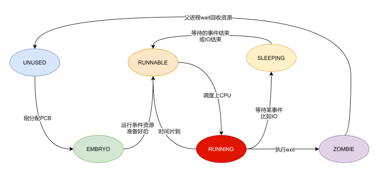

* UNUSED: 表示任务结构体未使用处于空闲状态, 当要创建进程的时候就可以将这个结构体分配出去 
* EMBRYO: 任务结构体刚分配出去, 资源都还没分配给该进程, 处于萌芽状态 
* RUNNABLE: 表示进程需要的一切准备就绪, 可以上 CPU执行了, 此时状态为 RUNNABLE
* RUNNING: 表示该进程正在 CPU上执行, 如果时间片到了则让出 CPU变为 RUNNABLE状态; 如果运行过程中因为某些事件阻塞比如 IO, 也让出 CPU变为 SLEEPING状态
* SLEEPING: 通常因为进程执行的过程中遇到某些事件阻塞比如 IO操作, 这时候等待 IO返回并让出 CPU使得进程进入 SLEEPING状态. 当 IO事件结束返回之后则恢复到 RUNNABLE状态, 表明又可以上 CPU执行了
* ZOMBIE: 进程执行到最后调用 exit函数, 则状态变为 ZOMBIE, 这个状态一直持续到父进程调用 wait来回收子进程资源. 
  如果子进程执行 exit之后, 父进程一直没有回收子进程, 那么这个子进程就一直处于僵尸状态, 也就是通常所说的僵尸进程. 
  如果一个父进程退出, 而它的一个或多个子进程还在运行, 那么这些子进程将成为孤儿进程. 孤儿进程最后会被 init进程(第一个进程)收养, 并由 init进程对它们完成资源的回收工作

#### CPU 结构体

```
[param.h]
#define NCPU          8  // maximum number of CPUs

[proc.h]
// Per-CPU state
struct cpu {
  uchar apicid;                // LAPIC ID, 可以当作是 CPU ID
  struct context *scheduler;   // 调度器的上下文
  struct taskstate ts;         // 任务状态段
  struct segdesc gdt[NSEGS];   // GDT
  volatile uint started;       // CPU是否已经启动
  int ncli;                    // 关中断深度
  int intena;                  // 该CPU在pushcli之前是否允许中断
  struct proc *proc;           // 运行在该CPU上的进程指针
};

[mp.c]
struct cpu cpus[NCPU];
```

进程运行在 CPU上, xv6 也是个支持多处理器的操作系统, 最大支持 NCPU 个 CPU, 并且为每个 CPU维护了
一个数据结构记录当前 CPU的信息.

每个处理器有着自己的调度器 scheduler, CPU结构体中记录了调度器的上下文指针 `struct context *scheduler`. 调度器就是一段内核代码, 当需要调度的时候, 它来决定当前执行哪一个状态为 RUNNABLE 的进程，或者说为状态是 RUNNABLE 的进程分配 CPU

#### 进程切换

##### 中断上下文 trapframe

当用户程序进入内核时(系统调用, 异常, 中断)需要保存当前进程的现场, 也就是将中断前一刻进程的所有寄存器压栈到内核栈, 这些寄存器加上一些其他信息比如向量号就形成中断上下文, 也叫中断栈帧.

进程控制块 PCB中有中断栈帧的指针, xv6 trapframe 定义如下:

```
struct proc {
	...
	struct trapframe *tf; 		// Trap frame for current syscall 中断栈帧指针
}

[x86.h]
// Layout of the trap frame built on the stack by the
// hardware and by trapasm.S, and passed to trap().
struct trapframe {
  // registers as pushed by pusha
  uint edi;
  uint esi;
  uint ebp;
  uint oesp;      // useless & ignored
  uint ebx;
  uint edx;
  uint ecx;
  uint eax;

  // rest of trap frame
  ushort gs;
  ushort padding1;
  ushort fs;
  ushort padding2;
  ushort es;
  ushort padding3;
  ushort ds;
  ushort padding4;
  uint trapno;

  // below here defined by x86 hardware
  uint err;
  uint eip;
  ushort cs;
  ushort padding5;
  uint eflags;

  // below here only when crossing rings, such as from user to kernel
  uint esp;
  ushort ss;
  ushort padding6;
};
```

Exercise 2 中 `env_run`函数中调用 `env_pop_tf`执行进程上下文切换, 其参数就是一个 trapframe结构.

关于中断栈帧的详细介绍见后文"中断"部分.

##### 上下文切换 context switch

上下文切换主要用于进程的切换.

* 每个进程都有用户部分和内核部分, 就算进入内核执行内核代码也还是在当前进程, 进程并没有切换
* 进程切换一定是在内核中进行的, 不论是因为时间片到了还是因为某些 IO事情阻塞主动让出 CPU都是如此

假设现在进程 A因为时间片到了要切换到进程 B, 因为时钟中断的发生, A会先保存它当前中断上下文到内核栈, 接下来就会执行切换进程的代码. 此时进入内核态, 保存 A内核部分的上下文, 从 A进程切换到调度程序, 调度程序根据调度算法选择出 B进程之后, 再切换到进程 B.

进程切换实际上进行了两次切换操作, 有两次切换上下文保存与恢复. 并且不论是主动让出 CPU还是被动让出 CPU, 还会有一个中断上下文的保存与恢复, 所以进程切换也避免不了中断上下文的保存与恢复. 如下图所示.

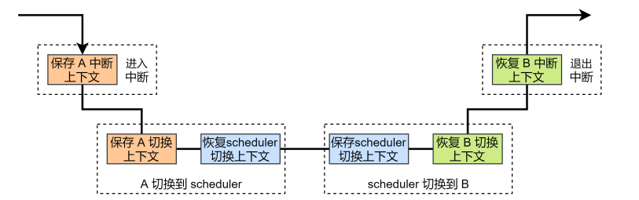

进程控制块 PCB中有上下文的指针, xv6 中 context 定义如下:

```
struct proc {
	...
	struct context *context; 	// swtch() here to run process 上下文指针
}

[proc.h]
// Saved registers for kernel context switches.
// Don't need to save all the segment registers (%cs, etc),
// because they are constant across kernel contexts.
// Don't need to save %eax, %ecx, %edx, because the
// x86 convention is that the caller has saved them.
// Contexts are stored at the bottom of the stack they
// describe; the stack pointer is the address of the context.
// The layout of the context matches the layout of the stack in swtch.S
// at the "Switch stacks" comment. Switch doesn't save eip explicitly,
// but it is on the stack and allocproc() manipulates it.
struct context {
  uint edi;
  uint esi;
  uint ebx;
  uint ebp;
  uint eip;
};
```

为什么内核态的上下文切换只需要保存这么几个寄存器?

进程切换就是切换函数的调用, 整个过程类似于 `A call scheduler`, `scheduler call B`. 根据 x86函数调用约定(参见 l-x86.pdf), eax, ecx, edx 为调用者保存寄存器, 不需要保存, 需要保存的是被调用者保存寄存器, 也就是上面那 5 个寄存器. 

### 陷入, 中断和驱动程序


## Introduction

在本 lab中, 你将实现基本的内核功能, 以使受保护的用户模式环境(即“进程”)运行. 你将增强 JOS内核, 设置数据结构来跟踪用户环境, 创建单个用户环境, 将程序映像加载到其中并启动它. 还将使 JOS内核能够处理用户环境发出的任何系统调用(system calls)和处理它引起的任何其他异常(exceptions handling).

注: 本 lab中环境 "environments"是进程 "process"的同义词. 两者都是指 "允许你运行程序的抽象“. 我们引入术语“环境”而不是传统的术语“进程”, 是为了强调 JOS环境和 UNIX进程提供不同的接口, 并且提供不同的语义.

### Getting Started

```
git checkout -b lab3 origin/lab3
git merge lab2
```

Lab3 包含了一些新的源文件, 应该浏览一下:

| `inc/`  | `env.h`       | Public definitions for user-mode environments, 用户环境(进程)公共定义 |
| ------- | ------------- | ------------------------------------------------------------ |
|         | `trap.h`      | Public definitions for trap handling, 陷入(用户态与内核态的切换)处理的公共定义 |
|         | `syscall.h`   | Public definitions for system calls from user environments to the kernel |
|         | `lib.h`       | Public definitions for the user-mode support library         |
| `kern/` | `env.h`       | Kernel-private definitions for user-mode environments        |
|         | `env.c`       | Kernel code implementing user-mode environments              |
|         | `trap.h`      | Kernel-private trap handling definitions                     |
|         | `trap.c`      | Trap handling code, 陷入处理的代码实现                       |
|         | `trapentry.S` | Assembly-language trap handler entry-points, 陷入处理程序入口点汇编语言 |
|         | `syscall.h`   | Kernel-private definitions for system call handling          |
|         | `syscall.c`   | System call implementation code                              |
| `lib/`  | `Makefrag`    | Makefile fragment to build user-mode library, `obj/lib/libjos.a` |
|         | `entry.S`     | Assembly-language entry-point for user environments          |
|         | `libmain.c`   | User-mode library setup code called from `entry.S`           |
|         | `syscall.c`   | User-mode system call stub functions                         |
|         | `console.c`   | User-mode implementations of `putchar` and `getchar`, providing console I/O |
|         | `exit.c`      | User-mode implementation of `exit`                           |
|         | `panic.c`     | User-mode implementation of `panic`                          |
| `user/` | `*`           | Various test programs to check kernel lab 3 code             |

此外, lab2 的一些源文件在 lab3中被修改了. 

你可能还想再看一看 [lab tools guide](https://pdos.csail.mit.edu/6.828/2017/labguide.html),它包含了调试与本 lab相关的用户代码的信息.

### Lab Requirements

略

### Inline Assembly

在本 lab中你可能会发现 GCC的内联汇编语言特性很有用, 不过也可以不使用它来完成实验. 至少你需要能够理解我们提供的源代码中已经存在的内联汇编语言片段(“asm”语句). 你可以在[reference materials](https://pdos.csail.mit.edu/6.828/2017/reference.html) 找到几个关于 GCC内联汇编语言的信息来源.

## Part A: User Environments and Exception Handling

新的文件 `inc/env.h` 包含 JOS中用户环境的基本定义. 内核使用 Env数据结构来跟踪每个用户环境. 在 lab中你最初将只创建一个环境, 但需要设计 JOS内核以支持多个环境. Lab4 将利用这个特性, 允许用户环境 fork其他环境.

正如你在 `kern/envirv.c`中看到的, 内核维护了三个与环境相关的主要全局变量:

```
struct Env *envs = NULL;		// All environments
struct Env *curenv = NULL;		// The current env
static struct Env *env_free_list;	// Free environment list
```

一旦 JOS启动并运行, `*env` 指针指向一个表示系统中所有环境(进程)的 Env结构数组. 在我们的设计中, JOS内核将支持同一时刻最多 NENV个活跃的环境, 尽管在任何给定时间通常会有更少的运行环境. (NENV 是在 `inc/env.h` 中 `#define` 的常量). 一旦分配了它，envs 数组将包含每个可能的 NENV 环境的 Env数据结构的单个实例.

JOS内核将所有未激活的 Env结构保存在 `env_free_list` 中, 这种设计允许轻松地分配和回收环境, 因为只需将它们添加到空闲列表中或从空闲列表中删除即可.

内核使用 `curenv` 符号在任何给定时间跟踪当前正在执行的环境. 在引导期间, 在第一个环境运行之前, `curenv` 最初被设置为 NULL.

### Environment State(进程状态)

`inc/env.h` 中的 `Env` 结构定义如下:

```
struct Env {
	struct Trapframe env_tf;	// Saved registers
	struct Env *env_link;		// Next free Env
	envid_t env_id;			// Unique environment identifier
	envid_t env_parent_id;		// env_id of this env's parent
	enum EnvType env_type;		// Indicates special system environments
	unsigned env_status;		// Status of the environment
	uint32_t env_runs;		// Number of times environment has run

	// Address space
	pde_t *env_pgdir;		// Kernel virtual address of page dir
};
```

**env_tf**: 在环境未运行时保存该环境的已保存寄存器值: 即当内核或其他环境正在运行时, 当从用户模式切换到内核模式时, 内核会保存这些信息, 以便稍后恢复中断的环境.

**env_link**: 指向 `env_free_list`上的下一个 Env. `env_free_list` 指向列表上的第一个空闲环境

**env_id**: 内核在这里存储一个值, 唯一标识当前使用 Env结构的环境 (即使用 `envs` 数组中的这个特定槽位). 在一个用户环境终止后, 内核可能会将相同的 Env结构重新分配到另一个环境中 —— 但是新环境的 `env_id` 将不同于旧环境, 即使新环境重用 `envs` 数组中的相同槽位

**env_parent_id**: 内核在这里存储创建该环境的环境的 `env_id`. 通过这种方式, 环境可以形成一个“家族树”, 这将有助于做出关于允许哪些环境对谁做什么事情的安全决策

**env_type**: 这是用来区分特殊环境的. 对于大多数环境, 它将是 `ENV_TYPE_USER`. 在后面的 lab中, 我们将为特殊的系统服务环境介绍更多的类型

**env_status**: 该变量包含以下值之一
		`ENV_FREE`: 指示 `Env` 结构处于非活动状态, 因此位于 `env_free_list` 上
		`ENV_RUNNABLE`: 指示 `Env` 结构表示正在等待运行的环境
		`ENV_RUNNING`: 指示 `Env` 结构表示当前正在运行的环境
		`ENV_NOT_RUNNABLE`: 指示 `Env` 结构表示当前活动的环境, 但它目前还没有准备好运行: 例如, 因为它正在等待来自另一个环境的进程间通信(IPC) --- 阻塞态
		`ENV_DYING`: 指示 `Env` 结构表示僵尸环境. 僵尸环境下次陷入内核时将被释放. 在 lab4之前我们不会使用这个标志

**env_pgdir**: 此变量保存此环境的页目录的内核虚拟地址

就像 Unix进程一样, JOS环境结合了“线程”和“地址空间”的概念. 线程主要由保存的寄存器( `env_tf`字段)定义, 地址空间由 `env_pgdir` 指向的页目录和页表定义. 要运行一个环境, 内核必须用保存的寄存器和适当的地址空间来设置CPU.

我们的结构`struct Env` 类似于 xv6中的结构`struct proc`. 这两个结构都在 `Trapframe` 结构中保存环境(即进程)的用户模式寄存器状态. 在 JOS中, 不同的环境不像 xv6中的进程那样有自己的内核堆栈, 内核中一次只能有一个活动的 JOS环境, 因此 JOS只需要一个内核堆栈.

### Allocating the Environments Array

在 lab2中你在 `mem_init()` 函数中分配了 `pages[]` 数组的地址空间, 用于记录内核中所有的页的信息. 现在你需要进一步去修改 `mem_init()` 函数, 来分配一个类似的 `Env` 结构体数组, 叫做 `envs`.

### Exercise 1

修改 `kern/pmap.c` 中的 `mem_init()` 来分配和映射 `envs` 数组. 这个数组由 `Env` 结构的 `NENV` 个实例组成, 就像分配 `pages` 数组的方式一样. 与 `pages` 数组一样.
`envs` 也应该映射到虚拟地址 `UENVS`处(在 `inc/memlayout.h` 中定义), 是用户模式只读的, 以便用户进程可以从该数组读取.

你应该运行代码并确保 `check_kern_pgdir()` 成功.

```
    // LAB 3: Your code here.
    envs = (struct Env*)boot_alloc(sizeof(struct Env*) * NENV);
    memset(envs, 0, sizeof(struct Env*) * NENV);

    // LAB 3: Your code here.
    // 在页表中建立映射关系, envs 的物理地址映射到虚拟地址 UENVS
    cprintf("mem_init() map envs to virtual address:UENVS, PTSIZE:%d, ROUNDUP:%d\n", PTSIZE, ROUNDUP((sizeof(struct Env)*NENV), PGSIZE));
    boot_map_region(kern_pgdir, UENVS, ROUNDUP((sizeof(struct Env)*NENV), PGSIZE), PADDR(envs), PTE_U);

运行结果(4194304 = 4096x1024, 98304= 4096x96):
mem_init() map envs to virtual address:UENVS, PTSIZE:4194304, ROUNDUP:98304
check_kern_pgdir() succeeded!

```

### Creating and Running Environments

你将需要编写运行用户环境所需的 `kern/env.c`代码, 因为我们还没有文件系统, 所以我们将设置内核来加载嵌入在内核中的静态二进制映像. JOS将此二进制文件作为 ELF可执行映像嵌入内核中.

Lab3 `GNUmakefile` 在 `obj/user/`目录中生成了许多二进制映像. 在 `kern/Makefrag`文件中, 你会发现一些魔法将这些二进制文件直接“链接”到内核可执行文件中, 就好像它们是 .o文件一样. 链接器命令行上的 `-b binary`选项会将这些文件作为“原始”未解释的二进制文件链接, 而不是作为编译器生成的常规 .o文件链接. (就链接器而言, 这些文件根本不必是 ELF文件——它们可以是任何格式, 例如文本文件或图片) 如果在构建内核后查看`obj/kern/kernel.sym`, 你会注意到链接器“神奇地”产生了许多有趣的符号, 这些符号具有晦涩的名字, 如_binary_obj_user_hello_start, _binary_obj_user_hello_end 和 _binary_obj_user_hello_size. 链接器通过修改二进制文件的文件名来生成这些符号名称; 这些符号为常规内核代码提供了引用嵌入式二进制文件的方法.

在 `kern/init.c` `i386_init()`中, 你将看到在某个环境中运行这些二进制映像之一的代码. 但是建立用户环境的关键功能还不完备, 你需要填写它们.

### Exercise 2

完成 `env.c` 文件中的下面函数.

```
在编写这些函数时, 你可能会发现新的 cprintf %e很有用——它打印与错误代码对应的描述. 例如,
	r = -E_NO_MEM;
	panic("env_alloc: %e", r);
will panic with the message "env_alloc: out of memory".
```

- env_init()

  初始化 envs数组中的所有 Env结构,并将它们添加到 env_free_list中. 还调用 env_init_percpu, 它将分段硬件配置为特权级别 0(内核)和特权级别 3(用户)的独立段.

  ```
  void env_init(void)
  {
  	// Set up envs array
  	// LAB 3: Your code here.
  	for(int i = NENV-1; i >= 0; i--)
  	{
  		envs[i].env_id = 0;
  		envs[i].env_status = ENV_FREE;
  		envs[i].env_link = env_free_list;
  		env_free_list = &envs[i];
  	}
  	// Per-CPU part of the initialization
  	env_init_percpu();
  	cprintf("env_init() done!\n");	
  }
  ```

- env_setup_vm()

  为新环境分配一个页目录(每个环境/进程都有一个自己的 page directory), 并初始化新环境地址空间的内核部分.

  只设置页目录表中和操作系统内核相关的页目录项, 用户环境的页目录项不需要设置, 因为所有用户环境的页目录表中和操作系统相关的页目录项都是一样的(除了虚拟地址 UVPT, 这个也会单独进行设置)

  ```
  static int
  env_setup_vm(struct Env *e)
  {
  	int i;
  	struct PageInfo *p = NULL;
  
  	// Allocate a page for the page directory
  	if (!(p = page_alloc(ALLOC_ZERO)))
  		return -E_NO_MEM;
  
  	// Now, set e->env_pgdir and initialize the page directory.
  	//
  	// Hint:
  	//    - The VA space of all envs is identical above UTOP
  	//	(except at UVPT, which we've set below).
  	//	See inc/memlayout.h for permissions and layout.
  	//	Can you use kern_pgdir as a template?  Hint: Yes.
  	//	(Make sure you got the permissions right in Lab 2.)
  	//    - The initial VA below UTOP is empty.
  	//    - You do not need to make any more calls to page_alloc.
  	//    - Note: In general, pp_ref is not maintained for
  	//	physical pages mapped only above UTOP, but env_pgdir
  	//	is an exception -- you need to increment env_pgdir's
  	//	pp_ref for env_free to work correctly.
  	//    - The functions in kern/pmap.h are handy.
  
  	// LAB 3: Your code here.
      // 自增引用计数
  	p->pp_ref++;
      // 页目录的虚拟地址
  	e->env_pgdir = (pde_t*)page2kva(p);
  	cprintf("e->env_pgdir:0x%08x\n",e->env_pgdir);
  
      // 这部分的页目录值和 kern_pgdir是一致的
      memcpy(e->env_pgdir, kern_pgdir, PGSIZE);
   
      //Map the directory below UTOP
      /*
      for(i = 0; i < PDX(UTOP); i++) 
      {
          e->env_pgdir[i] = 0;        
      }
      */
      
      //Map the directory above UTOP
      /*
      for(i = PDX(UTOP); i < NPDENTRIES; i++) 
      {
          e->env_pgdir[i] = kern_pgdir[i];
      }
      */
  	
  	// UVPT maps the env's own page table read-only.
  	// Permissions: kernel R, user R
  	e->env_pgdir[PDX(UVPT)] = PADDR(e->env_pgdir) | PTE_P | PTE_U;
  	cprintf("env_setup_vm() done!\n");	
  
  	return 0;
  }
  ```
  
- region_alloc()

  为环境分配和映射物理内存. 分配即分配物理页, 使用的是 page_alloc(); 映射即安装到页目录和页表中.

  注意要先把起始地址和终止地址进行页对齐, 对其之后我们就可以以页为单位, 为其一页一页的分配内存, 并且修改页目录表和页表

  ```
  static void
  region_alloc(struct Env *e, void *va, size_t len)
  {
  	// LAB 3: Your code here.
  	void *start = (void *)ROUNDDOWN((uint32_t)va, PGSIZE);
  	void *end = (void *)ROUNDUP((uint32_t)va+len, PGSIZE);
  
      struct PageInfo *p = NULL;
      void *i = NULL;
      int ret = 0;
      for(i = start; i < end; i += PGSIZE)
      {
      	p = page_alloc(0);
          if(p == NULL)
          {
  			panic("region_alloc(), allocation failed!!!");       
          }
   		// 修改页目录表和页表
          ret = page_insert(e->env_pgdir, p, i, PTE_W|PTE_U);
          if(ret != 0)
          {
              panic("region_alloc(), page_insert failed!!!");
          }
  	}
       
  	// (But only if you need it for load_icode.)
  	//
  	// Hint: It is easier to use region_alloc if the caller can pass
  	//   'va' and 'len' values that are not page-aligned.
  	//   You should round va down, and round (va + len) up.
  	//   (Watch out for corner-cases!)
  }
  ```

- load_icode()

  解析 ELF二进制映像,就像 bootloader 那样, 并将其内容加载到新环境的用户地址空间中.

  参考 boot/main.c中 bootloader 加载 kernel image的过程. 区别在于, bootloader是从 disk中加载 kernel, 而load_icode()要加载的二进制文件已经在 memory中了.

  有以下几点注意:

  1. 只有 p_type=ELF_PROG_LOAD的段才需要被被加载. 在加载 program segment时, 是 load到 user environment, 因此需要在 load之前使用 lcr3指令切换到当前 environment 的 page directory
  2. ph->p_va 是需要被加载到的虚地址
  3. ph->p_memsz 是整个在内存中占的大小, 也是我们申请空间时的大小
  4. 从 binary + ph->p_offset 开始的 ph->p_filesz字节需要被复制到 ph->p_va处
  5. 需要考虑一些 ELF头的入口点处理, 将该环境的指令寄存器 eip的值设置为该 elf格式文件的 e_entry的值
  6. 在指定完 program的 entry point之后, 需要将 page directory切换回 kernel directory

  ```
  static void
  load_icode(struct Env *e, uint8_t *binary)
  {
  	// Hints:
  	//  Load each program segment into virtual memory
  	//  at the address specified in the ELF segment header.
  	//  You should only load segments with ph->p_type == ELF_PROG_LOAD.
  	//  Each segment's virtual address can be found in ph->p_va
  	//  and its size in memory can be found in ph->p_memsz.
  	//  The ph->p_filesz bytes from the ELF binary, starting at
  	//  'binary + ph->p_offset', should be copied to virtual address
  	//  ph->p_va.  Any remaining memory bytes should be cleared to zero.
  	//  (The ELF header should have ph->p_filesz <= ph->p_memsz.)
  	//  Use functions from the previous lab to allocate and map pages.
  	//
  	//  All page protection bits should be user read/write for now.
  	//  ELF segments are not necessarily page-aligned, but you can
  	//  assume for this function that no two segments will touch
  	//  the same virtual page.
  	//
  	//  You may find a function like region_alloc useful.
  	//
  	//  Loading the segments is much simpler if you can move data
  	//  directly into the virtual addresses stored in the ELF binary.
  	//  So which page directory should be in force during
  	//  this function?
  	//
  	//  You must also do something with the program's entry point,
  	//  to make sure that the environment starts executing there.
  	//  What?  (See env_run() and env_pop_tf() below.)
  
  	// LAB 3: Your code here.
  
  	struct Elf *elf = (struct Elf *)binary;
  	if (elf->e_magic != ELF_MAGIC)
  	{
  		panic("invalid ELF file!");
  	}
  	
  	struct Proghdr *ph,*end_ph;
  	ph = (struct Proghdr *)((uint8_t *)elf + elf->e_phoff);
  	end_ph = ph + elf->e_phnum;
  	cprintf("ph:0x%08x, end_ph:0x%08x\n", ph, end_ph);
  	
  	lcr3(PADDR(e->env_pgdir));
  	
  	for (; ph < end_ph; ph++)
  	{
  		if(ph->p_type==ELF_PROG_LOAD){
  			if((ph->p_memsz - ph->p_filesz) < 0)
  			{
  				panic("p_memsz < p_filesz");
  			}
  			region_alloc(e, (void*)ph->p_va, ph->p_memsz);
  			memcpy((void*)ph->p_va, (void*)binary + ph->p_offset, ph->p_filesz);
  			memset((void*)(ph->p_va + ph->p_filesz), 0, ph->p_memsz - ph->p_filesz);
  		}
  	}
  	e->env_tf.tf_eip = elf->e_entry;
  	lcr3(PADDR(kern_pgdir));
  	
  	// Now map one page for the program's initial stack
  	// at virtual address USTACKTOP - PGSIZE.
  	// LAB 3: Your code here.
  	region_alloc(e, (void*)(USTACKTOP - PGSIZE), PGSIZE);
  	
  	cprintf("load_icode() done!\n");	
  }
  ```

- env_create()

  使用 env_alloc分配一个环境, 并调用 load_icode将 ELF二进制文件加载到其中

  ```
  void
  env_create(uint8_t *binary, enum EnvType type)
  {
  	struct Env *new_env;
  	int ret = env_alloc(&new_env,0);
  	if(ret != 0)
  	{
  		panic("env_create() env_alloc fail: %e",ret);
  	}
  	
  	new_env->env_type = type;
  	cprintf("env_create() done before load_icode()\n");
  
  	load_icode(new_env, binary);
  }
  ```

- env_run()

  启动一个给定的环境并以用户模式运行(上下文切换, context switch).

  ```
  void
  env_run(struct Env *e)
  {
  	// Step 1: If this is a context switch (a new environment is running):
  	//	   1. Set the current environment (if any) back to
  	//	      ENV_RUNNABLE if it is ENV_RUNNING (think about
  	//	      what other states it can be in),
  	//	   2. Set 'curenv' to the new environment,
  	//	   3. Set its status to ENV_RUNNING,
  	//	   4. Update its 'env_runs' counter,
  	//	   5. Use lcr3() to switch to its address space.
  	// Step 2: Use env_pop_tf() to restore the environment's
  	//	   registers and drop into user mode in the
  	//	   environment.
  
  	// Hint: This function loads the new environment's state from
  	//	e->env_tf.  Go back through the code you wrote above
  	//	and make sure you have set the relevant parts of
  	//	e->env_tf to sensible values.
  
  	// LAB 3: Your code here.
  	if((curenv != NULL) && curenv->env_status == ENV_RUNNING)
  	{
  		curenv->env_type = ENV_RUNNABLE;
  	}
  	curenv = e;
  	e->env_status = ENV_RUNNING;
  	e->env_runs++;
  	lcr3(PADDR(e->env_pgdir));
  	
      //保存环境
  	env_pop_tf(&e->env_tf);
  }
  ```

下面是在调用用户代码之前的代码调用图, 确保你理解每一步的目的.

- `start` (`kern/entry.S`)
- `i386_init` (`kern/init.c`)
  - `cons_init`
  - `mem_init`
  - `env_init`
  - `trap_init`(目前还没实现)
  - `env_create`
  - `env_run`
    - `env_pop_tf`

完成之后, 编译内核并在 QEMU下运行它. 如果一切顺利, 系统会进入用户空间并执行 hello二进制文件, 直到它使用int 指令进行系统调用. 这时就会出现问题, 因为 JOS还没有设置硬件来允许从用户空间到内核空间的任何形式的转换. 当 CPU发现它没有被设置来处理这个系统调用中断时, 会生成一个一般保护异常, 发现它不能处理, 生成一个双重故障异常, 发现它也不能处理, 最后放弃所谓的 "triple fault". 通常, CPU会复位, 系统会重启. 

我们将很快解决这个问题, 但现在我们可以使用调试器检查是否进入用户模式. 使用 `make qemu-gdb` 并在`env_pop_tf` 处设置断点, 这应该是实际进入用户模式之前命中的最后一个函数. 

使用 `si` 单步运行, 处理器应该在 `iret`指令之后进入用户模式. 然后在用户环境的可执行文件中看到第一条指令, 即 `lib/entry.S` 中 `start` `label` 处的 `cmpl`指令. 

现在使用 `b *0x…`在 `hello`中的 `sys_cputs()`中设置 `int $0x30`处的断点(参见 `obj/user/hello.asm` 找到用户空间地址). 这个 `int`是一个系统调用, 将一个字符显示到控制台. 如果你不能执行到 `int`, 说明你的地址空间设置或程序代码有问题. 

完成代码后, 运行 make, make qemu, 出现了  "triple fault"

```
xxx:~/workspace/6.828_2018/lab$ make qemu
...
6828 decimal is 15254 octal!
edata_2017 end addr: 0xf018c014, bss end_2017 addr: 0xf018eff4
edata end addr: 0xf018e0e0, bss end addr: 0xf018efe0
Physical memory: 131072K available, base = 640K, extended = 130432K
nextfree: 0xf018f000, bss end addr: 0xf018efe0
nextfree: 0xf0190000
mem_init() kern_pgdir: 0xf018f000, kern_pgdir addr: 0xf018efec
mem_init() kern_pgdir[0]: 0, kern_pgdir[1]: 0, ...kern_pgdir[PGSIZE-1]: 0
mem_init() UVPT: 0xef400000, PDX(UVPT): 0x3bd, kern_pgdir[PDX(UVPT)] physical addr: 0x0018f000
nextfree: 0xf01d0000
nextfree: 0xf01d1000
check_page_free_list() succeeded!
check_page_alloc() succeeded!
check_page() succeeded!
mem_init() map envs to virtual address:UENVS, PTSIZE:4194304, ROUNDUP:98304
check_kern_pgdir() succeeded!
check_page_free_list() succeeded!
check_page_installed_pgdir() succeeded!
env_init() done!
e->env_pgdir:0xf03bc000
[00000000] new env 00001000
env_create() done before load_icode()
ph:0xf011b364, end_ph:0xf011b3e4
load_icVNC server running on `127.0.0.1:5900'
6828 decimal is 15254 octal!
edata_2017 end addr: 0xf018c014, bss end_2017 addr: 0xf018eff4
edata end addr: 0xf018e0e0, bss end addr: 0xf018efe0
Physical memory: 131072K available, base = 640K, extended = 130432K
nextfree: 0xf018f000, bss end addr: 0xf018efe0
nextfree: 0xf0190000
mem_init() kern_pgdir: 0xf018f000, kern_pgdir addr: 0xf018efec
mem_init() kern_pgdir[0]: 0, kern_pgdir[1]: 0, ...kern_pgdir[PGSIZE-1]: 0
mem_init() UVPT: 0xef400000, PDX(UVPT): 0x3bd, kern_pgdir[PDX(UVPT)] physical addr: 0x0018f000
nextfree: 0xf01d0000
nextfree: 0xf01d1000
check_page_free_list() succeeded!
check_page_alloc() succeeded!
check_page() succeeded!
mem_init() map envs to virtual address:UENVS, PTSIZE:4194304, ROUNDUP:98304
check_kern_pgdir() succeeded!
check_page_free_list() succeeded!
check_page_installed_pgdir() succeeded!
env_init() done!
e->env_pgdir:0xf03bc000
[00000000] new env 00001000
env_create() done before load_icode()
ph:0xf011b364, end_ph:0xf011b3e4
load_icode() done!
env_run() start...
EAX=00000000 EBX=00000000 ECX=0000000d EDX=eebfde88
ESI=00000000 EDI=00000000 EBP=eebfde60 ESP=eebfde54
EIP=00800b44 EFL=00000092 [--S-A--] CPL=3 II=0 A20=1 SMM=0 HLT=0
ES =0023 00000000 ffffffff 00cff300 DPL=3 DS   [-WA]
CS =001b 00000000 ffffffff 00cffa00 DPL=3 CS32 [-R-]
SS =0023 00000000 ffffffff 00cff300 DPL=3 DS   [-WA]
DS =0023 00000000 ffffffff 00cff300 DPL=3 DS   [-WA]
FS =0023 00000000 ffffffff 00cff300 DPL=3 DS   [-WA]
GS =0023 00000000 ffffffff 00cff300 DPL=3 DS   [-WA]
LDT=0000 00000000 00000000 00008200 DPL=0 LDT
TR =0028 f018eb60 00000067 00408900 DPL=0 TSS32-avl
GDT=     f011b300 0000002f
IDT=     f018e340 000007ff
CR0=80050033 CR2=00000000 CR3=003bc000 CR4=00000000
DR0=00000000 DR1=00000000 DR2=00000000 DR3=00000000 
DR6=ffff0ff0 DR7=00000400
EFER=0000000000000000
Triple fault.  Halting for inspection via QEMU monitor.
```

调试:

1. 在一个 terminal 运行 make qemu-gdb, 另一个 terminal 运行 make gdb

2. 在`env_pop_tf`设置断点, 这是进入用户模式之前的最后一个函数, 运行到此函数

   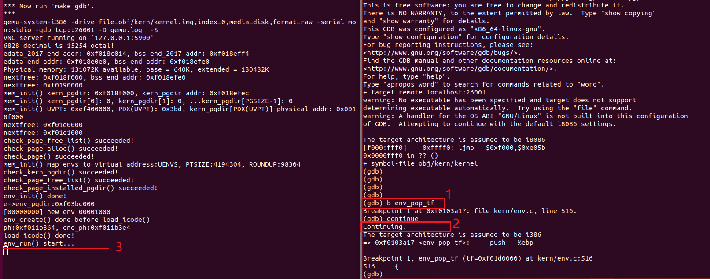

3.  `si` 单步运行, 在 `iret`指令之后进入用户模式. 在用户环境的可执行文件中看到第一条指令, 即 `lib/entry.S` 中 `start` `label` 处的 `cmpl`指令. 

   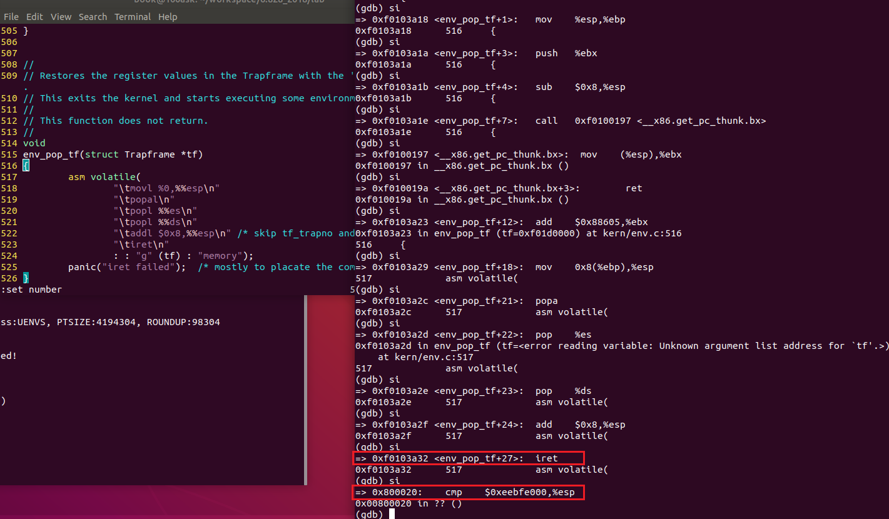

4. 查看 obj/user/hello.asm, 在 sys_cputs int $0x30 设断点, int指令是一个系统调用.

   由于系统调用还没有实现, 这里继续往下执行就会触发 triple fault(下图中的 3)

   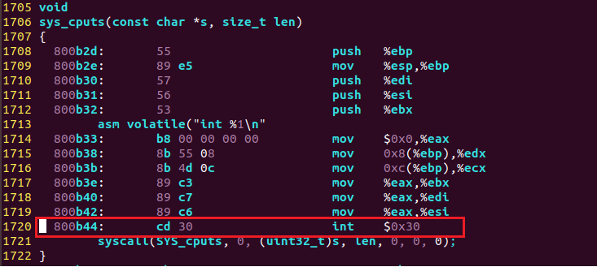

   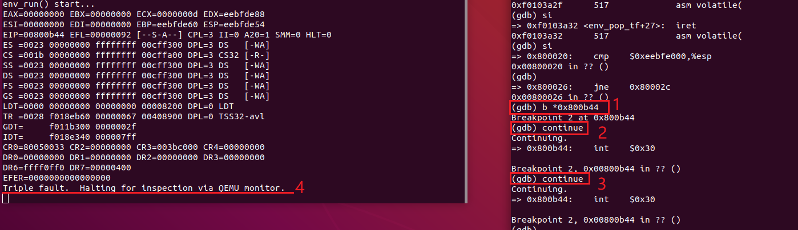

### env_pop_tf

env_pop_tf() 在 env_run() 中最后调用, 是进入用户模式之前的最后一个函数.
其实就是将栈指针 esp指向该环境(进程)的 env_tf, 将 env_tf 中存储的寄存器的值弹出到对应寄存器中, 然后通过 iret 指令弹出栈中的元素分别到 EIP, CS, EFLAGS 对应寄存器, 并跳转到 `CS:EIP` 存储的地址执行.
当使用 iret指令返回到一个不同特权级运行时, 还会弹出堆栈段选择子及堆栈指针分别到 SS与 SP寄存器, 这样相关寄存器都从内核设置成了用户程序对应的值, EIP存储的是程序入口地址.

```
void
env_pop_tf(struct Trapframe *tf)
{
	asm volatile(
		"\tmovl %0,%%esp\n"	//	esp指向tf结构，弹出时会弹到tf里
		"\tpopal\n"			//  弹出tf_regs中值到各通用寄存器
		"\tpopl %%es\n"		//  弹出tf_es 到 es寄存器
		"\tpopl %%ds\n"		//  弹出tf_ds 到 ds寄存器
		"\taddl $0x8,%%esp\n"   //  跳过tf_trapno和tf_err
		"\tiret\n"			//  中断返回 弹出tf_eip,tf_cs,tf_eflags,tf_esp,tf_ss到相应寄存器
		: : "g" (tf) : "memory");
	panic("iret failed");  /* mostly to placate the compiler */
}

struct PushRegs {
        /* registers as pushed by pusha */
        uint32_t reg_edi;
        uint32_t reg_esi;
        uint32_t reg_ebp;
        uint32_t reg_oesp;              /* Useless */
        uint32_t reg_ebx;
        uint32_t reg_edx;
        uint32_t reg_ecx;
        uint32_t reg_eax;
} __attribute__((packed));

struct Trapframe {
        struct PushRegs tf_regs;
        uint16_t tf_es;
        uint16_t tf_padding1;
        uint16_t tf_ds;
        uint16_t tf_padding2;
        uint32_t tf_trapno;
        /* below here defined by x86 hardware */
        uint32_t tf_err;
        uintptr_t tf_eip;
        uint16_t tf_cs;
        uint16_t tf_padding3;
        uint32_t tf_eflags;
        /* below here only when crossing rings, such as from user to kernel */
        uintptr_t tf_esp;
        uint16_t tf_ss;
        uint16_t tf_padding4;
} __attribute__((packed));
                              
```

#### Trapframe

Trapframe 存储的是当前环境(进程)的寄存器的值, `env_pop_tf`中便是将 trapframe的起始地址赋值给 esp, 然后用的这个顺序将栈中元素弹出到对应寄存器中的. 其中 popal 是弹出 tf_regs到所有的通用寄存器中, 接着弹出值到 es, ds寄存器, 接着跳过 trapno 和 errcode, 调用 iret 分别将栈中存储数据弹出到 EIP, CS, EFLAGS寄存器中.

### User <-> Kernel

用户栈和内核栈的切换, 这个过程 ss, sp, eflags, cs, eip 在中断发生时由处理器压入, 通用寄存器部分则需要自己实现.

 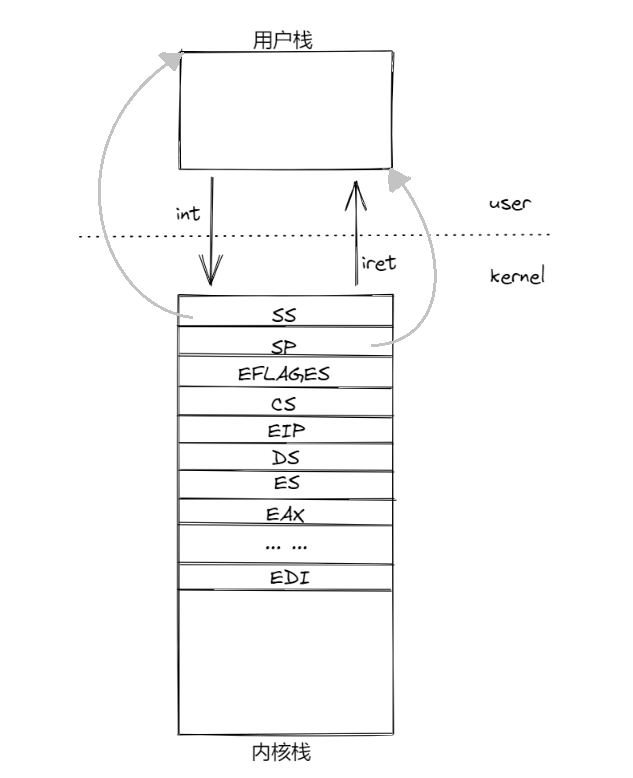


### Handling Interrupts and Exceptions

到目前为止, 当程序运行到第一个系统调用 int $0x30 时, 就会进入错误的状态, 因为现在系统无法从用户态切换到内核态. 所以你需要实现一个基本的异常/系统调用处理机制, 使得内核可以从用户态转换为内核态. 你应该先熟悉一下 X86的异常中断机制.

### Exercise 3

阅读 [80386 Programmer's Manual](https://pdos.csail.mit.edu/6.828/2018/readings/i386/toc.htm) 的 [Chapter 9, Exceptions and Interrupts](https://pdos.csail.mit.edu/6.828/2018/readings/i386/c09.htm) 或者  [IA-32 Developer's Manual](https://pdos.csail.mit.edu/6.828/2018/readings/ia32/IA32-3A.pdf) Chapter5

在本 Lab中,我们通常遵循英特尔关于中断、异常等的术语. 然而诸如 exception, trap, interrupt, fault and abort(异常、陷入、中断、故障和中止) 等术语在架构或操作系统中没有标准含义, 并且在使用时通常不考虑它们在特定架构(如x86)上的细微区别. 当你在 Lab之外看到这些术语时, 含义可能会略有不同.

### Basics of Protected Control Transfer

异常(Exception)和中断(Interrupts)都是“受到保护的控制转移”, 都会使处理器从用户态转移为内核态. 在 Intel的术语中, 一个中断指的是由外部异步事件引起的处理器控制权转移, 比如外部 IO设备发送来的中断信号. 一个异常则是由于当前正在运行的指令所带来的同步的处理器控制权的转移, 比如除零溢出异常, 无效的内存访问.

根据异常被报告的方式以及导致异常的指令是否能重新执行, 异常还可以细分为故障(Fault), 陷入(Trap)和中止(Abort).

* Fault 是通常可以被纠正的异常, 纠正后可以继续运行. 出现 Fault时处理器会把机器状态恢复到产生 Fault指令之前的状态, 此时异常处理程序返回地址会指向产生 Fault的指令, 而不是下一条指令, 产生 Fault的指令在中断处理程序返回后会重新执行, 如 Page Fault.
* Trap 处理程序返回后执行的指令是引起陷阱指令的后一条指令
* Abort 则不允许异常指令继续执行

为了能够确保这些控制的转移能够真正被保护起来, 处理器的中断/异常机制通常被设计为: 用户态的代码无权选择内核中的代码从哪里开始执行. 处理器可以确保只有在某些条件下, 才能进入内核态. 在 X86上有两种机制配合工作来提供这种保护:

1. 中断向量表:

   处理器保证中断和异常只能够引起内核进入到一些特定的, 被事先定义好的程序入口点, 而不是由触发中断的程序来决定中断程序入口点.

   X86允许多达256个不同的中断和异常, 每一个都配备一个独一无二的中断向量. 一个向量指的就是0到255中的一个数, 一个中断向量的值是根据中断源来决定的: 不同设备, 错误条件, 以及对内核的请求都会产生出不同的中断和中断向量的组合. CPU将使用这个向量作为这个中断在中断向量表中的索引, 这个表由内核设置的, 放在内核空间中, 和 GDT很像, 通过这个表中的任意一个表项, 处理器可以知道:

   * 需要加载到 EIP寄存器中的值, 这个值指向了处理这个中断的中断处理程序的位置
   * 需要加载到 CS寄存器中的值, 里面还包含了这个中断处理程序的运行特权级(程序是在用户态还是内核态下运行)

2. 任务状态段

   处理器还需要一个地方来存放, 当异常/中断发生时处理器的状态, 比如 EIP和 CS寄存器的值. 这样的话中断处理程序一会可以重新返回到原来的程序中, 这段内存自然也要保护起来, 不能被用户态的程序所篡改.

   正因为如此, 当一个 x86处理器要处理一个中断/异常并且使运行特权级从用户态转为内核态时, 它也会把它的堆栈切换到内核空间中. 一个叫做 “任务状态段(TSS)”的数据结构将会详细记录这个堆栈所在的段的段描述符和地址. 处理器会把 SS, ESP, EFLAGS, CS, EIP以及一个可选错误码等等这些值压入到这个堆栈上, 然后加载中断处理程序的 CS, EIP值, 并且设置 ESP, SS寄存器指向新的堆栈.

   尽管 TSS非常大, 并且还有很多其他的功能, 但 JOS仅仅使用它来定义处理器从用户态转向内核态所采用的内核堆栈, 由于 JOS中的内核态指的就是特权级 0, 所以处理器用 TSS中的 ESP0, SS0字段来指明这个内核堆栈的位置, 大小.

### Types of Exceptions and Interrupts

由 x86处理器内部产生的所有同步异常都使用 0到 31之间的中断向量, 映射到 IDT条目的 0-31. 比如页错误(page fault) 对应的异常向量值 14. 大于 31的中断向量仅用于软件中断, 它可以由`int`指令产生, 或者外部设备在需要注意时引起的异步硬件中断.

 在这一章, 我们将扩展 JOS的功能, 使它能够处理 0~31的内部异常. 在下一节会让 JOS能够处理软件中断向量 48(0x30),  JOS(相当随意地)将其用作系统调用中断向量. 在 Lab4中会继续扩展 JOS使它能够处理外部硬件中断, 比如时钟中断.

### An Example

让我们看一个实例, 假设处理器正在用户状态下运行代码, 但是遇到了一个除法指令, 并且除数为 0.

1. 处理器会首先切换切换到由 TSS的 `SS0` 和 `ESP0`字段所指定的内核堆栈区, 这两个字段分别存放着 GD_KD和 KSTACKTOP的值.

2. 处理器把异常参数压入到内核堆栈中, 起始于地址 KSTACKTOP：

   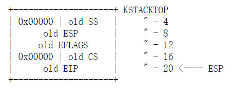

3. 因为我们要处理的是除零异常, 对应 x86的中断向量是 0, 处理器会读取 IDT表中的表项 0, 并且把 `CS:EIP` 指向由条目描述的处理程序函数.
4. 处理函数获取控制权并处理异常, 例如终止用户环境(进程).

对于某些特定类型的 x86异常, 除了上面图中要保存的五个字(word)之外, 处理器将另一个包含错误码的字压入堆栈. 比如 page fault 异常是一个重要的例子, 请参考 80386手册, 以确定处理器为哪个异常编号压入错误代码, 以及在这种情况下错误代码的含义. 当处理器压入错误代码时, 从用户模式进入异常处理程序时, 堆栈看起来如下所示:

​		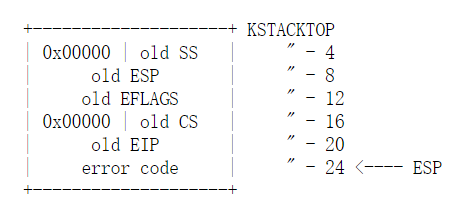

### Nested Exceptions and Interrupts

嵌套异常和中断.

来自用户态和内核态下的异常或中断处理器都可以处理, 但是只有从用户态进入到内核态时, x86处理器从才会自动地切换堆栈, 然后将旧的寄存器状态压入到堆栈上, 并通过 IDT调用适当的异常处理程序. 如果处理器在中断或异常发生时已经处于内核模式 (CS寄存器的低 2位已经为零)，那么 CPU只是在相同的内核堆栈上压入更多的值. 通过这种方式, 内核可以优雅地处理由内核内部代码引起的嵌套异常. 这个功能是实现保护的重要工具, 我们将在后面关于系统调用的部分中看到.

如果处理器已经处于内核模式并且遇到嵌套中断, 因为它不需要切换堆栈, 所以它不需要保存旧的 `SS` 和 `ESP` 寄存器, 对于不压入错误代码的异常类型, 在异常处理程序入口时的内核堆栈看起来如下:

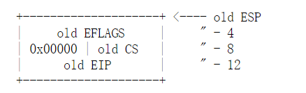

对于压入错误代码的异常类型, 处理器将像之前一样, 在旧 `EIP` 之后立即压入错误代码.

对于处理器的嵌套异常功能, 有一个重要的警告. 如果处理器在已经处于内核模式时发生异常, 并且由于缺乏堆栈空间等原因无法将其旧状态推入内核堆栈, 则处理器无法恢复, 只能简单地重置, 内核的设计应该使这种情况不会发生.

### Setting Up the IDT

你应该拥有了设置 IDT和处理 JOS异常所需的基本信息. 现在你将设置 IDT来处理中断向量 0-31(处理器异常). 我们将在稍后的实验中处理系统调用中断, 并在稍后的实验中添加中断 32-47(device IRQs).

头文件 `inc/trap.h` 和 `kern/trap.h` 包含与中断和异常相关的重要定义, 需要熟悉这些定义. `kern/trap.h` 包含对内核严格私有的定义, 而 `inc/trap.h` 包含对用户级程序和库可能有用的定义.

注意: 0-31范围内的一些异常被 Intel定义为保留, 因为它们永远不会由处理器生成, 所以如何处理它们并不重要, 做你认为最干净的事.

应该实现的总体控制流程如下所示:

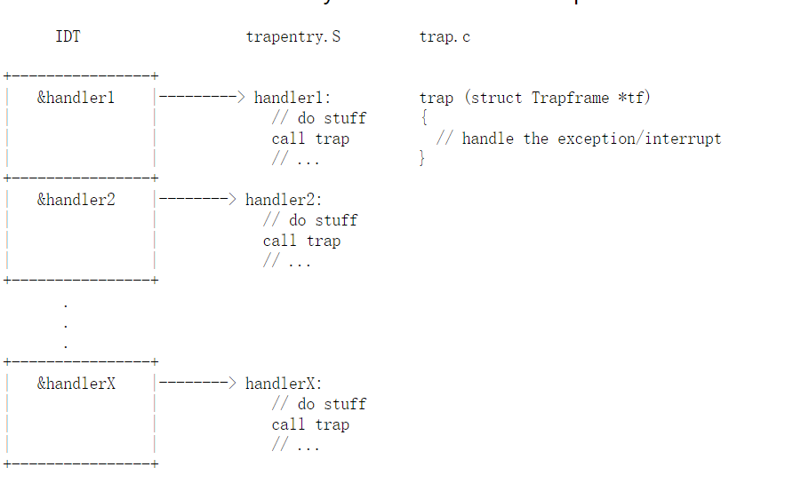

在 `trapentry.S`中每个异常或中断都应该有自己的处理程序, `trap_init()`应该用这些处理程序的地址初始化 IDT. 每个处理程序都应该在堆栈上构建一个 `struct  Trapframe` (参见 `inc/trap.h`), 并使用指向 `Trapframe` 的指针调用 `trap()` (在 trap.c 中), 然后 `trap()` 处理异常/中断或发送到特定的处理函数.

### Exercise 4

编辑 `trapentry.S` 和 `trap.c` 文件, 并且实现上面所说的功能. `trapentry.S` 中的宏定义 `TRAPHANDLER` 和 `TRAPHANDLER_NOEC` 以及 `inc/trap.h`中的 T_* 会对你有帮助. 你将会在 `trapentry.S` 文件中为在 `inc/trap.h` 中的每一个 `trap` 添加一个入口, 并且必须提供 `TRAPHANDLER` 宏所引用的 _alltraps. 还需要修改 `trap_init()` 函数来初始化 idt 表, 使表中每一项指向定义在 `trapentry.S` 中的入口指针, `SETGATE` 宏定义在这里用得上.

你所实现的 _alltraps 应该:

1. 把值压入堆栈使堆栈看起来像一个 struct Trapframe

2. 加载 GD_KD 的值到 %ds, %es寄存器中

3. 把 %esp 的值压入, 并且传递一个指向 Trapframe 的指针作为 trap() 参数

4. 调用 trap

考虑使用 `pushal` 指令, 它会很好的和 struct Trapframe 的布局配合好.

在进行任何系统调用之前, 使用用户目录中导致异常的一些测试程序测试 trap 处理代码, 比如 user/divzero. 你应该使得  **make grade** 在 divzero, softint, badsegment 测试中通过.

首先看 `trapentry.S` , 有两个宏定义 `TRAPHANDLER` , `TRAPHANDLER_NOEC` 

根据注释, `TRAPHANDLER`定义了一个全局可见的函数来处理 trap, 将 trap number 压入堆栈, 然后跳转到 _alltraps.  

对于 CPU自动压入 error code 的使用 `TRAPHANDLER`; 对于不压入error code 的使用`TRAPHANDLER_NOEC`

```
#define TRAPHANDLER(name, num)						\
	.globl name;		/* define global symbol for 'name' */	\
	.type name, @function;	/* symbol type is function */		\
	.align 2;		/* align function definition */		\
	name:			/* function starts here */		\
	pushl $(num);							\
	jmp _alltraps

#define TRAPHANDLER_NOEC(name, num)					\
	.globl name;							\
	.type name, @function;						\
	.align 2;							\
	name:								\
	pushl $0;							\
	pushl $(num);							\
	jmp _alltraps
	
==================================================
.globl name; 指定 name 是个全局符号
.type name, @function; 指定 name 是个函数
pushl $0;	压入 0占位 error code
pushl $(num); 压入 trap number
```

 `trapentry.S` 中的第一部分代码实现如下:

```
/*
 * Lab 3: Your code here for generating entry points for the different traps.
 */

// divide_handler 是处理函数, T_DIVIDE是 inc/trap.h中定义的中断向量号(trap number)
TRAPHANDLER_NOEC(divide_handler, T_DIVIDE)		
TRAPHANDLER_NOEC(debug_handler, T_DEBUG)
TRAPHANDLER_NOEC(nmi_handler, T_NMI)
TRAPHANDLER_NOEC(brkpt_handler, T_BRKPT)
TRAPHANDLER_NOEC(oflow_handler, T_OFLOW)
TRAPHANDLER_NOEC(bound_handler, T_BOUND)

TRAPHANDLER_NOEC(illop_handler, T_ILLOP)
TRAPHANDLER(device_handler, T_DEVICE)
TRAPHANDLER_NOEC(dblflt_handler, T_DBLFLT)
TRAPHANDLER(tss_handler, T_TSS)

TRAPHANDLER(segnp_handler, T_SEGNP)
TRAPHANDLER(stack_handler, T_STACK)
TRAPHANDLER(gpflt_handler, T_GPFLT)
TRAPHANDLER(pgflt_handler, T_PGFLT)

TRAPHANDLER_NOEC(fperr_handler, T_FPERR)
TRAPHANDLER(align_handler, T_ALIGN)
TRAPHANDLER_NOEC(mchk_handler, T_MCHK)
TRAPHANDLER_NOEC(simderr_handler, T_SIMDERR)

TRAPHANDLER_NOEC(syscall_handler, T_SYSCALL)
```

 `trapentry.S` 中的第二部分代码 _alltraps.

```
_alltraps:
	pushl %ds
	pushl %es
	pushal
   	
   	#load GD_KD into %ds, %es.段寄存器ds,es在mov指令中不支持立即数, 使用ax寄存器中转数据
    movw $(GD_KD), %ax
    movw %ax, %ds
    movw %ax, %es
    
    # pass a pointer to the trap frame for function trap
    pushl %esp
    call trap /*never return*/    
```

根据前面的提示 1, 堆栈看起来像一个 struct Trapframe. 参数压栈顺序是从右往左, 对应 struct Trapframe 就是就是从下往上. 

* tf_ss 和 tf_esp: SS, ESP, 只用在发生特权级变化的时候才会有(从用户态进入内核模式), 由硬件处理器自动压栈
* tf_eflags, tf_cs, tf_eip: EFLAGS, CS, EIP 也是硬件自动压栈, tf_err(error code)可选, 对于 `TRAPHANDLER`则由硬件入栈, 所以`TRAPHANDLER`首先就是压栈 tf_trapno, `TRAPHANDLER_NOEC` 则是先压入占位 0(), 再压入 trap num.
* _alltraps 第一步压入 %ds, %es, 对应 tf_ds, tf_es. 
* _alltraps 紧接着加载 GD_KD 的值到 %ds, %es寄存器中(提示 2)
* pushl %esp, 将当前栈指针压栈, 相当于给 `trap`函数传参. `kern/trap.c`中的`trap`函数中接受的参数 `tf`就是这样传进来, 相当于传递了一个 struct Trapframe.

```
struct Trapframe {
	struct PushRegs tf_regs;
	uint16_t tf_es;
	uint16_t tf_padding1;
	uint16_t tf_ds;
	uint16_t tf_padding2;
	uint32_t tf_trapno;
	/* below here defined by x86 hardware */
	uint32_t tf_err;
	uintptr_t tf_eip;
	uint16_t tf_cs;
	uint16_t tf_padding3;
	uint32_t tf_eflags;
	/* below here only when crossing rings, such as from user to kernel */
	uintptr_t tf_esp;
	uint16_t tf_ss;
	uint16_t tf_padding4;
} __attribute__((packed));
```

以上, 则在内核栈中构造了 struct Trapframe, 执行 `trap(struct Trapframe *tf)` 时, tf 指向内核栈, 而栈中内容正好是一个完整的 struct Trapframe.

再看 `trap.c` 中的 `trap_init()` 函数, 其用来初始化 idt 表(中断描述符表), 使表中每一项指向定义在 `trapentry.S` 中的入口指针, 使用宏`SETGATE` 宏来实现.

给宏`SETGATE`传函数名和对应的中断序号即可, 在使用函数名之前, 需要先声明函数, 告诉连接器要使用  `trapentry.S`文件中的`symbol`

```
void
trap_init(void)
{
    extern struct Segdesc gdt[];
    
    // LAB 3: Your code here.
  	void divide_handler();
    void debug_handler();
    void nmi_handler();
    void brkpt_handler();
    void oflow_handler();
    void bound_handler();
    void device_handler();
    void illop_handler();
    void tss_handler();
    void segnp_handler();
    void stack_handler();
    void gpflt_handler();
    void pgflt_handler();
    void fperr_handler();
    void align_handler();
    void mchk_handler();
    void simderr_handler();
    void syscall_handler();
    void dblflt_handler();
    
    // GD_KT 全局描述符号 0x08(kernel text)
    SETGATE(idt[T_DIVIDE], 0, GD_KT, divide_handler, 0);
    SETGATE(idt[T_DEBUG], 0, GD_KT, debug_handler, 0);
    SETGATE(idt[T_NMI], 0, GD_KT, nmi_handler, 0);
    
     // T_BRKPT DPL 3
    SETGATE(idt[T_BRKPT], 0, GD_KT, brkpt_handler, 3);
    
    SETGATE(idt[T_OFLOW], 0, GD_KT, oflow_handler, 0);
    SETGATE(idt[T_BOUND], 0, GD_KT, bound_handler, 0);
    SETGATE(idt[T_DEVICE], 0, GD_KT, device_handler, 0);
    SETGATE(idt[T_ILLOP], 0, GD_KT, illop_handler, 0);
    SETGATE(idt[T_DBLFLT], 0, GD_KT, dblflt_handler, 0);
    SETGATE(idt[T_TSS], 0, GD_KT, tss_handler, 0);
    SETGATE(idt[T_SEGNP], 0, GD_KT, segnp_handler, 0);
    SETGATE(idt[T_STACK], 0, GD_KT, stack_handler, 0);
    SETGATE(idt[T_GPFLT], 0, GD_KT, gpflt_handler, 0);
    SETGATE(idt[T_PGFLT], 0, GD_KT, pgflt_handler, 0);
    SETGATE(idt[T_FPERR], 0, GD_KT, fperr_handler, 0);
    SETGATE(idt[T_ALIGN], 0, GD_KT, align_handler, 0);
    SETGATE(idt[T_MCHK], 0, GD_KT, mchk_handler, 0);
    SETGATE(idt[T_SIMDERR], 0, GD_KT, simderr_handler, 0);
  
    // T_SYSCALL DPL 3
  	SETGATE(idt[T_SYSCALL], 0, GD_KT, syscall_handler, 3);
    
    // Per-CPU setup 
    trap_init_percpu();
}
```

```
// Set up a normal interrupt/trap gate descriptor.
// - istrap: 1 for a trap (= exception) gate, 0 for an interrupt gate.
    //   see section 9.6.1.3 of the i386 reference: "The difference between
    //   an interrupt gate and a trap gate is in the effect on IF (the
    //   interrupt-enable flag). An interrupt that vectors through an
    //   interrupt gate resets IF, thereby preventing other interrupts from
    //   interfering with the current interrupt handler. A subsequent IRET
    //   instruction restores IF to the value in the EFLAGS image on the
    //   stack. An interrupt through a trap gate does not change IF."
// - sel: Code segment selector for interrupt/trap handler
// - off: Offset in code segment for interrupt/trap handler
// - dpl: Descriptor Privilege Level -
//	  the privilege level required for software to invoke
//	  this interrupt/trap gate explicitly using an int instruction.
#define SETGATE(gate, istrap, sel, off, dpl)			\
{								\
	(gate).gd_off_15_0 = (uint32_t) (off) & 0xffff;		\
	(gate).gd_sel = (sel);					\
	(gate).gd_args = 0;					\
	(gate).gd_rsv1 = 0;					\
	(gate).gd_type = (istrap) ? STS_TG32 : STS_IG32;	\
	(gate).gd_s = 0;					\
	(gate).gd_dpl = (dpl);					\
	(gate).gd_p = 1;					\
	(gate).gd_off_31_16 = (uint32_t) (off) >> 16;		\
}
```

`SETGATE`各参数的解释:

gate: 

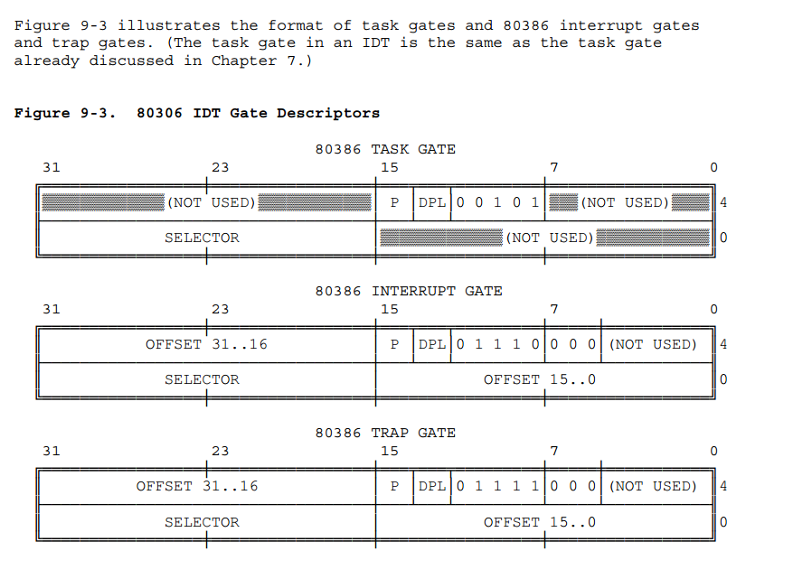

istrap: 1 for a trap (= exception) gate, 0 for an interrupt gate. 

sel:  interrupt/trap handler 的代码段选择子

off: interrupt/trap handler 的代码段偏移

dpl: 描述符特权级, 大部分中断门描述符特权级为 0, 少量的需要允许用户模式调用的为 3, 如断点 BRKPT 和系统调用 SYSCALL.

此时, 再执行`make qemu`可以看到没有报 `triple fault`, 运行 `make grade`可以看到 divzero, softint, badsegment 这几个测试通过 (Part A 测试全部通过, Part B 还没开始会 fail)

```
divzero: OK (2.8s) 
    (Old jos.out.divzero failure log removed)
softint: OK (1.9s) 
    (Old jos.out.softint failure log removed)
badsegment: OK (2.0s) 
    (Old jos.out.badsegment failure log removed)
Part A score: 30/30
```

#### Question

```
1. What is the purpose of having an individual handler function for each exception/interrupt? (i.e., if all exceptions/interrupts were delivered to the same handler, what feature that exists in the current implementation could not be provided?)

答:
	不同的中断或者异常需要不同的中断处理函数, 因为不同的异常/中断需要不同的处理方式. 比如有些异常是代表指令错误, 则需要直接中断程序的运行, 不会返回被中断的命令. 而 I/O中断在读取数据后, 还要返回到被中断的程序中继续运行.

2. Did you have to do anything to make the user/softint program behave correctly? The grade script expects it to produce a general protection fault (trap 13), but softint's code says int $14. Why should this produce interrupt vector 13? What happens if the kernel actually allows softint's int $14 instruction to invoke the kernel's page fault handler (which is interrupt vector 14)?
	需要做什么才能使 user/softint 程序正常运行? 评分脚本期望它产生一般保护错误(trap 13), 但 softint的代码为 int $14. 为什么这会产生interrupt vector 13? 如果内核实际上允许 softint int $14指令调用内核的页错误处理程序(中断向量14)会发生什么?

答:
	因为当前系统运行在用户态下, 特权级为3. 而 INT指令为系统指令, 特权级为0. 特权级为3的程序不能直接调用特权级为0的程序, 会导致一个 General Protection Exception, 即 trap 13.
	我们在 SETGATE()中对中断向量14(T_PGFLT)设置的 DPL为0, 如果要允许, 可以设置中断向量14的 DPL为3, 但是一般不允许用户模式下(用户程序)来操作内存.
```

## Part B: Page Faults, Breakpoints Exceptions, and System Calls

现在你的操作系统内核已经具备基本的异常处理能力了, 你将对其进行改进, 以提供依赖于异常处理的重要操作系统原语.

### Handling Page Faults

缺页异常, 中断向量14 (`T_PGFLT`)，是一个特别重要的异常, 我们将在本实验和下一个实验中大量练习. 当处理器发生页面错误时, 它将导致该错误的线性(即虚拟)地址存储在一个特殊的处理器控制寄存器 `CR2` 中. 在 `trap.c`中，我们提供了一个特殊函数的开头部分, `page_fault_handler()`来用于处理缺页异常.

在实现系统调用时, 将会进一步改进内核的缺页异常处理.

### Exercise 5

修改 `trap_dispatch()`，将页面故障异常分派给 `page_fault_handler()`. `make grade` 应该能够在 `faultread`,`faultreadkernel`,`faultwrite` 和 `faultwritekernel` 测试中成功. 如果它们中的任何一个不起作用, 找出原因并修复它们. 
请记住, 可以使用 `make run-x` 或 `make run-x-nox` 将 JOS引导到特定的用户程序中. 例如 make run-hello-nox运行 hello用户程序.

`Trapframe` 结构体中 `tf_trapno` 成员表示中断码, 根据入参 `Trapframe *tf` 中的 `tf_trapno` 成员来判断是否是缺页中断, 执行 `page_fault_handler`

```
static void
trap_dispatch(struct Trapframe *tf)
{
	// Handle processor exceptions.
	// LAB 3: Your code here.
    switch(tf->tf_trapno) 
    {
        case (T_PGFLT):
			page_fault_handler(tf);
		 	break;
		default: // Unexpected trap: The user process or the kernel has a bug.
			print_trapframe(tf);
            if (tf->tf_cs == GD_KT)
                panic("unhandled trap in kernel");
            else 
            {
                env_destroy(curenv);
                return;
            }
    }
}
```

### The Breakpoint Exception

断点异常, 中断向量3 (`T_BRKPT`), 通常用于允许调试器在程序代码中插入断点，方法是用特殊的 1-byte `int3`软件中断指令临时替换相关的程序指令. 在 JOS中, 我们将稍微滥用这个异常, 把它变成一个基本的伪系统调用, 任何用户环境都可以用它来调用 JOS内核监视器. 如果我们把 JOS内核监视器看作是一个基本的调试器, 那么这种用法实际上是比较合适的. 例如 `lib/panic.c`中的 `panic()`的用户模式实现, 在显示其 `panic`消息后执行 `int3`.

### Exercise 6

修改 `trap_dispatch()`, 使断点异常调用内核监视器. 现在, `make grade` 应该能够在 `breakpoint`测试中成功.

```
static void
trap_dispatch(struct Trapframe *tf)
{
	// Handle processor exceptions.
	// LAB 3: Your code here.
    switch(tf->tf_trapno) 
    {
        case (T_PGFLT):
			page_fault_handler(tf);
		 	break;
        case (T_BRKPT):
			monitor(tf);
		 	break;		 	
		default: // Unexpected trap: The user process or the kernel has a bug.
			print_trapframe(tf);
            if (tf->tf_cs == GD_KT)
                panic("unhandled trap in kernel");
            else 
            {
                env_destroy(curenv);
                return;
            }
    }
}
```

 `make grade` 运行结果

```
faultread: OK (0.9s) 
    (Old jos.out.faultread failure log removed)
faultreadkernel: OK (1.9s) 
    (Old jos.out.faultreadkernel failure log removed)
faultwrite: OK (2.2s) 
    (Old jos.out.faultwrite failure log removed)
faultwritekernel: OK (0.9s) 
    (Old jos.out.faultwritekernel failure log removed)
breakpoint: OK (1.8s) 
    (Old jos.out.breakpoint failure log removed)
```

#### Questions

```
3. break point 测试用例中, 将生成 break point exception或者 general protection fault. 这取决于如何初始化 IDT中的断点条目(即从trap_init调用SETGATE). 为什么? 你需要如何设置它才能使断点异常像上面指定的那样工作? 哪些不正确的设置会导致它触发 general protection fault?

答:
设置 IDT表中的 breakpoint exception的表项时, 如果我们把表项中的 DPL字段设置为3, 则会触发 break point exception, 如果设置为0, 则会触发 general protection exception.
DPL字段代表的含义是段描述符优先级(Descriptor Privileged Level), 如果我们想要当前执行的程序能够跳转到这个描述符所指向的程序继续执行的话, 有个要求就是当前运行程序的 CPL,RPL的最大值需要小于等于 DPL. 否则就会出现优先级低的代码试图去访问优先级高的代码的情况, 就会触发 general protection exception.
测试程序首先运行于用户态, 它的CPL为3, 当异常发生时, 它希望去执行 int3指令, 这是一个系统级别的指令, 用户态命令的 CPL一定大于 int3的 DPL, 所以就会触发 general protection exception, 但如果把 IDT这个表项的 DPL设置为3时, 就不会出现这样的现象了. 这时如果再出现异常, 肯定是因为还没有编写 break point exception的异常处理程序所引起的.

4. 你认为这些机制的意义是什么, 特别是考虑到 user/softint 测试程序所做的事情?
答:
DPL的设置, 可以限制用户态对关键指令的使用.
```

### System calls

用户进程通过调用系统调用来要求内核为它们做一些事情. 当用户进程调用系统调用时, 处理器进入内核模式, 处理器和内核合作保存用户进程的状态, 内核执行相应的代码来执行系统调用, 然后恢复用户进程. 用户进程如何引起内核的注意以及它如何指定它想执行哪个调用的确切细节因系统而异.

在 JOS内核中, 我们将使用 `int`指令, 这会导致处理器中断. 特别地, 我们将使用 `int $0x30` 作为系统调用中断. 我们已经为你定义了常量 `t_sycall`为 48 (0x30). 你必须设置中断描述符以允许用户进程引起该中断, 请注意中断`0x30` 不能由硬件生成, 因此允许用户代码生成它不会造成歧义.

应用程序将在寄存器中传递系统调用号和系统调用参数. 这样内核就不需要在用户环境的堆栈或指令流中搜索. 系统调用号将以 `%eax`, 参数(最多5个)将以 `%edx、%ecx、%ebx、%edi`和 `%esi`的形式输入. 内核以 `%eax`将返回值以传回. 调用系统调用的汇编代码已经编写, 在 `lib/sycall.c` `sycall()` 中, 你应该通读一遍, 确保明白是怎么回事.

### Exercise 7

在内核中为中断向量 `T_SYSCALL`编写一个中断处理函数. 你需要去编辑 `kern/trapentry.S` 和 `kern/trap.c`的 `trap_init()`函数. 你也需要去修改 `trap_dispatch()`函数, 使他能够通过调用 `syscall()`（在 `kern/syscall.c`中定义的) 函数处理系统调用中断, 然后将返回值通过  `%eax`传递给用户进程. 最终你需要去实现`kern/syscall.c` 中的 `syscall()`函数, 确保这个函数会在系统调用号为非法值时返回 `-E_INVAL`. 你应该阅读和理解 `lib/syscall.c`(尤其是内联汇编例程), 以确认对系统调用接口的理解, 通过为每个调用调用相应的内核函数来处理在 `inc/sycall .h` 中列出的所有系统调用.

通过 `make run-hello` 指令来运行 `user/hello` 程序, 它应该在控制台上打印 `“hello, world”`, 然后在用户模式下导致一个 page fault. 如果没有发生这种情况，则可能意味着你的系统调用处理程序不太正确. 你现在也应该能够在 testbss 测试中 `make grade` 成功.

首先, 在  `kern/trapentry.S` 中为 `T_SYSCALL`声明一个中断处理函数(Exercise 4 中已实现).

```
TRAPHANDLER_NOEC(syscall_handler, T_SYSCALL)
```

在  `kern/trap.c`中注册 `syscall_handler`

```
void trap_init(void)
{
	...
	void syscall_handler();

    // T_SYSCALL DPL 3
  	SETGATE(idt[T_SYSCALL], 0, GD_KT, syscall_handler, 3);
}
```

此时当系统调用中断发生时, 内核就可以捕捉到 T_SYSCALL这个中断了, 其大致流程为: T_SYSCALL 系统调用 ---> _alltraps ---> trap() ---> trap_dispatch().

然后在 `trap_dispatch()`中添加对 T_SYSCALL 的处理.

```
static void
trap_dispatch(struct Trapframe *tf)
{
	// Handle processor exceptions.
	// LAB 3: Your code here.
    switch(tf->tf_trapno) 
    {
		...
        case (T_BRKPT):
			monitor(tf);
		 	break;
        case (T_SYSCALL):
    		// print_trapframe(tf);
            ret_code = syscall(
                    tf->tf_regs.reg_eax,
                    tf->tf_regs.reg_edx,
                    tf->tf_regs.reg_ecx,
                    tf->tf_regs.reg_ebx,
                    tf->tf_regs.reg_edi,
                    tf->tf_regs.reg_esi);
            tf->tf_regs.reg_eax = ret_code;
            break;	            
		default: // Unexpected trap: The user process or the kernel has a bug.
			...
    }
}
```

最后在 `kern/syscall.c`  `syscall()`中添加对 `syscallno` 的处理, 继续调用  `lib/syscall.c`中相应的系统调用函数.

```
int32_t
syscall(uint32_t syscallno, uint32_t a1, uint32_t a2, uint32_t a3, uint32_t a4, uint32_t a5)
{
	// Call the function corresponding to the 'syscallno' parameter.
	// Return any appropriate return value.
	// LAB 3: Your code here.

	switch (syscallno) {
        case (SYS_cputs):
            sys_cputs((const char *)a1, a2);
            return 0;
        case (SYS_cgetc):
            return sys_cgetc();
        case (SYS_getenvid):
            return sys_getenvid();
        case (SYS_env_destroy):
            return sys_env_destroy(a1);		
		default:
			return -E_INVAL;
	}
}
```

 `make grade` 运行结果

```
divzero: OK (3.1s) 
softint: OK (1.0s) 
badsegment: OK (1.1s) 
Part A score: 30/30

faultread: OK (1.1s) 
faultreadkernel: OK (2.1s) 
faultwrite: OK (1.3s) 
faultwritekernel: OK (1.8s) 
breakpoint: OK (1.1s) 
testbss: OK (1.8s) 
    (Old jos.out.testbss failure log removed)
hello: FAIL (1.4s) 
```

 `make run-hello` 运行结果, 用户模式下触发 page fault.

```

env_run() start...
Incoming TRAP frame at 0xefffffbc
hello, world
env_run() start...
Incoming TRAP frame at 0xefffffbc
[00001000] user fault va 00000048 ip 00800059
TRAP frame at 0xf01d1000
  edi  0x00000000
  esi  0x00000000
  ebp  0xeebfdfd0
  oesp 0xefffffdc
  ebx  0x00802000
  edx  0xeebfde88
  ecx  0x0000000d
  eax  0x00000000
  es   0x----0023
  ds   0x----0023
  trap 0x0000000e Page Fault
  cr2  0x00000048
  err  0x00000004 [user, read, not-present]
  eip  0x00800059
  cs   0x----001b
  flag 0x00000092
  esp  0xeebfdfb8
  ss   0x----0023
[00001000] free env 00001000
Destroyed the only environment - nothing more to do!
Welcome to the JOS kernel monitor!
Type 'help' for a list of commands.

```


## 参考

https://pdos.csail.mit.edu/6.828/2018/labs/lab3/

https://pdos.csail.mit.edu/6.828/2018/readings/ia32/

https://zhuanlan.zhihu.com/p/74028717

https://github.com/shishujuan/mit6.828-2017/blob/master/docs/lab3.md

https://github.com/shishujuan/mit6.828-2017/blob/master/docs/lab3-exercize.md

[【xv6学习之番外篇】详解struct Env 与 struct Trapframe_mick_seu的博客-CSDN博客](https://blog.csdn.net/woxiaohahaa/article/details/50564517)

### PART A

https://www.dingmos.com/index.php/archives/8/

https://www.cnblogs.com/oasisyang/p/15520180.html

https://111qqz.com/2019/03/mit-6-828-lab-3-user-environments/

https://www.cnblogs.com/fatsheep9146/p/5341836.html

### Part B

https://www.cnblogs.com/fatsheep9146/p/5451579.html

https://www.dingmos.com/index.php/archives/9/