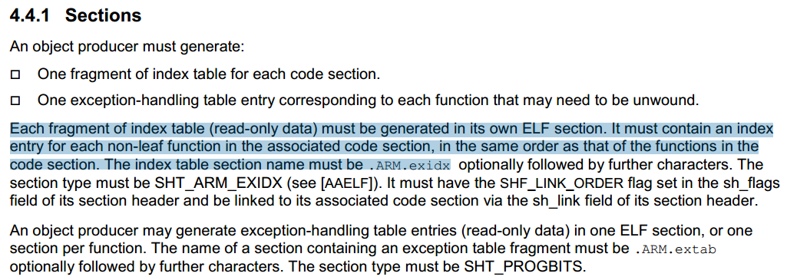

# ELF 文件格式

ELF 全称 Executable and Linkable Format, 即可执行可链接文件格式, 是一种用于可重定位目标文件,可执行文件,  共享库和核心转储(core dump) 的标准文件格式. 

## ELF 文件类型

* 可重定位目标文件(relocatable file), 保存了一些可以和其他目标文件链接并生成可执行文件或者共享库的二进制代码和数据. 一般由编译器编译阶段生成, 后缀名为 `.o` 的文件. 如 `gcc -c test.c` 得到的 `test.o` 就是目标文件, 目标文件通过链接生成可执行文件.

  静态库其实也算目标文件, 其通过 ar 命令将目标打包为.a 文件

* 可执行文件(excutable file), 保存了适合直接加载到内存中执行的二进制程序, 在编译过程中由汇编器和链接器生成. 如 `gcc -o test test.c` 得到的 `test` 就是可执行的二进制文件.
* 共享库文件(shared object file) 一种特殊的可重定位目标文件, 可以在加载或者运行时被动态的加载进内存并链接. 如 `gcc test.c -fPIC -shared -o libtest.so`得到的文件 `listtest.so` 就是共享库.
* 核心转储(core dump),  操作系统在进程收到某些信号而终止时, 将此时进程地址空间的内容以及有关进程状态的其他信息写出的一个磁盘文件, 这种信息往往用于调试.


## ELF 文件结构

ELF 文件需要满足可链接, 可执行, 可加载三大基本功能.

* 从可链接的角度看, 需要处理不同编译单元之间的引用问题，所以需要符号解析与重定位相关信息;
* 从可执行的角度看, 程序需要包含指令与数据, 也就是说 ELF 文件中需要存储程序对应的指令和数据;
* 从可加载的角度看, ELF 文件需要指定将那些代码、数据映射到虚拟内存的什么位置;
* 从内容组织的角度看, ELF 文件中包含代码、数据、重定位信息等多个 section. 同时包含这些数据的元数据信息 (每个 section 在文件的起始地址, section 大小). 另外 ELF 文件格式和其他的任何二进制文件一样, 还应该包含一个 header, 作为所有 ELF 文件中信息的元数据.

对于目标文件和可执行文件, 其对应的 ELF 文件结构是不同的, 如下图 (参考 [1]):


左边是链接视图, 即目标文件的内容布局; 右边是执行视图, 即可执行文件的内存布局.

目标文件的内容由节(section)组成, 通常我们说的程序代码的 .text, .bss, .data 这些都是 section. 比如 .text, 告诉汇编器后面的代码放入 .text section 中. 

目标文件中的 section 和  section header table 条目一一对应, 而 program header table 是可选的.

可执行文件被加载到内容执行时, 以段(segment)的形式组织, 用于建立进程映像, 通常我们说的代码段, 数据段都是  segment. 所有目标代码中的 .text 被链接器组织到代码段中, .data, .bss 被组织到数据段中.

可执行文件的 segment 和 program header table 条目一一对应, 而 section header table 是可选的.

### ELF Header

定义如下图 (参考 [1]):


- [ ] |             |             |                                                              |
  | :---------- | ----------- | ------------------------------------------------------------ |
  | e_ident     | 16 字节     | 0x7F + 0x45 4c 46(ELF in ASCII)                              |
  | e_type      | 2 字节      | ELF 文件类型: Relocatable, Executable, Shared,Core...        |
  | e_machine   | 2 字节      | 机器架构: 0x03(x86), 0x14(PowerPC), 0x28(ARM), 0x3E(x86_64)  |
  | e_version   | 2 字节      | 版本号                                                       |
  | e_entry     | 4字节/8字节 | 可执行文件程序入口地址                                       |
  | e_phoff     | 4字节/8字节 | program header table 相对于 ELF 文件开始位置的偏移(以byte为单位) |
  | e_shoff     | 4字节/8字节 | section header table 相对于 ELF 文件开始位置的偏移(以byte为单位) |
  | e_flags     | 4字节       | 处理器特定标志位, ARM 处理器的值参考                         |
  | e_ehsize    | 2 字节      | ELF Header 大小                                              |
  | e_phentsize | 2 字节      | program header table 中每个 entry 的大小                     |
  | e_phnum     | 2 字节      | program header table 中表项个数, 即段的个数.                 |
  | e_shentsize | 2 字节      | section header table 中每个 entry 大小                       |
  | e_shnum     | 2 字节      | section header table 中表项个数, 即节的个数                  |
  | e_shstrndx  | 2 字节      | section header table 中包含 section name string table 的 index |
  |             |             |                                                              |

关于 e_ident[16]:


前4个字节是 ELF 的 Magic Number, 固定为 7f 45 4c 46.
第5个字节指定 ELF 文件是32位还是64位, 1: 32-bit objects, 2: 64-bit objects.
第6个字节指定编码方式, 1: 小端对齐(低地址存低字节, 0x12345678 存储顺序为 78 56 34 12), 2: 大端对齐(低地址存高字节, 0x12345678 存储顺序为 12 34 56 78)
第7个字节为 ELF Header 版本号, 为 1.
后面为填充字节.

### Sections 

section(节) 构成了目标文件的内容, 也组成了可执行文件中的 segment. 

section header table 是 section header 的集合, 每个 section header 描述一个 section 的结构. 同一个 ELF 中, 所有 section header 大小相同.

#### Section Header

定义如下图 (参考 [1]):


* sh_name: section name, 4 字节, 是一个索引值, 在  shstrtable 中的索引.

  * shstrtable 是 section header string table, 包含 section name 的字符串表，也是一个 section.
  * ELF Header 中的字段 e_shstrndx, 就是 shstrtable 所在的 section header 在 section header table中的索引

* sh_type: section type, 4 字节, 常见的值如下:

  | 值           |      | 解释                                                         |
  | ------------ | ---- | ------------------------------------------------------------ |
  | SHT_NULL     | 0    | section header 无效                                          |
  | SHT_PROGBITS | 1    | section 包含了程序所需的信息, 格式和含义由程序解释           |
  | SHT_SYMTAB   | 2    | section 包含了一个符号表                                     |
  | SHT_STRTAB   | 3    | section 包含了一个字符串表                                   |
  | SHT_RELA     | 4    | relocation 入口, 一个目标文件可能包含多个重定位 section      |
  | SHT_HASH     | 5    | section 包含一个符号 hash表, 参与动态链接的目标代码文件必须有一个hash表,一个目标文件只包含一个hash表 |
  | SHT_DYNAMIC  | 6    | 包含动态链接的信息, 一个目标文件只有一个 DYNAMIC section     |
  | SHT_NOBITS   | 8    | section 不含字节, 不占用文件空间. header 中的 sh_offset 只是概念上的偏移 |

* sh_flags: 标志位, 4字节/8字节, readelf -S ... 输出中的 “Flg”, 常见的有

  | 值            |      | 解释                            |
  | ------------- | ---- | ------------------------------- |
  | SHF_WRITE     | 0x01 | 进程执行时 section 内的数据可写 |
  | SHF_ALLOC     | 0x01 | 进程执行时 section 需要占用内存 |
  | SHF_EXECINSTR | 0x04 | section 包含可以执行的机器指令  |
  | SHF_STRINGS   | 0x20 | section 包含 null 结尾字符串    |

* sh_addr:  如果 section 会出现在进程的内存映像中, section 中第一字节的虚拟地址, 4字节/8字节.

* sh_offset: section 相对于文件头的字节偏移. 对于不占文件空间的 section, 给出 section 逻辑上的位置, 4字节/8字节.

* sh_size: section 占多少字节.

* sh_link: 一个 section header table 的索引, 值取决于 section type.

  * SHT_DYNAMIC, sh_link 是 string table 的 section header index, 指向字符串表.
  * SHT_HASH, sh_link is the section header index of the symbol table to which the hash table
    applies.
  * SHT_REL 或 SHT_RELA, sh_link is the section header index of the associated symbol
    table.
  * SHT_SYMTAB 或 SHT_DYNSYM, sh_link: This information is operating system specific.

  .....

  

#### Special Sections

定义如下图 (参考 [1]):


* .text: 类型 SHT_PROGBITS, 属性 SHF_EXECINSTR + SHF_ALLOC, 包含执行的指令, 进程运行时需要占用内存.
* .data和.data1: 类型 SHT_PROGBITS, 属性 SHF_WRITE + SHF_ALLOC, 包含初始化的全局变量和静态变量, 运行时占内存, 可写.
* .bss: 类型 SHT_NOBITS(不占文件空间), 属性 SHF_WRITE + SHF_ALLOC, 包含未初始化的数据(全局和静态变量), 程序运行时初始化为 0. 该 section 不占用文件空间, 运行时占内存, 可写.
* .rodata和.rodata1: 类型 SHT_PROGBITS, 属性 SHF_ALLOC, 包含只读数据, 运行时占内存, 不可写.
* .debug: 类型 SHT_PROGBITS, 包含符号调试信息, 供 GDB 调试时使用.
* .dynamic, 类型 SHT_DYNAMIC, 包含了动态链接的信息.
* .relname .relaname, 类型 SHT_REL(A), 包含重定位信息, name 是应用重定位的 section name, 比如 .text 的重定位信息存储在.rel.text 中
* .strtab, 类型 SHT_STRTAB, 包含字符串, 通常是符号表中符号对应的变量名字.
* .symtab, 类型 SHT_SYMTAB, 符号表, 包含了定位、重定位符号定义和引用时需要的信息.
  * .init, 类型 SHT_PROGBITS, 属性 SHF_WRITE + SHF_EXECINSTR, 运行时占内存, 可执行指令. 包含了程序运行前的进程初始化代码, 如 main() 函数之前执行的那些代码, 现在 ELF 还包含 .init_array section(构造函数)
* .dynstr, 类型 SHT_STRTAB, 属性 SHF_ALLOC. 包含动态链接所需的字符串, 最常见的是与符号表项关联的名称的字符串.
* .dynsym, 类型 SHT_DYNAMIC, 属性 SHF_ALLOC. 包含动态链接符号表.
* .fini, 类型 SHT_PROGBITS, 属性 SHF_WRITE + SHF_EXECINSTR, 运行时占内存, 可执行指令. 包含了程序结束时, 进程结束代码. 现在 ELF 还包含 .fini_array section(析构函数).
* .interp, 类型 SHT_PROGBITS. 包含了一个字符串, 指定了程序解释器的路径名. 如果文件中有一个可加载的segment 包含该节, 则节的属性包含 SHF_ALLOC

#### Example

下面是使用 ELF 解析工具 readelf, 对目标文件的解析.

```
$ readelf -h stackframe.o
ELF Header:
  Magic:   7f 45 4c 46 01 01 01 00 00 00 00 00 00 00 00 00 
  Class:                             ELF32
  Data:                              2's complement, little endian
  Version:                           1 (current)
  OS/ABI:                            UNIX - System V
  ABI Version:                       0
  Type:                              REL (Relocatable file)
  Machine:                           ARM
  Version:                           0x1
  Entry point address:               0x0
  Start of program headers:          0 (bytes into file)
  Start of section headers:          2116 (bytes into file)
  Flags:                             0x5000000, Version5 EABI
  Size of this header:               52 (bytes)
  Size of program headers:           0 (bytes)
  Number of program headers:         0
  Size of section headers:           40 (bytes)
  Number of section headers:         25
  Section header string table index: 22

$ readelf -S stackframe.o
There are 25 section headers, starting at offset 0x844:

Section Headers:
  [Nr] Name              Type            Addr     Off    Size   ES Flg Lk Inf Al
  [ 0]                   NULL            00000000 000000 000000 00      0   0  0
  [ 1] .text             PROGBITS        00000000 000034 00000c 00  AX  0   0  4
  [ 2] .data             PROGBITS        00000000 000040 000000 00  WA  0   0  1
  [ 3] .bss              NOBITS          00000000 000040 000000 00  WA  0   0  1
  [ 4] .text.startup     PROGBITS        00000000 000040 000008 00  AX  0   0  4
  [ 5] .debug_info       PROGBITS        00000000 000048 000162 00      0   0  1
  [ 6] .rel.debug_info   REL             00000000 0006dc 0000d0 08   I 23   5  4
  [ 7] .debug_abbrev     PROGBITS        00000000 0001aa 00008e 00      0   0  1
  [ 8] .debug_loc        PROGBITS        00000000 000238 000021 00      0   0  1
  [ 9] .rel.debug_loc    REL             00000000 0007ac 000020 08   I 23   8  4
  [10] .debug_aranges    PROGBITS        00000000 000259 000028 00      0   0  1
  [11] .rel.debug_arange REL             00000000 0007cc 000018 08   I 23  10  4
  [12] .debug_ranges     PROGBITS        00000000 000281 000018 00      0   0  1
  [13] .rel.debug_ranges REL             00000000 0007e4 000020 08   I 23  12  4
  [14] .debug_line       PROGBITS        00000000 000299 000051 00      0   0  1
  [15] .rel.debug_line   REL             00000000 000804 000010 08   I 23  14  4
  [16] .debug_str        PROGBITS        00000000 0002ea 0000db 01  MS  0   0  1
  [17] .comment          PROGBITS        00000000 0003c5 000029 01  MS  0   0  1
  [18] .note.GNU-stack   PROGBITS        00000000 0003ee 000000 00      0   0  1
  [19] .debug_frame      PROGBITS        00000000 0003f0 000040 00      0   0  4
  [20] .rel.debug_frame  REL             00000000 000814 000030 08   I 23  19  4
  [21] .ARM.attributes   ARM_ATTRIBUTES  00000000 000430 000033 00      0   0  1
  [22] .shstrtab         STRTAB          00000000 000463 0000e1 00      0   0  1
  [23] .symtab           SYMTAB          00000000 000544 000170 10     24  20  4
  [24] .strtab           STRTAB          00000000 0006b4 000025 00      0   0  1
Key to Flags:
  W (write), A (alloc), X (execute), M (merge), S (strings), I (info),
  L (link order), O (extra OS processing required), G (group), T (TLS),
  C (compressed), x (unknown), o (OS specific), E (exclude),
  y (noread), p (processor specific)

$ readelf -l stackframe.o

There are no program headers in this file.
```

从ELF Header 看出, 该目标文件是 32 位文件, 硬件平台 ARM, 小端对齐.


### Segments

可执行文件由 segment(段)组成, 运行时一个 segment 由链接器将一个或多个 section 链接而成. 每个  segment 和 program header table 条目一一对应.

#### Program header

定义如下图 (参考 [1]):


* p_type: 描述当前 segment 的类型或者如何解释当前 segment. 常见的值如下:

  | Name       | Value | 解释                                                         |
  | ---------- | ----- | ------------------------------------------------------------ |
  | PT_LOAD    | 1     | 可加载的段                                                   |
  | PT_DYNAMIC | 2     | 指定动态链接信息, 参见 “Dynamic Section’’                    |
  | PT_INTERP  | 3     | 指定一个以 unll 结尾的路径名的位置和大小, 作为解释器调用(动态链接过程中所使用的解释器路径和名称). 此段仅对可执行文件有意义. |

* p_offset: 从ELF 文件开始位置到该segment 第一个字节的偏移量.

* p_vaddr: 表示该segment 的第一个字节在内存中的虚拟地址.

* p_paddr: 如果系统使用物理地址, 这个成员表示该segment 的物理地址.

* p_filesz: segment 的文件映像大小, 以字节为单位.

* p_memsz: segment 的内存映像大小, 以字节为单位.

* p_flags: segment 的 p_flags.

  | Name | Value | 解释    |
  | ---- | ----- | ------- |
  | PF_X | 0x1   | Execute |
  | PF_W | 0x2   | Write   |
  | PF_R | 0x4   | Read    |

* p_align: 表示该segment 在文件中或者内存中以多少字节对齐.

  

#### Example

下面是使用 ELF 解析工具 readelf, 对可执行文件的解析.

```
$ readelf -h stack
ELF Header:
  Magic:   7f 45 4c 46 01 01 01 00 00 00 00 00 00 00 00 00 
  Class:                             ELF32
  Data:                              2's complement, little endian
  Version:                           1 (current)
  OS/ABI:                            UNIX - System V
  ABI Version:                       0
  Type:                              EXEC (Executable file)
  Machine:                           ARM
  Version:                           0x1
  Entry point address:               0x10318
  Start of program headers:          52 (bytes into file)
  Start of section headers:          9740 (bytes into file)
  Flags:                             0x5000202, Version5 EABI, soft-float ABI, <unknown>
  Size of this header:               52 (bytes)
  Size of program headers:           32 (bytes)
  Number of program headers:         8
  Size of section headers:           40 (bytes)
  Number of section headers:         38
  Section header string table index: 35

$ readelf -l stack

Elf file type is EXEC (Executable file)
Entry point 0x10318
There are 8 program headers, starting at offset 52

Program Headers:
  Type           Offset   VirtAddr   PhysAddr   FileSiz MemSiz  Flg Align
  EXIDX          0x000574 0x00010574 0x00010574 0x00008 0x00008 R   0x4
  PHDR           0x000034 0x00010034 0x00010034 0x00100 0x00100 R E 0x4
  INTERP         0x000134 0x00010134 0x00010134 0x00013 0x00013 R   0x1
      [Requesting program interpreter: /lib/ld-linux.so.3]
  LOAD           0x000000 0x00010000 0x00010000 0x00580 0x00580 R E 0x10000
  LOAD           0x000580 0x00020580 0x00020580 0x00120 0x00124 RW  0x10000
  DYNAMIC        0x00058c 0x0002058c 0x0002058c 0x000f0 0x000f0 RW  0x4
  NOTE           0x000148 0x00010148 0x00010148 0x00044 0x00044 R   0x4
  GNU_STACK      0x000000 0x00000000 0x00000000 0x00000 0x00000 RW  0x10

 Section to Segment mapping:
  Segment Sections...
   00     .ARM.exidx 
   01     
   02     .interp 
   03     .interp .note.ABI-tag .note.gnu.build-id .gnu.hash .dynsym .dynstr .gnu.version .gnu.version_r .rel.dyn .rel.plt .init .plt .text .fini .rodata .ARM.exidx .eh_frame 
   04     .init_array .fini_array .jcr .dynamic .got .data .bss 
   05     .dynamic 
   06     .note.ABI-tag .note.gnu.build-id 

$ readelf -S stack
There are 38 section headers, starting at offset 0x260c:

Section Headers:
  [Nr] Name              Type            Addr     Off    Size   ES Flg Lk Inf Al
  [ 0]                   NULL            00000000 000000 000000 00      0   0  0
  [ 1] .interp           PROGBITS        00010134 000134 000013 00   A  0   0  1
  [ 2] .note.ABI-tag     NOTE            00010148 000148 000020 00   A  0   0  4
  [ 3] .note.gnu.build-i NOTE            00010168 000168 000024 00   A  0   0  4
  [ 4] .gnu.hash         GNU_HASH        0001018c 00018c 000024 04   A  5   0  4
  [ 5] .dynsym           DYNSYM          000101b0 0001b0 000040 10   A  6   1  4
  [ 6] .dynstr           STRTAB          000101f0 0001f0 00009b 00   A  0   0  1
  [ 7] .gnu.version      VERSYM          0001028c 00028c 000008 02   A  5   0  2
  [ 8] .gnu.version_r    VERNEED         00010294 000294 000020 00   A  6   1  4
  [ 9] .rel.dyn          REL             000102b4 0002b4 000008 08   A  5   0  4
  [10] .rel.plt          REL             000102bc 0002bc 000018 08  AI  5  22  4
  [11] .init             PROGBITS        000102d4 0002d4 00000c 00  AX  0   0  4
  [12] .plt              PROGBITS        000102e0 0002e0 000038 04  AX  0   0  4
  [13] .text             PROGBITS        00010318 000318 000250 00  AX  0   0  4
  [14] .fini             PROGBITS        00010568 000568 000008 00  AX  0   0  4
  [15] .rodata           PROGBITS        00010570 000570 000004 04  AM  0   0  4
  [16] .ARM.exidx        ARM_EXIDX       00010574 000574 000008 00  AL 13   0  4
  [17] .eh_frame         PROGBITS        0001057c 00057c 000004 00   A  0   0  4
  [18] .init_array       INIT_ARRAY      00020580 000580 000004 00  WA  0   0  4
  [19] .fini_array       FINI_ARRAY      00020584 000584 000004 00  WA  0   0  4
  [20] .jcr              PROGBITS        00020588 000588 000004 00  WA  0   0  4
  [21] .dynamic          DYNAMIC         0002058c 00058c 0000f0 08  WA  6   0  4
  [22] .got              PROGBITS        0002067c 00067c 00001c 04  WA  0   0  4
  [23] .data             PROGBITS        00020698 000698 000008 00  WA  0   0  4
  [24] .bss              NOBITS          000206a0 0006a0 000004 00  WA  0   0  1
  [25] .comment          PROGBITS        00000000 0006a0 000028 01  MS  0   0  1
  [26] .ARM.attributes   ARM_ATTRIBUTES  00000000 0006c8 000033 00      0   0  1
  [27] .debug_aranges    PROGBITS        00000000 000700 0000d0 00      0   0  8
  [28] .debug_info       PROGBITS        00000000 0007d0 000577 00      0   0  1
  [29] .debug_abbrev     PROGBITS        00000000 000d47 000212 00      0   0  1
  [30] .debug_line       PROGBITS        00000000 000f59 0002bf 00      0   0  1
  [31] .debug_frame      PROGBITS        00000000 001218 0000b4 00      0   0  4
  [32] .debug_str        PROGBITS        00000000 0012cc 0003d3 01  MS  0   0  1
  [33] .debug_loc        PROGBITS        00000000 00169f 000091 00      0   0  1
  [34] .debug_ranges     PROGBITS        00000000 001730 000070 00      0   0  8
  [35] .shstrtab         STRTAB          00000000 0017a0 000170 00      0   0  1
  [36] .symtab           SYMTAB          00000000 001910 0007c0 10     37  98  4
  [37] .strtab           STRTAB          00000000 0020d0 000539 00      0   0  1
Key to Flags:
  W (write), A (alloc), X (execute), M (merge), S (strings), I (info),
  L (link order), O (extra OS processing required), G (group), T (TLS),
  C (compressed), x (unknown), o (OS specific), E (exclude),
  y (noread), p (processor specific)
```

由 *readelf -l stack* 得出可执行文件 `stack`有如下 segment, 以及每个 segment 对应的 section.

* EXIDX, [Nr] = 0, 对应的 section .ARM.exidx, 该 section 包含了异常索引表, 每个条目包含了代码中的函数与其异常处理代码之间的关联, 即指定了执行函数期间抛出异常时要做的事, 包括函数调用栈的展开.

  参考: [Exception handling ABI for the ARM architecture](https://developer.arm.com/architectures/system-architectures/software-standards/abi)

  

* INTERP: 动态链接解释器 /lib/ld-linux.so.3, 虚拟内存地址: 0x00010134,  大小: 0x13 (+null 正好19个 byte).

* LOAD: 可加载的段, 虚拟内存地址: 0x00010000, 大小: 0x00580, 属性: R E (可读+可执行).

  [Nr] = 03, 对应的 section 有: .interp .dynsym .dynstr .init .text .fini .rodata .ARM.exidx; 即 解释器, 动态链接符号表, 动态链接所需的字符串, 初始化代码, 程序代码, 结束代码, 只读数据, 栈展开信息...

  该段为代码段, 而且能看出来只读数据也放在代码段中.

* LOAD: 可加载的段, 虚拟内存地址: 0x00020580, 文件大小: 0x00120, 内存大小: 0x00124, 属性: RW(可读+可写).

  [Nr] = 03, 对应的 section 有: .dynamic .data .bss, 即 动态链接信息, 初始化的数据, 未初始化的数据.
  该段为数据段, 内存占用比文件大也是因为 .bss 的存在.

## 进程内存布局


参考:

[1]. https://refspecs.linuxfoundation.org/ ([Tool Interface Standard (TIS) Portable Formats Specification, version 1.2](https://refspecs.linuxfoundation.org/elf/elf.pdf). )

https://pdos.csail.mit.edu/6.828/2017/readings/elf.pdf

http://www.skyfree.org/linux/references/ (ELF_Format.pdf)

https://developer.arm.com/architectures/system-architectures/software-standards/abi

https://en.wikipedia.org/wiki/Executable_and_Linkable_Format

https://www.cnblogs.com/xmphoenix/archive/2011/10/23/2221879.html


参考:
[计算机原理系列之二 ——– 详解ELF文件](https://luomuxiaoxiao.com/?p=139#ELF)

https://zhuanlan.zhihu.com/p/57258399

https://zhuanlan.zhihu.com/p/54739589

https://zhuanlan.zhihu.com/p/62039158

https://zhuanlan.zhihu.com/p/73114831

https://www.cnblogs.com/jiqingwu/p/elf_format_research_01.html

[深入理解可执行程序的结构](https://blog.csdn.net/qq_37375427/article/details/85306241)


https://zhuanlan.zhihu.com/p/36887189

https://zhuanlan.zhihu.com/p/30516267

https://wiki.osdev.org/ELF#Header


[Introduction to the ELF Format (Part V) : Understanding C start up .init_array and .fini_array sections](http://blog.k3170makan.com/2018/10/introduction-to-elf-format-part-v.html)

https://luomuxiaoxiao.com/?p=516

