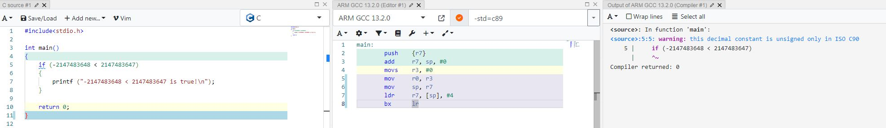

# 数据的存储与表示

## 整数类型

### 引子1: 负数的打印

将一个负数比如 -1 赋值给 `unsigned` 类型的变量, 然后打印, 结果是什么?

```
#include <stdio.h>

int main(void)
{
    unsigned int a = -1;
    printf("a = %d\n", a);
    printf("a = %u\n", a);

    unsigned char b = -1;
    printf("b = %d\n", b);
    printf("b = %u\n", b);

    unsigned short c = -1;
    printf("c = %d\n", c);
    printf("c = %u\n", c);

    return 0;
}
```

输出结果如下:

```
a = -1
a = 4294967295
b = 255
b = 255
c = 65535
c = 65535
```

为什么 `a` 的 `%d` 输出是 `-1`, 一个 `unsigned` 类型的变量竟然打印出一个负数? 而 `%u` 是 `4294967295` ?

`b` 的 `%d`, `%u` 输出是 `255` ? `c` 的 `%d`, `%u` 输出是 `65535` ?

### 引子2: 整数(有符号无符号)的比较

```
#include<stdio.h>
int main()
{
    if (-2147483648 < 2147483647)
    {
        printf ("-2147483648 < 2147483647 is true!\n");
    }
    return 0;
}
```

上面的代码中, `-2147483648 < 2147483647` 为 ISO C90 标准下, 32位系统上的结果为 `false`, 并且编译器会提示: `warning: this decimal constant is unsigned only in ISO C90`.



下面代码中的两种情况则成立.

```
#include<stdio.h>
int main()
{
    int i = -2147483648;
    if (i < 2147483647)
    {
        printf("i < 2147483647 is true\n");
    }

    if (-2147483647 - 1 < 2147483647)
    {
		printf("-2147483647 - 1 < 2147483647\n");
    }
}
```


### 数据的存储

赋值语句 `unsigned int a = -1;` 执行时发生了什么?

在内存中分配一块 32 bit 的空间, 然后存储 `-1`. 负数以补码的形式存入.

`-1` 的原码 `1000 0000 0000 0000 0000 0000 0000 0001`, 符号位不变, 数值位取反, 即可得反码, 所以 `-1` 在内存中就是 `1111 1111 1111 1111 1111 1111 1111 1111`(对补码再求一次补码可得原码).

赋值语句不管正数还是负数, 只要这是一个 `int` 型的数, 赋值操作就存储负数对应的补码形式.

同理, `unsigned char b = -1;` 在内存中存储了 `1111 1111`.

`unsigned short c = -1;` 在内存中存储了 `1111 1111 1111 1111`.

### 数据的表示

`printf` 打印的格式化输出如下:

| *specifier*  | Output                                                       | Example        |
| ------------ | ------------------------------------------------------------ | -------------- |
| `d` *or* `i` | Signed decimal integer                                       | `392`          |
| `u`          | Unsigned decimal integer                                     | `7235`         |
| `o`          | Unsigned octal                                               | `610`          |
| `x`          | Unsigned hexadecimal integer                                 | `7fa`          |
| `X`          | Unsigned hexadecimal integer (uppercase)                     | `7FA`          |
| `f`          | Decimal floating point, lowercase                            | `392.65`       |
| `F`          | Decimal floating point, uppercase                            | `392.65`       |
| `e`          | Scientific notation (mantissa/exponent), lowercase           | `3.9265e+2`    |
| `E`          | Scientific notation (mantissa/exponent), uppercase           | `3.9265E+2`    |
| `g`          | Use the shortest representation: `%e` or `%f`                | `392.65`       |
| `G`          | Use the shortest representation: `%E` or `%F`                | `392.65`       |
| `a`          | Hexadecimal floating point, lowercase                        | `-0xc.90fep-2` |
| `A`          | Hexadecimal floating point, uppercase                        | `-0XC.90FEP-2` |
| `c`          | Character                                                    | `a`            |
| `s`          | String of characters                                         | `sample`       |
| `p`          | Pointer address                                              | `b8000000`     |
| `n`          | Nothing printed. The corresponding argument must be a pointer to a `signed int`. The number of characters written so far is stored in the pointed location. |                |
| `%`          | A `%` followed by another `%` character will write a single `%` to the stream. | `%`            |

`%d`: 以十进制形式输出有符号整数. 具体表现为程序将内存中的数据最高位当作符号位, 根据符号位正负将二进制补码转换为十进制数打印输出. 对于 `unsigned int a` 来说, 把 `1111 1111 1111 1111 1111 1111 1111 1111` 当作有符号数就是 `-1`.

`%u`: 以十进制形式输出无符号整数. 对于 `unsigned int a` 来说, 把 `1111 1111 1111 1111 1111 1111 1111 1111` 当作无符号符号数就是 `4294967295`.

所以同样的数据, 用不同的方式打印得到的结果不同. 

**数据的存储是按照一定的规则存入内存中, 不关心数据的含义, 属于低级操作.**

**打印则是按照某种格式把数据输出, 显示结果的不同并不代表数据本身发生了改变, 而是对数据的解析方式不一样.**

**数据的存储与表示就像编码与解码, 只有用同一种规则对数据进行读写、显示才能避免歧义, 保证程序的正确性**


那么为什么 `unsigned char b, unsigned short c` 的 `%d` 输出不是 `-1` 呢 ?

### 类型扩展

无论是 `%d`, 还是 `%u`, 输出的都是整数, `int` 类型. 

对于 `unsigned char b = -1;` 内存中的数据是`1111 1111`. `printf` 执行时将其扩展为 `int` 类型`32bit` 的形式, 对于 `unsigned` 类型, 扩展时填充 `0`, 即 `0000 0000 0000 0000 0000 0000 1111 1111`. 按照 `%d` 有符号输出, 最高位是 `0`, 正数, 则输出为 `255`, 按照 `%u` 无符号输出也是 `255`.

同理对于 `unsigned short c = -1`; 内存中的数据是 `1111 1111 1111 1111`, `printf` 执行时将其扩展为 `0000 0000 0000 0000 1111 1111 1111 1111`. 按照 `%d` 有符号输出, 最高位是 `0`, 正数, 则输出为 `65535`, 按照 `%u` 无符号输出也是 `65535`.

所以, 接下来的代码将 a,b,c 与相关的整数作比较:

```
    if (a == -1)
    {
        printf("a == -1\n");
    }
    if (a == 0xffffffff)
    {
        printf("a == 0xffffffff\n");
    }

    if (b == -1)
    {
        printf("b == -1\n");
    }
    if (b == 0xff)
    {
        printf("b == 0xff\n");
    }

    if (c == -1)
    {
        printf("c == -1\n");
    }
    if (c == 0xffff)
    {
        printf("c == 0xffff\n");
    }
```

输出如下:

```
a == -1
a == 0xffffffff
b == 0xff
c == 0xffff
```

`a` 与 整数 `-1` 比较, 相等, 与 `0xffffffff` 也相等. 而 `b` 和 `c` 不等于 `-1`.

因为 `-1` 在 `32bit` 系统下是 `0xffffffff`, 而 `b` 为 `0xff`, `c` 为 `0xffff`.


类型扩展在另外一种情况下会填充 `1`, 看接下来的代码.

```
    char d = -1;
    printf("d = %d\n", d);
    printf("d = %u\n", d);

    signed char e = -1;
    printf("e = %d\n", e);
    printf("e = %u\n", e);

    short f = -1;
    printf("f = %d\n", f);
    printf("f = %u\n", f);

    int g = -1;
    printf("g = %d\n", g);
    printf("g = %u\n", g);
```

输出为

```
d = -1
d = 4294967295
e = -1
e = 4294967295
f = -1
f = 4294967295
g = -1
g = 4294967295
```

`char d = -1;` 在内存中存储了 `1111 1111`.

输出时扩展成 `32bit int` 型, 由于 `d` 是有符号数且符号位是 `1`, 则高 `24bit` 填充 `1`, 即  **1111 1111 1111 1111 1111 1111** `1111 1111`, 按照 %u 无符号数输出即为 4294967295, 按照 %d 有符号数即为 `-1`.

所以, 类型扩展
**对于 `unsigned` 类型, 扩展时填充 `0`;**
**对于 `signed` 类型取决于符号位, 符号位为 `1`, 扩展时就填充 `1`; 符号位为 `0`, 扩展时就填充 `0`.**
该规则同样适用于 `char, unsigned char` 转 `int, unsigned int`.

## 总结: 同一规则读写数据

综上, 我们知道无论是用  `int` 还是 `unsigned int` 来存储 `-1`, 内存中的数据都是 `1111 1111 1111 1111 1111 1111 1111 1111`; 无论是用 `char` 还是 `unsigned char` 来存储 `-1`, 内存中的数据都是 `1111 1111`. 

用 `char, int` 定义就用 `%d` 打印; 用 `unsigned char, unsigned int` 定义就用 `%u` 打印.

数据在内存中存储, 以及用什么形式表示, 是互相独立的.


## 参考

https://www.shaoguoji.cn/2017/05/09/store-and-show-of-data/

https://bbs.csdn.net/topics/390143541

https://blog.csdn.net/m0_37809890/article/details/80018409


## TODO

https://c.biancheng.net/view/143.html

https://c.biancheng.net/view/177.html

https://www.zhihu.com/question/479719681

https://zhuanlan.zhihu.com/p/81528108

https://zh.cppreference.com/w/c/language/types

https://zh.cppreference.com/w/c/language/integer_constant

https://blog.csdn.net/qq_43177371/article/details/105703234

https://www.cnblogs.com/godfriend/p/10931503.html

https://www.cnblogs.com/lsgxeva/p/7614856.html


