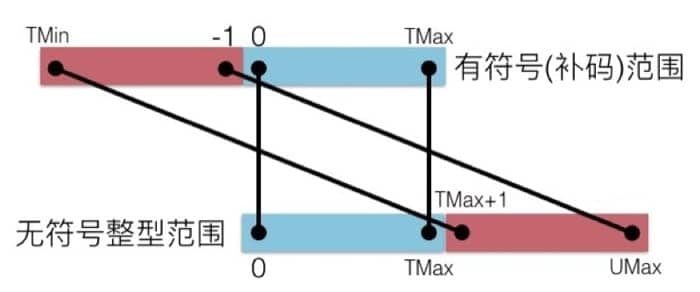
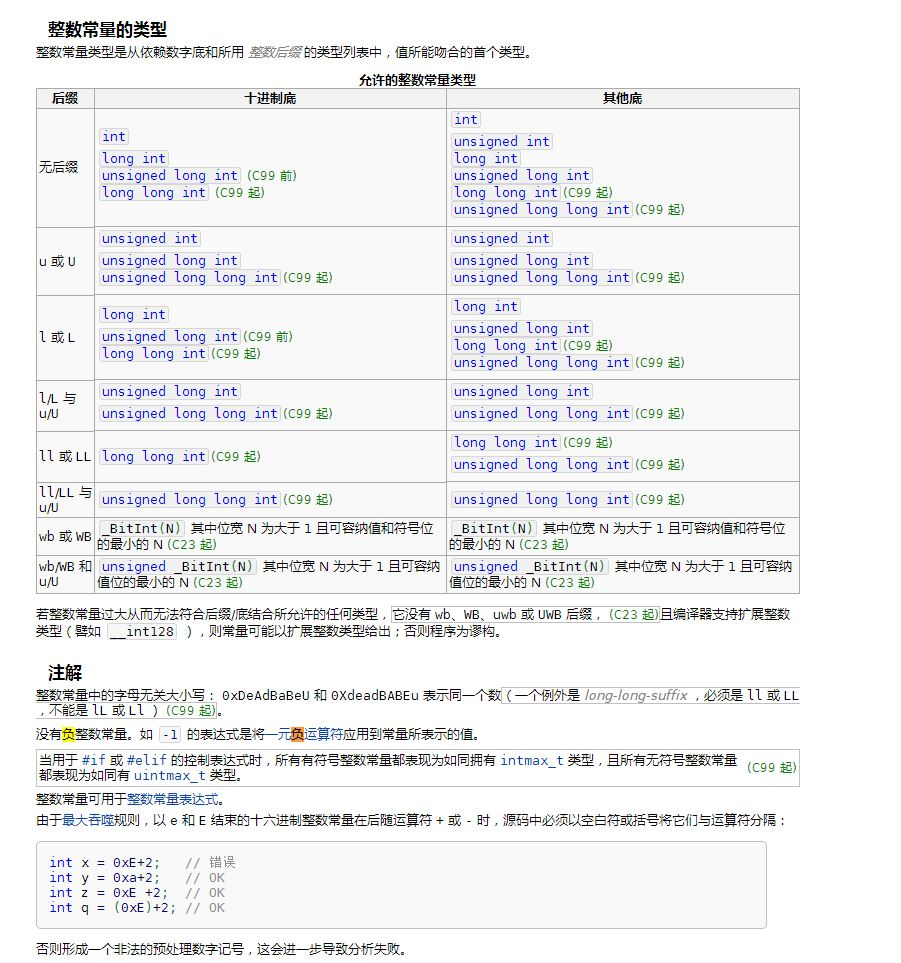
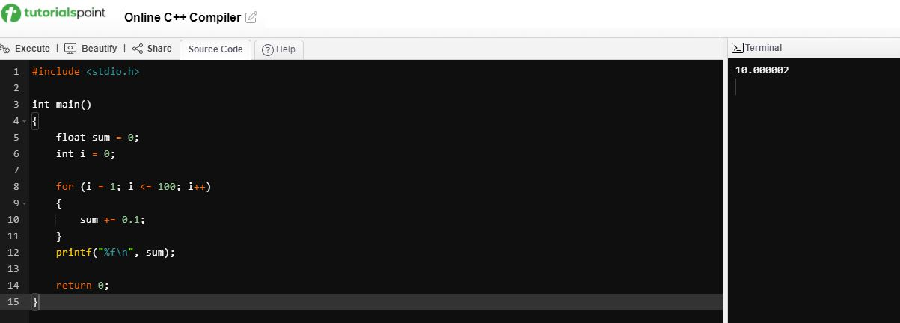
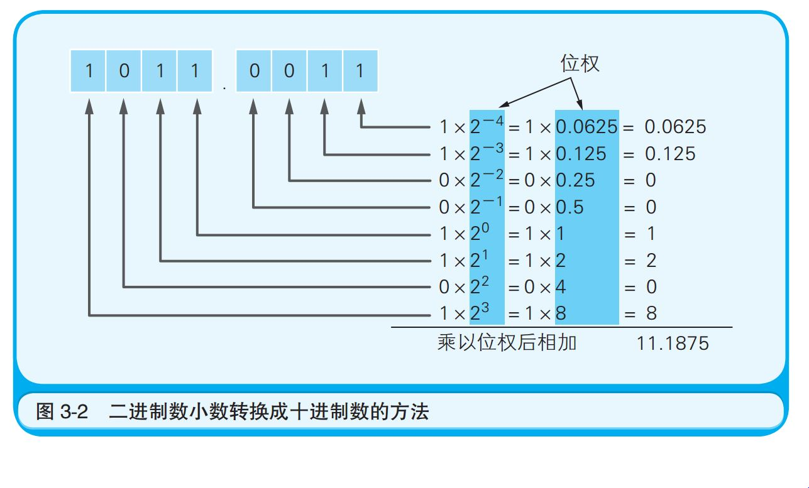
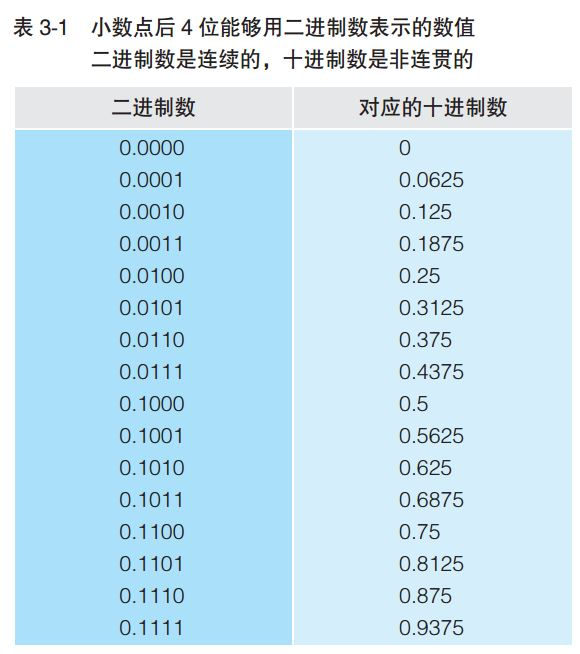
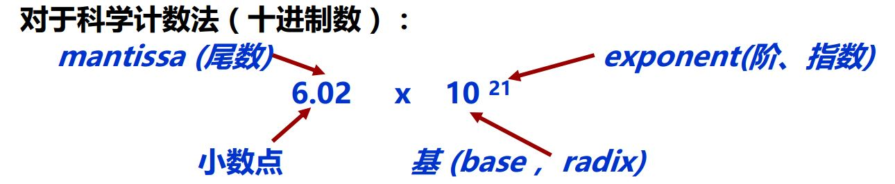

# 数据的存储与表示

## 整数类型

### 引子1: 负数的打印

将一个负数比如 -1 赋值给 `unsigned` 类型的变量, 然后打印, 结果是什么?

```
#include <stdio.h>

int main(void)
{
    unsigned int a = -1;
    printf("a = %d\n", a);
    printf("a = %u\n", a);

    unsigned char b = -1;
    printf("b = %d\n", b);
    printf("b = %u\n", b);

    unsigned short c = -1;
    printf("c = %d\n", c);
    printf("c = %u\n", c);

    return 0;
}
```

输出结果如下:

```
a = -1
a = 4294967295
b = 255
b = 255
c = 65535
c = 65535
```

为什么 `a` 的 `%d` 输出是 `-1`, 一个 `unsigned` 类型的变量竟然打印出一个负数? 而 `%u` 是 `4294967295` ?

`b` 的 `%d`, `%u` 输出是 `255` ? `c` 的 `%d`, `%u` 输出是 `65535` ?

### 数据的存储(补码)

对于一个数, 计算机要使用一定的编码方式进行存储. 原码, 反码和补码是计算机表示一个数的三种编码方式, 对于有符号整数来说, 采用补码来表示.

* 原码: 符号位加上数值部分, 即第一位表示符号, 其余位表示值. 比如8位二进制

  ```
  [+1]原 = 0000 0001
  [-1]原 = 1000 0001
  ```

  因为第一位为符号, 则8位二进制的取值范围是 [1111 1111, 0111 1111], 即 [-127, 127]

* 反码: 正数的反码是其本身, 负数的反码是在其原码的基础上, 符号位不变, 其余各个位取反.

  ```
  [+1] = [00000001]原 = [00000001]反
  [-1] = [10000001]原 = [11111110]反
  ```

* 补码: 正数的补码是其本身, 负数的补码是在其原码的基础上, 符号位不变, 其余各位取反, 末位+1(即在反码的基础上+1)

  ```
  [+1] = [00000001]原 = [00000001]反 = [00000001]补
  [-1] = [10000001]原 = [11111110]反 = [11111111]补
  ```

为什么采用补码的方式来存储?

* 加法和减法可以使用同样的硬件电路, 减法等于加上被减数的补码, 简化硬件实现(用原码表示则加、减运算方式不统一, 需额外对符号位进行处理)
* 0 的表示唯一, 0 用补码表示为: [+0]补码 = 0000 0000, [-0]补码 = 0000 0000, 如果用原码表示则为: 0(0000 0000), -0(1000 0000)
* 比原码多表示一个最小负数, 8位二进制的补码取值范围是 [-128, 127],  [-128]补 = 1000 0000. n位二进制补码数的表示范围为-2^n-1 ~ 2^(n-1) -1

为什么 -128的补码是 1000 0000?

从补码的意义上看, 256 - 128 = 256 + (-128)补 = 128, 因此 (-128)补 = 256 - 128 = 128 = 1000 0000

另外, 8位二进制的补码组合序列有256个

* 0000 0000 - 0111 1111 ---> 0 ~+127
* 1000 0000 ---> ??? 
* 1000 0001 - 1111 1111   ---> -1~-127

因此规定 -128的补码为 1000 0000.


赋值语句 `unsigned int a = -1;` 执行时发生了什么?

在内存中分配一块 32 bit 的空间, 然后存储 `-1`. 负数以补码的形式存入.

`-1` 的原码 `1000 0000 0000 0000 0000 0000 0000 0001`, 符号位不变, 数值位取反, 末位+1, 所以 `-1` 在内存中以补码的形式存储为 `1111 1111 1111 1111 1111 1111 1111 1111`(对补码再求一次补码可得原码).

赋值语句不管正数还是负数, 只要这是一个 `int` 型的数, 赋值操作就存储负数对应的补码形式.

同理, `unsigned char b = -1;` 在内存中存储了 `1111 1111`.

`unsigned short c = -1;` 在内存中存储了 `1111 1111 1111 1111`.

### 数据的表示

`printf` 打印的格式化输出如下:

| *specifier*  | Output                                                       | Example        |
| ------------ | ------------------------------------------------------------ | -------------- |
| `d` *or* `i` | Signed decimal integer                                       | `392`          |
| `u`          | Unsigned decimal integer                                     | `7235`         |
| `o`          | Unsigned octal                                               | `610`          |
| `x`          | Unsigned hexadecimal integer                                 | `7fa`          |
| `X`          | Unsigned hexadecimal integer (uppercase)                     | `7FA`          |
| `f`          | Decimal floating point, lowercase                            | `392.65`       |
| `F`          | Decimal floating point, uppercase                            | `392.65`       |
| `e`          | Scientific notation (mantissa/exponent), lowercase           | `3.9265e+2`    |
| `E`          | Scientific notation (mantissa/exponent), uppercase           | `3.9265E+2`    |
| `g`          | Use the shortest representation: `%e` or `%f`                | `392.65`       |
| `G`          | Use the shortest representation: `%E` or `%F`                | `392.65`       |
| `a`          | Hexadecimal floating point, lowercase                        | `-0xc.90fep-2` |
| `A`          | Hexadecimal floating point, uppercase                        | `-0XC.90FEP-2` |
| `c`          | Character                                                    | `a`            |
| `s`          | String of characters                                         | `sample`       |
| `p`          | Pointer address                                              | `b8000000`     |
| `n`          | Nothing printed. The corresponding argument must be a pointer to a `signed int`. The number of characters written so far is stored in the pointed location. |                |
| `%`          | A `%` followed by another `%` character will write a single `%` to the stream. | `%`            |

`%d`: 以十进制形式输出有符号整数. 具体表现为程序将内存中的数据最高位当作符号位, 根据符号位正负将二进制补码转换为十进制数打印输出. 对于 `unsigned int a` 来说, 把 `1111 1111 1111 1111 1111 1111 1111 1111` 当作有符号数就是 `-1`.

`%u`: 以十进制形式输出无符号整数. 对于 `unsigned int a` 来说, 把 `1111 1111 1111 1111 1111 1111 1111 1111` 当作无符号符号数就是 `4294967295`.

所以同样的数据, 用不同的方式打印得到的结果不同. 

**数据的存储是按照一定的规则存入内存中, 不关心数据的含义, 属于低级操作.**

**打印则是按照某种格式把数据输出, 显示结果的不同并不代表数据本身发生了改变, 而是对数据的解析方式不一样.**

**数据的存储与表示就像编码与解码, 只有用同一种规则对数据进行读写、显示才能避免歧义, 保证程序的正确性**


那么为什么 `unsigned char b, unsigned short c` 的 `%d` 输出不是 `-1` 呢 ?

### 类型扩展(位扩展)

类型转换时可能需要数据扩展或截断, 类型扩展即短转长, 比如从 short 转 int, 都可以得到预期的结果.

* 无符号数: 0 扩展 (前面补 0)
* 带符号整数: 符号扩展 (前面补符)

举个例子:

```
short x = 15213;
int ix = (int) x;
short y = -15213;
int iy = (int) y;
```

C 语言会自动做符号拓展, 把小的数据类型转换成大的, 如下表所示

| 十进制    | 十六进制    | 二进制                              |
| --------- | ----------- | ----------------------------------- |
| x=15213   | 3B 6D       | 00111011 01101101                   |
| ix=15213  | 00 00 3B 6D | 00000000 00000000 00111011 01101101 |
| y=-15213  | C4 93       | 11000100 10010011                   |
| iy=-15213 | FF FF C4 93 | 11111111 11111111 11000100 10010011 |


在执行 `printf`时, 无论是 `%d`, 还是 `%u`, 输出的都是整数, `int` 类型. 

对于 `unsigned char b = -1;` 内存中的数据是`1111 1111`. `printf` 执行时将其扩展为 `int` 类型`32bit` 的形式, 对于 `unsigned` 类型, 扩展时填充 `0`, 即 `0000 0000 0000 0000 0000 0000 1111 1111`. 按照 `%d` 有符号输出, 最高位是 `0`, 正数, 则输出为 `255`, 按照 `%u` 无符号输出也是 `255`.

同理对于 `unsigned short c = -1`; 内存中的数据是 `1111 1111 1111 1111`, `printf` 执行时将其扩展为 `0000 0000 0000 0000 1111 1111 1111 1111`. 按照 `%d` 有符号输出, 最高位是 `0`, 正数, 则输出为 `65535`, 按照 `%u` 无符号输出也是 `65535`.

所以, 接下来的代码将 a,b,c 与相关的整数作比较:

```
    if (a == -1)
    {
        printf("a == -1\n");
    }
    if (a == 0xffffffff)
    {
        printf("a == 0xffffffff\n");
    }

    if (b == -1)
    {
        printf("b == -1\n");
    }
    if (b == 0xff)
    {
        printf("b == 0xff\n");
    }

    if (c == -1)
    {
        printf("c == -1\n");
    }
    if (c == 0xffff)
    {
        printf("c == 0xffff\n");
    }
```

输出如下:

```
a == -1
a == 0xffffffff
b == 0xff
c == 0xffff
```

`a` 与 整数 `-1` 比较, 相等, 与 `0xffffffff` 也相等. 而 `b` 和 `c` 不等于 `-1`.

因为 `-1` 在 `32bit` 系统下是 `0xffffffff`, 而 `b` 为 `0xff`, `c` 为 `0xffff`.


类型扩展在另外一种情况下会填充 `1`, 看下面的代码.

```
    char d = -1;
    printf("d = %d\n", d);
    printf("d = %u\n", d);

    signed char e = -1;
    printf("e = %d\n", e);
    printf("e = %u\n", e);

    short f = -1;
    printf("f = %d\n", f);
    printf("f = %u\n", f);

    int g = -1;
    printf("g = %d\n", g);
    printf("g = %u\n", g);
```

输出为

```
d = -1
d = 4294967295
e = -1
e = 4294967295
f = -1
f = 4294967295
g = -1
g = 4294967295
```

`char d = -1;` 在内存中存储了 `1111 1111`.

输出时扩展成 `32bit int` 型, 由于 `d` 是有符号数且符号位是 `1`, 则高 `24bit` 填充 `1`, 即  **1111 1111 1111 1111 1111 1111** `1111 1111`, 按照 %u 无符号数输出即为 4294967295, 按照 %d 有符号数即为 `-1`.

所以, 类型扩展
**对于 `unsigned` 类型, 扩展时填充 `0`;**
**对于 `signed` 类型取决于符号位, 符号位为 `1`, 扩展时就填充 `1`; 符号位为 `0`, 扩展时就填充 `0`.**
该规则同样适用于 `char, unsigned char` 转 `int, unsigned int`.


相对于类型扩展, 也有类型截取, 即长转短, 例如 int 转 short. 

类型截取对于小的数可以得到预期的结果, 对于大的数强行将高位丢弃, 可能发生“溢出”.

举个例子:

```
int i = 32768;			// i = 00 00 80 00
short si = (short) i;	// si = 80 00 = -32768
int j = si;				// j = FF FF 80 00 = -32768 
```

对 i 截断时, 因其超出 16位能表示的最大值, 发生了“溢出”, 故无法截断为正确的16位数.   

### 总结: 同一规则读写数据

综上, 我们知道无论是用  `int` 还是 `unsigned int` 来存储 `-1`, 内存中的数据都是 `1111 1111 1111 1111 1111 1111 1111 1111`; 无论是用 `char` 还是 `unsigned char` 来存储 `-1`, 内存中的数据都是 `1111 1111`. 

用 `char, int` 定义就用 `%d` 打印; 用 `unsigned char, unsigned int` 定义就用 `%u` 打印.

数据在内存中存储, 以及用什么形式表示, 是互相独立的.


### 引子2: 整数(有符号无符号)的比较

```
#include<stdio.h>
int main()
{
    if (-2147483648 < 2147483647)
    {
        printf ("-2147483648 < 2147483647 is true!\n");
    }
    return 0;
}
```

上面的代码中, `-2147483648 < 2147483647` 为 ISO C90 标准下, 32位系统上的结果为 `false`, 并且编译器会提示: `warning: this decimal constant is unsigned only in ISO C90`.


下面代码中的两种情况则成立.

```
#include<stdio.h>
int main()
{
    int i = -2147483648;
    if (i < 2147483647)
    {
        printf("i < 2147483647 is true\n");
    }

    if (-2147483647 - 1 < 2147483647)
    {
		printf("-2147483647 - 1 < 2147483647\n");
    }
}
```

### 数据模型 LP32 LP64

| 数据类型/模型标准 | LP32      | ILP32                                      | LP64                        | ILP64 | LLP64     |
| ----------------- | --------- | ------------------------------------------ | --------------------------- | ----- | --------- |
| 平台              | Win16 API | Win32 API<br />Unix Like (Linux, Mac OS X) | Unix Like (Linux, Mac OS X) | /     | Win64 API |
| char              | 8         | 8                                          | 8                           | 8     | 8         |
| short             | 16        | 16                                         | 16                          | 16    | 16        |
| int               | 32        | 32                                         | 32                          | 64    | 32        |
| long              | 32        | 32                                         | 64                          | 64    | 32        |
| long long         | 64        | 64                                         | 64                          | 64    | 64        |
| pointer           | 32        | 32                                         | 64                          | 64    | 64        |

ILP32 和 LP32 是32位平台上的字长模型

- ILP32 指 int, long 和 pointer 是32位的
- LP32 指 long 和 pointer是32位的

LP64, ILP64, LLP64 是64位平台上的字长模型, 64位 Windows使用 LLP64 数据模型; 64位的 Unix Like 平台均使用 LP64 数据模型

- LP64 指 long 和 pointer 是64位
- ILP64 指 int, long, pointer是64位
- LLP64 指 long long 和 pointer 是64位的

float 都是4字节, double 都是8字节.

### C语言整数长度及范围

C语言有5种带符号的整数类型, 其中 long long(int) 由 C99 引入, 表示 64位数据长度

| **类型**        | **同义词**                                            |
| --------------- | ----------------------------------------------------- |
| signed char     |                                                       |
| short           | short int, signed short, signed short int             |
| int             | signe, signed int                                     |
| long            | long int, signed long, signed long int                |
| long long (C99) | long long int, signed long long, signed long long int |

C语言无符号的整数类型, _Bool 由 C99 引入用来表示布尔值, 

| **类型**                 | **同义词**                       |
| ------------------------ | -------------------------------- |
| _Bool (C99)              | bool (在 stdbool.h 头文件中定义) |
| unsigned char            |                                  |
| unsigned short           | unsigned short int               |
| unsigned int             | unsigned                         |
| unsigned long            | unsigned long int                |
| unsigned long long (C99) | unsigned long long int           |

char 类型也是一个标准的整数类型. 但是仅有一个单词的类型名称 char, 既可以是 signed char 的同义词, 又可以是 unsigned char 的同义词, 这由编译器决定. 所以严格地说，char、signed char和 unsigned char 是三种不同的数据类型.

如果程序会用到的 char 值包括小于 0 或大于 127 的情况, 则应该使用 signed char 或者 unsigned char, 而不是 char.

C语言定义了各种类型的长度和取值范围

- char 类型的值占用1个字节
- short 类型至少占用 2 个字节
- long 类型至少占用 4 个字节
- long long 类型至少占用 8 个字节

| **类型**                 | 存储空间                             | 最小/最大值                                            |
| ------------------------ | ------------------------------------ | ------------------------------------------------------ |
| char                     | 与 signed char 或 unsigned char 相同 | 与 signed char 或 unsigned char 相同                   |
| unsigned char            | 1 Byte                               | 0 ~ 255                                                |
| signed char              | 1 Byte                               | -128 ~ 127                                             |
| unsigned short           | 2 Byte                               | 0 ~ 65535                                              |
| short                    | 2 Byte                               | -32768 ~ 32767                                         |
| unsigned int             | 2 Byte 或 4 Byte                     | 0 ~ 65535 / 4 294 967 295                              |
| int                      | 2 Byte 或 4 Byte                     | -32768 ~ 32767 或 -2 147 483 648 ~ 2 147 483 647       |
| unsigned long            | 4 Byte                               | 0 ~ 4 294 967 295                                      |
| long                     | 4 Byte                               | -2 147 483 648 ~ 2 147 483 647                         |
| unsigned long long (C99) | 8 Byte                               | 0 ~ 18 446 744 073 709 551 615                         |
| long long (C99)          | 8 Byte                               | -9 223 372 036 854 775 808 ~ 9 223 372 036 854 775 807 |

sizeof 运算符可以获取一个数据类型或变量的空间大小. sizeof (type) 输出指定类型的大小; sizeof (expression) 输出指定表达式类型的大小.

输出结果是类型为 size_t.

### 类型转换

在数轴上把有符号数和无符号数画出来的话,就能很清晰的看出相对的关系:



其中, T 表示补码, U 表示无符号数, w 表示字长

- Tmin = −2^(w−1), 即 100…0
- Tmax = −2^(w−1) - 1, 即 011…1
- UMax = 2^w −1 即 111…1

所以 -1 用符号数类型表示时, 
 `unsigned int a = -1;` = `1111 1111 1111 1111 1111 1111 1111 1111`

`unsigned short c = -1;` = `1111 1111 1111 1111`

 `unsigned char b = -1;` = `1111 1111`

在进行有符号和无符号数的互相转换时:

- 具体每一个字节的值不会改变, 改变的是计算机解释当前值的方式
- 如果一个表达式既包含有符号数也包含无符号数, 那么会被隐式转换成无符号数进行比较

分析以下判断不成立

```
if (-2147483648 < 2147483647)
```

对于"字面量", C语言编译器在判定其类型时, 是依次按照 int, long int, unsigned long int (C99 前)/long long int (C99 起) 的顺序解析的, 哪个类型能放下则为哪种类型. 不考虑负数, 不会有负的常量, 负数是在有了正的常量之后, 对正数进行一次一元运算法进行一次隐式转换达成的.

在 C90标准, 32位系统中, 十进制常量 2147483648 依次匹配 int, long int, unsigned long int, 2147483648 匹配到了 unsigned long int 来存储自己的值. 随后进行了一次 minus 的单目运算符运算, 所以这个常量最终以 `unsigned long int`的类型存储了 -2147483648的值 ( 编译时 warning: this decimal constant is unsigned only in ISO C90).

-2147483648 < 2147483647 的比较就变成了无符号与有符号数的比较, 则两边都会被看作无符号数进行比较, 所以表达式为假

如果是 C99标准下, 则 -2147483648 会匹配到 long long int 并合理地表示这个值, -2147483648 < 2147483647 的比较是带符号整数的比较, 表达式为真.



为什么以下两种情况都成立

```
    int i = -2147483648;	// i 确定是 sign int
    if (i < 2147483647)		// 这里比较是带符号数的比较, 表达式成立

    if (-2147483647 - 1 < 2147483647)	// 2147483647匹配到long int,是带符号数,运算之后仍然是带符号数, 比较是带符号数的比较.
```

以下表达式在 32位机器上的执行结果

| 表达式                         | 类型       | 结果 | 说明                           |
| ------------------------------ | ---------- | ---- | ------------------------------ |
| 0 = = 0U                       | 无符号比较 | 1    | 00…0B = 00…0B                  |
| -1 < 0                         | 有符号比较 | 1    | 11…1B (-1) < 00…0B (0)         |
| -1 < 0U                        | 无符号比较 | 0    | 11…1B (2^32-1) > 00…0B(0)      |
| 2147483647 > -2147483647 - 1   | 有符号比较 | 1    | 011…1B (231-1) > 100…0B (-231) |
| 2147483647U > -2147483647 - 1  | 无符号比较 | 0    | 011…1B (231-1) < 100…0B(231)   |
| 2147483647 > (int) 2147483648U | 有符号比较 | 1    | 011…1B (231-1) > 100…0B (-231) |
| -1 > -2                        | 有符号比较 | 1    | 11…1B (-1) > 11…10B (-2)       |
| (unsigned) -1 > -2             | 无符号比较 | 1    | 11…1B (232-1) > 11…10B (232-2) |

#### 例子

另外一个例子如下, 参数 len 类型为 unsigned int, 当实参 len 为 0时, 期望的返回值应该是 0, 但执行时却发生访存异常. 当 len 类型为 int 时则正常.

```
#include <stdio.h>

int sum(int a[], unsigned int len)
{
	int i, sum = 0;
	for(i = 0; i <= (len - 1); i++)	//unsigned int, len-1=-1, 以无符号数表示为:4294967295, 两边以无符号方式比较, a[i]访问溢出
    	sum += a[i];
  	return sum;
}

int main()
{
  int a[5] = {1, 2, 3, 4, 5};
  
  printf("result is %d", sum(a, 0));
  return 0;
}
```

## 浮点数

### 引子: 0.1 累加 100次

一个计算机的运算错误（无法得到正确结果）的例子是将 0.1 累加 100 次, 程序运行结果如下, 并没有得到我们期望的结果 10, 而是 10.000002.



### 用二进制数表示小数

计算机内部所有的信息都是以二进制数的形式来处理的, 如前文所述的整数类型的处理. 但是使用二进制数小数的方法和整数却有很大的不同. 比如把 1011.0011 这个有小数点的二进制数转换成十进制数, 如下:



只需将各数位数值和位权相乘, 然后再将相乘的结果相加即可实现. 二进制数小数点前面部分的位权, 第 1位是 2 的 0次幂、第 2位是 2的 1次幂……以此类推; 小数后面部分的位权, 第 1位是 2的 -1次幂、 第 2位是 2的 -2次幂, 以此类推.

图中, 小数点后 4位用二进制数表示时的数值范围为 0.0000～0.1111, 因此其只能表示 0.5、0.25、0.125、0.0625这四个数的组合(相加)的小数, 如下表所示:



可以看出, 十进制数 0的下一位是 0.0625, 0~0.0625 这中间的小数就无法用小数点后 4 位数的二进制数来表示. 同样 0.0625 的下一位数一下子变成了 0.125, 这中间的小数也无法用小数点后 4 位数的二进制数来表示. 如果增加二进制数小数点后面的位数, 与其相对应的十进制数的个数也会增加, 不管增加多少位, 都无法表示所有的小数.

这就是为什么程序中 0.1累加 100次之后的结果不是 10, 因为 0.1转换成二进制后, 会变成 0.00011001100…这样的循环小数 (1100 循环), 计算机这个功能有限的机器设备是无法处理无限循环的小数的, 因此在遇到循环小数时, 计算机就会根据变量数据类型所对应的长度将数值从中间截断或者四舍五入. 例如将 0.3333…这样的循环小数从中间截断会变成 0.333333, 这时它的 3倍是无法得出 1的(结果是0.999999).

因此, 计算机之所以会出现运算错误, 是因为 "有一些十进制数的小数无法转换成二进制数", 小数点后面即使有几百位也会有误差.

### 浮点数的表示

#### 科学计数法

一个十进制数科学计算法的表示如下图所示:



但是同一个数有多种表示形式, 例对于数 1/1,000,000,000

* Unnormalized (非规格化形式): 0.1 x 10^8, 10.0 x 10^10, 是不唯一的
* Normalized (规格化形式): 1.0 x 10^9, 是唯一的

那么对于二进制数的科学表示法, 其规格化形式为:


只要对尾数和指数分别编码, 就可表示一个浮点数. 并且在规范化二进制浮点数中, 小数点的左边通常只有一个 1, 除此之外没有其他数字.


## 参考

https://www.shaoguoji.cn/2017/05/09/store-and-show-of-data/

https://bbs.csdn.net/topics/390143541

https://blog.csdn.net/m0_37809890/article/details/80018409

https://www.zhihu.com/question/479719681

https://zhuanlan.zhihu.com/p/81528108

https://zh.cppreference.com/w/c/language/integer_constant

https://www.cnblogs.com/lsgxeva/p/7614856.html

https://c.biancheng.net/view/177.html

https://zh.cppreference.com/w/c/language/types


