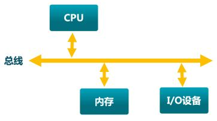
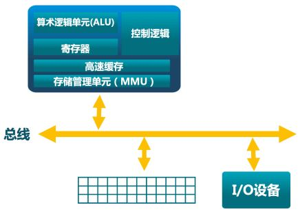
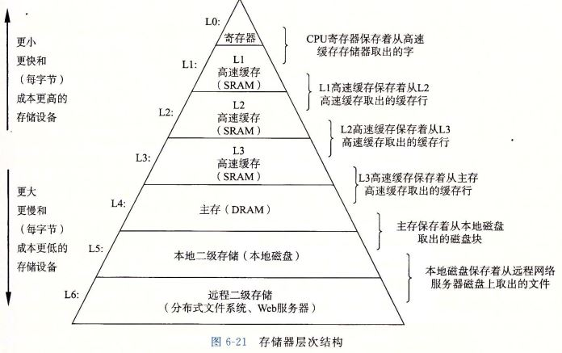
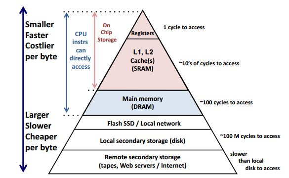
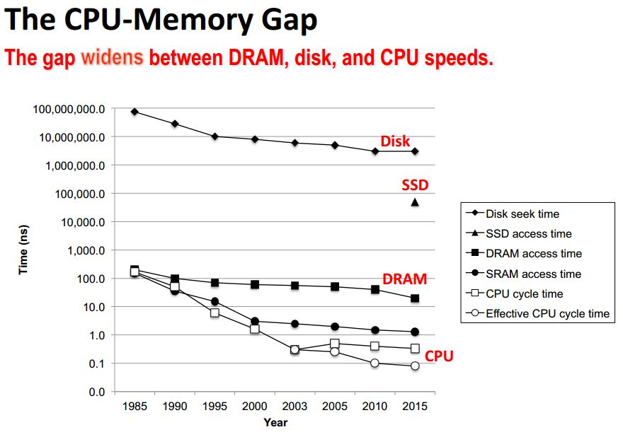

# 内存管理

## 参考资料

操作系统原理(清华)

视频: [清华 操作系统原理_哔哩哔哩 (゜-゜)つロ 干杯~-bilibili](https://www.bilibili.com/video/BV1uW411f72n?p=13)

课件: 
[OS2014 - OscourseWiki (tsinghua.edu.cn)](http://os.cs.tsinghua.edu.cn/oscourse/OS2014#Course_Introduction) 
[OS2018spring - OscourseWiki (tsinghua.edu.cn)](http://os.cs.tsinghua.edu.cn/oscourse/OS2018spring) 
[OS2020spring - OscourseWiki (tsinghua.edu.cn)](http://os.cs.tsinghua.edu.cn/oscourse/OS2020spring) [Releases · dramforever/os-lectures-build · GitHub](https://github.com/dramforever/os-lectures-build/releases) 
PS. 2014 年的课件和视频比较匹配

学习笔记: 
[3.OperatingSystem_in_depth/Charpter 3.md at main · OXygenPanda/3.OperatingSystem_in_depth · GitHub](https://github.com/OXygenPanda/3.OperatingSystem_in_depth/blob/main/Charpter 3.md) 
[PrivateNotes/计算机科学/计算机操作系统 at master · kirklin/PrivateNotes · GitHub](https://github.com/kirklin/PrivateNotes/tree/master/计算机科学/计算机操作系统) 

## 计算机体系结构

计算机基本硬件结构：CPU, 内存, 外设.  程序执行在 CPU, 执行时的程序代码和数据保存在内存, 外设包括键盘鼠标等输入输出设备. 

其中, CPU 由运算器(ALU), 控制器(CU), 寄存器(Register), 缓存(Cache), 存储管理单元(MMU) 等组成.

内存不仅仅是指 RAM, 还包括硬盘等其他存储设备.

## 存储器分层体系

现代计算机系统将存储器以金字塔的形式分层管理(Memory Hierarchy). 实际就是 CPU执行的指令和数据所处的不同层次的位置. 如下图所示. 

自上而下包括: 寄存器, L1/L2/L3 Cache, 主存(物理内存), 本地磁盘(硬盘), 远程存储.  从高到低存储设备的容量越来越大, 硬件成本越来越低, 但是访问速度越来越慢. 另外还有一种非易失性存储器, 如 flash 和 SSD, 其访问速度介于 主存和存盘之间, 相对于传统的磁盘, 它更快速, 更低能耗.

下图是不同层次存储器的访问时间, 以及 CPU 的速率和存储器访问时间的差异变化.

## 关于内存

关于内存的一些主题: 局部性, 内存与缓存一致性, 虚拟内存等.

[深入理解计算机系统合集（周更中）_哔哩哔哩 (゜-゜)つロ 干杯~-bilibili](https://www.bilibili.com/video/BV17K4y1N7Q2?p=27)

[GitHub - yangminz/bcst_csapp: A C language repo to implement CSAPP](https://github.com/yangminz/bcst_csapp/)

