# 内存管理

## 参考资料

操作系统原理(清华)

视频: [清华 操作系统原理_哔哩哔哩 (゜-゜)つロ 干杯~-bilibili](https://www.bilibili.com/video/BV1uW411f72n?p=13)

课件: 
[OS2014 - OscourseWiki (tsinghua.edu.cn)](http://os.cs.tsinghua.edu.cn/oscourse/OS2014#Course_Introduction) 
[OS2018spring - OscourseWiki (tsinghua.edu.cn)](http://os.cs.tsinghua.edu.cn/oscourse/OS2018spring) 
[OS2020spring - OscourseWiki (tsinghua.edu.cn)](http://os.cs.tsinghua.edu.cn/oscourse/OS2020spring) [Releases · dramforever/os-lectures-build · GitHub](https://github.com/dramforever/os-lectures-build/releases) 
PS. 2014 年的课程章节与视频比较匹配, 2018 课件内容与视频更匹配, 2020 年课件最新, 包含一些 RISC-V 的知识.

学习笔记: 
[3.OperatingSystem_in_depth/Charpter 3.md at main · OXygenPanda/3.OperatingSystem_in_depth · GitHub](https://github.com/OXygenPanda/3.OperatingSystem_in_depth/blob/main/Charpter 3.md) 
[PrivateNotes/计算机科学/计算机操作系统 at master · kirklin/PrivateNotes · GitHub](https://github.com/kirklin/PrivateNotes/tree/master/计算机科学/计算机操作系统)

[【操作系统】 Operation System 第三章：连续式内存分配_iwanderu的博客-CSDN博客](https://blog.csdn.net/iwanderu/article/details/103934647)

[【操作系统】 Operation System 第四章：非连续式内存分配_iwanderu的博客-CSDN博客](https://blog.csdn.net/iwanderu/article/details/103946219)

## 计算机体系结构

计算机基本硬件结构：CPU, 内存, 外设.  程序执行在 CPU, 执行时的程序代码和数据保存在内存, 键盘鼠标等输入输出设备作为外设. 

其中, CPU 由运算器(ALU), 控制器(CU), 寄存器(Register), 缓存(Cache), 存储管理单元(MMU) 等组成.

内存也可以扩展为广义上的存储器, 包括主存(DRAM), Flash, 硬盘等其他存储设备.

## 存储器分层体系

现代计算机系统将存储器以金字塔的形式分层管理(Memory Hierarchy). 实际就是 CPU执行的指令和数据所处的不同层次的位置. 如下图所示. 

自上而下包括: 寄存器, L1/L2/L3 Cache, 主存(物理内存), 本地磁盘(硬盘), 远程存储.  从高到低存储设备的容量越来越大, 硬件成本越来越低, 但是访问速度越来越慢. 另外还有一种非易失性存储器, 如 flash 和 SSD, 其访问速度介于 主存和存盘之间, 相对于传统的磁盘, 它更快速, 更低能耗.

下图是不同层次存储器的访问时间, 以及 CPU 的速率和存储器访问时间的差异变化.

## 关于内存的其他主题

关于内存的一些其他主题: 局部性, 内存与缓存一致性, 虚拟内存等.

[深入理解计算机系统合集（周更中）_哔哩哔哩 (゜-゜)つロ 干杯~-bilibili](https://www.bilibili.com/video/BV17K4y1N7Q2?p=27)

[GitHub - yangminz/bcst_csapp: A C language repo to implement CSAPP](https://github.com/yangminz/bcst_csapp/)

## 内存管理目标

现代计算机系统的内存面临几个问题. 一是 CPU 的速率和存储器的访问速率差距越来越大, 这就引入了缓存; 二是运行时的数据都放在内存上, 现代计算机运行的程序越来越多, 对内存容量的需求越来越大, 这就引入了硬盘; 三是内存一旦掉电后数据不能保存, 所以代码和数据需要永久保存在硬盘. 

这些都需要操作系统的内存管理工作, 其理想是既能快速地访问存储器, 存储器的容量也能最大.

4个目标:

* 抽象: 程序在内存中运行时不需要考虑底层细节. 比如物理内存在什么地方, 外设在什么地方, 只需访问一段地址空间就可以了. 这个地址空间称为: 逻辑地址空间.
* 保护: 内存中可能运行多个不同的应用进程, 相互之间有可能会破坏对方地址空间上的数据, 需要一种机制来保护/隔离进程的数据: 独立地址空间.
*  共享: 进程之间也可能需要互相交互, 需要共享空间使得进程间可以安全、可靠、有效地进行数据传递. 需要一种进程间的数据传递机制: 访问相同内存.
* 虚拟化: 大量的应用程序会导致主存容量不够, 如何让正在运行的进程获得他需要的内存空间. 这就需要把正在使用的数据放在内存中, 暂时不适用的数据临时地放到硬盘中, 通过这种方式实现虚拟的, 更大的可用内存. 这个过程对应用程序不可见, 满足进程的数据空间需求.

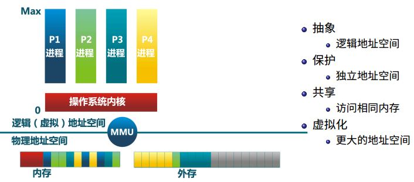

## 内存管理方法

要实现上述目标, 方法有:

* 程序重定位(program relocation)
* 分段 (segmentation)
* 分页 (paging) , 目前多数系统如 Linux采用按需分页虚拟内存

同时操作系统实现内存管理也高度依赖硬件支持:

* 与计算机存储架构紧耦合
* MMU(内存管理单元): 处理 CPU 的内存访问请求 

## 地址空间

### 定义

* 物理地址空间 --- 硬件支持的地址空间, 比如物理内存的地址空间.
* 逻辑地址空间 --- 一个运行的程序所拥有的内存范围.

如下图所示, 物理地址空间是0 ~ **MAX**sys, 逻辑地址空间是 0~ **MAX**prog. 那么程序中的某个指令的地址是如何生成的呢?

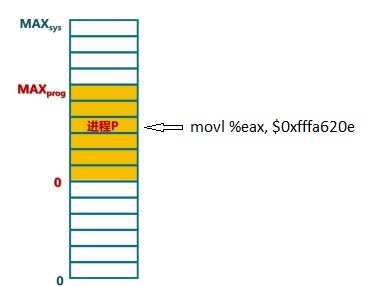

### 逻辑地址生成

如下图所示: 逻辑地址的生成由编译器和加载器完成, 其过程为: 编译, 汇编, 链接, 加载(程序重定位).

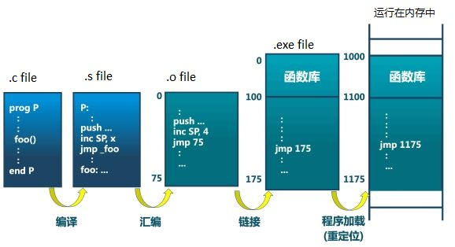

* 编译(Compilation): c 程序中的函数、变量都是逻辑地址的体现, 他以一种人更容易理解的方式存在. 经过编译之后生成 .s 程序, 用符号代表函数和变量
* 汇编(Assembly): s 汇编程序更接近机器语言, 经过汇编器转换成机器语言 .o 程序. 变量和函数的符号被转换成地址, 是从0开始的相对地址.
* 链接(Linking): .o 程序之间会互相依赖互相访问, 链接器将多个 .o 链接成一个可执行程序, 对所有.o 程序里的地址作了全局分布, 生成全局地址. 但是这个地址依然是在程序中的相对地址.
* 加载(Loading): 加载器将程序加载到内存中运行. 通过程序重定位生成内存中运行的地址, 其相对于程序中的地址有个偏移量. Linux 系统的程序加载通过 exec 函数族实现.

具体过程可参考: [C编译器、链接器、加载器详解 - LiuYanYGZ - 博客园 (cnblogs.com)](https://www.cnblogs.com/LiuYanYGZ/p/5574601.html)

逻辑地址的生成时机.

* 编译时, 如果起始地址已知, 也就是说知道程序放在内存中的什么位置, 那么编译时就可以生成逻辑地址.

* 加载时, 大多数情况下起始地址是未知的, 这就需要编译器生成可重定位的代码, 加载时重定位, 生成绝对地址. ELF 格式的目标文件中都包含可重定位信息, 比如 .text 的重定位信息存储在.rel.text 中. 链接器在处理目标文件时对相应的 .text 重定位. ELF 格式的可执行文件中也有一个重定位表, 加载时改成绝对地址就可以运行了.
* 执行时, 执行到这条指令之前一直使用相对地址, 当执行到这一条指令的时候, 才去获取它确切访问的地址. 这种情况出现在使用虚拟存储的系统里, 优点是程序执行过程中就可以将代码移动, 而前面两种生成时机都不可以. 但是需要地址转化硬件支持, 相对较麻烦.

### 逻辑地址处理

应用程序的逻辑地址是如何映射到物理地址.

* CPU
  * 运算器 ALU 需要在逻辑地址的内存内容
  * 内存管理单元 MMU 进行逻辑地址和物理地址的转换(映射)
  * CPU 控制器从总线发送在物理地址的内存内容的请求
* 内存
  * 内存发送物理地址内存内容给 CPU
* 操作系统
  * 建立逻辑地址和物理地址之间的映射(确保程序不相互干扰)

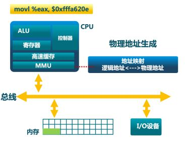

### 地址安全检查

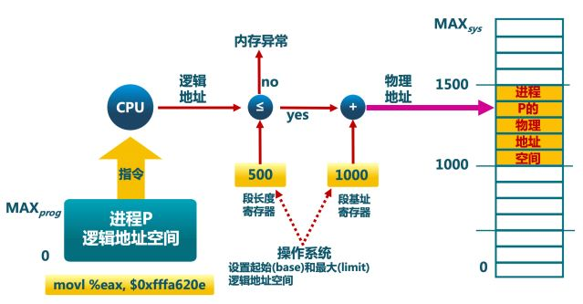

操作系统为每个进程设置了起始地址和范围, 当程序访问的地址空间处于这个范围内时, 则映射成对应的物理地址. 如果不在这个范围则产生内存异常.

## 连续内存分配

...

## 非连续内存分配

### 为什么

分配给一个程序连续的物理内存不可避免地存在一些问题

* 内碎片、外碎片问题
* 内存利用率较低

针对这些问题, 通过非连续内存分配来解决. 分配给一个程序的物理内存是非连续的, 它的优点

* 更好的内存利用和管理
* 允许共享代码、数据、库等
* 支持动态加载和动态链接

非连续内存分配的缺点就是它本身的开销, 如何建立虚拟地址和物理地址之间的转换

* 软件方案(开销大)
* 硬件方案(分段, 分页)

### 分段 (Segmentation)

段式存储管理的目的是能够实现更细粒度和灵活的分离和共享, 其需要关注两个问题

* 程序/进程的分段地址空间
* 分段如何寻址

进程的地址空间由多个段组成:

* 主程序代码段(Main program)
* 子程序代码段(Subroutines)
* 公用库代码段
* 数据(data)
* 堆(heap)
* 栈(stack)
* 符号表(Symbols)
* 等...

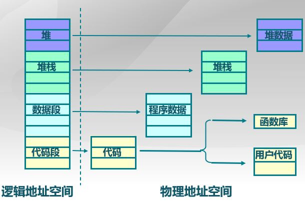

#### 分段地址空间

进程运行时, 按照程序自身的逻辑关系划分为若干个段, 通过对每个段不同的管理, 如访问权限等, 能够实现更好的分离与共享.

段的逻辑地址空间连续, 但是对应的物理地址空间是不连续的.

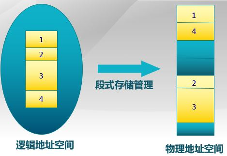

#### 分段寻址方案

1. 段访问机制: 程序逻辑地址的访问需要一个二元组 (s 段号, addr 段内偏移), 二元组可以用段寄存器+地址寄存器实现(如 X86), 也可以用单寄存器地址实现.

   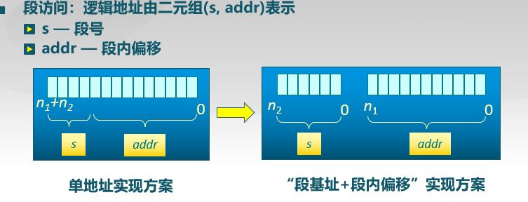

2. 段访问机制硬件实现:

   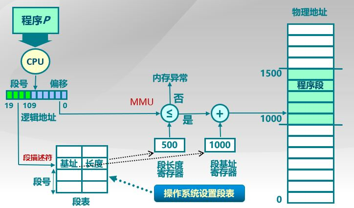

   这里由操作系统将段表信息(段号, 物理内存起始地址, 长度) 写入寄存器, 用于程序运行时的地址映射.

### 分页 (Paging)

分段寻址中, 地址由段号+段内偏移组成, 类似地, 分页寻址中地址访问由页(帧)号+页内偏移组成.

不同的是, 分段中段的 size 是不同的, 可变的. 分页中, 页的 size 是固定的, 为 2^n, 比如 4096B, 8192B.

#### 分页地址空间

* 划分物理地址空间至固定大小的页帧, Page Frame

  大小是 2 的幂次方, 比如: 512B, 4096B, 8192B

* 划分逻辑地址空间至相同大小的页, Page

  大小和物理页帧一样, 比如: 512B, 4096B, 8192B

* 建立方案, 逻辑地址空间(逻辑页)与物理地址空间(物理页)之间的映射, pages to frames

  * 页表
  * MMU/TLB

#### 页帧 (Frame)

物理内存被划分成大小相等的帧. 一个物理地址表示为一个二元组(f, o)

* f : 页帧号, F 位, 共有 2^F 个页帧.
* o : 帧内偏移, S 位, 每帧有 2^S bytes.

Physical address = 2^S * f + o, 如下图所示.

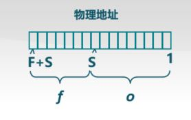

举例, 16-bit 的地址空间, 9-bit (512 byte) 大小的页帧. 物理地址表示 = (3, 6)

物理地址 = 2^S * f + o = 2^9 * 3 + 6 = 1542 (F = 7, S = 9, f = 3, o= 6)

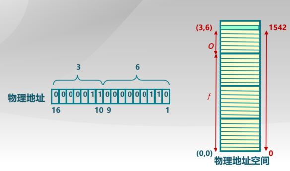

#### 页 (Page)

进程逻辑地址空间被划分为大小相等的页, 一个逻辑地址表示为一个二元组(p, o)

* p : 页号(P 位, 一共 2^P 个页). 页号大小一般 != 帧号大小
* o : 页内偏移(S 位, 每页有 2^S bytes).  页内偏移 == 帧内偏移

Virtual address = 2^S * p + o, 如下图所示.

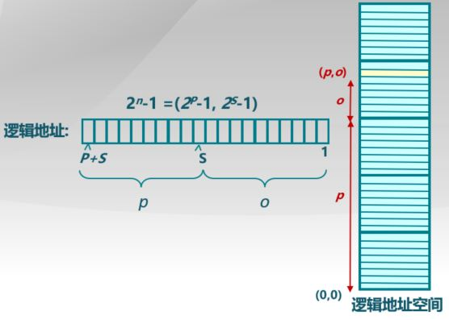

#### 页寻址机制

* 逻辑页到物理页帧的映射
* 逻辑地址中的页号是连续的
* 物理地址中的帧号是不连续的
* 不是所有的逻辑页都有对应的物理页帧, 一般逻辑地址空间会大于物理地址空间

页表由操作系统建立, 可以简单理解为一个数组, 页号是 index, 页帧号是 value.

CPU 寻址时根据页表基地址和页号获取该页号对应的页帧, 加上偏移地址, 获得要访问的物理地址.