# 栈帧(stack frame)

## 示例代码

```
int func4(int para1, int para2, int para3, int para4)
{
    int locVar1 = para1;
    int locVar2 = para2;
    int locVar3 = para3;
    int locVar4 = para4;

	para1 += 1;
    para2 += 1;
    para3 += 1;
    para3 += 1;

    return locVar1 + locVar2 + locVar3 + locVar4;
}

int main(void)
{
    int var1 = 1, var2 = 2, var3 = 3, var4 = 4;
    func4(var1, var2, var3, var4);
    return 0;
}
```

编译:

```
> bash
$ source baseline/.cache/.../sdk/env.sh
$ arm-none-linux-gnueabi-gcc --sysroot=/../sysroots -march=armv7-a -mthumb-interwork -mfloat-abi=softfp -mfpu=neon -Wall -Wno-attributes -Wno-write-strings -g -O2 -o stack stackframe.c
```

汇编:

```
$arm-wrs-linux-gnueabi-objdump -d stack

stack:     file format elf32-littlearm

Disassembly of section .init:
...
Disassembly of section .plt:
...
000102f4 <__libc_start_main@plt>:
   102f4:	e28fc600 	add	ip, pc, #0, 12
   102f8:	e28cca10 	add	ip, ip, #16, 20	; 0x10000
   102fc:	e5bcf3ac 	ldr	pc, [ip, #940]!	; 0x3ac
...

Disassembly of section .text:
00010318 <_start>:
   10318:	e3a0b000 	mov	fp, #0
   1031c:	e3a0e000 	mov	lr, #0
   10320:	e49d1004 	pop	{r1}		; (ldr r1, [sp], #4)
   10324:	e1a0200d 	mov	r2, sp
   10328:	e52d2004 	push	{r2}		; (str r2, [sp, #-4]!)
   1032c:	e52d0004 	push	{r0}		; (str r0, [sp, #-4]!)
   10330:	e59fc010 	ldr	ip, [pc, #16]	; 10348 <_start+0x30>
   10334:	e52dc004 	push	{ip}		; (str ip, [sp, #-4]!)
   10338:	e59f000c 	ldr	r0, [pc, #12]	; 1034c <_start+0x34>
   1033c:	e59f300c 	ldr	r3, [pc, #12]	; 10350 <_start+0x38>
   10340:	ebffffeb 	bl	102f4 <__libc_start_main@plt>
   10344:	ebfffff0 	bl	1030c <abort@plt>
   10348:	00010584 	.word	0x00010584
   1034c:	000104d4 	.word	0x000104d4
   10350:	00010524 	.word	0x00010524

0001043c <func4>:
   1043c:	e52db004 	push	{fp}		; (str fp, [sp, #-4]!)
   10440:	e28db000 	add	fp, sp, #0
   10444:	e24dd024 	sub	sp, sp, #36	; 0x24
   10448:	e50b0018 	str	r0, [fp, #-24]	; 0xffffffe8
   1044c:	e50b101c 	str	r1, [fp, #-28]	; 0xffffffe4
   10450:	e50b2020 	str	r2, [fp, #-32]	; 0xffffffe0
   10454:	e50b3024 	str	r3, [fp, #-36]	; 0xffffffdc
   10458:	e51b3018 	ldr	r3, [fp, #-24]	; 0xffffffe8
   1045c:	e50b3008 	str	r3, [fp, #-8]
   10460:	e51b301c 	ldr	r3, [fp, #-28]	; 0xffffffe4
   10464:	e50b300c 	str	r3, [fp, #-12]
   10468:	e51b3020 	ldr	r3, [fp, #-32]	; 0xffffffe0
   1046c:	e50b3010 	str	r3, [fp, #-16]
   10470:	e51b3024 	ldr	r3, [fp, #-36]	; 0xffffffdc
   10474:	e50b3014 	str	r3, [fp, #-20]	; 0xffffffec
   10478:	e51b3018 	ldr	r3, [fp, #-24]	; 0xffffffe8
   1047c:	e2833001 	add	r3, r3, #1
   10480:	e50b3018 	str	r3, [fp, #-24]	; 0xffffffe8
   10484:	e51b301c 	ldr	r3, [fp, #-28]	; 0xffffffe4
   10488:	e2833001 	add	r3, r3, #1
   1048c:	e50b301c 	str	r3, [fp, #-28]	; 0xffffffe4
   10490:	e51b3020 	ldr	r3, [fp, #-32]	; 0xffffffe0
   10494:	e2833001 	add	r3, r3, #1
   10498:	e50b3020 	str	r3, [fp, #-32]	; 0xffffffe0
   1049c:	e51b3024 	ldr	r3, [fp, #-36]	; 0xffffffdc
   104a0:	e2833001 	add	r3, r3, #1
   104a4:	e50b3024 	str	r3, [fp, #-36]	; 0xffffffdc
   104a8:	e51b2008 	ldr	r2, [fp, #-8]
   104ac:	e51b300c 	ldr	r3, [fp, #-12]
   104b0:	e0822003 	add	r2, r2, r3
   104b4:	e51b3010 	ldr	r3, [fp, #-16]
   104b8:	e0822003 	add	r2, r2, r3
   104bc:	e51b3014 	ldr	r3, [fp, #-20]	; 0xffffffec
   104c0:	e0823003 	add	r3, r2, r3
   104c4:	e1a00003 	mov	r0, r3
   104c8:	e24bd000 	sub	sp, fp, #0
   104cc:	e49db004 	pop	{fp}		; (ldr fp, [sp], #4)
   104d0:	e12fff1e 	bx	lr

000104d4 <main>:
   104d4:	e92d4800 	push	{fp, lr}
   104d8:	e28db004 	add	fp, sp, #4
   104dc:	e24dd010 	sub	sp, sp, #16
   104e0:	e3a03001 	mov	r3, #1
   104e4:	e50b3008 	str	r3, [fp, #-8]
   104e8:	e3a03002 	mov	r3, #2
   104ec:	e50b300c 	str	r3, [fp, #-12]
   104f0:	e3a03003 	mov	r3, #3
   104f4:	e50b3010 	str	r3, [fp, #-16]
   104f8:	e3a03004 	mov	r3, #4
   104fc:	e50b3014 	str	r3, [fp, #-20]	; 0xffffffec
   10500:	e51b3014 	ldr	r3, [fp, #-20]	; 0xffffffec
   10504:	e51b2010 	ldr	r2, [fp, #-16]
   10508:	e51b100c 	ldr	r1, [fp, #-12]
   1050c:	e51b0008 	ldr	r0, [fp, #-8]
   10510:	ebffffc9 	bl	1043c <func4>
   10514:	e3a03000 	mov	r3, #0
   10518:	e1a00003 	mov	r0, r3
   1051c:	e24bd004 	sub	sp, fp, #4
   10520:	e8bd8800 	pop	{fp, pc}

```

PS. 
将可执行文件 stack 放到 ARM 板子上运行时, 反汇编代码稍有不同. 在 ARM中, 寄存器 r11 作为 fp 使用.
参考 [6.2.1. APCS register names and usage](http://infocenter.arm.com/help/index.jsp?topic=/com.arm.doc.dui0040d/ch06s02s01.html)

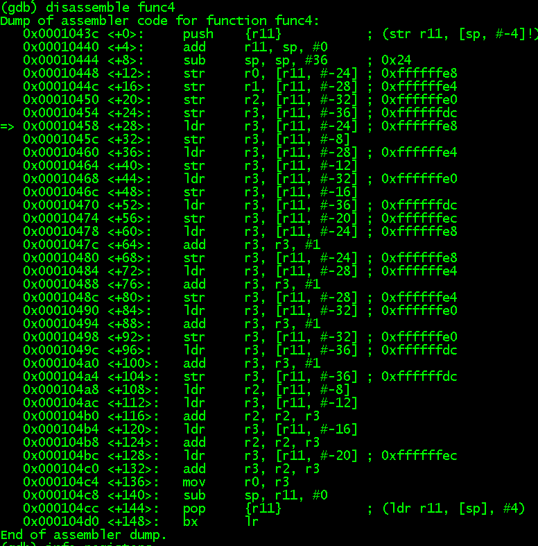


## 函数栈

在执行 main() 之前, 调用函数 __libc_start_main() 的栈帧如下.  fp 和 sp 之间的那片内存空间构成了 libc_start_main() 的函数栈, 函数栈由 stack frame 组成.

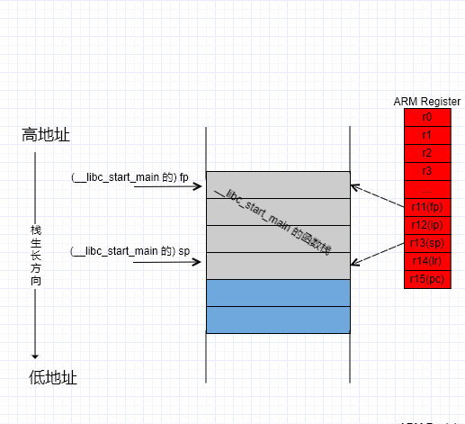

### main() 函数栈

每一个函数被执行之前, 其调用函数(caller) 都会保存一些 CPU 寄存器, 如 fp, sp, lr, pc 等. 被调函数(callee) 在执行时如果有后续的函数调用也会做类似的工作.

下面通过反汇编一步一步分析 main() 的函数栈.

`104d4:	e92d4800 	push	{fp, lr}	; 调用函数的 lr, fp 分别入栈, sp-4, sp-8`

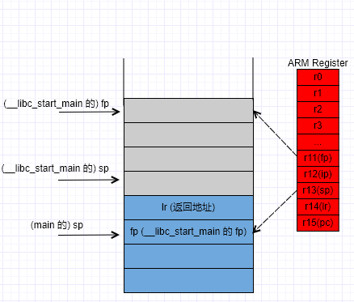

```
104d8:	e28db004 	add	fp, sp, #4		; fp=sp+4, CPU寄存器更新为当前函数 main()的 fp
104dc:	e24dd010 	sub	sp, sp, #16		; sp=sp-16, 分配空间用于保存 main() 的局部变量
```

到此, 将 caller 函数 __libc_start_main() 的 fp, lr 保存在 main() 的函数栈中, 将 CPU 寄存器中的 r11, r13 更新为 main() 函数的 fp, sp.


这一步并没有保存 __libc_start_main() 的 sp, 因为 main() 返回以后, main() 的 fp+4 即为 sp


```
   104e0:	e3a03001 	mov	r3, #1			;main() 的局部变量 var1,var2,var3,var4 分别入栈
   104e4:	e50b3008 	str	r3, [fp, #-8]
	...
   104f8:	e3a03004 	mov	r3, #4
   104fc:	e50b3014 	str	r3, [fp, #-20]	; 0xffffffec
```

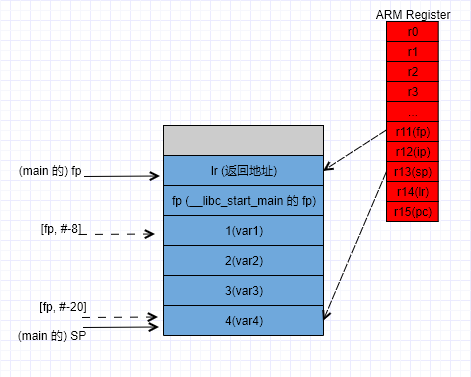

```
   10500:	e51b3014 	ldr	r3, [fp, #-20]	; 0xffffffec
   10504:	e51b2010 	ldr	r2, [fp, #-16]
   10508:	e51b100c 	ldr	r1, [fp, #-12]
   1050c:	e51b0008 	ldr	r0, [fp, #-8]
```

调用 func4() 前, 将参数保存到 r0, r1, r2, r3. 根据 [AAPCS](http://infocenter.arm.com/help/index.jsp?topic=/com.arm.doc.ihi0042f/index.html), 当参数不超过 4 个时, 通过 CPU 寄存器进行传递参数.

综上, 在调用 func4() 前, main() 的函数栈如下:

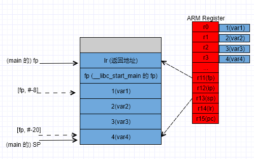

### func4() 函数栈

```
   1043c:	e52db004 	push	{fp}		; sp=sp-4, main()的fp入栈
```

这一步没有将 lr 入栈, 因为 func4() 函数并没有进一步调用其他函数, 不会修改 CPU lr 寄存器, 也就不需要保存返回地址. 

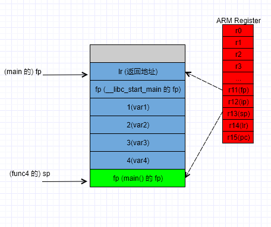

```
   10440:	e28db000 	add	fp, sp, #0		; fp=sp, CPU 寄存器更新为当前函数 func4()的 fp
   10444:	e24dd024 	sub	sp, sp, #36	; 0x24	; sp=sp-36, 分配空间用于保存 func4()的局部变量
```

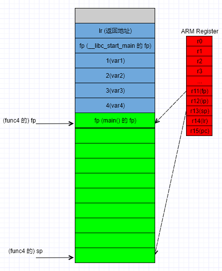

```
   10448:	e50b0018 	str	r0, [fp, #-24]	; 0xffffffe8	将 r0~r3 传递的参数保存到栈上
   1044c:	e50b101c 	str	r1, [fp, #-28]	; 0xffffffe4
   10450:	e50b2020 	str	r2, [fp, #-32]	; 0xffffffe0
   10454:	e50b3024 	str	r3, [fp, #-36]	; 0xffffffdc
```

```
   10458:	e51b3018 	ldr	r3, [fp, #-24]	; 赋值并保存 locVar1~locVar4 到栈上
   1045c:	e50b3008 	str	r3, [fp, #-8]
   10460:	e51b301c 	ldr	r3, [fp, #-28]	; 0xffffffe4
   10464:	e50b300c 	str	r3, [fp, #-12]
   10468:	e51b3020 	ldr	r3, [fp, #-32]	; 0xffffffe0
   1046c:	e50b3010 	str	r3, [fp, #-16]
   10470:	e51b3024 	ldr	r3, [fp, #-36]	; 0xffffffdc
   10474:	e50b3014 	str	r3, [fp, #-20]	; 0xffffffec
```

```
   10478:	e51b3018 	ldr	r3, [fp, #-24]	; 对应代码 para1+=1...para4+=1
   1047c:	e2833001 	add	r3, r3, #1
   10480:	e50b3018 	str	r3, [fp, #-24]	; 0xffffffe8
   10484:	e51b301c 	ldr	r3, [fp, #-28]	; 0xffffffe4
   10488:	e2833001 	add	r3, r3, #1
   1048c:	e50b301c 	str	r3, [fp, #-28]	; 0xffffffe4
   10490:	e51b3020 	ldr	r3, [fp, #-32]	; 0xffffffe0
   10494:	e2833001 	add	r3, r3, #1
   10498:	e50b3020 	str	r3, [fp, #-32]	; 0xffffffe0
   1049c:	e51b3024 	ldr	r3, [fp, #-36]	; 0xffffffdc
   104a0:	e2833001 	add	r3, r3, #1
   104a4:	e50b3024 	str	r3, [fp, #-36]	; 0xffffffdc
```

```
   104a8:	e51b2008 	ldr	r2, [fp, #-8]	;对应代码 locVar1 + locVar2 + locVar3 + locVar4
   104ac:	e51b300c 	ldr	r3, [fp, #-12]
   104b0:	e0822003 	add	r2, r2, r3
   104b4:	e51b3010 	ldr	r3, [fp, #-16]
   104b8:	e0822003 	add	r2, r2, r3
   104bc:	e51b3014 	ldr	r3, [fp, #-20]	; 0xffffffec
   104c0:	e0823003 	add	r3, r2, r3
   104c4:	e1a00003 	mov	r0, r3			; 将结果保存在 r0 寄存器然后 return
```

综上, func4() 的函数栈如下:

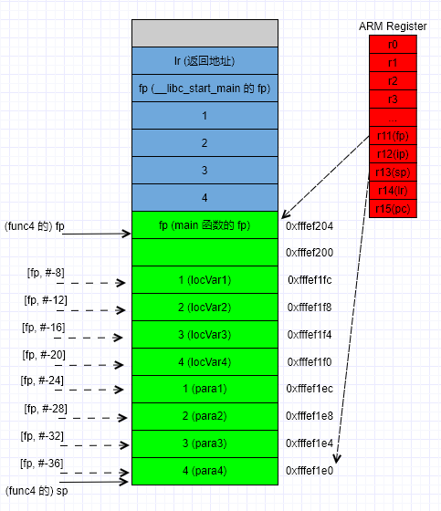

### func4() 调试

运行可执行文件, 将断点设在 func4(), 运行到此处, 打印 r0~r15 寄存器如下.
可知 func4() 函数栈为 0xfffef204 ~ 0xfffef1e0, r0~r3 = 1~4.
lr 寄存器在执行 `bl  1043c <func4>` 时被设为下一条指令地址(0x10514), 在 func4() 运行过程中没有被修改.

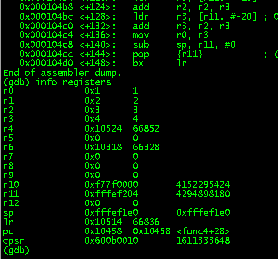

此时, 通过访问栈内存, 可知 func4() 栈空间还没有被赋值, 但是可以看到 main() 的函数栈数据.

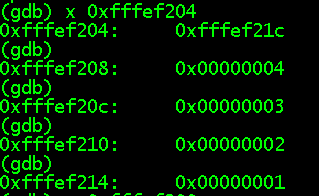


单步运行, 可以看到先保存 r0~r3 的参数到栈上(0xfffef1ec ~ 0xfffef1e0), 然后赋值并保存 locVar1~locVar4 到栈上(0xfffef1fc ~ 0xfffef1f0)

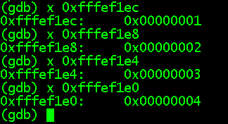

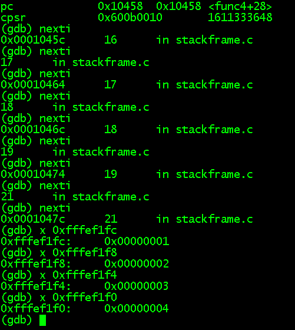

### func4() 函数返回

```
   104c8:	e24bd000 	sub	sp, fp, #0
   104cc:	e49db004 	pop	{fp}		; (ldr fp, [sp], #4)
   104d0:	e12fff1e 	bx	lr
```

1. sp=fp-0, sp 指向 func4() 的栈基地址 0xfffef204

2. 弹出 0xfffef204 处保存的 main() 的 fp, 此时寄存器 fp 恢复到 main() 的 fp, 同时 sp=sp-4, 执向 main() 的 sp.

3. 跳转到 lr, 返回到 main() 继续执行.

   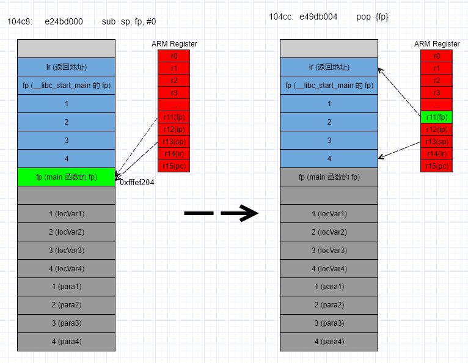

### func4() 进一步调用

如果在 func4() 内有进一步的调用且函数参数超过4个时, 有什么不同呢?

代码如下:

```
int func4(int para1, int para2, int para3, int para4)
{
	return func5(para1, para2, para3, para4, para1);
}
int func5(int para1, int para2, int para3, int para4, int para5)
{
    return para5;
}
```

反汇编如下:

```
0001046c <func4>:
   1046c:	e92d4800 	push	{fp, lr}
   10470:	e28db004 	add	fp, sp, #4
   10474:	e24dd018 	sub	sp, sp, #24
   10478:	e50b0008 	str	r0, [fp, #-8]
   1047c:	e50b100c 	str	r1, [fp, #-12]
   10480:	e50b2010 	str	r2, [fp, #-16]
   10484:	e50b3014 	str	r3, [fp, #-20]	; 0xffffffec
   10488:	e51b3008 	ldr	r3, [fp, #-8]
   1048c:	e58d3000 	str	r3, [sp]
   10490:	e51b3014 	ldr	r3, [fp, #-20]	; 0xffffffec
   10494:	e51b2010 	ldr	r2, [fp, #-16]
   10498:	e51b100c 	ldr	r1, [fp, #-12]
   1049c:	e51b0008 	ldr	r0, [fp, #-8]
   104a0:	ebffffe5 	bl	1043c <func5>
   104a4:	e1a03000 	mov	r3, r0
   104a8:	e1a00003 	mov	r0, r3
   104ac:	e24bd004 	sub	sp, fp, #4
   104b0:	e8bd8800 	pop	{fp, pc}

0001043c <func5>:
   1043c:	e52db004 	push	{fp}		; (str fp, [sp, #-4]!)
   10440:	e28db000 	add	fp, sp, #0
   10444:	e24dd014 	sub	sp, sp, #20
   10448:	e50b0008 	str	r0, [fp, #-8]
   1044c:	e50b100c 	str	r1, [fp, #-12]
   10450:	e50b2010 	str	r2, [fp, #-16]
   10454:	e50b3014 	str	r3, [fp, #-20]	; 0xffffffec
   10458:	e59b3004 	ldr	r3, [fp, #4]
   1045c:	e1a00003 	mov	r0, r3
   10460:	e24bd000 	sub	sp, fp, #0
   10464:	e49db004 	pop	{fp}		; (ldr fp, [sp], #4)
   10468:	e12fff1e 	bx	lr
```

1. `push	{fp, lr}`	将 `lr` 也入栈, 因为在执行 `bl	1043c <func5>` 调转时会更新 `lr` 寄存器, 所以需要将返回地址先保存.

2. 将第 5个实参 `para1` 入栈, 当参数超过 4 个时, 除了寄存器 `r0~r3` 外, 通过函数栈进行参数传递.

   同时在 `func5()` 中通过栈取到第 5 个参数.

   ```
   0001046c <func4>:
      10488:	e51b3008 	ldr	r3, [fp, #-8]
      1048c:	e58d3000 	str	r3, [sp]		; 函数栈保存第5个实参 para1
      10490:	e51b3014 	ldr	r3, [fp, #-20]	; 0xffffffec
      10494:	e51b2010 	ldr	r2, [fp, #-16]
      10498:	e51b100c 	ldr	r1, [fp, #-12]
      1049c:	e51b0008 	ldr	r0, [fp, #-8]
      
   0001043c <func5>:
      10458:	e59b3004 	ldr	r3, [fp, #4]	; fp+4 取到第5个实参 para1
      1045c:	e1a00003 	mov	r0, r3			; 返回值赋给 r0
   ```

   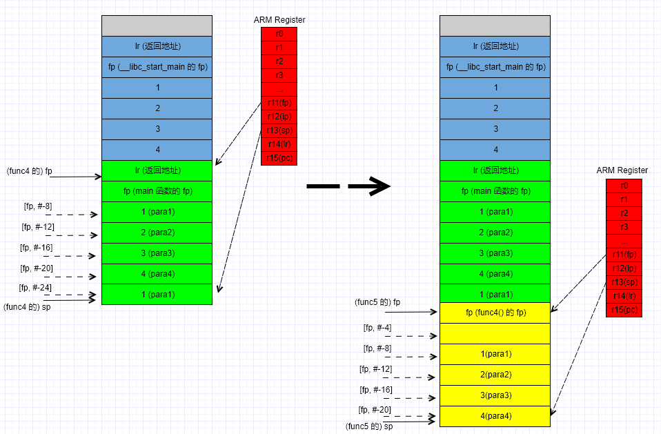

# TODO:

push{} 入栈顺序: 从右到左 https://www.cnblogs.com/fanzhidongyzby/p/5250116.html

参数传递规则: 与代码顺序相反 AAPCS

 https://community.arm.com/developer/ip-products/processors/b/processors-ip-blog/posts/function-parameters-on-32-bit-arm

参数返回规则: R0

## ARM 栈汇编指令

### 栈类型

确定一个栈的类型根据两个参数:

* 栈地址的增长方向: 向高地址增长的栈称为递增栈(Ascending stack), 向低地址增长的栈称为递减栈(Descending stack)
* 栈指针(SP)的指向位置: SP 指向栈顶元素的位置称为满栈(Full stack), SP 指向即将入栈元素的位置称为空栈(Empty Stack)

所有栈的类型可以分为4类:

* 满递减栈(Full Descending stack, FD)
* 满递增栈(Full Ascending stack, FA)
* 空递减栈(Empty Descending stack, ED)
* 空递增栈(Empty Ascending stack, EA)

如下图所示, 其中虚线位置表示即将入栈的元素. ARM 中最常用的是 FD 栈.

​	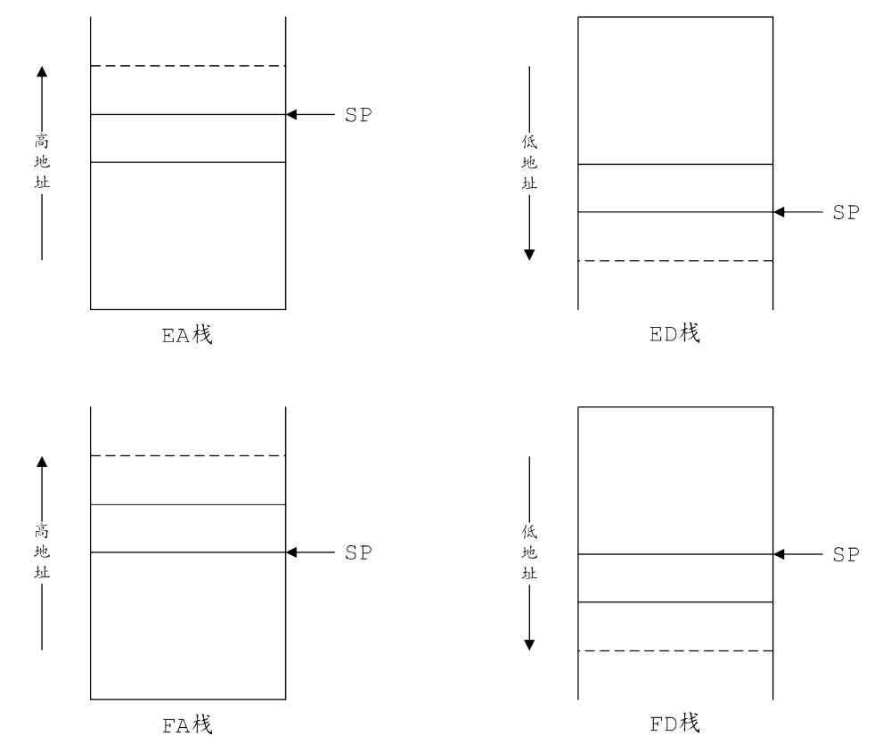

### 栈指令

栈的操作就两种, 入栈和出栈, 不同的栈类型对应有不同的汇编操作指令.

#### push/pop

push/pop 是 Thumb指令集中的存储器访问指令. push 和 pop 指令使用堆栈指针 (sp, r13) 实现满递减栈, 除了 R0~R7 寄存器外, push 指令还可以存储链接寄存器(lr, r14), pop 指令可以加载程序指令 pc(r15).

```
关于Thumb指令集的介绍参考:
1. 常用 ARM 指令及汇编.pdf
2. ARM Software Development Toolkit User Guide.pdf, 5.2.7 Thumb instruction set overview
3. ARM® Architecture Reference Manual, Chapter A4 The Instruction Sets
4. ARM® Architecture Reference Manual, A8.8.134 PUSH
```

存储器访问指令分为单存储器加载/存储指令 和 多(批量)存储器加载/存储指令.
单存储器指令从内存加载数据到一个低寄存器, 或者存储一个低寄存器的数据到内存中. 这里的低寄存器是指某一个 r0~r7 寄存器, 在 Thumb状态下指令不能访问 r8 ~ r15 寄存器.

多存储器加载/存储指令, 这些指令可以从内存加载数据到 r0~r7 的寄存器子集, 也可以将 r0~r7 子集的数据存储到内存中. push/pop 就是其中一种.

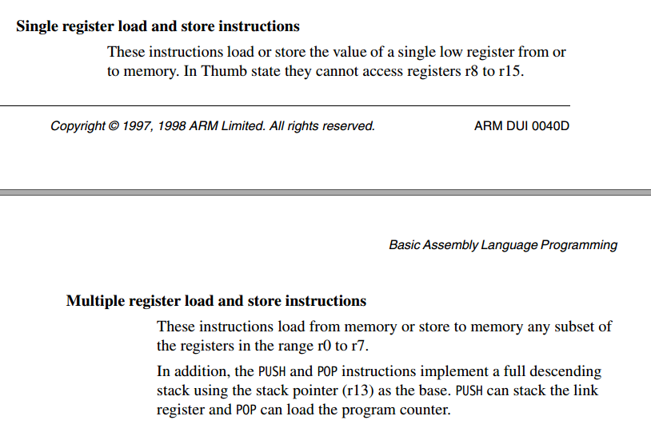

push/pop 命令格式

```
push	{reglist[,LR]}
pop		{reglist[,PC]}
其中
	reglist, 入栈/出栈的低寄存器列表: r0~r7
	LR, 入栈的可选寄存器
	PC, 出栈的可选寄存器
举例
push	{r0-r7, lr}		; 将 r0~r7 寄存器值入栈, lr 也入栈.
push	{fp, lr}		; 将 fp, lr 入栈.
pop		{r0-r7, pc}		; 将堆栈中(内存)的数据弹出到 r0~r7 以及 pc 寄存器中.

参考:
1. 常用 ARM 指令及汇编.pdf, PUSH 和 POP, page51
2. ARM Software Development Toolkit User Guide.pdf, 5.2.7 Thumb instruction set overview
```

#### stm/ldm

#### 入/出栈顺序

栈操作指令可以分解为两个步骤: 数据存取和栈指针sp操作. 这两部操作的先后顺序与栈的类型有关.

对于FD 栈来说, 是先移动 sp, 再存取数据.  因为 sp指向最后一个入栈的数据.
以示例代码中的 main() 函数栈 push 为例

`104d4:	e92d4800 	push	{fp, lr}	; 调用函数的 lr, fp 分别入栈, sp-4, sp-8`

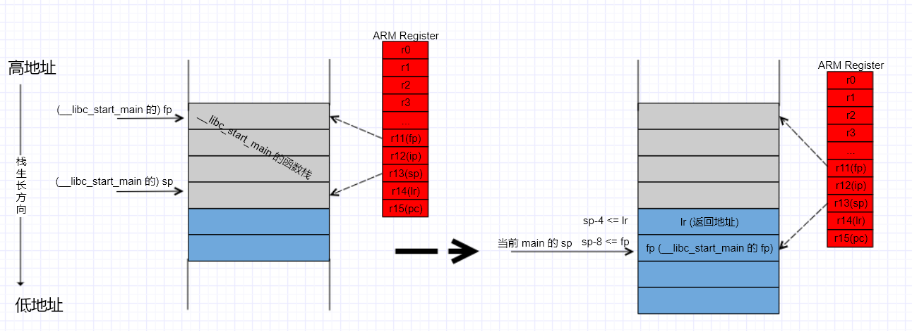

pop 则是先读取 [sp], 再弹出数据.

并且满递减栈, push 参数的入栈顺序是从右到左依次入栈(与参数声明顺序相反), pop 参数的出栈顺序是从左到右的顺序. 对于递增栈, 相应操作的顺序相反.

```
push	{fp, lr}
相当于
	[sp-4] <= lr
	[sp-8] = fp

pop	{fp}
	[sp] => fp
	
参考:
DUI0041C_ARM Software Development Toolkit Reference Guide.pdf(9.3.2 Argument list marshalling)
```

